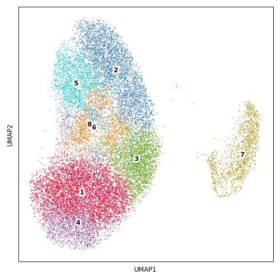

B/Plasma Figure
================

## Set up

Load R libraries

``` r
library(reticulate)
use_python("/projects/home/tlchan/.conda/envs/myenv/bin/python")

setwd('/projects/home/tlchan/github_code/ascites/functions')
source('plot_dotplot.R')
```

Load python libraries

``` python
import pegasus as pg

import sys
sys.path.append("/projects/home/tlchan/github_code/ascites/functions")
import python_functions
```

## Figure 1A

``` python
b_cluster_palette = {
    "1": "#FF0029",
    "2": "#377EB8",
    "3": "#66A61E",
    "4": "#984EA3",
    "5": "#00D2D5",
    "6": "#FF7F00",
    "7": "#AF8D00",
    "8": "#7F80CD",
    "9": "#B3E900",
    "10": "#C42E60"
}

# Load single-cell object
b_data = pg.read_input(
    '/projects/home/tlchan/projects/ascites/second_data_freeze/clusterings/ascites_bplasma_R5_300mg_20pm_harm_channel_multi_res/1.5/data/pseudobulk/ascites_bplasma_R5_300mg_20pm_harm_channel_1_5_complete_with_pb.zarr.zip')

# Relabel obs for function
b_data.obs['Cluster'] = b_data.obs['leiden_labels'].cat.remove_unused_categories().astype(str)

python_functions.plot_umap(lin_data=b_data,
                           palette=b_cluster_palette)
```

    ## 2024-05-04 17:37:25,541 - pegasusio.readwrite - INFO - zarr file '/projects/home/tlchan/projects/ascites/second_data_freeze/clusterings/ascites_bplasma_R5_300mg_20pm_harm_channel_multi_res/1.5/data/pseudobulk/ascites_bplasma_R5_300mg_20pm_harm_channel_1_5_complete_with_pb.zarr.zip' is loaded.
    ## 2024-05-04 17:37:25,541 - pegasusio.readwrite - INFO - Function 'read_input' finished in 0.40s.
    ## /projects/home/tlchan/.conda/envs/myenv/lib/python3.9/site-packages/scanpy/plotting/_tools/scatterplots.py:392: UserWarning: No data for colormapping provided via 'c'. Parameters 'cmap' will be ignored
    ##   cax = scatter(



## Figure 1B

``` r
b_gex <- read.csv('/projects/home/tlchan/projects/ascites/figure_panels/dotplot_data/bplasma_gene_exp.csv')
b_cite <- read.csv('/projects/home/tlchan/projects/ascites/figure_panels/dotplot_data/bplasma_cite_exp.csv')

plot_dotplot(lin_gex = b_gex,
             lin_cite = b_cite,
             lin = "bplasma")
```

<!-- -->
