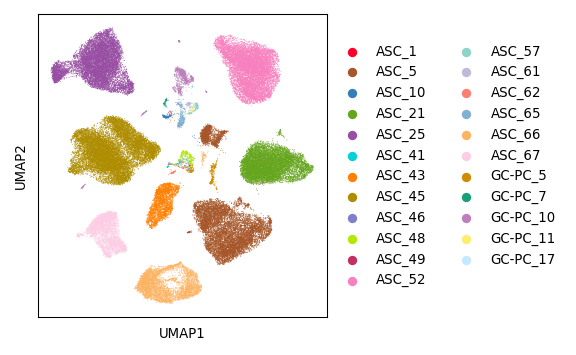
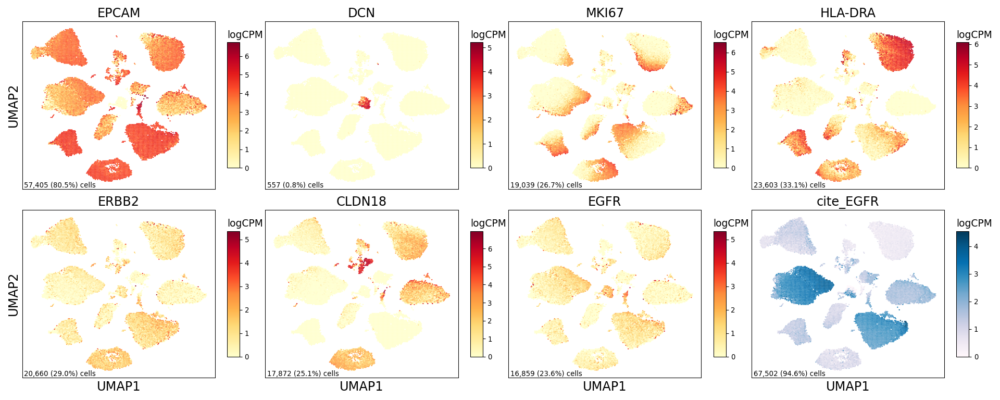

Cancer Figure
================

## Set up

Load R libraries

``` r
# load packages
library(tidyverse)
library(glue)
library(ComplexHeatmap)
library(reticulate)
library(ggpubr)
use_python("/projects/home/tlchan/.conda/envs/myenv/bin/python")

setwd('/projects/home/tlchan/github_code/ascites/functions')
source('plot_fgsea.R')
```

Load python libraries

``` python
import pegasus as pg
import scanpy as sc
import pandas as pd
import numpy as np
import matplotlib as mpl
import matplotlib.pyplot as plt
```

## Figure 1A

``` python
mpl.rcParams['pdf.fonttype'] = 42

patient_palette = {
    "ASC_1": "#FF0029",
    "ASC_10": "#377EB8",
    "ASC_21": "#66A61E",
    "ASC_25": "#984EA3",
    "ASC_41": "#00D2D5",
    "ASC_43": "#FF7F00",
    "ASC_45": "#AF8D00",
    "ASC_46": "#7F80CD",
    "ASC_48": "#B3E900",
    "ASC_49": "#C42E60",
    "ASC_5": "#A65628",
    "ASC_52": "#F781BF",
    "ASC_57": "#8DD3C7",
    "ASC_61": "#BEBADA",
    "ASC_62": "#FB8072",
    "ASC_65": "#80B1D3",
    "ASC_66": "#FDB462",
    "ASC_67": "#FCCDE5",
    "GC-PC_10": "#BC80BD",
    "GC-PC_11": "#FFED6F",
    "GC-PC_17": "#C4EAFF",
    "GC-PC_5": "#CF8C00",
    "GC-PC_7": "#1B9E77"
}
cancer_data = pg.read_input(
    '/projects/home/tlchan/projects/ascites/second_data_freeze/clusterings/ascites_cancer_R3_300mg_20pm_multi_res/1.3/data/pseudobulk/ascites_cancer_R3_300mg_20pm_1_3_complete_with_pb.zarr.zip')
cancer_data.obs["Patient"] = cancer_data.obs["patient_id"]

cancer_fig, cancer_ax = plt.subplots(1)
cancer_umap = sc.pl.umap(adata=cancer_data.to_anndata(),
                         color="Patient",
                         use_raw=True,
                         palette=patient_palette,
                         # legend_loc="on data",
                         legend_fontoutline=5,
                         title="",
                         show=False,
                         ax=cancer_ax)
cancer_fig = plt.gcf()
cancer_fig.set_size_inches(6, 3.7)
cancer_fig.tight_layout()
cancer_ax.set_rasterization_zorder(2)
plt.show()
plt.close()
```

    ## 2024-04-17 05:16:01,541 - pegasusio.readwrite - INFO - zarr file '/projects/home/tlchan/projects/ascites/second_data_freeze/clusterings/ascites_cancer_R3_300mg_20pm_multi_res/1.3/data/pseudobulk/ascites_cancer_R3_300mg_20pm_1_3_complete_with_pb.zarr.zip' is loaded.
    ## 2024-04-17 05:16:01,541 - pegasusio.readwrite - INFO - Function 'read_input' finished in 3.05s.
    ## /projects/home/tlchan/.conda/envs/myenv/lib/python3.9/site-packages/scanpy/plotting/_tools/scatterplots.py:392: UserWarning: No data for colormapping provided via 'c'. Parameters 'cmap' will be ignored
    ##   cax = scatter(



## Figure 1B

``` python
mpl.rcParams['pdf.fonttype'] = 42

ncol = 4
nrow = 2
genes = ['EPCAM', 'DCN', 'MKI67', 'HLA-DRA', 'ERBB2', 'CLDN18', 'EGFR', 'cite_EGFR']

lineage_data = pg.read_input("/projects/home/tlchan/data_objects/cancer.zarr.zip")

# get umap coordinates for base
umap_coords = pd.DataFrame(lineage_data.obsm['X_umap'], columns=['x', 'y'])
x = umap_coords['x']
y = umap_coords['y']

# Set up figure structure
fig_size = (5 * ncol, 4 * nrow)
fig, axes = plt.subplots(nrows=nrow, ncols=ncol, figsize=fig_size,
                         sharex=True, sharey=True)
ax = axes.ravel()

# Plot for each gene
for num, gene in enumerate(genes):
    # get counts for each gene
    norm_counts = lineage_data[:, gene].copy().get_matrix('X').todense().transpose()
    norm_counts = np.squeeze(np.asarray(norm_counts))

    if norm_counts.size == 0:  # ie. All empty/zero in sparce matrix
        norm_counts = np.zeros(norm_counts.shape[1])

    # Get n cells and perc cells
    ncells = (norm_counts != 0).sum()
    pcells = ncells / norm_counts.shape[0]

    if gene.startswith('cite_'):
        cmap = 'PuBu'
    else:
        cmap = 'YlOrRd'

    # Create heatmap
    hb = ax[num].hexbin(x=x,
                        y=y,
                        C=norm_counts,
                        cmap=cmap,
                        gridsize=150,
                        edgecolors="none")

    # Add percent expression
    ax[num].annotate(f'{ncells:,} ({pcells:.1%}) cells',
                     xy=(0.01, 0), xycoords='axes fraction',
                     fontsize=10,
                     horizontalalignment='left',
                     verticalalignment='bottom')

    # Add axes and colorbar information
    cb = fig.colorbar(hb, ax=ax[num], shrink=.75, aspect=10)
    cb.ax.set_title('logCPM', loc='left', fontsize=14)
    ax[num].set_title(gene, fontsize=18)
    ax[num].tick_params(left=False, labelleft=False,
                        bottom=False, labelbottom=False)
    if (num + ncol) % ncol == 0:
        # Start of row
        ax[num].set_ylabel('UMAP2', fontsize=18)
    if nrow == 1:
        # Only one row
        ax[num].set_xlabel('UMAP1', fontsize=18)
    elif num > (len(genes) - ncol - 1):
        # Last row if more than one row
        ax[num].set_xlabel('UMAP1', fontsize=18)

    # Rasterize
    ax[num].set_rasterization_zorder(2)

for i in range(len(ax) - (len(ax) - len(genes)), len(ax)):
    ax[i].set_axis_off()
fig.tight_layout()
plt.show()
plt.close()
```

    ## 2024-04-17 05:16:05,121 - pegasusio.readwrite - INFO - zarr file '/projects/home/tlchan/data_objects/cancer.zarr.zip' is loaded.
    ## 2024-04-17 05:16:05,121 - pegasusio.readwrite - INFO - Function 'read_input' finished in 2.00s.



## Figure 1C

``` r
# Make cancer heatmap
all_fgsea <- read.csv("/projects/home/tlchan/projects/ascites/second_data_freeze/data/gene_programs/FGSEA_scores/canonical_combo_fgsea.csv")

cancer_fgsea <- all_fgsea %>%
    filter(lineage == "cancer") %>%
    select("pathway", "NES", "padj", "variable")
nes_mtx <- cancer_fgsea %>%
    select("pathway", "NES", "variable") %>%
    pivot_wider(names_from = variable, values_from = NES) %>%
    column_to_rownames("pathway")
padj_mtx <- cancer_fgsea %>%
    select("pathway", "padj", "variable") %>%
    pivot_wider(names_from = variable, values_from = padj) %>%
    column_to_rownames("pathway")

stopifnot(identical(rownames(nes_mtx), rownames(padj_mtx)))
stopifnot(identical(colnames(nes_mtx), colnames(padj_mtx)))

clustering_cols <- hclust(dist(t(nes_mtx), method = "euclidean"), method = "ward.D2")
col_hc <- as.dendrogram(clustering_cols)

clustering_rows <- hclust(dist(nes_mtx, method = "euclidean"), method = "ward.D2")
row_hc <- as.dendrogram(clustering_rows)

fgsea_hmap <- Heatmap(nes_mtx,
                      name = "NES",
                      show_column_names = TRUE,
                      show_row_names = TRUE,
                      row_names_gp = gpar(cex = 0.5),
                      cluster_columns = FALSE,
                      cluster_rows = FALSE,
                      show_heatmap_legend = TRUE,
                      column_title = "Variable",
                      row_title = "Program",
                      cell_fun = function(j, i, x, y, width, height, fill) {
                          if (padj_mtx[i, j] < 0.05)
                              grid.text("•", x, y, gp = gpar(fontsize = 20))
                      })

draw(fgsea_hmap,
     column_title = glue("Cancer FGSEA"),
     column_title_gp = grid::gpar(fontsize = 16))
```

<!-- -->

## Figure 1D

``` r
gene_sets <- read.csv("/projects/home/tlchan/projects/ascites/second_data_freeze/data/gene_programs/canon_gene_sets.csv")
cancer_fgsea <- read.csv("/projects/home/tlchan/projects/ascites/second_data_freeze/data/gene_programs/FGSEA_scores/by_lineage/cancer_combo_fgsea.csv")

EMT_gs <- gene_sets %>%
    filter(program_name == "EMT") %>%
    pull(genes) %>%
    str_split(",") %>%
    unlist()

cancer_B2M_data <- read.csv(glue('/projects/home/tlchan/cancer/cancer_de_by_B2M_2v0_all_results.csv')) %>%
    select(c("gene_symbol", "stat")) %>%
    na.omit() %>%
    distinct() %>%
    group_by(gene_symbol) %>%
    summarize(stat = mean(stat)) %>%
    deframe()

EMT_fgsea <- cancer_fgsea %>%
    filter(pathway == "EMT") %>%
    filter(variable == "B2M_2v0")

EMT_plot <- plot_fgsea(EMT_fgsea, cancer_B2M_data, EMT_gs, "cancer", "B2M (2 vs. 0)", "EMT")

PS_gs <- gene_sets %>%
    filter(program_name == "proliferation_score") %>%
    pull(genes) %>%
    str_split(",") %>%
    unlist()

cancer_survival_data <- read.csv(glue('/projects/home/tlchan/cancer/cancer_de_by_survival_HvL_all_results.csv')) %>%
    select(c("gene_symbol", "stat")) %>%
    na.omit() %>%
    distinct() %>%
    group_by(gene_symbol) %>%
    summarize(stat = mean(stat)) %>%
    deframe()

PS_fgsea <- cancer_fgsea %>%
    filter(pathway == "proliferation_score") %>%
    filter(variable == "survival_HvL")

PS_plot <- plot_fgsea(PS_fgsea, cancer_B2M_data, PS_gs, "cancer", "survival (H vs. L)", "proliferation_score")

ggarrange(EMT_plot, PS_plot, ncol = 1)
```

<!-- -->

## Figure 1E

``` r
library(tidyverse)
library(ggplot2)
library(glue)
library(magrittr)
library(ComplexHeatmap)
library(circlize)
library(gtools)

cancer_counts_filepath <- "/projects/home/tlchan/projects/ascites/second_data_freeze/clusterings/ascites_cancer_R3_300mg_20pm_multi_res/1.3/data/pseudobulk/ascites_cancer_R3_300mg_20pm_1_3_pseudobulk_counts.csv"
cancer_meta_filepath <- "/projects/home/tlchan/projects/ascites/second_data_freeze/clusterings/ascites_cancer_R3_300mg_20pm_multi_res/1.3/data/pseudobulk/ascites_cancer_R3_300mg_20pm_1_3_pseudobulk_meta.csv"

# Normalize counts
counts <- read_csv(cancer_counts_filepath) %>% column_to_rownames("featurekey")
norm_counts <- apply(counts, 2, function(c) {
    n_total <- sum(c)
    per_100k <- (c * 1000000) / n_total
    return(per_100k)
})
norm_counts <- log1p(norm_counts)

sig_genes_filepath <- "/projects/home/tlchan/cancer/cancer_de_by_B2M_all_results.csv"
sig_genes <- read.csv(sig_genes_filepath) %>%
    filter(padj < 0.05) %>%
    arrange(padj) %>%
    pull(gene_symbol)

# Get mapping
meta <- read.csv(cancer_meta_filepath) %>%
    select(c("patient_id", "B2M")) %>%
    arrange(B2M, patient_id)

# Make and scale heatmap matrix
heatmap_mtx <- norm_counts[sig_genes,]
heatmap_mtx <- t(scale(t(heatmap_mtx)))
heatmap_mtx <- heatmap_mtx[, meta$patient_id]

patients <- colnames(heatmap_mtx)
codes <- paste(lapply(patients, function(patient) meta$B2M[match(patient, meta$patient_id)]), sep = " ", collapse = NULL)

patient_col_fun <- c("#FFFF00", "#1CE6FF", "#FF34FF", "#FF4A46", "#008941", "#006FA6", "#A30059", "#FFDBE5", "#7A4900",
                     "#0000A6", "#63FFAC", "#B79762", "#004D43", "#8FB0FF", "#997D87", "#5A0007", "#809693", "#6A3A4C",
                     "#1B4400", "#4FC601", "#3B5DFF", "#4A3B53", "#FF2F80")
names(patient_col_fun) <- patients

patient_bar <- HeatmapAnnotation(
    patient_id = patients,
    B2M = codes,
    col = list(patient_id = patient_col_fun,
               B2M = c('0' = '#fff2ac', '1' = '#fed16e', '2' = '#fd9941')),
    show_legend = TRUE,
    show_annotation_name = FALSE
)

# Function for coloring the heatmap
heatmap_col_fun <- colorRamp2(c(min(heatmap_mtx), 0, max(heatmap_mtx)), c("purple", "black", "yellow"))

# This creates the dendrogram for the samples, using euclidean distance and Ward method. These can def be changed. see documentation
clustering_cols <- hclust(dist(t(heatmap_mtx), method = "euclidean"), method = "ward.D2")
col_hc <- as.dendrogram(clustering_cols)

# This creates the dendrogram for the genes
clustering_rows <- hclust(dist(heatmap_mtx, method = "euclidean"), method = "ward.D2")
row_hc <- as.dendrogram(clustering_rows)

cancer_hmap <- Heatmap(heatmap_mtx, name = "z-score", col = heatmap_col_fun,
                       top_annotation = patient_bar, show_column_names = TRUE,
                       show_row_names = TRUE, row_names_gp = gpar(cex = 0.5),
                       cluster_columns = FALSE, cluster_rows = row_hc,
                       show_heatmap_legend = TRUE, column_title = "Patient",
                       row_title = "Genes")

draw(cancer_hmap,
     column_title = "Cancer B2M",
     column_title_gp = grid::gpar(fontsize = 16))
```

<!-- -->
