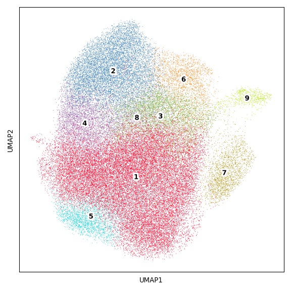
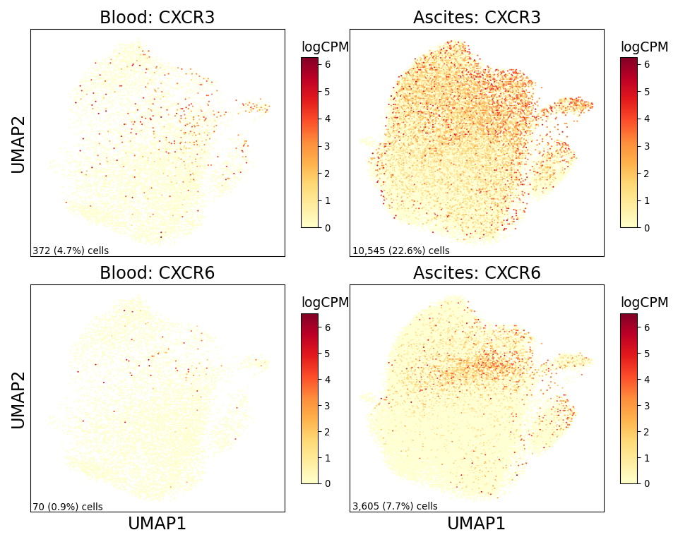
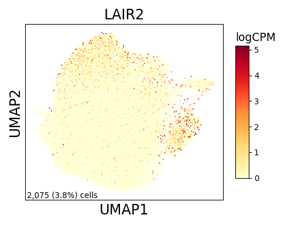

CD4 Figure
================

## Set up

Load R libraries

``` r
library(reticulate)
use_python("/projects/home/tlchan/.conda/envs/myenv/bin/python")

setwd('/projects/home/tlchan/github_code/ascites/functions')
source('plot_abundance.R')
source('plot_deg.R')
source('plot_dotplot.R')
```

Load python libraries

``` python
import pegasus as pg

import sys
sys.path.append("/projects/home/tlchan/github_code/ascites/functions")
import python_functions
```

## Figure 1A

``` python
cd4_cluster_palette = {
    "1": "#FF0029",
    "2": "#377EB8",
    "3": "#66A61E",
    "4": "#984EA3",
    "5": "#00D2D5",
    "6": "#FF7F00",
    "7": "#AF8D00",
    "8": "#7F80CD",
    "9": "#B3E900"
}

# Load single-cell object
cd4_data = pg.read_input(
    '/projects/home/tlchan/projects/ascites/second_data_freeze/clusterings/ascites_cd4_cite_concat_R7_300mg_20pm_harm_channel_multi_res/1.3/data/pseudobulk/ascites_cd4_cite_concat_R7_300mg_20pm_harm_channel_1_3_complete_with_pb.zarr.zip')

# Relabel obs for function
cd4_data.obs['Cluster'] = cd4_data.obs['leiden_pca_cite_concat'].cat.remove_unused_categories().astype(str)
cd4_data.obsm['X_umap'] = cd4_data.obsm['X_umap_pca_cite_concat']

python_functions.plot_umap(lin_data=cd4_data,
                           palette=cd4_cluster_palette)
```

    ## 2024-06-20 18:30:47,823 - pegasusio.readwrite - INFO - zarr file '/projects/home/tlchan/projects/ascites/second_data_freeze/clusterings/ascites_cd4_cite_concat_R7_300mg_20pm_harm_channel_multi_res/1.3/data/pseudobulk/ascites_cd4_cite_concat_R7_300mg_20pm_harm_channel_1_3_complete_with_pb.zarr.zip' is loaded.
    ## 2024-06-20 18:30:47,823 - pegasusio.readwrite - INFO - Function 'read_input' finished in 1.21s.



## Figure 1B

``` r
cd4_gex <- read.csv('/projects/home/tlchan/projects/ascites/figure_panels/dotplot_data/cd4_gene_exp.csv')
cd4_cite <- read.csv('/projects/home/tlchan/projects/ascites/figure_panels/dotplot_data/cd4_cite_exp.csv')

plot_dotplot(lin_gex = cd4_gex,
             lin_cite = cd4_cite,
             lin = "cd4",
             widths = c(1, .2, .2))
```

<!-- -->

## Figure 1C

``` r
plot_cluster_abundance("cd4")
```

<!-- -->

## Figure 1D

``` python
cd4_data = pg.read_input(
    '/projects/home/tlchan/projects/ascites/second_data_freeze/clusterings/ascites_cd4_cite_concat_R7_300mg_20pm_harm_channel_multi_res/1.3/data/pseudobulk/ascites_cd4_cite_concat_R7_300mg_20pm_harm_channel_1_3_complete_with_pb.zarr.zip')
cd4_data.obsm["X_umap"] = cd4_data.obsm["X_umap_pca_cite_concat"]

python_functions.plot_feature_by_tissue_type(lin_data=cd4_data,
                                             genes=["CXCR3", "CXCR6"])
```

    ## 2024-06-20 18:30:54,206 - pegasusio.readwrite - INFO - zarr file '/projects/home/tlchan/projects/ascites/second_data_freeze/clusterings/ascites_cd4_cite_concat_R7_300mg_20pm_harm_channel_multi_res/1.3/data/pseudobulk/ascites_cd4_cite_concat_R7_300mg_20pm_harm_channel_1_3_complete_with_pb.zarr.zip' is loaded.
    ## 2024-06-20 18:30:54,206 - pegasusio.readwrite - INFO - Function 'read_input' finished in 0.92s.



## Figure 1E

``` r
cd4_res <- read.csv('/projects/home/tlchan/projects/ascites/ascites_deg_results/cd4/cd4_ascites_de_by_survival_HvL_all_results.csv')
cd4_meta <- read.csv("/projects/home/tlchan/projects/ascites/second_data_freeze/clusterings/ascites_cd4_cite_concat_R7_300mg_20pm_harm_channel_multi_res/1.3/data/pseudobulk/ascites_cd4_cite_concat_R7_300mg_20pm_harm_channel_1_3_pseudobulk_meta.csv", row.names = 1)

cd4_meta <- cd4_meta %>%
    mutate(survival_bin = case_when(survival < 92 ~ "Low", survival > 183 ~ "High")) %>%
    filter(survival_bin == "Low" | survival_bin == "High") %>%
    mutate(survival_bin = factor(survival_bin, levels = c("Low", "High"))) %>%
    mutate(sex = factor(sex, levels = c('M', 'F'))) %>%
    filter(tissue_type == "ascites")

plotlist <- lapply(c(2, 3, 6), function(clust) {
    p <- plot_deg(res = cd4_res,
                  meta = cd4_meta,
                  lin = "CD4",
                  clust = clust,
                  contrast = "survival_bin",
                  ref_var = "Low",
                  test_var = "High")
    return(p)
})
ggarrange(plotlist = plotlist, nrow = 3)
```

<!-- -->

## Figure 1F

``` python
cd4_data = pg.read_input(
    '/projects/home/tlchan/projects/ascites/second_data_freeze/clusterings/ascites_cd4_cite_concat_R7_300mg_20pm_harm_channel_multi_res/1.3/data/pseudobulk/ascites_cd4_cite_concat_R7_300mg_20pm_harm_channel_1_3_complete_with_pb.zarr.zip')
cd4_data.obsm["X_umap"] = cd4_data.obsm["X_umap_pca_cite_concat"]

python_functions.plot_feature(lin_data=cd4_data,
                              genes=["LAIR2"],
                              ncol=1,
                              nrow=1)
```

    ## 2024-06-20 18:31:00,455 - pegasusio.readwrite - INFO - zarr file '/projects/home/tlchan/projects/ascites/second_data_freeze/clusterings/ascites_cd4_cite_concat_R7_300mg_20pm_harm_channel_multi_res/1.3/data/pseudobulk/ascites_cd4_cite_concat_R7_300mg_20pm_harm_channel_1_3_complete_with_pb.zarr.zip' is loaded.
    ## 2024-06-20 18:31:00,455 - pegasusio.readwrite - INFO - Function 'read_input' finished in 0.92s.


