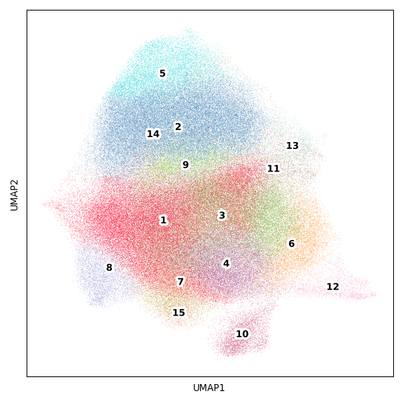
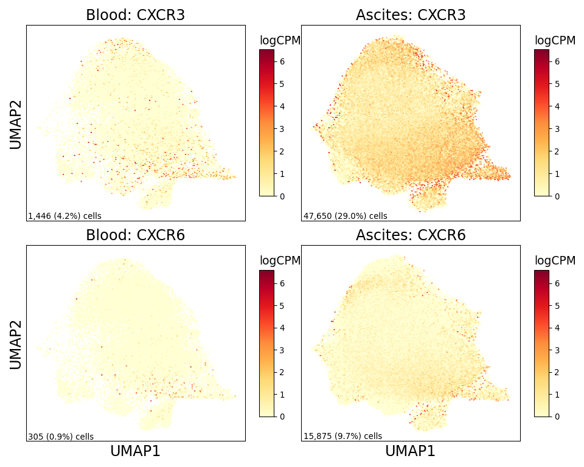

CD8 Figure
================

## Set up

Load R libraries

``` r
library(reticulate)
use_python("/projects/home/tlchan/.conda/envs/myenv/bin/python")

setwd('/projects/home/tlchan/github_code/ascites/functions')
source('plot_abundance.R')
source('plot_dotplot.R')
source('plot_sf_boxplot.R')
source('plot_upset.R')
```

Load python libraries

``` python
import pegasus as pg

import sys
sys.path.append("/projects/home/tlchan/github_code/ascites/functions")
import python_functions
```

## Figure 1A

``` python
cd8_cluster_palette = {
    "1": "#FF0029",
    "2": "#377EB8",
    "3": "#66A61E",
    "4": "#984EA3",
    "5": "#00D2D5",
    "6": "#FF7F00",
    "7": "#AF8D00",
    "8": "#7F80CD",
    "9": "#B3E900",
    "10": "#C42E60",
    "11": "#A65628",
    "12": "#F781BF",
    "13": "#8DD3C7",
    "14": "#BEBADA",
    "15": "#FB8072"
}

# Load single-cell object
cd8_data = pg.read_input(
    '/projects/home/tlchan/projects/ascites/second_data_freeze/clusterings/ascites_cd8_cite_concat_R7_300mg_20pm_harm_channel_multi_res/1.9/data/pseudobulk/ascites_cd8_cite_concat_R7_300mg_20pm_harm_channel_1_9_complete_with_pb.zarr.zip')

# Relabel obs for function
cd8_data.obs['Cluster'] = cd8_data.obs['leiden_pca_cite_concat'].cat.remove_unused_categories().astype(str)
cd8_data.obsm['X_umap'] = cd8_data.obsm['X_umap_pca_cite_concat']

python_functions.plot_umap(lin_data=cd8_data,
                           palette=cd8_cluster_palette)
```

    ## 2024-06-20 18:31:56,027 - pegasusio.readwrite - INFO - zarr file '/projects/home/tlchan/projects/ascites/second_data_freeze/clusterings/ascites_cd8_cite_concat_R7_300mg_20pm_harm_channel_multi_res/1.9/data/pseudobulk/ascites_cd8_cite_concat_R7_300mg_20pm_harm_channel_1_9_complete_with_pb.zarr.zip' is loaded.
    ## 2024-06-20 18:31:56,027 - pegasusio.readwrite - INFO - Function 'read_input' finished in 3.85s.



## Figure 1B

``` r
cd8_gex <- read.csv('/projects/home/tlchan/projects/ascites/figure_panels/dotplot_data/cd8_gene_exp.csv')
cd8_cite <- read.csv('/projects/home/tlchan/projects/ascites/figure_panels/dotplot_data/cd8_cite_exp.csv')

plot_dotplot(lin_gex = cd8_gex,
             lin_cite = cd8_cite,
             lin = "cd8",
             widths = c(1.0, 0.3, 0.2))
```

<!-- -->

## Figure 1C

``` r
plot_cluster_abundance(lin = "cd8",
                       cluster_order = c('1', '3', '4', '6', '7', '8', '9', '11', '15', '12', '13', '2', '5', '14', '10'))
```

<!-- -->

## Figure 1D

``` r
cd8_res <- read.csv('/projects/home/tlchan/projects/ascites/ascites_deg_results/cd8/cd8_de_by_tissue_type_all_results.csv')

cd8_clusters <- c('1', '3', '4', '6', '7', '8', '9', '11', '12', '13', '15')

cd8_res <- cd8_res %>% filter(cluster %in% cd8_clusters)

plot_upset(res = cd8_res,
           min_degree = 9)
```

<!-- -->

## Figure 1E

``` python
cd8_data = pg.read_input(
    '/projects/home/tlchan/projects/ascites/second_data_freeze/clusterings/ascites_cd8_cite_concat_R7_300mg_20pm_harm_channel_multi_res/1.9/data/pseudobulk/ascites_cd8_cite_concat_R7_300mg_20pm_harm_channel_1_9_complete_with_pb.zarr.zip')
cd8_data.obsm["X_umap"] = cd8_data.obsm["X_umap_pca_cite_concat"]

python_functions.plot_feature_by_tissue_type(lin_data=cd8_data,
                                             genes=["CXCR3", "CXCR6"])
```

    ## 2024-06-20 18:32:11,106 - pegasusio.readwrite - INFO - zarr file '/projects/home/tlchan/projects/ascites/second_data_freeze/clusterings/ascites_cd8_cite_concat_R7_300mg_20pm_harm_channel_multi_res/1.9/data/pseudobulk/ascites_cd8_cite_concat_R7_300mg_20pm_harm_channel_1_9_complete_with_pb.zarr.zip' is loaded.
    ## 2024-06-20 18:32:11,106 - pegasusio.readwrite - INFO - Function 'read_input' finished in 2.77s.



## Figure 1F

``` r
plot_sf_boxplot(analytes = c("CXCL10", "CXCL9", "CXCL16", "SDF-1", "IL-15", "IL-12p40", "TNFα", "IFNγ"),
                nrow = 2)
```

<!-- -->
