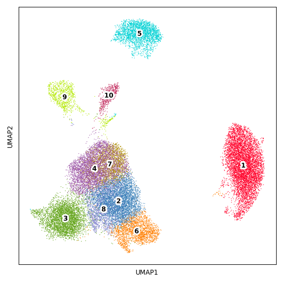
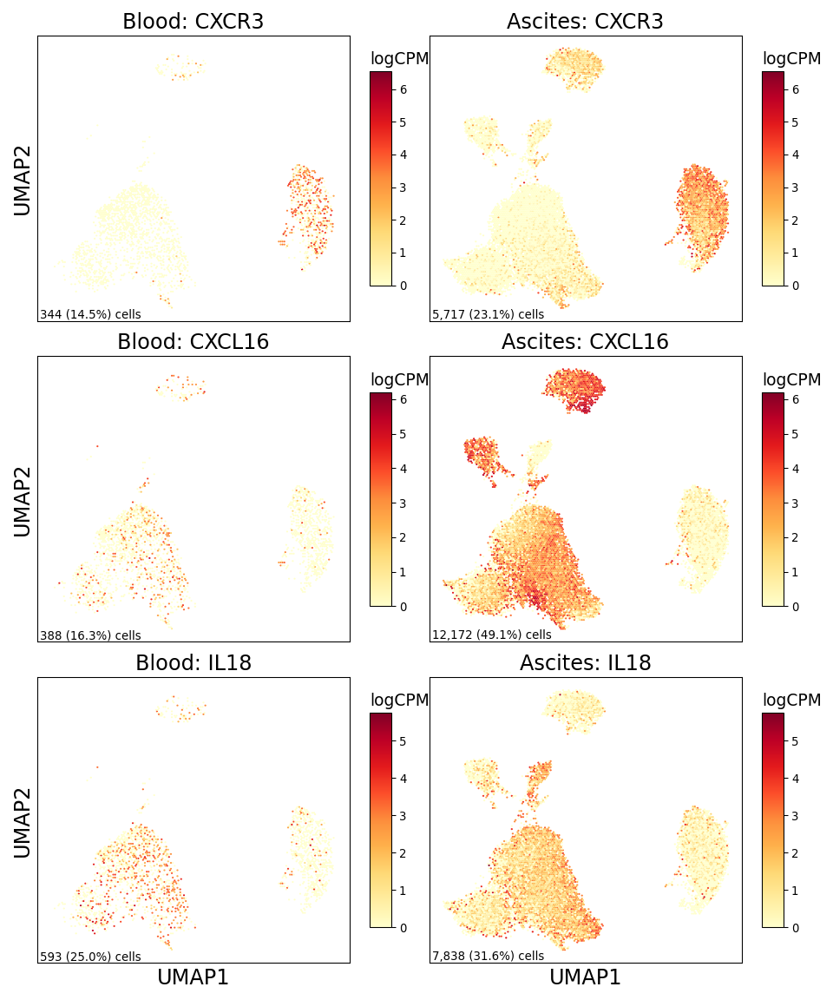

DC Figure
================

## Set up

Load R libraries

``` r
library(tidyverse)

library(reticulate)
use_python("/projects/home/tlchan/.conda/envs/myenv/bin/python")

setwd('/projects/home/tlchan/github_code/ascites/functions')
source('plot_abundance.R')
source('plot_deg.R')
source('plot_dotplot.R')
source('plot_fgsea.R')
source('plot_sf_boxplot.R')
```

Load python libraries

``` python
import pegasus as pg

import sys
sys.path.append("/projects/home/tlchan/github_code/ascites/functions")
import python_functions
```

## Figure 1A

``` python
dc_cluster_palette = {
    "1": "#FF0029",
    "2": "#377EB8",
    "3": "#66A61E",
    "4": "#984EA3",
    "5": "#00D2D5",
    "6": "#FF7F00",
    "7": "#AF8D00",
    "8": "#7F80CD",
    "9": "#B3E900",
    "10": "#C42E60"
}

# Load single-cell object
dc_data = pg.read_input(
    '/projects/home/tlchan/projects/ascites/second_data_freeze/clusterings/ascites_dc_R8_300mg_20pm_harm_channel_multi_res/1.1/data/pseudobulk/ascites_dc_R8_300mg_20pm_harm_channel_1_1_complete_with_pb.zarr.zip')

# Relabel obs for function
dc_data.obs['Cluster'] = dc_data.obs['leiden_labels'].cat.remove_unused_categories().astype(str)

python_functions.plot_umap(lin_data=dc_data,
                           palette=dc_cluster_palette)
```

    ## 2024-05-07 17:07:37,647 - pegasusio.readwrite - INFO - zarr file '/projects/home/tlchan/projects/ascites/second_data_freeze/clusterings/ascites_dc_R8_300mg_20pm_harm_channel_multi_res/1.1/data/pseudobulk/ascites_dc_R8_300mg_20pm_harm_channel_1_1_complete_with_pb.zarr.zip' is loaded.
    ## 2024-05-07 17:07:37,647 - pegasusio.readwrite - INFO - Function 'read_input' finished in 0.96s.
    ## /projects/home/tlchan/.conda/envs/myenv/lib/python3.9/site-packages/scanpy/plotting/_tools/scatterplots.py:392: UserWarning: No data for colormapping provided via 'c'. Parameters 'cmap' will be ignored
    ##   cax = scatter(



## Figure 1B

``` r
dc_gex <- read.csv('/projects/home/tlchan/projects/ascites/figure_panels/dotplot_data/dc_gene_exp.csv')
dc_cite <- read.csv('/projects/home/tlchan/projects/ascites/figure_panels/dotplot_data/dc_cite_exp.csv')

plot_dotplot(lin_gex = dc_gex,
             lin_cite = dc_cite,
             lin = "dc")
```

<!-- -->

## Figure 1C

``` r
plot_cluster_abundance("dc")
```

<!-- -->

## Figure 1D

``` python
dc_data = pg.read_input(
    '/projects/home/tlchan/projects/ascites/second_data_freeze/clusterings/ascites_dc_R8_300mg_20pm_harm_channel_multi_res/1.1/data/pseudobulk/ascites_dc_R8_300mg_20pm_harm_channel_1_1_complete_with_pb.zarr.zip')

python_functions.plot_feature_by_tissue_type(lin_data=dc_data,
                                             genes=["CXCR3", "CXCL16", "IL18"])
```

    ## 2024-05-07 17:07:43,138 - pegasusio.readwrite - INFO - zarr file '/projects/home/tlchan/projects/ascites/second_data_freeze/clusterings/ascites_dc_R8_300mg_20pm_harm_channel_multi_res/1.1/data/pseudobulk/ascites_dc_R8_300mg_20pm_harm_channel_1_1_complete_with_pb.zarr.zip' is loaded.
    ## 2024-05-07 17:07:43,138 - pegasusio.readwrite - INFO - Function 'read_input' finished in 0.79s.



## Figure 1E

``` r
plot_sf_boxplot(c("6CKine", "SCF", "IL-6", "FLT-3L"))
```

<!-- -->

## Figure 1F

``` r
dc_res <- read.csv('/projects/home/tlchan/dc/dc_ascites_de_by_B2M_all_results.csv')
dc_meta <- read.csv('/projects/home/tlchan/projects/ascites/second_data_freeze/clusterings/ascites_dc_R8_300mg_20pm_harm_channel_multi_res/1.1/data/pseudobulk/ascites_dc_R8_300mg_20pm_harm_channel_1_1_pseudobulk_meta.csv', row.names = 1)

p <- plot_deg(res = dc_res,
              meta = dc_meta,
              lin = "DC",
              clust = 10)
return(p)
```

<!-- -->

## Figure 1G

``` r
B2M_palette <- list("0" = "#FF0029",
                    "1" = "#377EB8",
                    "2" = "#66A61E")

counts_filepath <- "/projects/home/tlchan/projects/ascites/second_data_freeze/clusterings/ascites_dc_R8_300mg_20pm_harm_channel_multi_res/1.1/data/pseudobulk/ascites_dc_R8_300mg_20pm_harm_channel_1_1_pseudobulk_counts.csv"
meta_filepath <- '/projects/home/tlchan/projects/ascites/second_data_freeze/clusterings/ascites_dc_R8_300mg_20pm_harm_channel_multi_res/1.1/data/pseudobulk/ascites_dc_R8_300mg_20pm_harm_channel_1_1_pseudobulk_meta.csv'

counts <- read_csv(counts_filepath)
counts <- counts %>%
    column_to_rownames(var = "featurekey") %>%
    apply(2, function(c) {
        n_total <- sum(c)
        per_100k <- (c * 1000000) / n_total
        return(per_100k)
    }) %>%
    as.data.frame
counts <- log1p(counts)
counts <- counts %>% filter(rownames(counts) == 'IL4I1')

meta <- read.csv(meta_filepath, row.names = 1) %>% filter(tissue_type == "ascites")

# Subset counts
counts <- select(counts, rownames(meta))

# Subset to cluster 10
meta_cluster <- meta[meta$cluster == 10,]
meta_cluster <- meta_cluster[meta_cluster$n_cells >= 10,]
tot_cells <- sum(meta_cluster$n_cells)
counts_cluster <- counts[, rownames(meta_cluster)]
n_samp <- rowSums(counts_cluster != 0)
counts_cluster <- counts_cluster[n_samp > (nrow(meta_cluster) / 2),]

counts_cluster <- as.data.frame(t(counts_cluster))
counts_cluster$sample <- rownames(counts_cluster)
meta_cluster$sample <- rownames(meta_cluster)
plot_data <- merge(counts_cluster, meta_cluster, by = "sample")

ggplot(plot_data, aes(x = factor(B2M), y = IL4I1)) +
    geom_boxplot(outlier.shape = NA) +
    geom_point(pch = 21, position = position_jitterdodge(), aes(fill = factor(B2M)), size = 2) +
    labs(fill = "B2M") +
    ylab("log(count + 1)") +
    xlab("B2M") +
    theme_classic(base_size = 12)
```

<!-- -->

## Figure 1H

``` r
dc_fgsea <- read.csv("/projects/home/tlchan/projects/ascites/second_data_freeze/data/dc_analysis/mreg/mreg_fgsea_results.csv")
gene_sets <- read.csv("/projects/home/tlchan/projects/ascites/second_data_freeze/data/dc_analysis/mreg/gene_sets.csv")

cDC2_fgsea <- dc_fgsea %>%
    filter(pathway == "cDC2") %>%
    filter(variable == "B2M_2v0")

dc_mreg_B2M_data <- read.csv(glue('/projects/home/tlchan/dc_mregs/dc_mregs_de_by_B2M_2v0_all_results.csv')) %>%
    select(c("gene_symbol", "stat")) %>%
    na.omit() %>%
    distinct() %>%
    group_by(gene_symbol) %>%
    summarize(stat = mean(stat)) %>%
    deframe()

cDC2_gs <- gene_sets %>%
    filter(program_name == "cDC2") %>%
    pull(genes) %>%
    str_split(",") %>%
    unlist()

plot_fgsea(cDC2_fgsea, dc_mreg_B2M_data, cDC2_gs, "DC mreg", "B2M (2 vs. 0)", "cDC2")
```

<!-- -->
