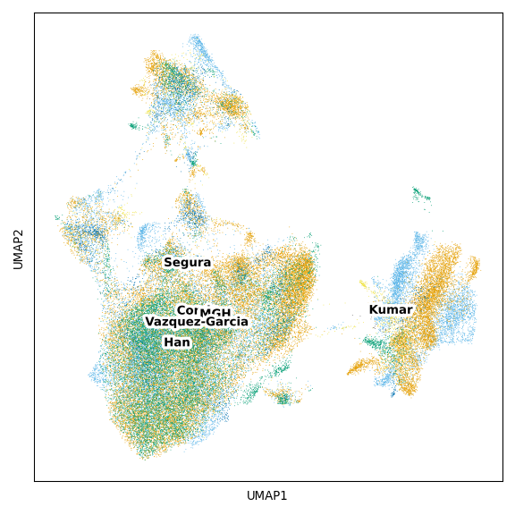
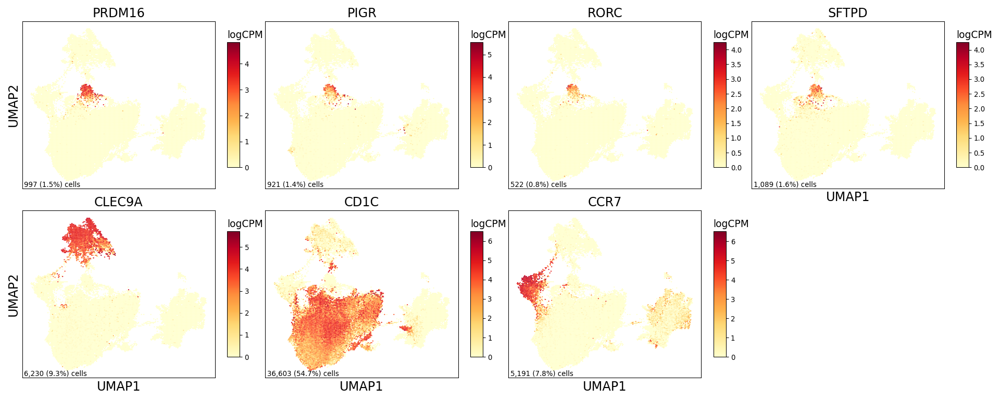

DC Figure 3
================

## Set up

Load R libraries

``` r
library(tidyverse)

library(reticulate)
use_python("/projects/home/tlchan/.conda/envs/myenv/bin/python")
```

Load python libraries

``` python
import pegasus as pg

import sys
sys.path.append("/projects/home/tlchan/github_code/ascites/functions")
import python_functions
```

## Figure 1B

``` python
dataset_dict = {
    "cancer_discovery": "Kumar",
    "gastric": "MGH",
    "ovarian": "Vazquez-Garcia",
    "peritoneal": "Han",
    "teichmann": "Conde",
    "tonsil": "Segura"
}

dataset_palette = {
    "Kumar": "#666666",
    "MGH": "#E69F00",
    "Vazquez-Garcia": "#56B4E9",
    "Han": "#009E73",
    "Conde": "#F0E442",
    "Segura": "#0072b2"
}

# Load single-cell object
ext_dc_data = pg.read_input(
    '/projects/home/tlchan/projects/ascites/dc_hunting/clusterings/combo_data_dc_R4_300mg_20pm_harm_dataset_multi_res/1.5/data/pseudobulk/combo_data_dc_R4_300mg_20pm_harm_dataset_1_5_complete_with_pb.zarr.zip')

# Relabel obs for function
pg.annotate(ext_dc_data, 'dataset', 'dataset', dataset_dict)

python_functions.plot_umap(lin_data=ext_dc_data,
                           color="dataset",
                           palette=dataset_palette)
```

    ## 2024-05-28 20:30:14,123 - pegasusio.readwrite - INFO - zarr file '/projects/home/tlchan/projects/ascites/dc_hunting/clusterings/combo_data_dc_R4_300mg_20pm_harm_dataset_multi_res/1.5/data/pseudobulk/combo_data_dc_R4_300mg_20pm_harm_dataset_1_5_complete_with_pb.zarr.zip' is loaded.
    ## 2024-05-28 20:30:14,123 - pegasusio.readwrite - INFO - Function 'read_input' finished in 2.62s.



## Figure 1C

``` python
ext_dc_data = pg.read_input("/projects/home/tlchan/projects/ascites/dc_hunting/clusterings/combo_data_dc_R4_300mg_20pm_harm_dataset_multi_res/1.5/data/pseudobulk/combo_data_dc_R4_300mg_20pm_harm_dataset_1_5_complete_with_pb.zarr.zip")

python_functions.plot_feature(lin_data=ext_dc_data,
                              genes=['PRDM16', 'PIGR', 'RORC', 'SFTPD', 'CLEC9A', 'CD1C', 'CCR7'],
                              ncol=4,
                              nrow=2)
```

    ## 2024-05-28 20:30:17,915 - pegasusio.readwrite - INFO - zarr file '/projects/home/tlchan/projects/ascites/dc_hunting/clusterings/combo_data_dc_R4_300mg_20pm_harm_dataset_multi_res/1.5/data/pseudobulk/combo_data_dc_R4_300mg_20pm_harm_dataset_1_5_complete_with_pb.zarr.zip' is loaded.
    ## 2024-05-28 20:30:17,915 - pegasusio.readwrite - INFO - Function 'read_input' finished in 2.63s.



## Figure 1D

``` r
# Load data
abundance <- read.csv('/projects/home/tlchan/projects/ascites/external_dcs_obs.csv')

abundance <- abundance %>%
    filter(!dataset %in% c("tonsil")) %>%
    group_by(organ, organ_type, dataset, Channel, leiden_labels) %>%
    summarize(n_cell = n())

# Include zeros
combos <- expand.grid(unique(abundance$Channel), unique(abundance$leiden_labels)) %>%
    `colnames<-`(c("Channel", "leiden_labels")) %>%
    left_join(abundance %>%
                  select("Channel", "organ_type", "organ") %>%
                  distinct(), by = c("Channel"))

abundance <- combos %>%
    left_join(abundance, by = c("Channel", "leiden_labels", "organ_type", "dataset", "organ")) %>%
    replace(is.na(.), 0)

abundance <- abundance %>%
    group_by(organ, Channel) %>%
    mutate(channel_count = sum(n_cell),
           percentage = n_cell / channel_count * 100)

organ_levels <- list("Other", "Upper quadrant", "Skeletal muscle", "Lung", "Liver", "Bone marrow", "Blood", "Adnexa",
                     "Thymus", "Thoracic LN", "Spleen", "Mesenteric LN", "Transverse colon", "Sigmoid colon", "Jejunum LP", "Jejunum epithelium", "Ileum", "Doudenum", "Caecum", "Bowel",
                     "Stomach", "Omentum", "Peritoneum", "Healthy washing", "Ascites")

tumor_palette <- list("Peritoneum" = "#66A61E", "GI tract" = "#984EA3", "Lymphoid" = "#00D2D5",
                      "Blood" = "#FF7F00", "Adnexa" = "#FF7F00", "Bone marrow" = "#FF7F00", "Liver" = "#FF7F00", "Lung" = "#FF7F00", "Muscle" = "#FF7F00", "Other" = "#FF7F00")

abundance <- abundance %>%
    filter(leiden_labels == 'dc_17') %>%
    mutate(organ = factor(organ, levels = organ_levels),
           dataset = factor(dataset, levels = c('GEA', 'NI PC', 'Ovarian_Ca', 'Immune Atlas')))

ggplot(abundance, aes(y = organ, x = percentage + 0.1, fill = organ_type)) +
    geom_boxplot(outlier.shape = NA) +
    geom_point(pch = 21, position = position_jitterdodge(), size = 3) +
    labs(fill = "Organ type") +
    scale_x_log10() +
    ylab("Organ") +
    xlab("Percent of channel + 0.1") +
    ggtitle("DC cluster 17, percent abundance") +
    facet_grid(dataset ~ ., scales = "free_y", space = 'free') +
    scale_fill_manual(values = tumor_palette) +
    theme_classic(base_size = 15) +
    theme(axis.text.x = element_text(angle = 90, vjust = 0.5, hjust = 1))
```

<!-- -->
