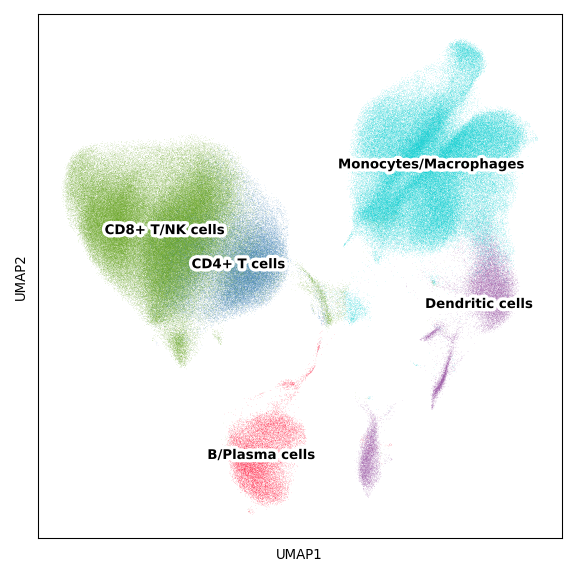

Figure 1
================

## Set up

Load R libraries

``` r
library(circlize)
library(ComplexHeatmap)
library(ggpubr)
library(ggrepel)
library(limma)
library(parameters)
library(rstatix)
library(tidyverse)

library(reticulate)
use_python("/projects/home/tlchan/.conda/envs/myenv/bin/python")
```

Load python libraries

``` python
import matplotlib.pyplot as plt
import pegasus as pg
import scanpy as sc
```

## Figure 1B

``` python
lineage_palette = {
    "B/Plasma cells": "#FF0029",
    "CD4+ T cells": "#377EB8",
    "CD8+ T/NK cells": "#66A61E",
    "Dendritic cells": "#984EA3",
    "Monocytes/Macrophages": "#00D2D5",
    "Cancer cells": "#FF7F00"
}

# Load single-cell object
global_data = pg.read_input(
    '/projects/home/tlchan/projects/ascites/second_data_freeze/clusterings/ascites_combo_lineage_R8_300mg_20pm_harm_channel_multi_res/0.9/data/pseudobulk/ascites_combo_lineage_R8_300mg_20pm_harm_channel_0_9_complete_with_pb.zarr.zip')

lineage_dict = {
    'cd4': 'CD4+ T cells',
    'cd8': 'CD8+ T/NK cells',
    'monomac': 'Monocytes/Macrophages',
    'dc': 'Dendritic cells',
    'bplasma': 'B/Plasma cells'
}

# Rename labels for plot
pg.annotate(global_data, 'Lineage', 'lineage', lineage_dict)

lineage_fig, lineage_ax = plt.subplots(1)
lineage_umap = sc.pl.umap(adata=global_data.to_anndata(),
                          color="Lineage",
                          use_raw=True,
                          palette=lineage_palette,
                          legend_loc="on data",
                          legend_fontoutline=5,
                          title="",
                          show=False,
                          ax=lineage_ax)
lineage_fig = plt.gcf()
lineage_fig.set_size_inches(6, 6)
lineage_fig.tight_layout()
lineage_ax.set_rasterization_zorder(2)
plt.show()
plt.close(lineage_fig)
```

    ## 2024-05-25 10:45:32,073 - pegasusio.readwrite - INFO - zarr file '/projects/home/tlchan/projects/ascites/second_data_freeze/clusterings/ascites_combo_lineage_R8_300mg_20pm_harm_channel_multi_res/0.9/data/pseudobulk/ascites_combo_lineage_R8_300mg_20pm_harm_channel_0_9_complete_with_pb.zarr.zip' is loaded.
    ## 2024-05-25 10:45:32,073 - pegasusio.readwrite - INFO - Function 'read_input' finished in 12.66s.



## Figure 1C

``` r
tissue_palette <- list("ascites" = "#00BFC4",
                       "blood" = "#F8766D",
                       "other" = "#000000")

paired_samples <- c("ASC_10", "ASC_25", "ASC_41", "ASC_45", "ASC_46", "ASC_48", "ASC_49", "ASC_52", "ASC_57", "ASC_61", "ASC_62", "ASC_65", "ASC_66", "ASC_67")

# Load data
abundance <- read.csv("/projects/home/tlchan/projects/ascites/second_data_freeze/data/metadata/ascites_abundance.csv")

# Remove cancer cells
abundance <- abundance %>%
    filter(lineage != "cancer") %>%
    filter(patient_id %in% paired_samples) %>%
    filter(patient_id != "ASC_48")

# Re-label for plot
abundance <- abundance %>% mutate(lineage = case_when(lineage == "bplasma" ~ "B/Plasma",
                                                      lineage == "cd4" ~ "CD4",
                                                      lineage == "cd8" ~ "CD8",
                                                      lineage == "dc" ~ "DC",
                                                      lineage == "monomac" ~ "Mono/Mac"))

# Get lin count
abundance <- abundance %>%
    group_by(patient_id, tissue_type, lineage) %>%
    mutate(lin_count = sum(immune == "True")) %>%
    select(patient_id, tissue_type, lineage, lin_count) %>%
    distinct()

# Account for patient/tissue pairs that contributed zero cells to clusters
combos <- expand.grid(unique(abundance$patient_id), unique(abundance$tissue_type), unique(abundance$lineage)) %>% `colnames<-`(c("patient_id", "tissue_type", "lineage"))

abundance <- combos %>%
    left_join(abundance, by = c("patient_id", "tissue_type", "lineage")) %>%
    replace(is.na(.), 0)

# Get statistics
abundance <- abundance %>%
    group_by(patient_id, tissue_type) %>%
    mutate(total_count = sum(lin_count)) %>%
    mutate(lin_percentage = lin_count / total_count * 100) %>%
    mutate(log_lin_percentage = log1p(lin_percentage)) %>%
    mutate(tissue_type = factor(tissue_type, levels = c("ascites", "blood")))

# Remove patients with fewer than 250 immune native fraction cells
abundance <- abundance %>%
    group_by(patient_id) %>%
    mutate(min_total_count = min(total_count)) %>%
    filter(min_total_count > 250)

bp <- ggplot(abundance, aes(x = lin_percentage + 1, y = factor(lineage), fill = tissue_type)) +
    geom_boxplot(outlier.shape = NA) +
    geom_point(pch = 21, position = position_jitterdodge(), aes(fill = tissue_type), size = 2) +
    scale_x_log10() +
    coord_cartesian(clip = "off") +
    labs(fill = "Tissue type") +
    xlab("Percent native immune + 1") +
    ylab("") +
    theme_classic(base_size = 25) +
    theme(axis.text.y = element_blank(), axis.text = element_text(size = 20)) +
    scale_fill_manual(values = tissue_palette)

pt_res <- lapply(unique(abundance$lineage), function(lin) {
    pt_data <- abundance %>% filter(lineage == lin)
    stats <- parameters(t.test(log_lin_percentage ~ tissue_type, pt_data, paired=TRUE))
    stats$lineage <- lin
    return(stats)
}) %>%
    do.call(rbind, .) %>%
    mutate(padj = p.adjust(p, method = "fdr")) %>%
    mutate(color = case_when(padj < 0.1 & Difference > 0 ~ "ascites", padj < 0.1 & Difference < 0 ~ "blood", padj >= 0.1 ~ "other"))

fp <- ggplot(pt_res, aes(x = Difference, y = factor(lineage), color = color)) +
    geom_point(size = 3) +
    geom_errorbarh(mapping = aes(xmin = CI_low, xmax = CI_high, height = 0)) +
    geom_vline(xintercept = 0) +
    guides(color = "none") +
    xlab("Log2FoldChange") +
    ylab("Lineage") +
    theme_classic(base_size = 25) +
    theme(axis.text = element_text(size = 20)) +
    scale_color_manual(values = tissue_palette)

ggarrange(fp, bp, ncol = 2, nrow = 1, widths = c(0.5, 1.0))
```

<!-- -->

## Figure 1D

``` r
# Read in metadata
metadata <- read_csv("/projects/home/tlchan/projects/ascites/figure_panels/metadata_heatmap.csv")

# Get matrix
metadata_mtx <- metadata %>%
    select(-patient_id) %>%
    as.matrix()
rownames(metadata_mtx) <- metadata$patient_id
metadata_mtx <- t(metadata_mtx)

rownames(metadata_mtx) <- c("Age", "Sex:Male", "Survival", "B2M",
                            "scRNA-Ascites", "scRNA-Blood",
                            "CITEseq-Ascites", "CITEseq-Blood",
                            "proteomics-Ascites", "proteomics-Blood")

# Split row
row_split <- c(rep("meta", 3), rep("analyses", 6))
row_split <- factor(row_split, levels = unique(row_split))

# Add colors
col_survival <- colorRamp2(c(3, 501), hcl_palette = "YlOrRd")
col_B2M <- colorRamp2(c(0, 1, 2), hcl_palette = "PuBu", reverse = TRUE)

make_rect <- function(j, i, x, y, width, height, fill) {
    grid.rect(x = x, y = y,
              width = width, height = height,
              gp = gpar(col = "black"))
    if (i == 2) { # ie. survival
        grid.rect(x = x, y = y,
                  width = width, height = height,
                  gp = gpar(fill = col_survival(as.numeric(metadata_mtx[i, j])), col = "black"))
    }
    else if (i == 3) { # ie. B2M
        grid.rect(x = x, y = y,
                  width = width, height = height,
                  gp = gpar(fill = col_B2M(as.numeric(metadata_mtx[i, j])), col = "black"))
    }
    else if (as.numeric(metadata_mtx[i, j]) == 1) {
        grid.rect(x = x, y = y,
                  width = width, height = height,
                  gp = gpar(col = "black", fill = "#5A5A5A"))
    } else if (as.numeric(metadata_mtx[i, j]) == 0) {
        grid.rect(x = x, y = y,
                  width = width, height = height,
                  gp = gpar(col = "black", fill = "white"))
    }
}

# Add percent cells and age annotation
lineage_cols <- c("B/Plasma cells" = "#FF0029",
                  "CD4+ T/NK cells" = "#377EB8",
                  "CD8+ T/NK cells" = "#66A61E",
                  "Dendritic cells" = "#984EA3",
                  "Monocytes/Macrophages" = "#00D2D5",
                  "Cancer cells" = "#FF7F00")

global_lineage <- read.csv("/projects/home/tlchan/projects/ascites/figure_panels/abundance_data/global_lineage_counts.csv", check.names = F)
perc_mtx <- global_lineage %>%
    group_by(Patient) %>%
    mutate(Native_Count = Native_Count / sum(Native_Count)) %>%
    select(Patient, Lineage, Native_Count) %>%
    pivot_wider(names_from = Lineage, values_from = Native_Count, values_fill = 0) %>%
    column_to_rownames("Patient") %>%
    arrange(desc(`Cancer cells`)) %>%
    as.matrix()

# Organize patients by cancer contribution
metadata_mtx <- metadata_mtx[, rownames(perc_mtx)]

# Get age data
age_mtx <- metadata_mtx['Age',]
metadata_mtx <- metadata_mtx[-1,]

top_bar <- HeatmapAnnotation("Cell fraction" = anno_barplot(perc_mtx, height = unit(2.8, "cm"), gp = gpar(fill = lineage_cols)),
                             "Age" = anno_points(age_mtx, height = unit(1.2, "cm")),
                             gap = unit(2, "mm"))

# Make heatmap body
ht <- Heatmap(metadata_mtx,
              cell_fun = make_rect,
              rect_gp = gpar(type = "none"),
              border_gp = gpar(col = "black"),
              cluster_columns = FALSE,
              cluster_rows = FALSE,
              show_row_names = TRUE,
              row_title = NULL,
              row_split = row_split,
              row_gap = unit(2, "mm"),
              top_annotation = top_bar,
              column_names_side = "bottom",
              row_names_side = "right",
              show_heatmap_legend = FALSE,
              show_column_names = TRUE,
              column_names_rot = 45,
              width = ncol(metadata_mtx) * unit(6, "mm"),
              height = nrow(metadata_mtx) * unit(6, "mm"),
              column_gap = unit(3, "mm"))

# Make legends
lin_lgd <- Legend(labels = colnames(perc_mtx),
                  title = "Lineage",
                  legend_gp = gpar(fill = lineage_cols),
                  border = "black")

survival_lgd <- Legend(col_fun = col_survival,
                       title = "Survival (days)",
                       legend_gp = gpar(fill = col_survival),
                       border = "black")

at <- seq(0, 2, by = 1)
B2M_lgd <- Legend(at = at,
                  title = "B2M",
                  legend_gp = gpar(fill = col_B2M(at)),
                  border = "black")

fill_lgd <- Legend(labels = c("True", "False"),
                   title = "Fill",
                   labels_gp = gpar(col = c("black", "black")),
                   legend_gp = gpar(fill = c("#5A5A5A", "white")),
                   border = "black")

pd <- packLegend(lin_lgd, survival_lgd, B2M_lgd, fill_lgd, direction = "vertical")

draw(ht)
draw(pd, x = unit(0.93, "npc"), y = unit(0.58, "npc"))
```

<!-- -->

## Figure 1E

``` r
sf_names <- read.csv("/projects/home/tlchan/projects/ascites/second_data_freeze/data/secreted_factors/sf_common_names.csv")
paired_list <- list('ASC_41', 'ASC_43', 'ASC_45', 'ASC_46', 'ASC_48', 'ASC_52', 'ASC_57', 'ASC_61', 'ASC_62', 'ASC_65', 'ASC_66', 'ASC_67')

# Load and prepare data
sf_data <- read.csv("/projects/home/tlchan/projects/ascites/second_data_freeze/data/secreted_factors/secreted_factors_updated.csv", row.names = 1) %>%
    filter(diluted == "No") %>%
    filter(type != "pleural") %>%
    filter(panel == "96-cytokine") %>%
    filter(patient_id %in% paired_list) %>%
    mutate(log_concentration = log(concentration)) %>%
    merge(sf_names, all.x = TRUE) %>%
    mutate(analyte = ifelse(!is.na(common_name), common_name, analyte))

# Run paired t-test
t_results <- sf_data %>%
    select(patient_id, log_concentration, type, analyte) %>%
    group_by(analyte) %>%
    t_test(log_concentration ~ type, paired = TRUE, ref.group = "plasma") %>%
    adjust_pvalue(method = "BH") %>%
    add_significance() %>%
    select(analyte, p, p.adj) %>%
    rename(ID = analyte)

# Save metadata
sf_metadata <- sf_data %>%
    select("sample_code", "type") %>%
    distinct() %>%
    mutate(type = factor(type, levels = c("plasma", "ascites")))

# Convert to wide format
sf_data <- sf_data[, c("sample_code", "analyte", "log_concentration")]
sf_data <- spread(sf_data, "analyte", "log_concentration")

# Embed rownames
sf_mtx <- as.matrix(sf_data[, -1])
rownames(sf_mtx) <- sf_data[, 1]

# Transpose for testing
sf_mtx <- t(sf_mtx)

# Match order of samples for metadata to mtx
sf_metadata <- sf_metadata %>% mutate(sample_code = factor(sample_code, levels = colnames(sf_mtx)))
sf_metadata <- sf_metadata[order(sf_metadata$sample_code),]

# Create design matrix for testing
des <- with(sf_metadata, model.matrix(as.formula("~type")))

# Create linear model and generate statistics
fit <- lmFit(object = sf_mtx, design = des)
fit <- eBayes(fit, robust = TRUE)

# Store genes
fit$genes <- rownames(fit$coefficients)

# Merge results with t-test results
res <- topTable(fit, coef = "typeascites", number = length(fit$genes))
res <- res %>% select(ID, logFC) %>% merge(t_results)

# Visualize results as volcano plot
up_label <- res %>%
    dplyr::filter(logFC > 0) %>%
    arrange(p) %>%
    top_n(-10, p) %>%
    .$ID
down_label <- res %>%
    filter(logFC < 0) %>%
    arrange(p) %>%
    top_n(-10, p) %>%
    .$ID
label_genes <- c(up_label, down_label)

ggplot(res, aes(x = logFC, y = -log10(p))) +
    geom_point(data = res[res$p.adj > 0.1,], color = "grey") +
    geom_point(data = res[res$logFC > 0 & res$p.adj < 0.1,], color = "#1F77B4") +
    geom_point(data = res[res$logFC < 0 & res$p.adj < 0.1,], color = "#D62728") +
    geom_text_repel(data = res[res$ID %in% label_genes,], aes(label = ID), max.overlaps = Inf, size = 4.5) +
    theme_classic(base_size = 20)
```

<!-- -->
