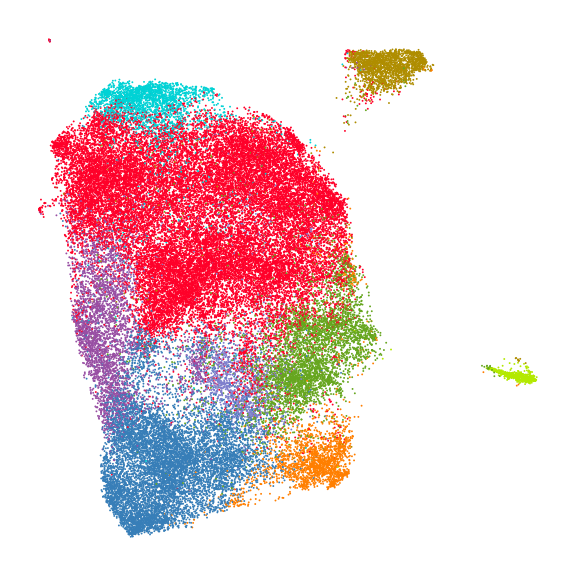
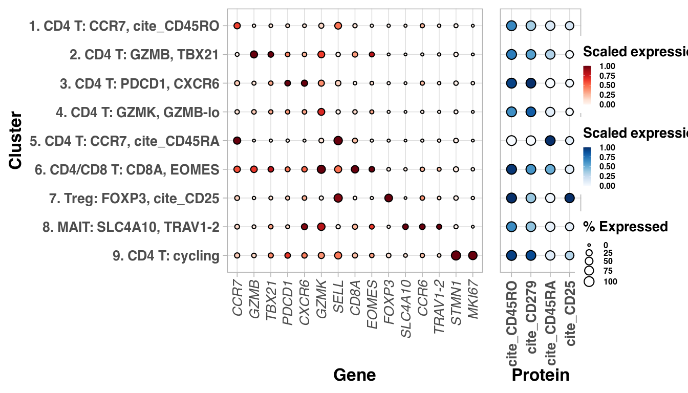
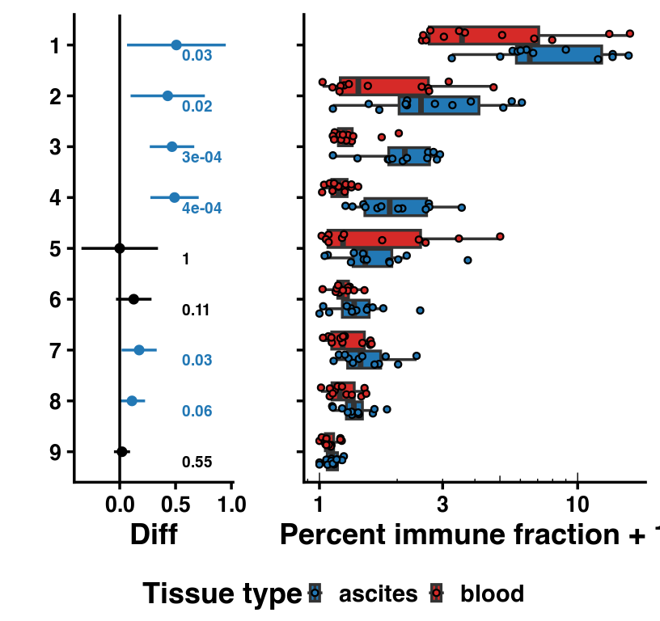
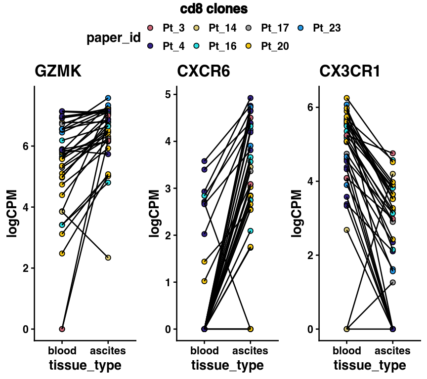
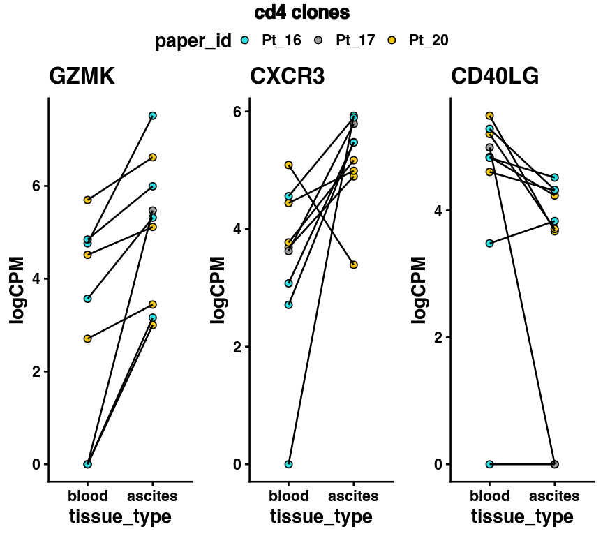
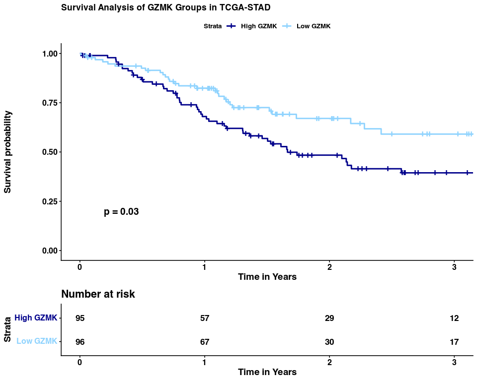

Figure 2
================

## Set up

Load R libraries

``` r
library(tidyverse)
library(magrittr)
library(ggplot2)
library(scattermore)
library(glue)
library(gtools)
library(ggpubr)
library(ggrepel)
library(survival)
library(survminer)
library(dplyr)
library(readr)

library(reticulate)
use_python("/projects/home/nealpsmith/software/pegasus_new_py/bin/python")

# setwd('/projects/home/tlchan/github_code/ascites/functions')
source('../../functions/plot_abundance.R')
source('../../functions/plot_dotplot.R')
source('../../functions/plot_upset.R')
```

Load python libraries

``` python
import matplotlib.pyplot as plt
import pegasus as pg

import sys
sys.path.append("../../functions")
import python_functions
```

## Figure 2A

``` python
cd4_cluster_palette = {
    "1": "#FF0029",
    "2": "#377EB8",
    "3": "#66A61E",
    "4": "#984EA3",
    "5": "#00D2D5",
    "6": "#FF7F00",
    "7": "#AF8D00",
    "8": "#7F80CD",
    "9": "#B3E900"
}

# Load single-cell object
cd4_data = pg.read_input(
    '/projects/home/tlchan/projects/ascites/integrated_data/clusterings/ascites_cd4_cite_concat_R7_300mg_20pm_harm_channel_multi_res/1.3/data/pseudobulk/ascites_cd4_cite_concat_R7_300mg_20pm_harm_channel_1_3_complete_with_pb.zarr.zip')

pg.umap(cd4_data, rep='pca_cite_concat', min_dist=0.01, spread=2, out_basis='umap_pca_cite_concat')

# Relabel obs for function
cd4_data.obs['Cluster'] = cd4_data.obs['leiden_pca_cite_concat'].cat.remove_unused_categories().astype(str)
cd4_data.obsm['X_umap'] = cd4_data.obsm['X_umap_pca_cite_concat']

fig = python_functions.plot_umap(lin_data=cd4_data,
                                 palette=cd4_cluster_palette,
                                 legend_loc=None,
                                 size=8)

plt.show()
# plt.savefig("/projects/home/tlchan/fig_panels/fig_2a.pdf")
plt.close(fig)
```

    ## /projects/home/nealpsmith/software/pegasus_new_py/lib/python3.12/site-packages/umap/umap_.py:1952: UserWarning: n_jobs value 1 overridden to 1 by setting random_state. Use no seed for parallelism.
    ##   warn(
    ## UMAP(min_dist=0.01, n_jobs=1, precomputed_knn=(array([[    0, 47, 923, ..., 41212, 42631, 28439],
    ##        [    1, 48548, 3095, ..., 22343, 39832, 48839],
    ##        [    2, 32671, 16798, ..., 25635, 17763, 3197],
    ##        ...,
    ##        [54479, 52148, 48207, ..., 51772, 38768, 54186],
    ##        [54480, 18948, 29512, ..., 49696, 42454, 26531],
    ##        [54481, 48117, 49923, ..., 49014, 52345, 49213]], shape=(54482, 15)), array([[0.       , 7.9653788, 8.102019 , ..., 8.427244 , 8.456426 ,
    ##         8.51234  ],
    ##        [0.       , 4.1543746, 4.3325644, ..., 4.8778615, 4.885023 ,
    ##         4.8907905],
    ##        [0.       , 7.8231144, 7.8412333, ..., 8.683318 , 8.692059 ,
    ##         8.7420635],
    ##        ...,
    ##        [0.       , 5.7290106, 5.758914 , ..., 6.434189 , 6.4435067,
    ##         6.5045056],
    ##        [0.       , 4.520164 , 4.807295 , ..., 5.3285036, 5.3378077,
    ##         5.3459125],
    ##        [0.       , 4.7135024, 4.928068 , ..., 5.531237 , 5.61214  ,
    ##         5.6200533]], shape=(54482, 15), dtype=float32), <pegasus.tools.visualization.DummyNNDescent object at 0x7f9fb1501730>), random_state=0, spread=2, verbose=True)
    ## Fri Feb  6 20:03:30 2026 Construct fuzzy simplicial set
    ## Fri Feb  6 20:03:30 2026 Construct embedding
    ## Epochs completed:   0%|                                                                                                                                                                                                        0/200 [00:00] completed  0  /  200 epochs
    ## Epochs completed:   2%| ##9                                                                                                                                                                                                    3/200 [00:00]Epochs completed:   3%| #####9                                                                                                                                                                                                 6/200 [00:00]Epochs completed:   4%| #######9                                                                                                                                                                                               8/200 [00:00]Epochs completed:   5%| #########8                                                                                                                                                                                            10/200 [00:00]Epochs completed:   6%| ###########8                                                                                                                                                                                          12/200 [00:01]Epochs completed:   6%| ############8                                                                                                                                                                                         13/200 [00:01]Epochs completed:   7%| #############7                                                                                                                                                                                        14/200 [00:01]Epochs completed:   8%| ##############7                                                                                                                                                                                       15/200 [00:01]Epochs completed:   8%| ###############7                                                                                                                                                                                      16/200 [00:01]Epochs completed:   8%| ################7                                                                                                                                                                                     17/200 [00:01]Epochs completed:   9%| #################7                                                                                                                                                                                    18/200 [00:01]Epochs completed:  10%| ##################7                                                                                                                                                                                   19/200 [00:02]Epochs completed:  10%| ###################7                                                                                                                                                                                  20/200 [00:02] completed  20  /  200 epochs
    ## Epochs completed:  10%| ####################6                                                                                                                                                                                 21/200 [00:02]Epochs completed:  11%| #####################6                                                                                                                                                                                22/200 [00:02]Epochs completed:  12%| ######################6                                                                                                                                                                               23/200 [00:02]Epochs completed:  12%| #######################6                                                                                                                                                                              24/200 [00:02]Epochs completed:  12%| ########################6                                                                                                                                                                             25/200 [00:02]Epochs completed:  13%| #########################6                                                                                                                                                                            26/200 [00:02]Epochs completed:  14%| ##########################5                                                                                                                                                                           27/200 [00:02]Epochs completed:  14%| ###########################5                                                                                                                                                                          28/200 [00:03]Epochs completed:  14%| ############################5                                                                                                                                                                         29/200 [00:03]Epochs completed:  15%| #############################5                                                                                                                                                                        30/200 [00:03]Epochs completed:  16%| ##############################5                                                                                                                                                                       31/200 [00:03]Epochs completed:  16%| ###############################5                                                                                                                                                                      32/200 [00:03]Epochs completed:  16%| ################################5                                                                                                                                                                     33/200 [00:03]Epochs completed:  17%| #################################4                                                                                                                                                                    34/200 [00:03]Epochs completed:  18%| ##################################4                                                                                                                                                                   35/200 [00:03]Epochs completed:  18%| ###################################4                                                                                                                                                                  36/200 [00:04]Epochs completed:  18%| ####################################4                                                                                                                                                                 37/200 [00:04]Epochs completed:  19%| #####################################4                                                                                                                                                                38/200 [00:04]Epochs completed:  20%| ######################################4                                                                                                                                                               39/200 [00:04]Epochs completed:  20%| #######################################4                                                                                                                                                              40/200 [00:04] completed  40  /  200 epochs
    ## Epochs completed:  20%| ########################################3                                                                                                                                                             41/200 [00:04]Epochs completed:  21%| #########################################3                                                                                                                                                            42/200 [00:04]Epochs completed:  22%| ##########################################3                                                                                                                                                           43/200 [00:04]Epochs completed:  22%| ###########################################3                                                                                                                                                          44/200 [00:05]Epochs completed:  22%| ############################################3                                                                                                                                                         45/200 [00:05]Epochs completed:  23%| #############################################3                                                                                                                                                        46/200 [00:05]Epochs completed:  24%| ##############################################2                                                                                                                                                       47/200 [00:05]Epochs completed:  24%| ###############################################2                                                                                                                                                      48/200 [00:05]Epochs completed:  24%| ################################################2                                                                                                                                                     49/200 [00:05]Epochs completed:  25%| #################################################2                                                                                                                                                    50/200 [00:05]Epochs completed:  26%| ##################################################2                                                                                                                                                   51/200 [00:05]Epochs completed:  26%| ###################################################2                                                                                                                                                  52/200 [00:06]Epochs completed:  26%| ####################################################2                                                                                                                                                 53/200 [00:06]Epochs completed:  27%| #####################################################1                                                                                                                                                54/200 [00:06]Epochs completed:  28%| ######################################################1                                                                                                                                               55/200 [00:06]Epochs completed:  28%| #######################################################1                                                                                                                                              56/200 [00:06]Epochs completed:  28%| ########################################################1                                                                                                                                             57/200 [00:06]Epochs completed:  29%| #########################################################1                                                                                                                                            58/200 [00:06]Epochs completed:  30%| ##########################################################1                                                                                                                                           59/200 [00:06]Epochs completed:  30%| ###########################################################1                                                                                                                                          60/200 [00:07] completed  60  /  200 epochs
    ## Epochs completed:  30%| ############################################################                                                                                                                                          61/200 [00:07]Epochs completed:  31%| #############################################################                                                                                                                                         62/200 [00:07]Epochs completed:  32%| ##############################################################                                                                                                                                        63/200 [00:07]Epochs completed:  32%| ###############################################################                                                                                                                                       64/200 [00:07]Epochs completed:  32%| ################################################################                                                                                                                                      65/200 [00:07]Epochs completed:  33%| #################################################################                                                                                                                                     66/200 [00:07]Epochs completed:  34%| #################################################################9                                                                                                                                    67/200 [00:07]Epochs completed:  34%| ##################################################################9                                                                                                                                   68/200 [00:08]Epochs completed:  34%| ###################################################################9                                                                                                                                  69/200 [00:08]Epochs completed:  35%| ####################################################################9                                                                                                                                 70/200 [00:08]Epochs completed:  36%| #####################################################################9                                                                                                                                71/200 [00:08]Epochs completed:  36%| ######################################################################9                                                                                                                               72/200 [00:08]Epochs completed:  36%| #######################################################################9                                                                                                                              73/200 [00:08]Epochs completed:  37%| ########################################################################8                                                                                                                             74/200 [00:08]Epochs completed:  38%| #########################################################################8                                                                                                                            75/200 [00:08]Epochs completed:  38%| ##########################################################################8                                                                                                                           76/200 [00:09]Epochs completed:  38%| ###########################################################################8                                                                                                                          77/200 [00:09]Epochs completed:  39%| ############################################################################8                                                                                                                         78/200 [00:09]Epochs completed:  40%| #############################################################################8                                                                                                                        79/200 [00:09]Epochs completed:  40%| ##############################################################################8                                                                                                                       80/200 [00:09] completed  80  /  200 epochs
    ## Epochs completed:  40%| ###############################################################################7                                                                                                                      81/200 [00:09]Epochs completed:  41%| ################################################################################7                                                                                                                     82/200 [00:09]Epochs completed:  42%| #################################################################################7                                                                                                                    83/200 [00:09]Epochs completed:  42%| ##################################################################################7                                                                                                                   84/200 [00:09]Epochs completed:  42%| ###################################################################################7                                                                                                                  85/200 [00:10]Epochs completed:  43%| ####################################################################################7                                                                                                                 86/200 [00:10]Epochs completed:  44%| #####################################################################################6                                                                                                                87/200 [00:10]Epochs completed:  44%| ######################################################################################6                                                                                                               88/200 [00:10]Epochs completed:  44%| #######################################################################################6                                                                                                              89/200 [00:10]Epochs completed:  45%| ########################################################################################6                                                                                                             90/200 [00:10]Epochs completed:  46%| #########################################################################################6                                                                                                            91/200 [00:10]Epochs completed:  46%| ##########################################################################################6                                                                                                           92/200 [00:10]Epochs completed:  46%| ###########################################################################################6                                                                                                          93/200 [00:11]Epochs completed:  47%| ############################################################################################5                                                                                                         94/200 [00:11]Epochs completed:  48%| #############################################################################################5                                                                                                        95/200 [00:11]Epochs completed:  48%| ##############################################################################################5                                                                                                       96/200 [00:11]Epochs completed:  48%| ###############################################################################################5                                                                                                      97/200 [00:11]Epochs completed:  49%| ################################################################################################5                                                                                                     98/200 [00:11]Epochs completed:  50%| #################################################################################################5                                                                                                    99/200 [00:11]Epochs completed:  50%| ##################################################################################################                                                                                                   100/200 [00:11] completed  100  /  200 epochs
    ## Epochs completed:  50%| ##################################################################################################9                                                                                                  101/200 [00:12]Epochs completed:  51%| ###################################################################################################9                                                                                                 102/200 [00:12]Epochs completed:  52%| ####################################################################################################9                                                                                                103/200 [00:12]Epochs completed:  52%| #####################################################################################################9                                                                                               104/200 [00:12]Epochs completed:  52%| ######################################################################################################9                                                                                              105/200 [00:12]Epochs completed:  53%| #######################################################################################################8                                                                                             106/200 [00:12]Epochs completed:  54%| ########################################################################################################8                                                                                            107/200 [00:12]Epochs completed:  54%| #########################################################################################################8                                                                                           108/200 [00:12]Epochs completed:  55%| ##########################################################################################################8                                                                                          109/200 [00:13]Epochs completed:  55%| ###########################################################################################################8                                                                                         110/200 [00:13]Epochs completed:  56%| ############################################################################################################7                                                                                        111/200 [00:13]Epochs completed:  56%| #############################################################################################################7                                                                                       112/200 [00:13]Epochs completed:  56%| ##############################################################################################################7                                                                                      113/200 [00:13]Epochs completed:  57%| ###############################################################################################################7                                                                                     114/200 [00:13]Epochs completed:  57%| ################################################################################################################7                                                                                    115/200 [00:13]Epochs completed:  58%| #################################################################################################################6                                                                                   116/200 [00:13]Epochs completed:  58%| ##################################################################################################################6                                                                                  117/200 [00:14]Epochs completed:  59%| ###################################################################################################################6                                                                                 118/200 [00:14]Epochs completed:  60%| ####################################################################################################################6                                                                                119/200 [00:14]Epochs completed:  60%| #####################################################################################################################6                                                                               120/200 [00:14] completed  120  /  200 epochs
    ## Epochs completed:  60%| ######################################################################################################################5                                                                              121/200 [00:14]Epochs completed:  61%| #######################################################################################################################5                                                                             122/200 [00:14]Epochs completed:  62%| ########################################################################################################################5                                                                            123/200 [00:14]Epochs completed:  62%| #########################################################################################################################5                                                                           124/200 [00:14]Epochs completed:  62%| ##########################################################################################################################5                                                                          125/200 [00:15]Epochs completed:  63%| ###########################################################################################################################4                                                                         126/200 [00:15]Epochs completed:  64%| ############################################################################################################################4                                                                        127/200 [00:15]Epochs completed:  64%| #############################################################################################################################4                                                                       128/200 [00:15]Epochs completed:  64%| ##############################################################################################################################4                                                                      129/200 [00:15]Epochs completed:  65%| ###############################################################################################################################4                                                                     130/200 [00:15]Epochs completed:  66%| ################################################################################################################################3                                                                    131/200 [00:15]Epochs completed:  66%| #################################################################################################################################3                                                                   132/200 [00:15]Epochs completed:  66%| ##################################################################################################################################3                                                                  133/200 [00:16]Epochs completed:  67%| ###################################################################################################################################3                                                                 134/200 [00:16]Epochs completed:  68%| ####################################################################################################################################3                                                                135/200 [00:16]Epochs completed:  68%| #####################################################################################################################################2                                                               136/200 [00:16]Epochs completed:  68%| ######################################################################################################################################2                                                              137/200 [00:16]Epochs completed:  69%| #######################################################################################################################################2                                                             138/200 [00:16]Epochs completed:  70%| ########################################################################################################################################2                                                            139/200 [00:16]Epochs completed:  70%| #########################################################################################################################################2                                                           140/200 [00:16] completed  140  /  200 epochs
    ## Epochs completed:  70%| ##########################################################################################################################################1                                                          141/200 [00:17]Epochs completed:  71%| ###########################################################################################################################################1                                                         142/200 [00:17]Epochs completed:  72%| ############################################################################################################################################1                                                        143/200 [00:17]Epochs completed:  72%| #############################################################################################################################################1                                                       144/200 [00:17]Epochs completed:  72%| ##############################################################################################################################################1                                                      145/200 [00:17]Epochs completed:  73%| ###############################################################################################################################################                                                      146/200 [00:17]Epochs completed:  74%| ################################################################################################################################################                                                     147/200 [00:17]Epochs completed:  74%| #################################################################################################################################################                                                    148/200 [00:17]Epochs completed:  74%| ##################################################################################################################################################                                                   149/200 [00:18]Epochs completed:  75%| ###################################################################################################################################################                                                  150/200 [00:18]Epochs completed:  76%| ###################################################################################################################################################9                                                 151/200 [00:18]Epochs completed:  76%| ####################################################################################################################################################9                                                152/200 [00:18]Epochs completed:  76%| #####################################################################################################################################################9                                               153/200 [00:18]Epochs completed:  77%| ######################################################################################################################################################9                                              154/200 [00:18]Epochs completed:  78%| #######################################################################################################################################################9                                             155/200 [00:18]Epochs completed:  78%| ########################################################################################################################################################8                                            156/200 [00:18]Epochs completed:  78%| #########################################################################################################################################################8                                           157/200 [00:18]Epochs completed:  79%| ##########################################################################################################################################################8                                          158/200 [00:19]Epochs completed:  80%| ###########################################################################################################################################################8                                         159/200 [00:19]Epochs completed:  80%| ############################################################################################################################################################8                                        160/200 [00:19] completed  160  /  200 epochs
    ## Epochs completed:  80%| #############################################################################################################################################################7                                       161/200 [00:19]Epochs completed:  81%| ##############################################################################################################################################################7                                      162/200 [00:19]Epochs completed:  82%| ###############################################################################################################################################################7                                     163/200 [00:19]Epochs completed:  82%| ################################################################################################################################################################7                                    164/200 [00:19]Epochs completed:  82%| #################################################################################################################################################################7                                   165/200 [00:19]Epochs completed:  83%| ##################################################################################################################################################################6                                  166/200 [00:20]Epochs completed:  84%| ###################################################################################################################################################################6                                 167/200 [00:20]Epochs completed:  84%| ####################################################################################################################################################################6                                168/200 [00:20]Epochs completed:  84%| #####################################################################################################################################################################6                               169/200 [00:20]Epochs completed:  85%| ######################################################################################################################################################################6                              170/200 [00:20]Epochs completed:  86%| #######################################################################################################################################################################5                             171/200 [00:20]Epochs completed:  86%| ########################################################################################################################################################################5                            172/200 [00:20]Epochs completed:  86%| #########################################################################################################################################################################5                           173/200 [00:20]Epochs completed:  87%| ##########################################################################################################################################################################5                          174/200 [00:21]Epochs completed:  88%| ###########################################################################################################################################################################5                         175/200 [00:21]Epochs completed:  88%| ############################################################################################################################################################################4                        176/200 [00:21]Epochs completed:  88%| #############################################################################################################################################################################4                       177/200 [00:21]Epochs completed:  89%| ##############################################################################################################################################################################4                      178/200 [00:21]Epochs completed:  90%| ###############################################################################################################################################################################4                     179/200 [00:21]Epochs completed:  90%| ################################################################################################################################################################################4                    180/200 [00:21] completed  180  /  200 epochs
    ## Epochs completed:  90%| #################################################################################################################################################################################3                   181/200 [00:21]Epochs completed:  91%| ##################################################################################################################################################################################3                  182/200 [00:22]Epochs completed:  92%| ###################################################################################################################################################################################3                 183/200 [00:22]Epochs completed:  92%| ####################################################################################################################################################################################3                184/200 [00:22]Epochs completed:  92%| #####################################################################################################################################################################################3               185/200 [00:22]Epochs completed:  93%| ######################################################################################################################################################################################2              186/200 [00:22]Epochs completed:  94%| #######################################################################################################################################################################################2             187/200 [00:22]Epochs completed:  94%| ########################################################################################################################################################################################2            188/200 [00:22]Epochs completed:  94%| #########################################################################################################################################################################################2           189/200 [00:22]Epochs completed:  95%| ##########################################################################################################################################################################################2          190/200 [00:23]Epochs completed:  96%| ###########################################################################################################################################################################################1         191/200 [00:23]Epochs completed:  96%| ############################################################################################################################################################################################1        192/200 [00:23]Epochs completed:  96%| #############################################################################################################################################################################################1       193/200 [00:23]Epochs completed:  97%| ##############################################################################################################################################################################################1      194/200 [00:23]Epochs completed:  98%| ###############################################################################################################################################################################################1     195/200 [00:23]Epochs completed:  98%| ################################################################################################################################################################################################     196/200 [00:23]Epochs completed:  98%| #################################################################################################################################################################################################    197/200 [00:23]Epochs completed:  99%| ##################################################################################################################################################################################################   198/200 [00:24]Epochs completed: 100%| ###################################################################################################################################################################################################  199/200 [00:24]Epochs completed: 100%| #################################################################################################################################################################################################### 200/200 [00:24]Epochs completed: 100%| #################################################################################################################################################################################################### 200/200 [00:24]
    ## Fri Feb  6 20:03:56 2026 Finished embedding



## Figure 2B

``` r
cd4_gex <- read.csv('/projects/home/tlchan/projects/ascites/figure_panels/data/dotplot_data/cd4_gene_exp.csv')
cd4_cite <- read.csv('/projects/home/tlchan/projects/ascites/figure_panels/data/dotplot_data/cd4_cite_exp.csv')

plot_dotplot(lin_gex = cd4_gex,
             lin_cite = cd4_cite,
             lin = "cd4",
             widths = c(1, .2, .2))
```

<!-- -->

``` r
# ggsave("/projects/home/tlchan/fig_panels/fig_2b.pdf", width = 14, height = 8)
```

## Figure 2C

``` r
plot_cluster_abundance("cd4")
```

<!-- -->

``` r
# ggsave("/projects/home/tlchan/fig_panels/fig_2c.pdf", width = 8.5, height = 8)
```

## Figure 2E and G

``` r
all_de_res <- read.csv("/projects/home/nealpsmith/projects/ascites/data/tcr/expanded_tcr_pseudobulk_degs.csv")

label_gene_list <- list("cd4" = c("H3F3B", "RPL27A", "JUN", "CX3CR1", "ITM2C", "CD44", "PRF1", "ARID5A", "DUSP1",
                                  "LAPTM5", "GZMK", "TGFB1", "NKG7", "CXCR3", "CD96", "GNLY", "ZNF683", "HLA-DRA", "GZMH",
                                  "SLAMF6", "CD40LG", "HMGN2", "IL10RA", "CD6", "NUB1"),
                        "cd8" = c("PLP2", "CX3CR1", "ITM2C", "PLEK", "CXCR3", "MYC", "CXCR6", "LGALS3", "GZMK", "RPL27A",
                                  "IL7R", "CD96", "S1PR1", "TNF", "HLA-DRA",
                                  "CCR7", "GZMA", "TGFB1", "TCF7", "TOX", "IL16", "SOCS2", "CD27",
                                  "TIGIT", "LAIR1", "ICOS", "IFIT3", "CD70"))

plot_list <- list()
for (lin in c("cd4", "cd8")){
  lin_data <- all_de_res %>%
    dplyr::filter(lineage == lin)

  # label_up <- lin_data %>%
  #   dplyr::filter(log2FoldChange > 0) %>%
  #   arrange(pvalue) %>%
  #   head(10) %>% .$gene
  #
  # label_down <- lin_data %>%
  #   dplyr::filter(log2FoldChange < 0) %>%
  #   arrange(pvalue) %>%
  #   head(10) %>% .$gene
  # all_label <- c(label_up, label_down)
  all_label <- label_gene_list[[lin]]
  label_up <- lin_data %>%
    dplyr::filter(gene %in% all_label, log2FoldChange > 0) %>% .$gene
  label_down <- lin_data %>%
    dplyr::filter(gene %in% all_label, log2FoldChange < 0) %>% .$gene

  p <- ggplot(lin_data, aes(x = log2FoldChange, y = -log10(pvalue))) +
    geom_point(data = lin_data %>% dplyr::filter(padj > 0.1), color = "grey", size = 1) +
    geom_point(data = lin_data %>% dplyr::filter(padj < 0.1, log2FoldChange > 0), color = "blue", size = 2) +
    geom_point(data = lin_data %>% dplyr::filter(padj < 0.1, log2FoldChange < 0), color = "red", size = 2) +
    geom_label_repel(data = lin_data %>% dplyr::filter(gene %in% label_up), aes(label = gene), max.overlaps = 30, color = "blue") +
    geom_label_repel(data = lin_data %>% dplyr::filter(gene %in% label_down), aes(label = gene), max.overlaps = 30, color = "red") +
    ggtitle(glue("{lin} : expanded clone DEGs")) +
    theme_classic(base_size = 20)
  plot_list <- c(plot_list, list(p))

}

ggarrange(plotlist = plot_list, ncol = 2)
```

<!-- -->

``` r
dset_list <- list("cd8" = list("meta" = "/projects/home/nealpsmith/projects/ascites/data/tcr/cd8_TRB_cdr3_pseudo_meta.csv",
                               "mtx" = "/projects/home/nealpsmith/projects/ascites/data/tcr/cd8_TRB_cdr3_pseudo_count_mtx.csv.gz",
                               "exp_clones" = "/projects/home/nealpsmith/projects/ascites/data/tcr/cd8_expanded_TRB_cdr3.csv",
                               "obs" = "/projects/home/nealpsmith/projects/ascites/data/updated_cd8_data_with_tcr_obs.csv.gz"),
                  "cd4" = list("meta" = "/projects/home/nealpsmith/projects/ascites/data/tcr/cd4_TRB_cdr3_pseudo_meta.csv",
                               "mtx" = "/projects/home/nealpsmith/projects/ascites/data/tcr/cd4_TRB_cdr3_pseudo_count_mtx.csv.gz",
                               "exp_clones" = "/projects/home/nealpsmith/projects/ascites/data/tcr/cd4_expanded_TRB_cdr3.csv",
                               "obs" = "/projects/home/nealpsmith/projects/ascites/data/updated_cd4_data_with_tcr_obs.csv.gz"))

paper_genes <- list("cd8" = c("GZMK", "CXCR6", "CX3CR1"),
                    "cd4" = c("GZMK", "CXCR3", "CD40LG"))

# Set this for consistency
patient_colors <- c("Pt_3" = "#CC6677",
                    "Pt_4" = "#332288",
                    "Pt_14" = "#DDCC77",
                    "Pt_16" = "117733",
                    "Pt_17" = "88CCEE",
                    "Pt_20" = "882255",
                    "Pt_23" = "44AA99")


for (lin in c("cd8", "cd4")){
  obs_data <- read.csv(dset_list[[lin]]$obs)
  mtx <- read.csv(dset_list[[lin]]$mtx, row.names = 1)
  meta <- read.csv(dset_list[[lin]]$meta, row.names = 1)

  # We defined expanded clones in the "basic_tcr_analysis" script, lets read them in here
  expanded_tcrs <- read.csv(dset_list[[lin]]$exp_clones,
                            row.names = 1)
   meta %<>%
    rownames_to_column() %>%
    dplyr::left_join(expanded_tcrs, by = c("tissue_type", "TRB_cdr3", "patient_id")) %>%
    replace(is.na(.), FALSE) %>%
    column_to_rownames()
  # We only want to look at the B1 donors
  pbmc_b1_patients <- obs_data %>%
    dplyr::select(Channel, patient_id) %>%
    dplyr::filter(Channel == "ASC_PBMC_B1_A") %>%
    distinct() %>%
    .$patient_id

  norm_mtx <- apply(mtx, 2, function(c){
    n_total <- sum(c)
    per_100k <- (c * 1000000) / n_total
    return(per_100k)
  })
  norm_mtx <- log1p(norm_mtx)

  has_both <- meta %>%
    dplyr::filter(patient_id %in% pbmc_b1_patients, expanded_t == TRUE) %>%
    group_by(TRB_cdr3, patient_id) %>%
    summarise(n_times = n()) %>%
    dplyr::filter(n_times == 2) %>%
    mutate(paired_analysis = "yes") %>%
    dplyr::select(-n_times)


  meta_temp <- meta %>%
      rownames_to_column() %>%
      dplyr::left_join(has_both, by = c("patient_id", "TRB_cdr3")) %>%
      dplyr::filter(paired_analysis == "yes") %>%
      column_to_rownames()

  meta_temp$tissue_type <- factor(meta_temp$tissue_type, levels = c("blood", "ascites"))
  meta_temp$TRB_cdr3 <- factor(meta_temp$TRB_cdr3)

  genes <- paper_genes[[lin]]
  plot_list <- list()
  for (gene in genes){
    plot_df <- norm_mtx[gene,rownames(meta_temp)] %>%
      as.data.frame() %>%
      `colnames<-`(c(gene)) %>%
      rownames_to_column() %>%
      dplyr::left_join(meta_temp %>% rownames_to_column(), by = "rowname")
    plot_df$paper_id <- factor(plot_df$paper_id, levels= mixedsort(unique(plot_df$paper_id)))

    p <- ggplot(plot_df, aes(x = tissue_type, y = !!as.symbol(gene), group = TRB_cdr3, fill = paper_id)) +
      geom_point(pch = 21, size = 3) +
      scale_fill_manual(values = patient_colors) +
      geom_line() +
      ggtitle(gene) +
      ylab("logCPM") +
      theme_classic(base_size = 20)
    plot_list <- c(plot_list, list(p))

  }
  fig <- ggarrange(plotlist = plot_list, common.legend = TRUE, ncol = 3)
  print(annotate_figure(fig, top = text_grob(glue("{lin} clones"),
               color = "black", face = "bold", size = 20)))

}
```

<!-- --><!-- -->

## Figure 2I

``` r
data <- read_tsv("/projects/home/nealpsmith/temp/survival.tsv")

# 3. Create the Survival Object & Fit the Model
# We divide by 365 to convert days into years for easier 3/5-year viewing
surv_obj <- Surv(time = data$OS.time / 365, event = data$OS)
fit <- survfit(surv_obj ~ group, data = data)

# 4. Calculate Hazard Ratio, 95% CI, and P-values
# The coxph function gives us the HR and significance
cox_model <- coxph(surv_obj ~ group, data = data)
summary(cox_model)
```

    ## Call:
    ## coxph(formula = surv_obj ~ group, data = data)
    ## 
    ##   n= 191, number of events= 81 
    ## 
    ##             coef exp(coef) se(coef)      z Pr(>|z|)  
    ## grouplow -0.4942    0.6100   0.2296 -2.153   0.0314 *
    ## ---
    ## Signif. codes:  0 '***' 0.001 '**' 0.01 '*' 0.05 '.' 0.1 ' ' 1
    ## 
    ##          exp(coef) exp(-coef) lower .95 upper .95
    ## grouplow      0.61      1.639     0.389    0.9567
    ## 
    ## Concordance= 0.566  (se = 0.03 )
    ## Likelihood ratio test= 4.76  on 1 df,   p=0.03
    ## Wald test            = 4.63  on 1 df,   p=0.03
    ## Score (logrank) test = 4.73  on 1 df,   p=0.03

``` r
# 5. Get survival probabilities at exactly 3 and 5 years
# This will show the percentage of patients alive at these time points
summary(fit, times = c(3, 5))
```

    ## Call: survfit(formula = surv_obj ~ group, data = data)
    ## 
    ##                 group=high 
    ##  time n.risk n.event survival std.err lower 95% CI upper 95% CI
    ##     3     12      48    0.394  0.0584        0.295        0.527
    ##     5      5       1    0.328  0.0772        0.207        0.521
    ## 
    ##                 group=low 
    ##  time n.risk n.event survival std.err lower 95% CI upper 95% CI
    ##     3     17      29    0.591  0.0651        0.476        0.733
    ##     5      3       1    0.473  0.1178        0.290        0.770

``` r
# 6. Generate the Kaplan-Meier Plot
plot_list <- ggsurvplot(fit,
            data = data,
            pval = TRUE,
            conf.int = FALSE,
            risk.table = TRUE,
            xlim = c(0, 3),
            legend.labs = c("High GZMK", "Low GZMK"),
            break.time.by = 1,
            palette = c("#00008B", "#8fd3fe"),
            xlab = "Time in Years",
            title = "Survival Analysis of GZMK Groups in TCGA-STAD")
plot_list$plot <- plot_list$plot +
  theme(plot.title = element_text(size = 13))
plot_list
```

<!-- -->
