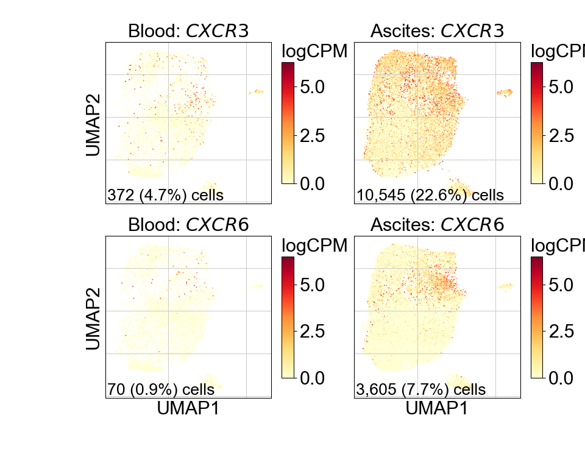
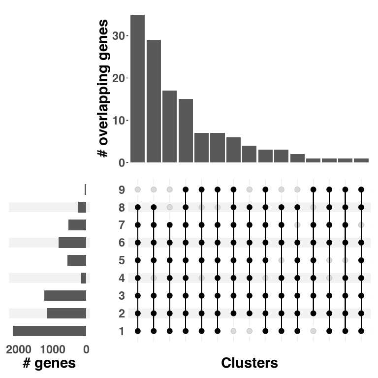

Figure 2
================

## Set up

Load R libraries

``` r
library(reticulate)
use_python("/projects/home/tlchan/.conda/envs/myenv/bin/python")

setwd('/projects/home/tlchan/github_code/ascites/functions')
source('plot_abundance.R')
source('plot_dotplot.R')
source('plot_upset.R')
```

Load python libraries

``` python
import matplotlib.pyplot as plt
import pegasus as pg

import sys
sys.path.append("/projects/home/tlchan/github_code/ascites/functions")
import python_functions
```

## Figure 2A

``` python
cd4_cluster_palette = {
    "1": "#FF0029",
    "2": "#377EB8",
    "3": "#66A61E",
    "4": "#984EA3",
    "5": "#00D2D5",
    "6": "#FF7F00",
    "7": "#AF8D00",
    "8": "#7F80CD",
    "9": "#B3E900"
}

# Load single-cell object
cd4_data = pg.read_input(
    '/projects/home/tlchan/projects/ascites/integrated_data/clusterings/ascites_cd4_cite_concat_R7_300mg_20pm_harm_channel_multi_res/1.3/data/pseudobulk/ascites_cd4_cite_concat_R7_300mg_20pm_harm_channel_1_3_complete_with_pb.zarr.zip')

pg.umap(cd4_data, rep='pca_cite_concat', min_dist=0.01, spread=2, out_basis='umap_pca_cite_concat')

# Relabel obs for function
cd4_data.obs['Cluster'] = cd4_data.obs['leiden_pca_cite_concat'].cat.remove_unused_categories().astype(str)
cd4_data.obsm['X_umap'] = cd4_data.obsm['X_umap_pca_cite_concat']

fig = python_functions.plot_umap(lin_data=cd4_data,
                                 palette=cd4_cluster_palette,
                                 legend_loc=None,
                                 size=8)

plt.show()
# plt.savefig("/projects/home/tlchan/fig_panels/fig_2a.pdf")
plt.close(fig)
```

    ## /projects/home/tlchan/.local/lib/python3.9/site-packages/umap/umap_.py:1943: UserWarning: n_jobs value -1 overridden to 1 by setting random_state. Use no seed for parallelism.
    ##   warn(f"n_jobs value {self.n_jobs} overridden to 1 by setting random_state. Use no seed for parallelism.")
    ## UMAP(min_dist=0.01, precomputed_knn=(array([[    0, 47, 923, ..., 41212, 42631, 28439],
    ##        [    1, 48548, 3095, ..., 22343, 39832, 48839],
    ##        [    2, 32671, 16798, ..., 25635, 17763, 3197],
    ##        ...,
    ##        [54479, 52148, 48207, ..., 51772, 38768, 54186],
    ##        [54480, 18948, 29512, ..., 49696, 42454, 26531],
    ##        [54481, 48117, 49923, ..., 49014, 52345, 49213]]), array([[0.       , 7.9653788, 8.102019 , ..., 8.427244 , 8.456426 ,
    ##         8.51234  ],
    ##        [0.       , 4.1543746, 4.3325644, ..., 4.8778615, 4.885023 ,
    ##         4.8907905],
    ##        [0.       , 7.8231144, 7.8412333, ..., 8.683318 , 8.692059 ,
    ##         8.7420635],
    ##        ...,
    ##        [0.       , 5.7290106, 5.758914 , ..., 6.434189 , 6.4435067,
    ##         6.5045056],
    ##        [0.       , 4.520164 , 4.807295 , ..., 5.3285036, 5.3378077,
    ##         5.3459125],
    ##        [0.       , 4.7135024, 4.928068 , ..., 5.531237 , 5.61214  ,
    ##         5.6200533]], dtype=float32), <pegasus.tools.visualization.DummyNNDescent object at 0x7f8ff43fc100>), random_state=0, spread=2, verbose=True)
    ## Sat Jun  7 04:04:49 2025 Construct fuzzy simplicial set
    ## Sat Jun  7 04:04:51 2025 Construct embedding
    ## Epochs completed:   0%|            0/200 [00:00] completed  0  /  200 epochs
    ## Epochs completed:   0%|            1/200 [00:00]Epochs completed:   2%| 2          4/200 [00:00]Epochs completed:   3%| 3          6/200 [00:01]Epochs completed:   4%| 3          7/200 [00:01]Epochs completed:   4%| 4          8/200 [00:01]Epochs completed:   4%| 4          9/200 [00:01]Epochs completed:   5%| 5          10/200 [00:01]Epochs completed:   6%| 5          11/200 [00:01]Epochs completed:   6%| 6          12/200 [00:01]Epochs completed:   6%| 6          13/200 [00:01]Epochs completed:   7%| 7          14/200 [00:02]Epochs completed:   8%| 7          15/200 [00:02]Epochs completed:   8%| 8          16/200 [00:02]Epochs completed:   8%| 8          17/200 [00:02]Epochs completed:   9%| 9          18/200 [00:02]Epochs completed:  10%| 9          19/200 [00:02]Epochs completed:  10%| #          20/200 [00:02]  completed  20  /  200 epochs
    ## Epochs completed:  10%| #          21/200 [00:02]Epochs completed:  11%| #1         22/200 [00:02]Epochs completed:  12%| #1         23/200 [00:03]Epochs completed:  12%| #2         24/200 [00:03]Epochs completed:  12%| #2         25/200 [00:03]Epochs completed:  13%| #3         26/200 [00:03]Epochs completed:  14%| #3         27/200 [00:03]Epochs completed:  14%| #4         28/200 [00:03]Epochs completed:  14%| #4         29/200 [00:03]Epochs completed:  15%| #5         30/200 [00:03]Epochs completed:  16%| #5         31/200 [00:04]Epochs completed:  16%| #6         32/200 [00:04]Epochs completed:  16%| #6         33/200 [00:04]Epochs completed:  17%| #7         34/200 [00:04]Epochs completed:  18%| #7         35/200 [00:04]Epochs completed:  18%| #8         36/200 [00:04]Epochs completed:  18%| #8         37/200 [00:04]Epochs completed:  19%| #9         38/200 [00:04]Epochs completed:  20%| #9         39/200 [00:05]Epochs completed:  20%| ##         40/200 [00:05] completed  40  /  200 epochs
    ## Epochs completed:  20%| ##         41/200 [00:05]Epochs completed:  21%| ##1        42/200 [00:05]Epochs completed:  22%| ##1        43/200 [00:05]Epochs completed:  22%| ##2        44/200 [00:05]Epochs completed:  22%| ##2        45/200 [00:05]Epochs completed:  23%| ##3        46/200 [00:05]Epochs completed:  24%| ##3        47/200 [00:06]Epochs completed:  24%| ##4        48/200 [00:06]Epochs completed:  24%| ##4        49/200 [00:06]Epochs completed:  25%| ##5        50/200 [00:06]Epochs completed:  26%| ##5        51/200 [00:06]Epochs completed:  26%| ##6        52/200 [00:06]Epochs completed:  26%| ##6        53/200 [00:06]Epochs completed:  27%| ##7        54/200 [00:06]Epochs completed:  28%| ##7        55/200 [00:06]Epochs completed:  28%| ##8        56/200 [00:07]Epochs completed:  28%| ##8        57/200 [00:07]Epochs completed:  29%| ##9        58/200 [00:07]Epochs completed:  30%| ##9        59/200 [00:07]Epochs completed:  30%| ###        60/200 [00:07] completed  60  /  200 epochs
    ## Epochs completed:  30%| ###        61/200 [00:07]Epochs completed:  31%| ###1       62/200 [00:07]Epochs completed:  32%| ###1       63/200 [00:07]Epochs completed:  32%| ###2       64/200 [00:08]Epochs completed:  32%| ###2       65/200 [00:08]Epochs completed:  33%| ###3       66/200 [00:08]Epochs completed:  34%| ###3       67/200 [00:08]Epochs completed:  34%| ###4       68/200 [00:08]Epochs completed:  34%| ###4       69/200 [00:08]Epochs completed:  35%| ###5       70/200 [00:08]Epochs completed:  36%| ###5       71/200 [00:08]Epochs completed:  36%| ###6       72/200 [00:09]Epochs completed:  36%| ###6       73/200 [00:09]Epochs completed:  37%| ###7       74/200 [00:09]Epochs completed:  38%| ###7       75/200 [00:09]Epochs completed:  38%| ###8       76/200 [00:09]Epochs completed:  38%| ###8       77/200 [00:09]Epochs completed:  39%| ###9       78/200 [00:09]Epochs completed:  40%| ###9       79/200 [00:09]Epochs completed:  40%| ####       80/200 [00:10] completed  80  /  200 epochs
    ## Epochs completed:  40%| ####       81/200 [00:10]Epochs completed:  41%| ####1      82/200 [00:10]Epochs completed:  42%| ####1      83/200 [00:10]Epochs completed:  42%| ####2      84/200 [00:10]Epochs completed:  42%| ####2      85/200 [00:10]Epochs completed:  43%| ####3      86/200 [00:10]Epochs completed:  44%| ####3      87/200 [00:10]Epochs completed:  44%| ####4      88/200 [00:10]Epochs completed:  44%| ####4      89/200 [00:11]Epochs completed:  45%| ####5      90/200 [00:11]Epochs completed:  46%| ####5      91/200 [00:11]Epochs completed:  46%| ####6      92/200 [00:11]Epochs completed:  46%| ####6      93/200 [00:11]Epochs completed:  47%| ####6      94/200 [00:11]Epochs completed:  48%| ####7      95/200 [00:11]Epochs completed:  48%| ####8      96/200 [00:11]Epochs completed:  48%| ####8      97/200 [00:12]Epochs completed:  49%| ####9      98/200 [00:12]Epochs completed:  50%| ####9      99/200 [00:12]Epochs completed:  50%| #####      100/200 [00:12]    completed  100  /  200 epochs
    ## Epochs completed:  50%| #####      101/200 [00:12]Epochs completed:  51%| #####1     102/200 [00:12]Epochs completed:  52%| #####1     103/200 [00:12]Epochs completed:  52%| #####2     104/200 [00:12]Epochs completed:  52%| #####2     105/200 [00:13]Epochs completed:  53%| #####3     106/200 [00:13]Epochs completed:  54%| #####3     107/200 [00:13]Epochs completed:  54%| #####4     108/200 [00:13]Epochs completed:  55%| #####4     109/200 [00:13]Epochs completed:  55%| #####5     110/200 [00:13]Epochs completed:  56%| #####5     111/200 [00:13]Epochs completed:  56%| #####6     112/200 [00:13]Epochs completed:  56%| #####6     113/200 [00:14]Epochs completed:  57%| #####6     114/200 [00:14]Epochs completed:  57%| #####7     115/200 [00:14]Epochs completed:  58%| #####8     116/200 [00:14]Epochs completed:  58%| #####8     117/200 [00:14]Epochs completed:  59%| #####8     118/200 [00:14]Epochs completed:  60%| #####9     119/200 [00:14]Epochs completed:  60%| ######     120/200 [00:14] completed  120  /  200 epochs
    ## Epochs completed:  60%| ######     121/200 [00:14]Epochs completed:  61%| ######1    122/200 [00:15]Epochs completed:  62%| ######1    123/200 [00:15]Epochs completed:  62%| ######2    124/200 [00:15]Epochs completed:  62%| ######2    125/200 [00:15]Epochs completed:  63%| ######3    126/200 [00:15]Epochs completed:  64%| ######3    127/200 [00:15]Epochs completed:  64%| ######4    128/200 [00:15]Epochs completed:  64%| ######4    129/200 [00:15]Epochs completed:  65%| ######5    130/200 [00:16]Epochs completed:  66%| ######5    131/200 [00:16]Epochs completed:  66%| ######6    132/200 [00:16]Epochs completed:  66%| ######6    133/200 [00:16]Epochs completed:  67%| ######7    134/200 [00:16]Epochs completed:  68%| ######7    135/200 [00:16]Epochs completed:  68%| ######8    136/200 [00:16]Epochs completed:  68%| ######8    137/200 [00:16]Epochs completed:  69%| ######9    138/200 [00:17]Epochs completed:  70%| ######9    139/200 [00:17]Epochs completed:  70%| #######    140/200 [00:17] completed  140  /  200 epochs
    ## Epochs completed:  70%| #######    141/200 [00:17]Epochs completed:  71%| #######1   142/200 [00:17]Epochs completed:  72%| #######1   143/200 [00:17]Epochs completed:  72%| #######2   144/200 [00:17]Epochs completed:  72%| #######2   145/200 [00:17]Epochs completed:  73%| #######3   146/200 [00:18]Epochs completed:  74%| #######3   147/200 [00:18]Epochs completed:  74%| #######4   148/200 [00:18]Epochs completed:  74%| #######4   149/200 [00:18]Epochs completed:  75%| #######5   150/200 [00:18]Epochs completed:  76%| #######5   151/200 [00:18]Epochs completed:  76%| #######6   152/200 [00:18]Epochs completed:  76%| #######6   153/200 [00:18]Epochs completed:  77%| #######7   154/200 [00:19]Epochs completed:  78%| #######7   155/200 [00:19]Epochs completed:  78%| #######8   156/200 [00:19]Epochs completed:  78%| #######8   157/200 [00:19]Epochs completed:  79%| #######9   158/200 [00:19]Epochs completed:  80%| #######9   159/200 [00:19]Epochs completed:  80%| ########   160/200 [00:19] completed  160  /  200 epochs
    ## Epochs completed:  80%| ########   161/200 [00:19]Epochs completed:  81%| ########1  162/200 [00:19]Epochs completed:  82%| ########1  163/200 [00:20]Epochs completed:  82%| ########2  164/200 [00:20]Epochs completed:  82%| ########2  165/200 [00:20]Epochs completed:  83%| ########2  166/200 [00:20]Epochs completed:  84%| ########3  167/200 [00:20]Epochs completed:  84%| ########4  168/200 [00:20]Epochs completed:  84%| ########4  169/200 [00:20]Epochs completed:  85%| ########5  170/200 [00:20]Epochs completed:  86%| ########5  171/200 [00:21]Epochs completed:  86%| ########6  172/200 [00:21]Epochs completed:  86%| ########6  173/200 [00:21]Epochs completed:  87%| ########7  174/200 [00:21]Epochs completed:  88%| ########7  175/200 [00:21]Epochs completed:  88%| ########8  176/200 [00:21]Epochs completed:  88%| ########8  177/200 [00:21]Epochs completed:  89%| ########9  178/200 [00:21]Epochs completed:  90%| ########9  179/200 [00:22]Epochs completed:  90%| #########  180/200 [00:22] completed  180  /  200 epochs
    ## Epochs completed:  90%| #########  181/200 [00:22]Epochs completed:  91%| #########1 182/200 [00:22]Epochs completed:  92%| #########1 183/200 [00:22]Epochs completed:  92%| #########2 184/200 [00:22]Epochs completed:  92%| #########2 185/200 [00:22]Epochs completed:  93%| #########3 186/200 [00:22]Epochs completed:  94%| #########3 187/200 [00:23]Epochs completed:  94%| #########3 188/200 [00:23]Epochs completed:  94%| #########4 189/200 [00:23]Epochs completed:  95%| #########5 190/200 [00:23]Epochs completed:  96%| #########5 191/200 [00:23]Epochs completed:  96%| #########6 192/200 [00:23]Epochs completed:  96%| #########6 193/200 [00:23]Epochs completed:  97%| #########7 194/200 [00:23]Epochs completed:  98%| #########7 195/200 [00:23]Epochs completed:  98%| #########8 196/200 [00:24]Epochs completed:  98%| #########8 197/200 [00:24]Epochs completed:  99%| #########9 198/200 [00:24]Epochs completed: 100%| #########9 199/200 [00:24]Epochs completed: 100%| ########## 200/200 [00:24]Epochs completed: 100%| ########## 200/200 [00:24]
    ## Sat Jun  7 04:05:17 2025 Finished embedding


## Figure 2B

``` r
cd4_gex <- read.csv('/projects/home/tlchan/projects/ascites/figure_panels/data/dotplot_data/cd4_gene_exp.csv')
cd4_cite <- read.csv('/projects/home/tlchan/projects/ascites/figure_panels/data/dotplot_data/cd4_cite_exp.csv')

plot_dotplot(lin_gex = cd4_gex,
             lin_cite = cd4_cite,
             lin = "cd4",
             widths = c(1, .2, .2))
```

<!-- -->

``` r
# ggsave("/projects/home/tlchan/fig_panels/fig_2b.pdf", width = 14, height = 8)
```

## Figure 2C

``` r
plot_cluster_abundance("cd4")
```

<!-- -->

``` r
# ggsave("/projects/home/tlchan/fig_panels/fig_2c.pdf", width = 8.5, height = 8)
```

## Figure 2D

``` python
cd4_data = pg.read_input(
    '/projects/home/tlchan/projects/ascites/integrated_data/clusterings/ascites_cd4_cite_concat_R7_300mg_20pm_harm_channel_multi_res/1.3/data/pseudobulk/ascites_cd4_cite_concat_R7_300mg_20pm_harm_channel_1_3_complete_with_pb.zarr.zip')

pg.umap(cd4_data, rep='pca_cite_concat', min_dist=0.01, spread=2, out_basis='umap_pca_cite_concat')

cd4_data.obsm["X_umap"] = cd4_data.obsm["X_umap_pca_cite_concat"]

fig = python_functions.plot_feature_by_tissue_type(lin_data=cd4_data,
                                                   genes=["CXCR3", "CXCR6"])

plt.show()
# plt.savefig("/projects/home/tlchan/fig_panels/fig_2d.pdf")
plt.close(fig)
```

    ## /projects/home/tlchan/.local/lib/python3.9/site-packages/umap/umap_.py:1943: UserWarning: n_jobs value -1 overridden to 1 by setting random_state. Use no seed for parallelism.
    ##   warn(f"n_jobs value {self.n_jobs} overridden to 1 by setting random_state. Use no seed for parallelism.")
    ## UMAP(min_dist=0.01, precomputed_knn=(array([[    0, 47, 923, ..., 41212, 42631, 28439],
    ##        [    1, 48548, 3095, ..., 22343, 39832, 48839],
    ##        [    2, 32671, 16798, ..., 25635, 17763, 3197],
    ##        ...,
    ##        [54479, 52148, 48207, ..., 51772, 38768, 54186],
    ##        [54480, 18948, 29512, ..., 49696, 42454, 26531],
    ##        [54481, 48117, 49923, ..., 49014, 52345, 49213]]), array([[0.       , 7.9653788, 8.102019 , ..., 8.427244 , 8.456426 ,
    ##         8.51234  ],
    ##        [0.       , 4.1543746, 4.3325644, ..., 4.8778615, 4.885023 ,
    ##         4.8907905],
    ##        [0.       , 7.8231144, 7.8412333, ..., 8.683318 , 8.692059 ,
    ##         8.7420635],
    ##        ...,
    ##        [0.       , 5.7290106, 5.758914 , ..., 6.434189 , 6.4435067,
    ##         6.5045056],
    ##        [0.       , 4.520164 , 4.807295 , ..., 5.3285036, 5.3378077,
    ##         5.3459125],
    ##        [0.       , 4.7135024, 4.928068 , ..., 5.531237 , 5.61214  ,
    ##         5.6200533]], dtype=float32), <pegasus.tools.visualization.DummyNNDescent object at 0x7f8ff4469340>), random_state=0, spread=2, verbose=True)
    ## Sat Jun  7 04:05:23 2025 Construct fuzzy simplicial set
    ## Sat Jun  7 04:05:23 2025 Construct embedding
    ## Epochs completed:   0%|            0/200 [00:00] completed  0  /  200 epochs
    ## Epochs completed:   0%|            1/200 [00:00]Epochs completed:   2%| 2          4/200 [00:00]Epochs completed:   3%| 3          6/200 [00:01]Epochs completed:   4%| 3          7/200 [00:01]Epochs completed:   4%| 4          8/200 [00:01]Epochs completed:   4%| 4          9/200 [00:01]Epochs completed:   5%| 5          10/200 [00:01]Epochs completed:   6%| 5          11/200 [00:01]Epochs completed:   6%| 6          12/200 [00:01]Epochs completed:   6%| 6          13/200 [00:01]Epochs completed:   7%| 7          14/200 [00:01]Epochs completed:   8%| 7          15/200 [00:02]Epochs completed:   8%| 8          16/200 [00:02]Epochs completed:   8%| 8          17/200 [00:02]Epochs completed:   9%| 9          18/200 [00:02]Epochs completed:  10%| 9          19/200 [00:02]Epochs completed:  10%| #          20/200 [00:02]  completed  20  /  200 epochs
    ## Epochs completed:  10%| #          21/200 [00:02]Epochs completed:  11%| #1         22/200 [00:02]Epochs completed:  12%| #1         23/200 [00:03]Epochs completed:  12%| #2         24/200 [00:03]Epochs completed:  12%| #2         25/200 [00:03]Epochs completed:  13%| #3         26/200 [00:03]Epochs completed:  14%| #3         27/200 [00:03]Epochs completed:  14%| #4         28/200 [00:03]Epochs completed:  14%| #4         29/200 [00:03]Epochs completed:  15%| #5         30/200 [00:03]Epochs completed:  16%| #5         31/200 [00:04]Epochs completed:  16%| #6         32/200 [00:04]Epochs completed:  16%| #6         33/200 [00:04]Epochs completed:  17%| #7         34/200 [00:04]Epochs completed:  18%| #7         35/200 [00:04]Epochs completed:  18%| #8         36/200 [00:04]Epochs completed:  18%| #8         37/200 [00:04]Epochs completed:  19%| #9         38/200 [00:04]Epochs completed:  20%| #9         39/200 [00:04]Epochs completed:  20%| ##         40/200 [00:05] completed  40  /  200 epochs
    ## Epochs completed:  20%| ##         41/200 [00:05]Epochs completed:  21%| ##1        42/200 [00:05]Epochs completed:  22%| ##1        43/200 [00:05]Epochs completed:  22%| ##2        44/200 [00:05]Epochs completed:  22%| ##2        45/200 [00:05]Epochs completed:  23%| ##3        46/200 [00:05]Epochs completed:  24%| ##3        47/200 [00:05]Epochs completed:  24%| ##4        48/200 [00:06]Epochs completed:  24%| ##4        49/200 [00:06]Epochs completed:  25%| ##5        50/200 [00:06]Epochs completed:  26%| ##5        51/200 [00:06]Epochs completed:  26%| ##6        52/200 [00:06]Epochs completed:  26%| ##6        53/200 [00:06]Epochs completed:  27%| ##7        54/200 [00:06]Epochs completed:  28%| ##7        55/200 [00:06]Epochs completed:  28%| ##8        56/200 [00:07]Epochs completed:  28%| ##8        57/200 [00:07]Epochs completed:  29%| ##9        58/200 [00:07]Epochs completed:  30%| ##9        59/200 [00:07]Epochs completed:  30%| ###        60/200 [00:07] completed  60  /  200 epochs
    ## Epochs completed:  30%| ###        61/200 [00:07]Epochs completed:  31%| ###1       62/200 [00:07]Epochs completed:  32%| ###1       63/200 [00:07]Epochs completed:  32%| ###2       64/200 [00:08]Epochs completed:  32%| ###2       65/200 [00:08]Epochs completed:  33%| ###3       66/200 [00:08]Epochs completed:  34%| ###3       67/200 [00:08]Epochs completed:  34%| ###4       68/200 [00:08]Epochs completed:  34%| ###4       69/200 [00:08]Epochs completed:  35%| ###5       70/200 [00:08]Epochs completed:  36%| ###5       71/200 [00:08]Epochs completed:  36%| ###6       72/200 [00:09]Epochs completed:  36%| ###6       73/200 [00:09]Epochs completed:  37%| ###7       74/200 [00:09]Epochs completed:  38%| ###7       75/200 [00:09]Epochs completed:  38%| ###8       76/200 [00:09]Epochs completed:  38%| ###8       77/200 [00:09]Epochs completed:  39%| ###9       78/200 [00:09]Epochs completed:  40%| ###9       79/200 [00:09]Epochs completed:  40%| ####       80/200 [00:09] completed  80  /  200 epochs
    ## Epochs completed:  40%| ####       81/200 [00:10]Epochs completed:  41%| ####1      82/200 [00:10]Epochs completed:  42%| ####1      83/200 [00:10]Epochs completed:  42%| ####2      84/200 [00:10]Epochs completed:  42%| ####2      85/200 [00:10]Epochs completed:  43%| ####3      86/200 [00:10]Epochs completed:  44%| ####3      87/200 [00:10]Epochs completed:  44%| ####4      88/200 [00:10]Epochs completed:  44%| ####4      89/200 [00:11]Epochs completed:  45%| ####5      90/200 [00:11]Epochs completed:  46%| ####5      91/200 [00:11]Epochs completed:  46%| ####6      92/200 [00:11]Epochs completed:  46%| ####6      93/200 [00:11]Epochs completed:  47%| ####6      94/200 [00:11]Epochs completed:  48%| ####7      95/200 [00:11]Epochs completed:  48%| ####8      96/200 [00:11]Epochs completed:  48%| ####8      97/200 [00:12]Epochs completed:  49%| ####9      98/200 [00:12]Epochs completed:  50%| ####9      99/200 [00:12]Epochs completed:  50%| #####      100/200 [00:12]    completed  100  /  200 epochs
    ## Epochs completed:  50%| #####      101/200 [00:12]Epochs completed:  51%| #####1     102/200 [00:12]Epochs completed:  52%| #####1     103/200 [00:12]Epochs completed:  52%| #####2     104/200 [00:12]Epochs completed:  52%| #####2     105/200 [00:13]Epochs completed:  53%| #####3     106/200 [00:13]Epochs completed:  54%| #####3     107/200 [00:13]Epochs completed:  54%| #####4     108/200 [00:13]Epochs completed:  55%| #####4     109/200 [00:13]Epochs completed:  55%| #####5     110/200 [00:13]Epochs completed:  56%| #####5     111/200 [00:13]Epochs completed:  56%| #####6     112/200 [00:13]Epochs completed:  56%| #####6     113/200 [00:14]Epochs completed:  57%| #####6     114/200 [00:14]Epochs completed:  57%| #####7     115/200 [00:14]Epochs completed:  58%| #####8     116/200 [00:14]Epochs completed:  58%| #####8     117/200 [00:14]Epochs completed:  59%| #####8     118/200 [00:14]Epochs completed:  60%| #####9     119/200 [00:14]Epochs completed:  60%| ######     120/200 [00:14] completed  120  /  200 epochs
    ## Epochs completed:  60%| ######     121/200 [00:14]Epochs completed:  61%| ######1    122/200 [00:15]Epochs completed:  62%| ######1    123/200 [00:15]Epochs completed:  62%| ######2    124/200 [00:15]Epochs completed:  62%| ######2    125/200 [00:15]Epochs completed:  63%| ######3    126/200 [00:15]Epochs completed:  64%| ######3    127/200 [00:15]Epochs completed:  64%| ######4    128/200 [00:15]Epochs completed:  64%| ######4    129/200 [00:15]Epochs completed:  65%| ######5    130/200 [00:16]Epochs completed:  66%| ######5    131/200 [00:16]Epochs completed:  66%| ######6    132/200 [00:16]Epochs completed:  66%| ######6    133/200 [00:16]Epochs completed:  67%| ######7    134/200 [00:16]Epochs completed:  68%| ######7    135/200 [00:16]Epochs completed:  68%| ######8    136/200 [00:16]Epochs completed:  68%| ######8    137/200 [00:16]Epochs completed:  69%| ######9    138/200 [00:17]Epochs completed:  70%| ######9    139/200 [00:17]Epochs completed:  70%| #######    140/200 [00:17] completed  140  /  200 epochs
    ## Epochs completed:  70%| #######    141/200 [00:17]Epochs completed:  71%| #######1   142/200 [00:17]Epochs completed:  72%| #######1   143/200 [00:17]Epochs completed:  72%| #######2   144/200 [00:17]Epochs completed:  72%| #######2   145/200 [00:17]Epochs completed:  73%| #######3   146/200 [00:18]Epochs completed:  74%| #######3   147/200 [00:18]Epochs completed:  74%| #######4   148/200 [00:18]Epochs completed:  74%| #######4   149/200 [00:18]Epochs completed:  75%| #######5   150/200 [00:18]Epochs completed:  76%| #######5   151/200 [00:18]Epochs completed:  76%| #######6   152/200 [00:18]Epochs completed:  76%| #######6   153/200 [00:18]Epochs completed:  77%| #######7   154/200 [00:19]Epochs completed:  78%| #######7   155/200 [00:19]Epochs completed:  78%| #######8   156/200 [00:19]Epochs completed:  78%| #######8   157/200 [00:19]Epochs completed:  79%| #######9   158/200 [00:19]Epochs completed:  80%| #######9   159/200 [00:19]Epochs completed:  80%| ########   160/200 [00:19] completed  160  /  200 epochs
    ## Epochs completed:  80%| ########   161/200 [00:19]Epochs completed:  81%| ########1  162/200 [00:19]Epochs completed:  82%| ########1  163/200 [00:20]Epochs completed:  82%| ########2  164/200 [00:20]Epochs completed:  82%| ########2  165/200 [00:20]Epochs completed:  83%| ########2  166/200 [00:20]Epochs completed:  84%| ########3  167/200 [00:20]Epochs completed:  84%| ########4  168/200 [00:20]Epochs completed:  84%| ########4  169/200 [00:20]Epochs completed:  85%| ########5  170/200 [00:20]Epochs completed:  86%| ########5  171/200 [00:21]Epochs completed:  86%| ########6  172/200 [00:21]Epochs completed:  86%| ########6  173/200 [00:21]Epochs completed:  87%| ########7  174/200 [00:21]Epochs completed:  88%| ########7  175/200 [00:21]Epochs completed:  88%| ########8  176/200 [00:21]Epochs completed:  88%| ########8  177/200 [00:21]Epochs completed:  89%| ########9  178/200 [00:21]Epochs completed:  90%| ########9  179/200 [00:22]Epochs completed:  90%| #########  180/200 [00:22] completed  180  /  200 epochs
    ## Epochs completed:  90%| #########  181/200 [00:22]Epochs completed:  91%| #########1 182/200 [00:22]Epochs completed:  92%| #########1 183/200 [00:22]Epochs completed:  92%| #########2 184/200 [00:22]Epochs completed:  92%| #########2 185/200 [00:22]Epochs completed:  93%| #########3 186/200 [00:22]Epochs completed:  94%| #########3 187/200 [00:23]Epochs completed:  94%| #########3 188/200 [00:23]Epochs completed:  94%| #########4 189/200 [00:23]Epochs completed:  95%| #########5 190/200 [00:23]Epochs completed:  96%| #########5 191/200 [00:23]Epochs completed:  96%| #########6 192/200 [00:23]Epochs completed:  96%| #########6 193/200 [00:23]Epochs completed:  97%| #########7 194/200 [00:23]Epochs completed:  98%| #########7 195/200 [00:23]Epochs completed:  98%| #########8 196/200 [00:24]Epochs completed:  98%| #########8 197/200 [00:24]Epochs completed:  99%| #########9 198/200 [00:24]Epochs completed: 100%| #########9 199/200 [00:24]Epochs completed: 100%| ########## 200/200 [00:24]Epochs completed: 100%| ########## 200/200 [00:24]
    ## Sat Jun  7 04:05:49 2025 Finished embedding



## Figure 2E

``` r
cd4_res <- read.csv('/projects/home/tlchan/projects/ascites/results/degs/integrated_data/cluster_level/cd4_tissue_type/cd4_de_by_tissue_type_all_results.csv')

plot_upset(res = cd4_res,
           min_degree = 7)
```

<!-- -->

``` r
# ggsave("/projects/home/tlchan/fig_panels/fig_2e.pdf", width = 8, height = 8, dpi = 300)
```
