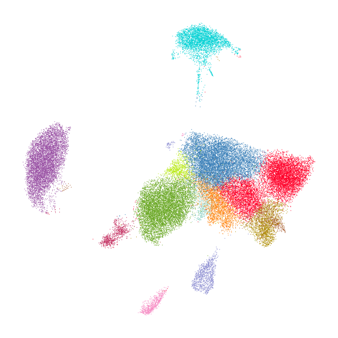
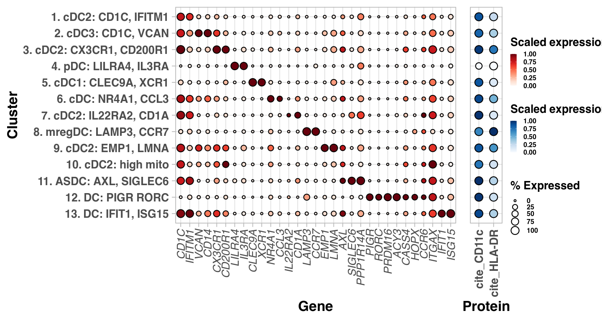
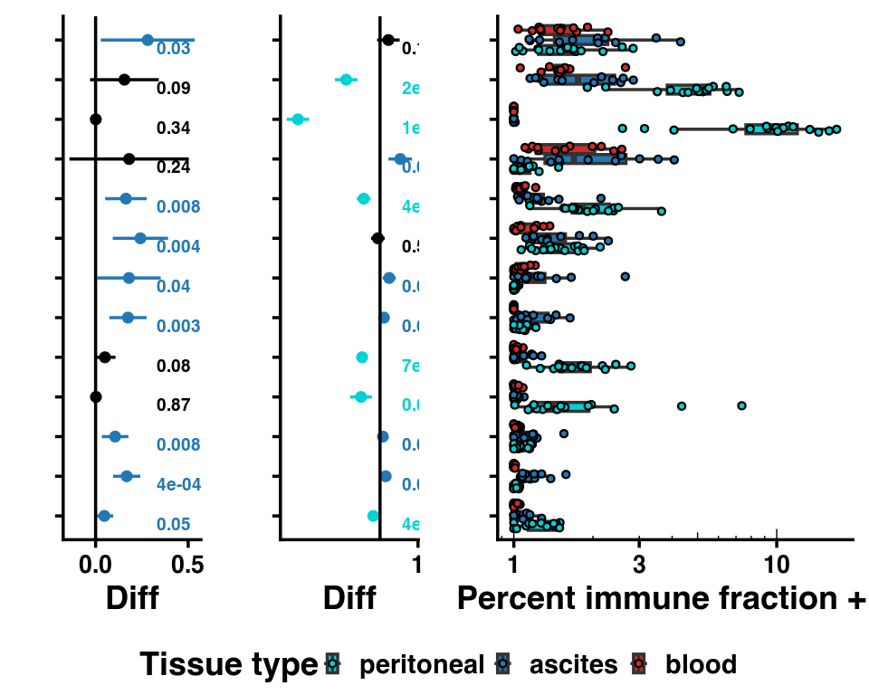
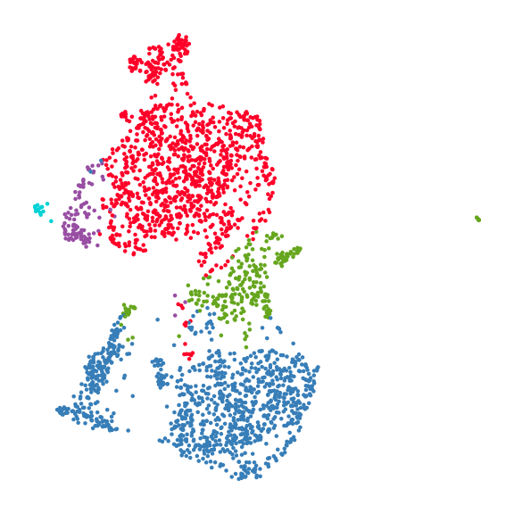
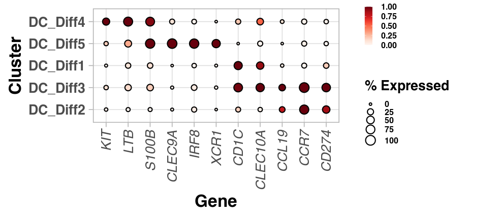
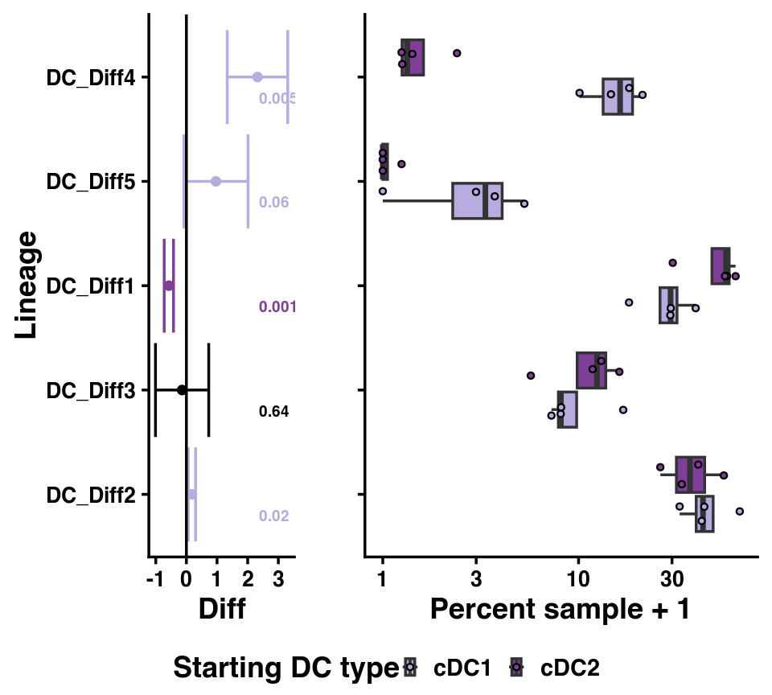
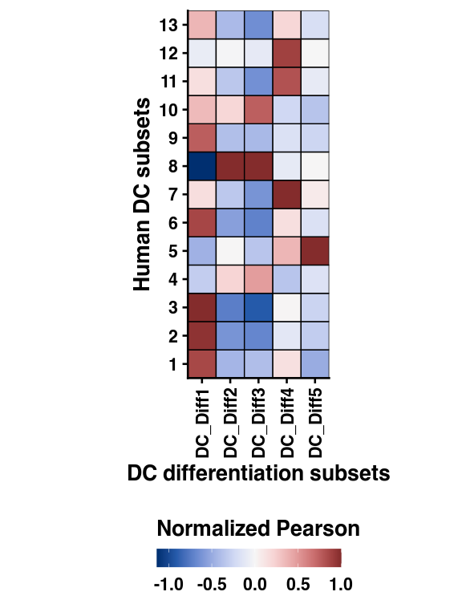
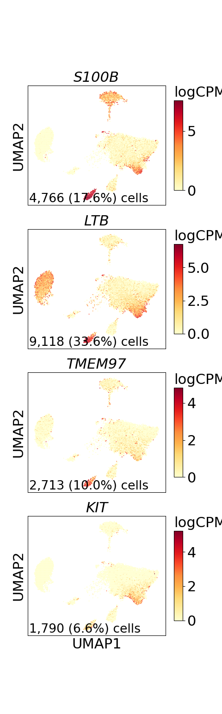
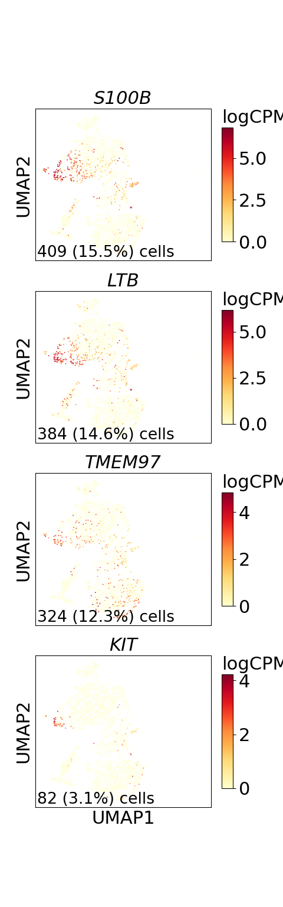

Figure 3
================

## Set up

Load R libraries

``` r
library(circlize)
library(colorspace)
library(ComplexHeatmap)
library(ggpubr)
library(glue)
library(openxlsx)
library(tidyverse)

library(reticulate)
use_python("/projects/home/nealpsmith/software/pegasus_new_py/bin/python")

source('../../functions/plot_abundance.R')
source('../../functions/plot_dotplot.R')
```

Load python libraries

``` python
import matplotlib.pyplot as plt
import pegasus as pg

import sys
sys.path.append("../../functions")
import python_functions
```

## Figure 3A

``` python
dc_cluster_palette = {
    "1": "#FF0029",
    "2": "#377EB8",
    "3": "#66A61E",
    "4": "#984EA3",
    "5": "#00D2D5",
    "6": "#FF7F00",
    "7": "#AF8D00",
    "8": "#7F80CD",
    "9": "#B3E900",
    "10": "#C42E60",
    "11": "#A65628",
    "12": "#F781BF",
    "13": "#8DD3C7"
}

# Load single-cell object
dc_data = pg.read_input(
    '/projects/home/tlchan/projects/ascites/w_peritoneal/clusterings/ascites_dc_R3_300mg_20pm_harm_channel_multi_res/1.5/data/pseudobulk/ascites_dc_R3_300mg_20pm_harm_channel_1_5_complete_with_pb.zarr.zip')

# Relabel obs for function
dc_data.obs['Cluster'] = dc_data.obs['leiden_labels'].cat.remove_unused_categories().astype(str)

fig = python_functions.plot_umap(lin_data=dc_data,
                                 palette=dc_cluster_palette)

plt.show()
# plt.savefig("/projects/home/tlchan/fig_panels/fig_3a.pdf")
plt.close(fig)
```



## Figure 3B

``` r
dc_gex <- read.csv('/projects/home/tlchan/projects/ascites/figure_panels/data/dotplot_data/dc_gene_exp.csv')
dc_cite <- read.csv('/projects/home/tlchan/projects/ascites/figure_panels/data/dotplot_data/dc_cite_exp.csv')

plot_dotplot(lin_gex = dc_gex,
             lin_cite = dc_cite,
             lin = "dc",
             widths = c(1.0, 0.1, 0.2),
             cluster_order = c("1. cDC2: CD1C, IFITM1", "2. cDC3: CD1C, VCAN", "3. cDC2: CX3CR1, CD200R1",
                               "4. pDC: LILRA4, IL3RA", "5. cDC1: CLEC9A, XCR1", "6. cDC: NR4A1, CCL3",
                               "7. cDC2: IL22RA2, CD1A", "8. mregDC: LAMP3, CCR7", "9. cDC2: EMP1, LMNA",
                               "10. cDC2: high mito", "11. ASDC: AXL, SIGLEC6", "12. DC: PIGR RORC",
                               "13. DC: IFIT1, ISG15"))
```

<!-- -->

``` r
# ggsave("/projects/home/tlchan/fig_panels/fig_3b.pdf", width = 15, height = 8)
```

## Figure 3C

``` r
plot_cluster_abundance_w_peritoneal(lin = "dc",
                                    n_breaks = 2)
```

<!-- -->

``` r
# ggsave("/projects/home/tlchan/fig_panels/fig_3c.pdf", width = 9, height = 8)
```

## Figure 3F

``` python
dc_cluster_palette = {
    "1": "#FF0029",
    "2": "#377EB8",
    "3": "#66A61E",
    "4": "#984EA3",
    "5": "#00D2D5"
}

# Load single-cell object
dc_diff = pg.read_input(
    '/projects/home/tlchan/projects/ascites/dc_diff_data/clusterings/dc_diff_3_R3_500mg_20pm_multi_res/1.3/data/filter_qc/dc_diff_3_R3_500mg_20pm_1_3.zarr.zip')

fig = python_functions.plot_umap(lin_data=dc_diff,
                                 color="leiden_labels",
                                 palette=dc_cluster_palette,
                                 legend_loc=None)

plt.show()
# plt.savefig("/projects/home/tlchan/fig_panels/fig_3g.pdf")
plt.close(fig)
```



## Figure 3G

``` r
# Use Reds
reds_colormap <- read.table('/projects/home/tlchan/util/cmaps/reds_cmap.txt', header = FALSE)
reds_hex <- apply(reds_colormap, 1, function(row) {
    rgb(row[1], row[2], row[3], maxColorValue = 1)
})

cluster_order <- c("DC_Diff4", "DC_Diff5", "DC_Diff1", "DC_Diff3", "DC_Diff2")
gene_order <- c("KIT", "LTB", "S100B", "CLEC9A", "IRF8", "XCR1", "CD1C", "CLEC10A", "CCL19",  "CCR7", "CD274")

lin_gex <- read.csv('/projects/home/tlchan/projects/ascites/figure_panels/data/dotplot_data/dc_diff_gene_exp.csv') %>%
    mutate(Gene = factor(Gene, levels = gene_order), Cluster = factor(Cluster, levels = cluster_order))

ggplot(lin_gex, aes(x = Gene, y = fct_rev(Cluster), fill = Count, size = Percent_Expressed)) +
    geom_point(color = "black", shape = 21) +
    ylab('Cluster') +
    labs(size = "% Expressed", fill = "Scaled expression") +
    scale_fill_gradientn(colors = reds_hex) +
    lims(size = c(0, 100)) +
    theme_light(base_size = 25) +
    theme(axis.text.x = element_text(angle = 90, vjust = 0.5, hjust = 1, face = "italic")) +
    theme(legend.key.size = unit(.4, "cm"), legend.title = element_text(size = 20), legend.text = element_text(size = 12))
```

<!-- -->

``` r
# ggsave("/projects/home/tlchan/fig_panels/fig_3h.pdf", width = 8, height = 5)
```

## Figure 3H and I

``` r
DC_palette <- c("cDC1" = '#B8ABE0', "cDC2" = '#7F3F98', 'Other' = '#000000')

excel_file <- '/projects/home/tlchan/projects/ascites/results/abundance/dc_diff_data/dc_diff_abundance.xlsx'

lineage_order <- c("DC_Diff4", "DC_Diff5", "DC_Diff1", "DC_Diff3", "DC_Diff2")

abundance <- read.xlsx(excel_file, sheet = "abundance") %>%
    mutate(DC_start = ifelse(DC_start == "DC1", "cDC1", DC_start)) %>%
    mutate(DC_start = ifelse(DC_start == "DC2", "cDC2", DC_start)) %>%
    mutate(lineage = factor(lineage, levels = lineage_order))

pt_res <- read.xlsx(excel_file, sheet = "DC1vDC2_pt") %>%
    mutate(color = ifelse(color == "DC1", "cDC1", color)) %>%
    mutate(color = ifelse(color == "DC2", "cDC2", color)) %>%
    mutate(lineage = factor(lineage, levels = lineage_order))

max_diff <- max(pt_res$Difference)
pt_res$clean_pvals <- sapply(pt_res$p, function(x) {
    if (x > 0.01) {
        return(as.character(round(x, 2)))
    } else if (x < 0.01 & x > 0.001) {
        return(as.character(round(x, 3)))
    } else {
        formatC(x, format = "e", digits = 0)
    }
})

fp <- ggplot(pt_res, aes(x = Difference, y = factor(lineage), color = color, label = clean_pvals)) +
    geom_point(size = 3) +
    geom_text(x = max_diff + 0.05, size = 5, hjust = 0, nudge_y = -0.2) +
    geom_errorbarh(mapping = aes(xmin = CI_low, xmax = CI_high, height = 0)) +
    geom_vline(xintercept = 0) +
    scale_y_discrete(limits = rev) +
    guides(color = "none") +
    xlab("Diff") +
    ylab("Lineage") +
    theme_classic(base_size = 27) +
    theme(axis.text = element_text(size = 20)) +
    scale_color_manual(values = DC_palette)

bp <- ggplot(abundance, aes(x = proportion + 1, y = factor(lineage), fill = DC_start)) +
    geom_boxplot(outlier.shape = NA) +
    geom_point(pch = 21, position = position_jitterdodge(), aes(fill = DC_start), size = 2) +
    scale_x_log10() +
    coord_cartesian(clip = "off") +
    scale_y_discrete(limits = rev) +
    labs(fill = "Starting DC type") +
    xlab("Percent sample + 1") +
    ylab("") +
    theme_classic(base_size = 27) +
    theme(axis.text.y = element_blank(), axis.text = element_text(size = 20)) +
    scale_fill_manual(values = DC_palette)

ggarrange(fp, bp, ncol = 2, nrow = 1, widths = c(0.5, 0.75), common.legend = TRUE, legend = "bottom")
```

<!-- -->

``` r
# ggsave("/projects/home/tlchan/fig_panels/fig_3i.pdf", width = 8, height = 5, dpi = 300, units = "in")
```

## Figure 3J

``` r
corr_mat <- read.csv("/projects/home/tlchan/projects/ascites/results/pearson/w_peritoneal/asc_dc_with_diff_corr_long.csv")
corr_mat <- corr_mat %>% mutate(dc_clusters = str_extract(dc_clusters, "^[^\\.]+"))

corr_mat <- corr_mat %>%
    group_by(diff_clusters) %>%
    mutate(Nor = value / max(value))

corr_mat <- corr_mat %>%
    mutate(dc_clusters = factor(dc_clusters, levels = c('1', '2', '3', '4', '5', '6', '7', '8', '9', '10', '11', '12', '13'))) %>%
    mutate(isolation_clusters = factor(diff_clusters, levels = c('DC_Diff1', 'DC_Diff2', 'DC_Diff5', 'DC_Diff4', 'DC_Diff3')))

ggplot(corr_mat, aes(x = diff_clusters, y = dc_clusters, fill = Nor)) +
    geom_tile(colour = "black", size = 0.5) +
    xlab("DC differentiation subsets") +
    ylab("Human DC subsets") +
    scale_fill_continuous_diverging(palette = "Blue-Red 3", name = 'Normalized Pearson') +
    scale_x_discrete(expand = c(0, 0)) +
    scale_y_discrete(expand = c(0, 0)) +
    coord_fixed() +
    theme_classic(base_size = 20) +
    theme(axis.text.x = element_text(angle = 90, vjust = 0.5, hjust = 1), legend.position = "bottom") +
    guides(fill = guide_colorbar(title.position = "top", barwidth = 12))
```

<!-- -->

``` r
# ggsave("/projects/home/tlchan/fig_panels/fig_3k.pdf", width = 5, height = 8)
```

## Figure 3K

``` python
dc_data = pg.read_input("/projects/home/tlchan/projects/ascites/figure_panels/data/data_cite_objects/dc.zarr.zip")

fig = python_functions.plot_feature(lin_data=dc_data,
                   genes=["S100B", "LTB", "TMEM97", "KIT"],
                   ncol=1,
                   nrow=4)

plt.show()
# plt.savefig("/projects/home/tlchan/fig_panels/fig_3l.pdf")
plt.close(fig)
```



## Figure 3L

``` python
dc_diff = pg.read_input(
    '/projects/home/tlchan/projects/ascites/dc_diff_data/clusterings/dc_diff_3_R3_500mg_20pm_multi_res/1.3/data/filter_qc/dc_diff_3_R3_500mg_20pm_1_3.zarr.zip')
dc_diff.add_matrix('X', dc_diff.X)

fig = python_functions.plot_feature(lin_data=dc_diff,
                   genes=["S100B", "LTB", "TMEM97", "KIT"],
                   ncol=1,
                   nrow=4)

plt.show()
# plt.savefig("/projects/home/tlchan/fig_panels/fig_3m.pdf")
plt.close(fig)
```


