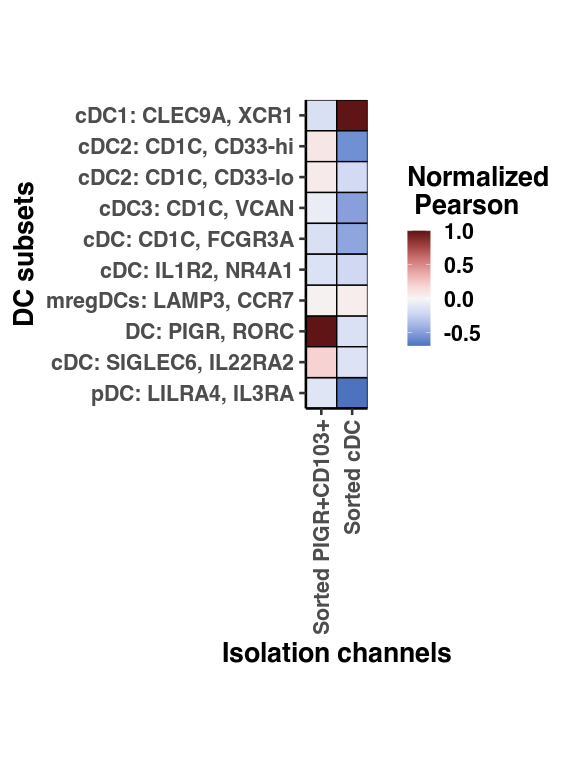
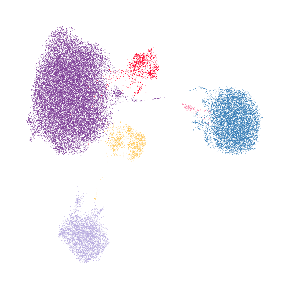
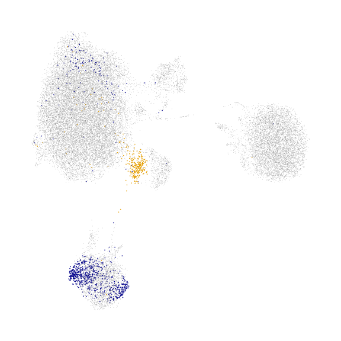
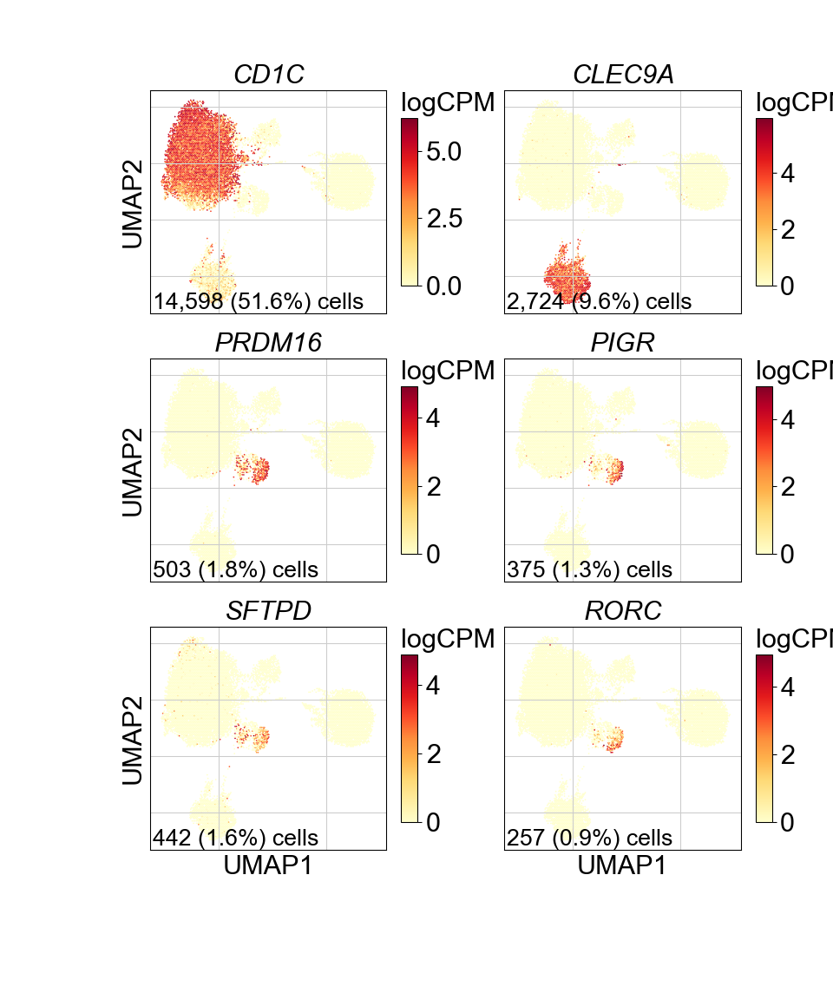
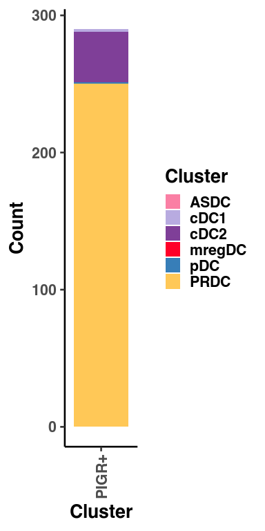

Figure 4
================

## Set up

Load R libraries

``` r
library(colorspace)
library(ggplot2)
library(tidyverse)

library(reticulate)
use_python("/projects/home/tlchan/.conda/envs/myenv/bin/python")
```

Load python libraries

``` python
import matplotlib.pyplot as plt
import pegasus as pg

import sys
sys.path.append("/projects/home/tlchan/github_code/ascites/functions")
import python_functions
```

## Figure 4A

``` python
dc_data = pg.read_input("/projects/home/tlchan/projects/ascites/figure_panels/data/data_cite_objects/dc.zarr.zip")

fig = python_functions.plot_feature(lin_data=dc_data,
                                    genes=['cite_CD11c', 'cite_CD1c', 'cite_CD370', 'cite_CD273', 'cite_CD103',
                                           'cite_CD196'],
                                    ncol=3,
                                    nrow=2)

plt.show()
# plt.savefig("/projects/home/tlchan/fig_panels/fig_4a.pdf")
plt.close(fig)
```


## Figure 4D

``` r
corr_mat <- read.csv("/projects/home/tlchan/projects/ascites/results/pearson/dc_iso_data/asc_dc_with_pigr_dc_corr_long.csv")

corr_mat <- corr_mat %>%
    group_by(isolation_clusters) %>%
    mutate(Nor = value / max(value))

corr_mat <- corr_mat %>%
    mutate(dc_clusters = factor(dc_clusters, levels = rev(c('cDC1: CLEC9A, XCR1', 'cDC2: CD1C, CD33-hi',
                                                            'cDC2: CD1C, CD33-lo', 'cDC3: CD1C, VCAN',
                                                            'cDC: CD1C, FCGR3A', 'cDC: IL1R2, NR4A1',
                                                            'mregDCs: LAMP3, CCR7', 'DC: PIGR, RORC',
                                                            'cDC: SIGLEC6, IL22RA2', 'pDC: LILRA4, IL3RA')))) %>%
    mutate(isolation_clusters = factor(isolation_clusters, levels = c('Sorted PIGR+CD103+', 'Sorted cDC')))

ggplot(corr_mat, aes(x = isolation_clusters, y = dc_clusters, fill = Nor)) +
    geom_tile(colour = "black", size = 0.5) +
    xlab("Isolation channels") +
    ylab("DC subsets") +
    scale_fill_continuous_diverging(palette = "Blue-Red 3", name ='Normalized\n Pearson') +
    scale_x_discrete(expand = c(0, 0)) +
    scale_y_discrete(expand = c(0, 0)) +
    coord_fixed() +
    theme_classic(base_size = 20) +
    theme(axis.text.x = element_text(angle = 90, vjust = 0.5, hjust = 1))
```

<!-- -->

``` r
# ggsave("/projects/home/tlchan/fig_panels/fig_4d.pdf", width = 6, height = 8)
```

## Figure 4E

``` python
dc_cluster_palette = {
    "cDC2": "#7F3F98",
    "pDC": "#377EB8",
    "cDC1": "#B8ABE0",
    "PRDC": "#FFC857",
    "mregDC": "#FF0029",
    "ASDC": "#FA7FA4"
}

# Load single-cell object
pigr_dc_data = pg.read_input(
    '/projects/home/tlchan/projects/ascites/dc_iso_data/clusterings/pigr_dc_project_R2_300mg_20pm_scVI_multi_res/1.3/data/pseudobulk/pigr_dc_project_R2_300mg_20pm_scVI_1_3_complete_with_pb.zarr.zip')
pigr_dc_data.obs['annots'] = pigr_dc_data.obs['annots'].replace('mREGDC', 'mregDC')
pigr_dc_data.obs['annots'] = pigr_dc_data.obs['annots'].replace('PIGR+DC', 'PRDC')

fig = python_functions.plot_umap(lin_data=pigr_dc_data,
                                 color="annots",
                                 palette=dc_cluster_palette,
                                 legend_loc=None)

plt.show()
# plt.savefig("/projects/home/tlchan/fig_panels/fig_4e.pdf")
plt.close(fig)
```

    ## <string>:1: FutureWarning: The behavior of Series.replace (and DataFrame.replace) with CategoricalDtype is deprecated. In a future version, replace will only be used for cases that preserve the categories. To change the categories, use ser.cat.rename_categories instead.



## Figure 4F

``` python
channel_palette = {
    "DCs from blood and ascites": "#808080",
    "Sorted PIGR+CD103+": "#E69F00",
    "Sorted cDC": "#00008B"
}

# Load single-cell object
pigr_dc_data = pg.read_input(
    '/projects/home/tlchan/projects/ascites/dc_iso_data/clusterings/pigr_dc_project_R2_300mg_20pm_scVI_multi_res/1.3/data/pseudobulk/pigr_dc_project_R2_300mg_20pm_scVI_1_3_complete_with_pb.zarr.zip')

# Relabel obs for function
pigr_dc_data.obs['Channel'] = pigr_dc_data.obs['Channel'].astype(str)
pigr_dc_data.obs.loc[
    ~pigr_dc_data.obs['Channel'].isin(["PIGR_1029_GEX", "cDCs_1029_GEX"]), "Channel"] = "DCs from blood and ascites"

pigr_dc_data.obs['Channel'] = pigr_dc_data.obs['Channel'].replace("PIGR_1029_GEX", "Sorted PIGR+CD103+")
pigr_dc_data.obs['Channel'] = pigr_dc_data.obs['Channel'].replace("cDCs_1029_GEX", "Sorted cDC")

pigr_dc_data.obs.loc[pigr_dc_data.obs["Channel"] == 'DCs from blood and ascites', 'size'] = 1
pigr_dc_data.obs.loc[pigr_dc_data.obs["Channel"] != 'DCs from blood and ascites', 'size'] = 6

fig = python_functions.plot_umap(lin_data=pigr_dc_data,
                                 color="Channel",
                                 palette=channel_palette,
                                 size=list(pigr_dc_data.obs['size']),
                                 legend_loc=None)

plt.show()
# plt.savefig("/projects/home/tlchan/fig_panels/fig_4f.pdf")
plt.close(fig)
```



## Figure 4G

``` python
pigr_dc_data = pg.read_input(
    '/projects/home/tlchan/projects/ascites/dc_iso_data/clusterings/pigr_dc_project_R1_300mg_20pm_scVI_multi_res/1.3/data/pseudobulk/pigr_dc_project_R1_300mg_20pm_scVI_1_3_complete_with_pb.zarr.zip')

fig = python_functions.plot_feature(lin_data=pigr_dc_data,
                                    genes=['CD1C', 'CLEC9A', 'PRDM16', 'PIGR', 'SFTPD', 'RORC'],
                                    ncol=2,
                                    nrow=3)

plt.show()
# plt.savefig("/projects/home/tlchan/fig_panels/fig_4g.pdf")
plt.close(fig)
```



## Figure 4H

``` r
dc_cluster_palette = list(
    "cDC2" = "#7F3F98",
    "pDC" = "#377EB8",
    "cDC1" = "#B8ABE0",
    "PRDC" = "#FFC857",
    "mregDC" = "#FF0029",
    "ASDC" = "#FA7FA4"
)

pigr_dc_counts <- read.csv("/projects/home/tlchan/projects/ascites/figure_panels/data/fig_4_data/pigr_dc_counts.csv")
pigr_dc_counts$channel <- "PIGR+"

ggplot(pigr_dc_counts, aes(x = channel, y = count, fill = annot)) +
    geom_bar(stat = 'identity', position = 'stack') +
    labs(fill = "Cluster") +
    xlab("Cluster") +
    ylab("Count") +
    theme_classic(base_size = 20) +
    theme(axis.text.x = element_text(angle = 90, vjust = 0.5, hjust = 1)) +
    scale_fill_manual(values=dc_cluster_palette)
```

<!-- -->

``` r
# ggsave("/projects/home/tlchan/fig_panels/fig_4h.pdf", width = 4, height = 8)
```
