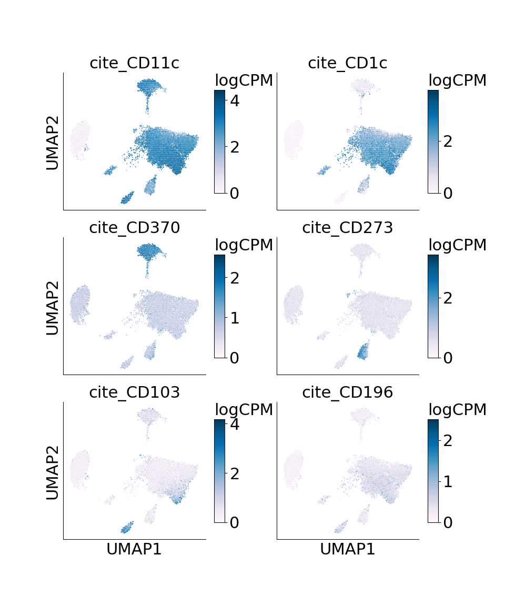
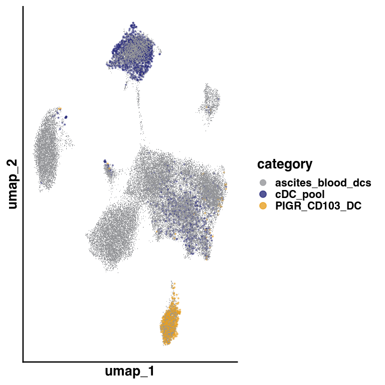
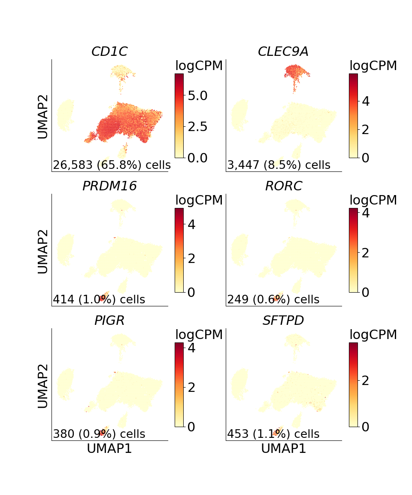
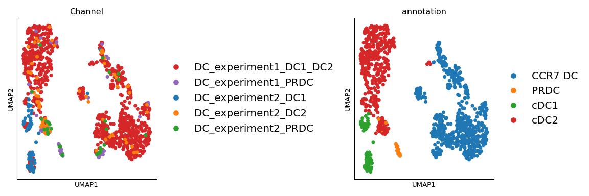
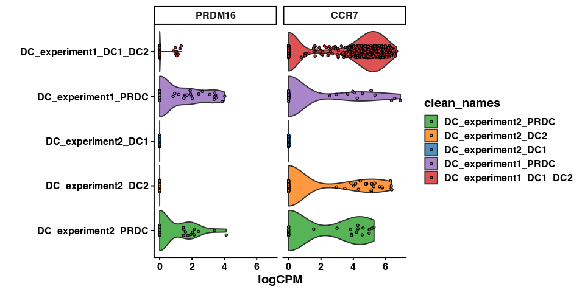
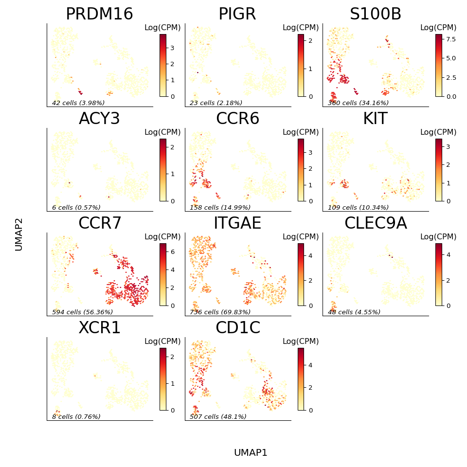
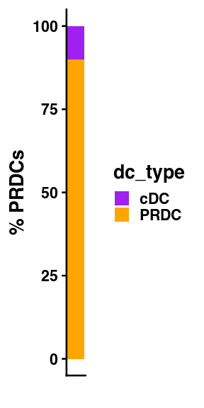

Figure 4
================

## Set up

Load R libraries

``` r
library(colorspace)
library(ggplot2)
library(tidyverse)
library(glue)
library(scattermore)
library(ggpubr)


library(reticulate)
use_python("/projects/home/nealpsmith/software/pegasus_new_py/bin/python")
```

Load python libraries

``` python
import matplotlib.pyplot as plt
import pegasus as pg
```

    ## /projects/home/nealpsmith/R/x86_64-pc-linux-gnu-library/4.2/reticulate/python/rpytools/loader.py:120: UserWarning: pkg_resources is deprecated as an API. See https://setuptools.pypa.io/en/latest/pkg_resources.html. The pkg_resources package is slated for removal as early as 2025-11-30. Refrain from using this package or pin to Setuptools<81.
    ##   return _find_and_load(name, import_)

``` python
import pandas as pd
import numpy as np
import matplotlib as mpl
import matplotlib.colors as clr
import scanpy as sc
from matplotlib.lines import Line2D

mpl.rcParams['axes.spines.right'] = False
mpl.rcParams['axes.spines.top'] = False
mpl.rcParams['pdf.fonttype'] = 42
colormap = clr.LinearSegmentedColormap.from_list('gene_cmap', ["#e0e0e1", '#4576b8', '#02024a'], N=200)


import sys
sys.path.append("../../functions")
import python_functions
```

## Figure 4A

``` python
dc_data = pg.read_input("/projects/home/tlchan/projects/ascites/figure_panels/data/data_cite_objects/dc.zarr.zip")

fig = python_functions.plot_feature(lin_data=dc_data,
                                    genes=['cite_CD11c', 'cite_CD1c', 'cite_CD370', 'cite_CD273', 'cite_CD103',
                                           'cite_CD196'],
                                    ncol=2,
                                    nrow=3)

plt.show()
# plt.savefig("/projects/home/nealpsmith/projects/ascites/figures/resubmission/fig_panels/fig_4a.pdf")
plt.close(fig)
```



## Figure 4C

``` r
obs <- read.csv("/projects/home/nealpsmith/projects/ascites/prospective_isolation/data/combined_data_with_ascites_dcs_obs.csv",
                 row.names = 1)
ggplot(obs, aes(x = umap_1, y = umap_2, color = category)) +
  geom_point(data = obs %>% dplyr::filter(category != "ascites_blood_dcs"),size = 0.3, alpha = 0.5) +
  geom_scattermore(data = obs %>% dplyr::filter(category == "ascites_blood_dcs"),
                   pointsize = 3, pixels = c(2048, 2048)) +
  scale_color_manual(values = c("#949598", "#2a2d7d", "#e7a023")) +
  theme_classic(base_size = 20) +
  theme(axis.text = element_blank(),
        axis.ticks = element_blank()) +
  guides(color = guide_legend(override.aes = list(size = 4, alpha = 0.8)))
```

<!-- -->

## Figure 4D

``` python
dc_data = pg.read_input(
    '/projects/home/tlchan/projects/ascites/w_peritoneal/clusterings/ascites_dc_R3_300mg_20pm_harm_channel_multi_res/1.5/data/pseudobulk/ascites_dc_R3_300mg_20pm_harm_channel_1_5_complete_with_pb.zarr.zip')

fig = python_functions.plot_feature(lin_data=dc_data,
                                    ncol=2,
                                    nrow=3,
                                    genes=["CD1C", "CLEC9A", "PRDM16", "RORC", "PIGR", "SFTPD"])

plt.show()
plt.close(fig)
```



\`\`\`

## Figure 4F-H

``` python
processed_data = pg.read_input("/projects/home/nealpsmith/projects/ascites/dc_stability/data/processed_data.zarr")
adata = processed_data.to_anndata()
adata.obs["Channel"] = [n.replace("Pheno", "experiment") for n in adata.obs["Channel"]]
adata.obs["Channel"] = [n.replace("experiment_", "experiment1_") for n in adata.obs["Channel"]]

cats = ["Channel", "annotation"]
sc.pl.umap(adata, color = ["Channel"], show = False, return_fig = False)
adata.uns["Channel_colors"] = ['#d62728','#9467bd', "#1f77b4","#ff7f0e","#2ca02c"]
fig, ax = plt.subplots(nrows=1, ncols=2)
ax = ax.ravel()
for num, c in enumerate(cats) :
    print(c)
    if c == "leiden_labels" :
        col_dict = dict(zip(sorted(set(adata.obs[c]), key = int),
                           adata.uns[f"{c}_colors"]))
        legend_elements = [Line2D([0], [0], marker='o', color=col_dict[cl], label=cl,
                                  markerfacecolor=col_dict[cl], markersize=7, lw=0) for cl in
                           sorted(set(adata.obs[c]), key = int)]
    else :
        col_dict = dict(zip(sorted(set(adata.obs[c])),
                            adata.uns[f"{c}_colors"]))
        legend_elements = [Line2D([0], [0], marker='o', color=col_dict[cl], label=cl,
                                  markerfacecolor=col_dict[cl], markersize=7, lw=0) for cl in
                           sorted(set(adata.obs[c]))]

    if len(legend_elements) > 6 :
        lcols = 2
        leg_loc = "on data"
    else :
        lcols = 1
        leg_loc = "none"

    plot = sc.pl.umap(adata, color=c,
                           legend_loc=leg_loc, show=False, ax=ax[num],
                           title="", legend_fontoutline=5)
    lgd = ax[num].legend(handles=legend_elements, loc='center left', fontsize=15,
                         bbox_to_anchor=(1, 0.5), frameon=False, ncol = lcols)
    ax[num].set_title(c)
    ax[num].set_rasterization_zorder(2)
for noplot in range(num + 1, len(ax)) :
    ax[noplot].axis("off")
fig = plt.gcf()
fig.set_size_inches(12, 4)
fig.tight_layout()
plt.show()
```



``` python
plt.close()
```

## Figure 4G

``` r
data <- read.csv("/projects/home/nealpsmith/projects/ascites/dc_stability/data/processed_data_obs.csv",
                 row.names = 1)

data$clean_names <- gsub("Pheno", "experiment", data$Channel)
data$clean_names <- gsub("experiment_", "experiment1_", data$clean_names)

violin_data <- data %>%
  dplyr::select(Channel, clean_names, PRDM16, CCR7) %>%
  reshape2::melt(id.vars = c("Channel", "clean_names"))
violin_data$clean_names <- factor(violin_data$clean_names, levels = rev(c("DC_experiment1_DC1_DC2", "DC_experiment1_PRDC",
                                                                      "DC_experiment2_DC1",
                                                                      "DC_experiment2_DC2", "DC_experiment2_PRDC")))


ggplot(violin_data, aes(y = clean_names,x = value, fill = clean_names)) +
  geom_violin(alpha = 0.8, scale = "width") +
  geom_point(aes(fill = clean_names), pch = 21, position = position_jitterdodge(), size = 1) +
  scale_fill_manual(values = c('#2ca02c','#ff7f0e', '#1f77b4', '#9467bd', '#d62728')) +
  # scale_color_manual(values = c("#6965a5", "#019f73", "#d85f02")) +
  facet_wrap(~variable) +
  xlab(glue("logCPM")) + ylab("") +
  theme_classic(base_size = 15)
```

<!-- -->

## Figure 4I

``` python
genes =["RORC", "PRDM16", "PIGR", "S100B", "ACY3", "CCR6", "KIT", "CCR7", "ITGAE", "CLEC9A", "XCR1", "CD1C"]
genes = [g for g in genes if g in adata.var_names]
x_loc = np.min(adata.obsm["X_umap"][:,0]) - np.min(adata.obsm["X_umap"][:,0]) * 0.01
y_loc = np.min(adata.obsm["X_umap"][:,1]) - 0.4

fig, ax = plt.subplots(ncols = 3, nrows = 4, figsize = (10, 10))
ax = ax.ravel()

for num, gene in enumerate(genes) :
    # Calculate n cells and percent
    n_cells = adata[:, gene].X.count_nonzero()
    perc_cells = n_cells / len(adata) * 100
    perc_cells = round(perc_cells, 2)

    plot_df = pd.DataFrame(adata[:,gene].X.toarray(), columns = [gene], index = adata.obs_names)
    plot_df["x"] = adata.obsm["X_umap"][:, 0]
    plot_df["y"] = adata.obsm["X_umap"][:, 1]
    hb = ax[num].hexbin(plot_df["x"], plot_df["y"], C=plot_df[gene], cmap="YlOrRd", gridsize=70, edgecolors = "none")
    ax[num].get_xaxis().set_ticks([])
    ax[num].get_yaxis().set_ticks([])
    ax[num].spines['top'].set_visible(False)
    ax[num].spines['right'].set_visible(False)
    ax[num].set_title(gene, size = 25)
    ax[num].text(x_loc, y_loc, f"{n_cells} cells ({perc_cells}%)", style="italic")
    cb = fig.colorbar(hb, ax=ax[num], shrink=.75, aspect=10)
    cb.ax.set_title("Log(CPM)")
for noplot in range(num +1, len(ax)) :
    ax[noplot].axis("off")
```

    ## (np.float64(0.0), np.float64(1.0), np.float64(0.0), np.float64(1.0))

``` python
fig.text(0.5, 0.03, 'UMAP1', va='center', size = 15)
fig.text(0.03, 0.5, 'UMAP2', va='center', rotation='vertical', size = 15)
fig.tight_layout()
plt.subplots_adjust(left = 0.1, bottom = 0.1)
# plt.savefig(f"/projects/home/nealpsmith/projects/ascites/dc_stability/figures/umap_dc_genes_oi.pdf")
plt.show()
```



``` python
plt.close()
```

## Figure 4J

``` r
data$dc_type <- ifelse(grepl("DC1|DC2", data$Channel), "cDC", "PRDC")

prdc_clust_by_dc_type <- data %>%
  group_by(dc_type, leiden_labels) %>%
  summarise(n_cells = n()) %>%
  group_by(leiden_labels) %>%
  mutate(total_cells = sum(n_cells)) %>%
  mutate(perc_cells = n_cells / total_cells * 100) %>%
  dplyr::filter(leiden_labels == 8)

ggplot(prdc_clust_by_dc_type, aes(x = 1, y = perc_cells, fill = dc_type)) +
  geom_bar(stat = "identity", position = "stack") +
  theme_classic(base_size = 20) +
  xlab("") +
  ylab("% PRDCs") +
  scale_fill_manual(values = c("purple", "orange")) +
  theme(axis.ticks.x = element_blank(),
        axis.text.x = element_blank())
```

<!-- -->
