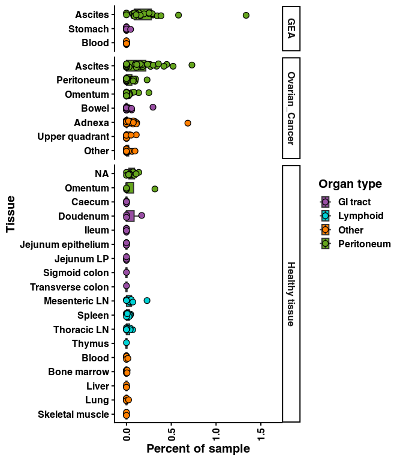

Figure 6
================

## Set up

Load R libraries

``` r
library(colorspace)
library(glue)
library(openxlsx)
library(tidyverse)
```

## Figure 3F

``` r
# "Other" organ types
other_organs <- c("Adnexa", "Blood", "Bone marrow", "Liver", "Lung", "Muscle")

# Load data, update values
abundance <- read.csv("/projects/home/tlchan/projects/ascites/figure_panels/data/fig_3_data/external_dcs_obs.csv")

abundance <- abundance %>%
    filter(!dataset %in% c("tonsil")) %>%
    mutate(organ_type = ifelse(organ_type %in% other_organs, "Other", organ_type)) %>%
    group_by(organ, organ_type, dataset, Channel, leiden_labels) %>%
    summarize(n_cell = n())

# Include zeros
combos <- expand.grid(unique(abundance$Channel), unique(abundance$leiden_labels)) %>%
    `colnames<-`(c("Channel", "leiden_labels")) %>%
    left_join(abundance %>%
                  select("Channel", "organ_type", "organ") %>%
                  distinct(), by = c("Channel"))

abundance <- combos %>%
    left_join(abundance, by = c("Channel", "leiden_labels", "organ_type", "dataset", "organ")) %>%
    replace(is.na(.), 0)

abundance <- abundance %>%
    group_by(organ, Channel) %>%
    mutate(channel_count = sum(n_cell),
           percentage = n_cell / channel_count * 100)

organ_levels <- list("Other", "Upper quadrant", "Skeletal muscle", "Lung", "Liver", "Bone marrow", "Blood", "Adnexa",
                     "Thymus", "Thoracic LN", "Spleen", "Mesenteric LN", "Transverse colon", "Sigmoid colon", "Jejunum LP", "Jejunum epithelium", "Ileum", "Doudenum", "Caecum", "Bowel",
                     "Stomach", "Omentum", "Peritoneum", "Peritoneal washing", "Ascites")

tumor_palette <- list("Peritoneum" = "#66A61E", "GI tract" = "#984EA3", "Lymphoid" = "#00D2D5", "Other" = "#FF7F00")

abundance <- abundance %>%
    filter(leiden_labels == 'dc_17') %>%
    mutate(organ = factor(organ, levels = organ_levels),
           dataset = factor(dataset, levels = c('GEA', 'Ovarian_Cancer', 'Healthy tissue')))

ggplot(abundance, aes(y = organ, x = percentage, fill = organ_type)) +
    geom_boxplot(outlier.shape = NA) +
    geom_point(pch = 21, position = position_jitterdodge(), size = 3) +
    labs(fill = "Organ type") +
    scale_x_continuous(expand = expansion(mult = c(0.1, 0.3))) +
    ylab("Tissue") +
    xlab("Percent of sample") +
    facet_grid(dataset ~ ., scales = "free_y", space = 'free') +
    scale_fill_manual(values = tumor_palette) +
    theme_classic(base_size = 15) +
    theme(axis.text.x = element_text(angle = 90, vjust = 0.5, hjust = 1))
```

<!-- -->

``` r
# ggsave("/projects/home/tlchan/fig_panels/fig_3f.pdf", width = 7, height = 8)
```
