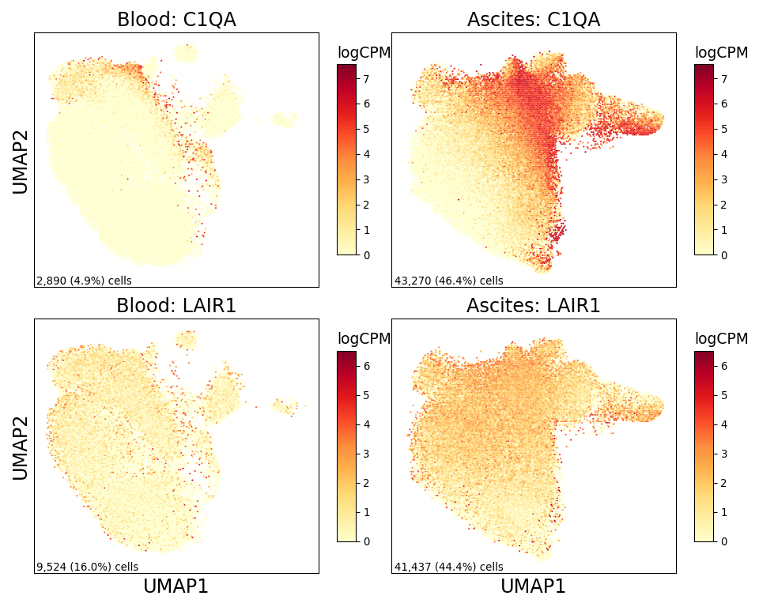

Monocyte/Macrophage Figure
================

## Set up

Load R libraries

``` r
library(ggplot2)
library(ggpubr)
library(ggrepel)
library(glue)
library(parameters)
library(tidyverse)

library(reticulate)
use_python("/projects/home/tlchan/.conda/envs/myenv/bin/python")
```

Load python libraries

``` python
import matplotlib as mpl
import matplotlib.pyplot as plt
import numpy as np
import pandas as pd
import pegasus as pg
import scanpy as sc
```

## Figure 1A

``` python
mpl.rcParams['pdf.fonttype'] = 42

cluster_palette = {
    "1": "#FF0029",
    "2": "#377EB8",
    "3": "#66A61E",
    "4": "#984EA3",
    "5": "#00D2D5",
    "6": "#FF7F00",
    "7": "#AF8D00",
    "8": "#7F80CD",
    "9": "#B3E900",
    "10": "#C42E60",
    "11": "#A65628",
    "12": "#F781BF",
    "13": "#8DD3C7",
    "14": "#BEBADA",
    "15": "#FB8072"
}

# Load single-cell object
lineage_data = pg.read_input(
    '/projects/home/tlchan/projects/ascites/second_data_freeze/clusterings/ascites_mono-mac_R7_300mg_20pm_harm_channel_multi_res/1.1/data/pseudobulk/ascites_mono-mac_R7_300mg_20pm_harm_channel_1_1_complete_with_pb.zarr.zip')

# Relabel obs for function
lineage_data.obs['Cluster'] = lineage_data.obs['leiden_labels'].cat.remove_unused_categories().astype(str)

cluster_fig, cluster_ax = plt.subplots(1)
cluster_umap = sc.pl.umap(adata=lineage_data.to_anndata(),
                          color="Cluster",
                          use_raw=True,
                          palette=cluster_palette,
                          legend_loc="on data",
                          legend_fontoutline=5,
                          title="",
                          show=False,
                          ax=cluster_ax)

cluster_fig = plt.gcf()
cluster_fig.set_size_inches(6, 6)
cluster_fig.tight_layout()
cluster_ax.set_rasterization_zorder(2)
plt.show()
plt.close()
```

    ## 2024-04-17 19:50:39,429 - pegasusio.readwrite - INFO - zarr file '/projects/home/tlchan/projects/ascites/second_data_freeze/clusterings/ascites_mono-mac_R7_300mg_20pm_harm_channel_multi_res/1.1/data/pseudobulk/ascites_mono-mac_R7_300mg_20pm_harm_channel_1_1_complete_with_pb.zarr.zip' is loaded.
    ## 2024-04-17 19:50:39,429 - pegasusio.readwrite - INFO - Function 'read_input' finished in 3.14s.
    ## /projects/home/tlchan/.conda/envs/myenv/lib/python3.9/site-packages/scanpy/plotting/_tools/scatterplots.py:392: UserWarning: No data for colormapping provided via 'c'. Parameters 'cmap' will be ignored
    ##   cax = scatter(


## Figure 1B

``` r
cluster_palette <- list("1" = "#FF0029",
                        "2" = "#377EB8",
                        "3" = "#66A61E",
                        "4" = "#984EA3",
                        "5" = "#00D2D5",
                        "6" = "#FF7F00",
                        "7" = "#AF8D00",
                        "8" = "#7F80CD",
                        "9" = "#B3E900"
)

cd4_data <- read.csv('/projects/home/tlchan/projects/ascites/figure_panels/abundance_data/cd4_patient_counts.csv') %>%
    mutate(Cluster = factor(Cluster))


ggplot(cd4_data, aes(x = Patient, y = Count, fill = Cluster)) +
    geom_bar(stat = "identity", position = "fill") +
    theme_classic(base_size = 12) +
    theme(axis.text.x = element_text(angle = 90, vjust = 0.5, hjust = 1)) +
    scale_fill_manual(values = cluster_palette)
```

<!-- -->

## Figure 1C

``` r
tissue_palette <- list("ascites" = "#00BFC4",
                       "blood" = "#F8766D",
                       "other" = "#000000")

# Load data
abundance <- read.csv("/projects/home/tlchan/projects/ascites/second_data_freeze/data/metadata/ascites_abundance.csv")

# Remove cancer cells and doublets
abundance <- abundance %>%
    filter(lineage != "cancer")

# Get immune count
abundance <- abundance %>%
    group_by(patient_id, tissue_type, lineage, cluster) %>%
    mutate(clust_count = sum(immune == "True")) %>%
    select(patient_id, tissue_type, lineage, cluster, clust_count) %>%
    distinct()

# Account for patient/tissue pairs that contributed zero cells to clusters
combos <- expand.grid(unique(abundance$patient_id), unique(abundance$tissue_type), unique(abundance$lineage), unique(abundance$cluster)) %>% `colnames<-`(c("patient_id", "tissue_type", "lineage", "cluster"))

abundance <- combos %>%
    left_join(abundance, by = c("patient_id", "tissue_type", "lineage", "cluster")) %>%
    replace(is.na(.), 0)

# Remove patients with fewer than 250 immune native fraction cells
abundance <- abundance %>%
    group_by(patient_id, tissue_type) %>%
    filter(sum(clust_count) > 250)

# Get statistics
abundance <- abundance %>%
    group_by(patient_id, tissue_type) %>%
    mutate(total_count = sum(clust_count)) %>%
    mutate(clust_percentage = clust_count / total_count * 100) %>%
    mutate(log_clust_percentage = log1p(clust_percentage)) %>%
    mutate(tissue_type = factor(tissue_type, levels = c("blood", "ascites")))

# Subset abundance
lin <- "monomac"
abundance_lineage <- abundance %>% filter(lineage == lin)

# Remove extra clusters
abundance_lineage <- abundance_lineage %>%
    group_by(cluster) %>%
    filter(sum(clust_count) != 0) %>%
    droplevels()

bp <- ggplot(abundance_lineage, aes(x = log_clust_percentage, y = factor(cluster), fill = tissue_type)) +
    geom_boxplot(outlier.shape = NA) +
    geom_point(pch = 21, position = position_jitterdodge(), aes(fill = tissue_type), size = 2) +
    annotation_logticks(side = "b", outside = TRUE) +
    coord_cartesian(clip = "off") +
    scale_y_discrete(limits = rev) +
    labs(fill = "Tissue type") +
    xlab("log1p(Percent native immune)") +
    ylab("") +
    theme_classic(base_size = 16)

lm_res <- lapply(unique(abundance_lineage$cluster), function(clust) {
    lm_data <- abundance_lineage %>% filter(cluster == clust)
    stats <- parameters(lm(log_clust_percentage ~ tissue_type, lm_data))
    stats$cluster <- clust
    stats <- stats %>% filter(Parameter != "(Intercept)")
    return(stats)
}) %>%
    do.call(rbind, .) %>%
    mutate(padj = p.adjust(p, method = "fdr")) %>%
    mutate(color = case_when(padj < 0.1 & Coefficient > 0 ~ "ascites", padj < 0.1 & Coefficient < 0 ~ "blood", padj >= 0.1 ~ "other"))

fp <- ggplot(lm_res, aes(x = Coefficient, y = factor(cluster), color = color)) +
    geom_point(size = 3) +
    geom_errorbarh(mapping = aes(xmin = CI_low, xmax = CI_high, height = 0)) +
    geom_vline(xintercept = 0) +
    scale_y_discrete(limits = rev) +
    guides(color = "none") +
    xlab("Log2FoldChange") +
    ylab("Cluster") +
    theme_classic(base_size = 16) +
    scale_color_manual(values = tissue_palette)

p <- ggarrange(fp, bp, ncol = 2, nrow = 1, widths = c(0.5, 1.0))
annotate_figure(p, top = text_grob(glue("{toupper(lin)} percent native immune by cluster"), size = 16))
```

<!-- -->

## Figure 1D

``` python
mpl.rcParams['pdf.fonttype'] = 42

lineage_data = pg.read_input(
    '/projects/home/tlchan/projects/ascites/second_data_freeze/clusterings/ascites_mono-mac_R7_300mg_20pm_harm_channel_multi_res/1.1/data/pseudobulk/ascites_mono-mac_R7_300mg_20pm_harm_channel_1_1_complete_with_pb.zarr.zip')

genes = ["CCL2", "IL10", "CXCL8", "CXCL1", "VEGFA"]

# Get UMAP coordinates for base
blood_data = lineage_data[lineage_data.obs['tissue_type'] == 'blood'].copy()
blood_coords = pd.DataFrame(blood_data.obsm['X_umap'], columns=['x', 'y'])
blood_x = blood_coords['x']
blood_y = blood_coords['y']

ascites_data = lineage_data[lineage_data.obs['tissue_type'] == 'ascites'].copy()
ascites_coords = pd.DataFrame(ascites_data.obsm['X_umap'], columns=['x', 'y'])
ascites_x = ascites_coords['x']
ascites_y = ascites_coords['y']

x = [blood_x, ascites_x]
y = [blood_y, ascites_y]

# set up figure structure
ncol = 2
nrow = len(genes)
fig_size = (5 * ncol, 4 * nrow)
fig, axes = plt.subplots(nrows=nrow, ncols=ncol, figsize=fig_size, sharex=True, sharey=True)
ax = axes.ravel()
title = ['Blood', 'Ascites']

# Plot for each gene
for num, gene in enumerate(genes):
    # Get gene counts
    blood_cts = blood_data[:, gene].copy().get_matrix('X').todense().transpose()
    blood_cts = np.squeeze(np.asarray(blood_cts))
    if blood_cts.size == 0:  # ie. All empty/zero in sparce matrix
        blood_cts = np.zeros(blood_cts.shape[1])
    blood_n = (blood_cts != 0).sum()
    blood_perc = blood_n / blood_cts.shape[0]

    ascites_cts = ascites_data[:, gene].copy().get_matrix('X').todense().transpose()
    ascites_cts = np.squeeze(np.asarray(ascites_cts))
    if ascites_cts.size == 0:  # ie. All empty/zero in sparce matrix
        ascites_cts = np.zeros(ascites_cts.shape[1])
    ascites_n = (ascites_cts != 0).sum()
    ascites_perc = (ascites_cts != 0).sum() / ascites_cts.shape[0]

    norm_counts = [blood_cts, ascites_cts]
    cb_max = max(max(blood_cts), max(ascites_cts))  # Makes sure colorbars are the same

    # Create heatmap
    for i in range(2):
        hb = ax[num * 2 + i].hexbin(x=x[i],
                                    y=y[i],
                                    C=norm_counts[i],
                                    cmap='YlOrRd',
                                    gridsize=150,
                                    vmin=0,
                                    vmax=cb_max,
                                    edgecolors="none")
        cb = fig.colorbar(hb, ax=ax[num * 2 + i], shrink=.75, aspect=10)
        cb.ax.set_title('logCPM', loc='left', fontsize=14)
        if i == 0:
            # ie. Blood
            ax[num * 2 + i].set_ylabel('UMAP2', fontsize=18)
            ax[num * 2 + i].annotate(f'{blood_n:,} ({blood_perc:.1%}) cells',
                                     xy=(0.01, 0), xycoords='axes fraction',
                                     fontsize=10,
                                     horizontalalignment='left',
                                     verticalalignment='bottom')
        if num + 1 == len(genes):
            # ie. Blood and only one row
            ax[num * 2 + i].set_xlabel('UMAP1', fontsize=18)
        if i == 1:
            # ie. Ascites
            ax[num * 2 + i].annotate(f'{ascites_n:,} ({ascites_perc:.1%}) cells',
                                     xy=(0.01, 0), xycoords='axes fraction',
                                     fontsize=10,
                                     horizontalalignment='left',
                                     verticalalignment='bottom')
        ax[num * 2 + i].set_title(f'{title[i]}: {gene}', fontsize=18)
        ax[num * 2 + i].tick_params(left=False, labelleft=False,
                                    bottom=False, labelbottom=False)
fig.tight_layout()
plt.show()
plt.close()
```

    ## 2024-04-17 19:50:47,434 - pegasusio.readwrite - INFO - zarr file '/projects/home/tlchan/projects/ascites/second_data_freeze/clusterings/ascites_mono-mac_R7_300mg_20pm_harm_channel_multi_res/1.1/data/pseudobulk/ascites_mono-mac_R7_300mg_20pm_harm_channel_1_1_complete_with_pb.zarr.zip' is loaded.
    ## 2024-04-17 19:50:47,434 - pegasusio.readwrite - INFO - Function 'read_input' finished in 2.73s.


## Figure 1E

``` r
tissue_palette <- list("ascites" = "#00BFC4",
                       "plasma" = "#F8766D")

# Load and prepare data
sf_data <- read.csv(glue("/projects/home/tlchan/projects/ascites/second_data_freeze/data/secreted_factors/secreted_factors_updated.csv"), row.names = 1)
sf_data <- sf_data[sf_data["diluted"] == "No",]
sf_data <- sf_data[sf_data["type"] != "pleural",]
sf_data$log_concentration <- log(sf_data$concentration)

# Remap to common names
sf_names <- read.csv("/projects/home/tlchan/projects/ascites/second_data_freeze/data/secreted_factors/sf_common_names.csv")
sf_data <- merge(sf_data, sf_names, all.x = TRUE)
sf_data$analyte <- ifelse(!(is.na(sf_data$common_name)), sf_data$common_name, sf_data$analyte)

# Select paired samples and specific analytes
analyte_list <- c("CCL2", "IL-10", "IL-8", "GROa", "VEGF-A")
paired_list <- list('ASC_41', 'ASC_43', 'ASC_45', 'ASC_46', 'ASC_48', 'ASC_52', 'ASC_57', 'ASC_61', 'ASC_62', 'ASC_65', 'ASC_66', 'ASC_67')
sf_data <- sf_data %>%
    filter(panel == "96-cytokine") %>%
    filter(patient_id %in% paired_list) %>%
    filter(analyte %in% analyte_list) %>%
    mutate(analyte = factor(analyte, levels = analyte_list))

ggplot(sf_data, aes(x = type, y = log_concentration, fill = type)) +
    geom_boxplot(outlier.shape = NA, alpha = 0.75) +
    geom_line(aes(group = patient_id)) +
    geom_point(pch = 20, size = 2) +
    stat_compare_means(paired = TRUE, label.x.npc = "center", aes(label = paste0("p = ", after_stat(p.format)))) +
    xlab("Type") +
    ylab("log(Concentration)") +
    ggtitle("Gene concentration by tissue type") +
    facet_wrap(~analyte, scales = "free_y", nrow = 5) +
    theme(axis.text.x = element_blank(),
          axis.ticks.x = element_blank()) +
    scale_fill_manual(values = tissue_palette)
```

<!-- -->

## Figure 1F

``` python
mpl.rcParams['pdf.fonttype'] = 42

lineage_data = pg.read_input(
    '/projects/home/tlchan/projects/ascites/second_data_freeze/clusterings/ascites_mono-mac_R7_300mg_20pm_harm_channel_multi_res/1.1/data/pseudobulk/ascites_mono-mac_R7_300mg_20pm_harm_channel_1_1_complete_with_pb.zarr.zip')

genes = ["C1QA", "LAIR1"]

# Get UMAP coordinates for base
blood_data = lineage_data[lineage_data.obs['tissue_type'] == 'blood'].copy()
blood_coords = pd.DataFrame(blood_data.obsm['X_umap'], columns=['x', 'y'])
blood_x = blood_coords['x']
blood_y = blood_coords['y']

ascites_data = lineage_data[lineage_data.obs['tissue_type'] == 'ascites'].copy()
ascites_coords = pd.DataFrame(ascites_data.obsm['X_umap'], columns=['x', 'y'])
ascites_x = ascites_coords['x']
ascites_y = ascites_coords['y']

x = [blood_x, ascites_x]
y = [blood_y, ascites_y]

# set up figure structure
ncol = 2
nrow = len(genes)
fig_size = (5 * ncol, 4 * nrow)
fig, axes = plt.subplots(nrows=nrow, ncols=ncol, figsize=fig_size, sharex=True, sharey=True)
ax = axes.ravel()
title = ['Blood', 'Ascites']

# Plot for each gene
for num, gene in enumerate(genes):
    # Get gene counts
    blood_cts = blood_data[:, gene].copy().get_matrix('X').todense().transpose()
    blood_cts = np.squeeze(np.asarray(blood_cts))
    if blood_cts.size == 0:  # ie. All empty/zero in sparce matrix
        blood_cts = np.zeros(blood_cts.shape[1])
    blood_n = (blood_cts != 0).sum()
    blood_perc = blood_n / blood_cts.shape[0]

    ascites_cts = ascites_data[:, gene].copy().get_matrix('X').todense().transpose()
    ascites_cts = np.squeeze(np.asarray(ascites_cts))
    if ascites_cts.size == 0:  # ie. All empty/zero in sparce matrix
        ascites_cts = np.zeros(ascites_cts.shape[1])
    ascites_n = (ascites_cts != 0).sum()
    ascites_perc = (ascites_cts != 0).sum() / ascites_cts.shape[0]

    norm_counts = [blood_cts, ascites_cts]
    cb_max = max(max(blood_cts), max(ascites_cts))  # Makes sure colorbars are the same

    # Create heatmap
    for i in range(2):
        hb = ax[num * 2 + i].hexbin(x=x[i],
                                    y=y[i],
                                    C=norm_counts[i],
                                    cmap='YlOrRd',
                                    gridsize=150,
                                    vmin=0,
                                    vmax=cb_max,
                                    edgecolors="none")
        cb = fig.colorbar(hb, ax=ax[num * 2 + i], shrink=.75, aspect=10)
        cb.ax.set_title('logCPM', loc='left', fontsize=14)
        if i == 0:
            # ie. Blood
            ax[num * 2 + i].set_ylabel('UMAP2', fontsize=18)
            ax[num * 2 + i].annotate(f'{blood_n:,} ({blood_perc:.1%}) cells',
                                     xy=(0.01, 0), xycoords='axes fraction',
                                     fontsize=10,
                                     horizontalalignment='left',
                                     verticalalignment='bottom')
        if num + 1 == len(genes):
            # ie. Blood and only one row
            ax[num * 2 + i].set_xlabel('UMAP1', fontsize=18)
        if i == 1:
            # ie. Ascites
            ax[num * 2 + i].annotate(f'{ascites_n:,} ({ascites_perc:.1%}) cells',
                                     xy=(0.01, 0), xycoords='axes fraction',
                                     fontsize=10,
                                     horizontalalignment='left',
                                     verticalalignment='bottom')
        ax[num * 2 + i].set_title(f'{title[i]}: {gene}', fontsize=18)
        ax[num * 2 + i].tick_params(left=False, labelleft=False,
                                    bottom=False, labelbottom=False)
fig.tight_layout()
plt.show()
plt.close()
```

    ## 2024-04-17 19:51:04,338 - pegasusio.readwrite - INFO - zarr file '/projects/home/tlchan/projects/ascites/second_data_freeze/clusterings/ascites_mono-mac_R7_300mg_20pm_harm_channel_multi_res/1.1/data/pseudobulk/ascites_mono-mac_R7_300mg_20pm_harm_channel_1_1_complete_with_pb.zarr.zip' is loaded.
    ## 2024-04-17 19:51:04,338 - pegasusio.readwrite - INFO - Function 'read_input' finished in 3.26s.



## Figure 1G

``` r
tissue_palette <- list("Ascites" = "#00BFC4",
                       "Blood" = "#F8766D")

plot_data <- read.csv("/projects/home/tlchan/projects/ascites/figure_panels/boxplot_data/monomac_protein_exp.csv", row.names = 1) %>%
    filter(protein == "cite_CD305") %>%
    filter(leiden_labels %in% c(2, 5, 9))

hp <- ggplot(plot_data, aes(x = count, fill = tissue_type)) +
    geom_histogram(position = "identity", alpha = 0.75) +
    labs(fill = "Tissue Type") +
    ylab("Count") +
    xlab("CLR(CITE count)") +
    facet_wrap(~leiden_labels, scales = "free_y") +
    ggtitle("Monocyte/Macrophage CITE_CD305") +
    theme_classic(base_size = 12) +
    scale_fill_manual(values = tissue_palette)

plot_data <- plot_data %>%
    group_by(patient_id, tissue_type, leiden_labels) %>%
    summarize(median_count = median(count), n_cells = n())

bp <- ggplot(plot_data, aes(x = tissue_type, y = median_count, fill = tissue_type)) +
    geom_boxplot(outlier.shape = NA) +
    geom_point(pch = 21, position = position_jitterdodge(), size = 2) +
    stat_compare_means(method = "t.test", label.x.npc = "center", aes(label = paste0("p = ", after_stat(p.format)))) +
    labs(fill = "Tissue Type") +
    ylab("Median CLR(CITE count)") +
    xlab("Tissue type") +
    facet_wrap(~leiden_labels, scales = "free_y") +
    ggtitle("Monocyte/Macrophage CITE_CD305") +
    theme_classic(base_size = 12) +
    scale_fill_manual(values = tissue_palette)

ggarrange(hp, bp, nrow = 2)
```

<!-- -->

## Figure 1H

``` r
all_res <- read.csv('/projects/home/tlchan/monomac/monomac_ascites_de_by_survival_HvL_all_results.csv')
meta <- read.csv('/projects/home/tlchan/projects/ascites/second_data_freeze/clusterings/ascites_mono-mac_R7_300mg_20pm_harm_channel_multi_res/1.1/data/pseudobulk/ascites_mono-mac_R7_300mg_20pm_harm_channel_1_1_pseudobulk_meta.csv', row.names = 1)
ref_var <- "Low"
test_var <- "High"
cell_cutoff <- 10
fc_cutoff <- 0
p_cutoff <- 0.1
clust <- 3
meta <- meta %>%
    mutate(survival_bin = case_when(survival < 92 ~ "Low", survival > 183 ~ "High")) %>%
    filter(survival_bin == ref_var | survival_bin == test_var) %>%
    mutate(survival_bin = factor(survival_bin, levels = c(ref_var, test_var))) %>%
    mutate(sex = factor(sex, levels = c('M', 'F'))) %>%
    filter(tissue_type == "ascites")

meta_cluster <- meta[meta$cluster == clust,]

# Filtering for sample/clusters that have more than cell_cutoff cells
meta_cluster <- meta_cluster[meta_cluster$n_cells >= cell_cutoff,]
tot_cells <- sum(meta_cluster$n_cells)

# Filter results
res <- all_res %>% filter(cluster == clust)

# Make plot
top <- res[res$log2FoldChange > fc_cutoff & res$padj < p_cutoff,]
top20 <- head(top[order(top$padj),], 20L)
bottom <- res[res$log2FoldChange < -fc_cutoff & res$padj < p_cutoff,]
bottom20 <- head(bottom[order(bottom$padj),], 20L)
plot_title <- sprintf('%s %s: %s (%i) vs %s (%i)', "Mono/Mac", clust, test_var,
                      nrow(meta_cluster[meta_cluster$survival_bin == test_var,]), ref_var,
                      nrow(meta_cluster[meta_cluster$survival_bin == ref_var,]))
plot_subtitle <- sprintf('%i total cells, %i cell cutoff, abs(log2fc) > %1.1f, and padj < %1.2f',
                         tot_cells, cell_cutoff, fc_cutoff, p_cutoff)
ggplot(res, aes(x = log2FoldChange, y = -log10(pvalue))) +
    geom_point(data = res[abs(res$log2FoldChange) < fc_cutoff | res$padj > p_cutoff,], color = "grey") +
    geom_point(data = top, color = "red") +
    geom_point(data = bottom, color = "blue") +
    geom_hline(yintercept = -log10(p_cutoff), linetype = 'dashed', size = 0.75) +
    geom_vline(xintercept = fc_cutoff, linetype = 'dashed', size = 0.75) +
    geom_vline(xintercept = -fc_cutoff, linetype = 'dashed', size = 0.75) +
    geom_text_repel(data = top20, aes(label = gene_symbol), max.overlaps = Inf) +
    geom_text_repel(data = bottom20, aes(label = gene_symbol), max.overlaps = Inf) +
    xlab("log2 Fold Change") +
    ggtitle(plot_title, subtitle = plot_subtitle) +
    theme_bw(base_size = 15)
```

<!-- -->
