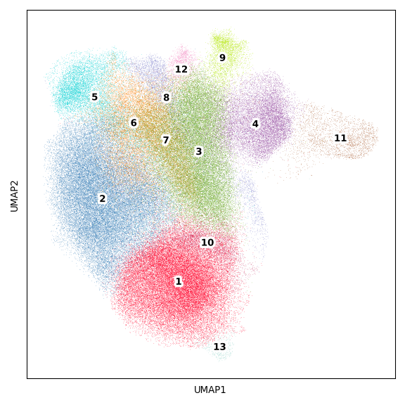
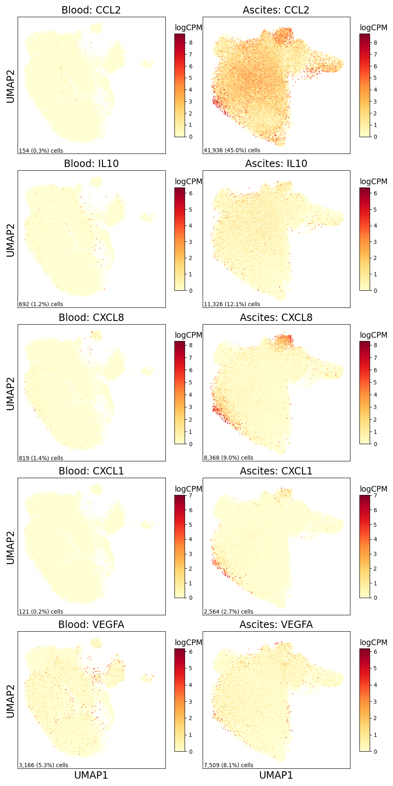
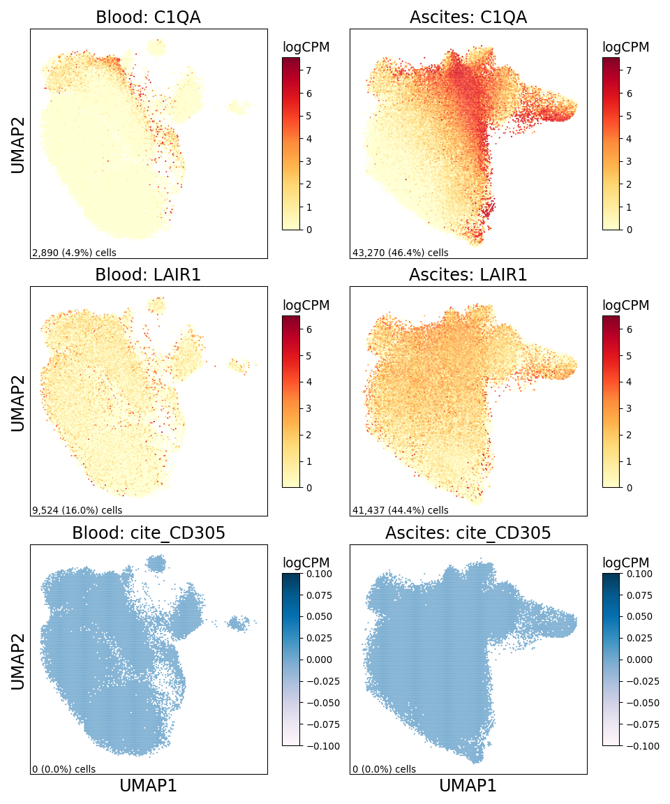

Monocyte/Macrophage Figure
================

## Set up

Load R libraries

``` r
library(ggpubr)
library(tidyverse)

library(reticulate)
use_python("/projects/home/tlchan/.conda/envs/myenv/bin/python")

setwd('/projects/home/tlchan/github_code/ascites/functions')
source('plot_abundance.R')
source('plot_deg.R')
source('plot_dotplot.R')
source('plot_sf_boxplot.R')
```

Load python libraries

``` python
import pegasus as pg

import sys
sys.path.append("/projects/home/tlchan/github_code/ascites/functions")
import python_functions
```

## Figure 1A

``` python
monomac_cluster_palette = {
    "1": "#FF0029",
    "2": "#377EB8",
    "3": "#66A61E",
    "4": "#984EA3",
    "5": "#00D2D5",
    "6": "#FF7F00",
    "7": "#AF8D00",
    "8": "#7F80CD",
    "9": "#B3E900",
    "10": "#C42E60",
    "11": "#A65628",
    "12": "#F781BF",
    "13": "#8DD3C7",
    "14": "#BEBADA",
    "15": "#FB8072"
}

# Load single-cell object
monomac_data = pg.read_input(
    '/projects/home/tlchan/projects/ascites/second_data_freeze/clusterings/ascites_mono-mac_R7_300mg_20pm_harm_channel_multi_res/1.1/data/pseudobulk/ascites_mono-mac_R7_300mg_20pm_harm_channel_1_1_complete_with_pb.zarr.zip')

# Relabel obs for function
monomac_data.obs['Cluster'] = monomac_data.obs['leiden_labels'].cat.remove_unused_categories().astype(str)

python_functions.plot_umap(lin_data=monomac_data,
                           palette=monomac_cluster_palette)
```

    ## 2024-06-20 18:47:15,738 - pegasusio.readwrite - INFO - zarr file '/projects/home/tlchan/projects/ascites/second_data_freeze/clusterings/ascites_mono-mac_R7_300mg_20pm_harm_channel_multi_res/1.1/data/pseudobulk/ascites_mono-mac_R7_300mg_20pm_harm_channel_1_1_complete_with_pb.zarr.zip' is loaded.
    ## 2024-06-20 18:47:15,738 - pegasusio.readwrite - INFO - Function 'read_input' finished in 3.88s.



## Figure 1B

``` r
monomac_gex <- read.csv('/projects/home/tlchan/projects/ascites/figure_panels/dotplot_data/monomac_gene_exp.csv')
monomac_cite <- read.csv('/projects/home/tlchan/projects/ascites/figure_panels/dotplot_data/monomac_cite_exp.csv')

plot_dotplot(lin_gex = monomac_gex,
             lin_cite = monomac_cite,
             lin = "monomac",
             widths = c(1, .1, .2))
```

<!-- -->

## Figure 1C

``` r
plot_cluster_abundance("monomac")
```

<!-- -->

## Figure 1D

``` python
monomac_data = pg.read_input(
    '/projects/home/tlchan/projects/ascites/second_data_freeze/clusterings/ascites_mono-mac_R7_300mg_20pm_harm_channel_multi_res/1.1/data/pseudobulk/ascites_mono-mac_R7_300mg_20pm_harm_channel_1_1_complete_with_pb.zarr.zip')

python_functions.plot_feature_by_tissue_type(lin_data=monomac_data,
                                             genes=["CCL2", "IL10", "CXCL8", "CXCL1", "VEGFA"])
```

    ## 2024-06-20 18:47:24,693 - pegasusio.readwrite - INFO - zarr file '/projects/home/tlchan/projects/ascites/second_data_freeze/clusterings/ascites_mono-mac_R7_300mg_20pm_harm_channel_multi_res/1.1/data/pseudobulk/ascites_mono-mac_R7_300mg_20pm_harm_channel_1_1_complete_with_pb.zarr.zip' is loaded.
    ## 2024-06-20 18:47:24,693 - pegasusio.readwrite - INFO - Function 'read_input' finished in 3.18s.



## Figure 1E

``` r
plot_sf_boxplot(analytes = c("CCL2", "IL-10", "IL-8", "GROa", "VEGF-A"),
                nrow = 5)
```

<!-- -->

## Figure 1F

``` python
monomac_data = pg.read_input(
    '/projects/home/tlchan/projects/ascites/second_data_freeze/clusterings/ascites_mono-mac_R7_300mg_20pm_harm_channel_multi_res/1.1/data/pseudobulk/ascites_mono-mac_R7_300mg_20pm_harm_channel_1_1_complete_with_pb.zarr.zip')

python_functions.plot_feature_by_tissue_type(lin_data=monomac_data,
                                             genes=["C1QA", "LAIR1", "cite_CD305"])
```

    ## 2024-06-20 18:47:40,417 - pegasusio.readwrite - INFO - zarr file '/projects/home/tlchan/projects/ascites/second_data_freeze/clusterings/ascites_mono-mac_R7_300mg_20pm_harm_channel_multi_res/1.1/data/pseudobulk/ascites_mono-mac_R7_300mg_20pm_harm_channel_1_1_complete_with_pb.zarr.zip' is loaded.
    ## 2024-06-20 18:47:40,417 - pegasusio.readwrite - INFO - Function 'read_input' finished in 3.05s.



## Figure 1G

``` r
tissue_palette <- list("Ascites" = "#00BFC4",
                       "Blood" = "#F8766D")

plot_data <- read.csv("/projects/home/tlchan/projects/ascites/figure_panels/boxplot_data/monomac_protein_exp.csv", row.names = 1) %>%
    filter(protein == "cite_CD305") %>%
    filter(leiden_labels %in% c(2, 5, 9))

hp <- ggplot(plot_data, aes(x = count, fill = tissue_type)) +
    geom_histogram(position = "identity", alpha = 0.75) +
    labs(fill = "Tissue Type") +
    ylab("Count") +
    xlab("CLR(CITE count)") +
    facet_wrap(~leiden_labels, scales = "free_y") +
    ggtitle("Monocyte/Macrophage, CITE_CD305") +
    theme_classic(base_size = 20) +
    scale_fill_manual(values = tissue_palette) +
    theme(legend.position = "bottom")

plot_data <- plot_data %>%
    group_by(patient_id, tissue_type, leiden_labels) %>%
    summarize(median_count = median(count), n_cells = n())

bp <- ggplot(plot_data, aes(x = tissue_type, y = median_count, fill = tissue_type)) +
    geom_boxplot(outlier.shape = NA) +
    geom_point(pch = 21, position = position_jitterdodge(), size = 2) +
    stat_compare_means(method = "t.test", label.x.npc = "center", aes(label = paste0("p = ", after_stat(p.format)))) +
    labs(fill = "Tissue Type") +
    ylab("Median CLR(CITE count)") +
    xlab("Tissue type") +
    facet_wrap(~leiden_labels, scales = "free_y") +
    ggtitle("Monocyte/Macrophage, CITE_CD305") +
    theme_classic(base_size = 20) +
    scale_fill_manual(values = tissue_palette) +
    theme(legend.position = "none") +
    scale_y_continuous(expand = expansion(mult = c(0.05, 0.15)))


ggarrange(hp, bp, nrow = 2)
```

<!-- -->
