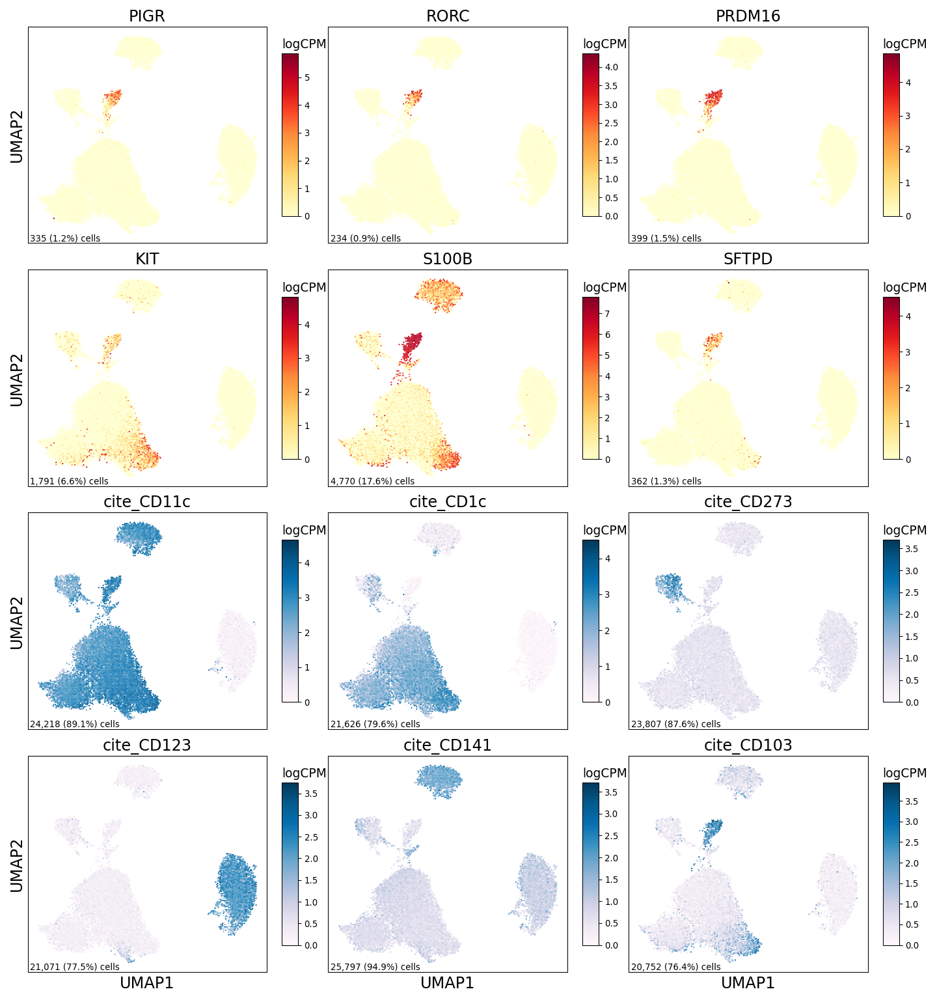
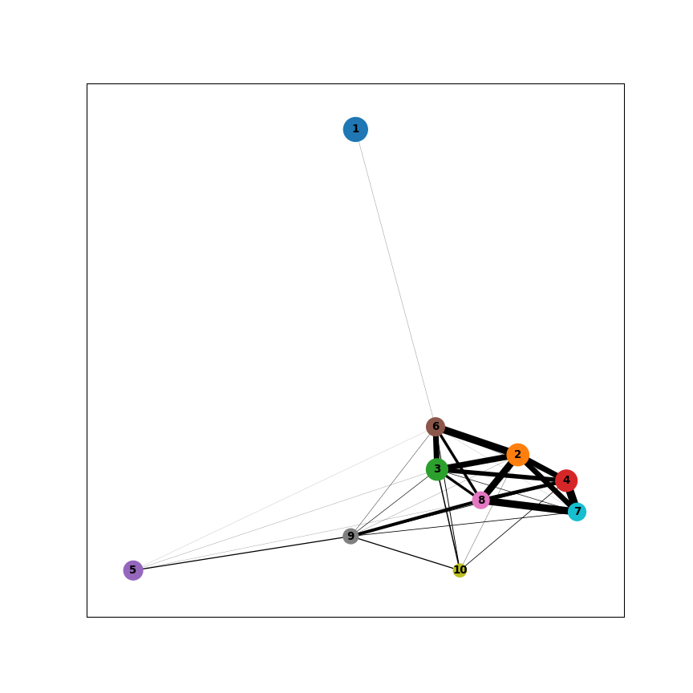
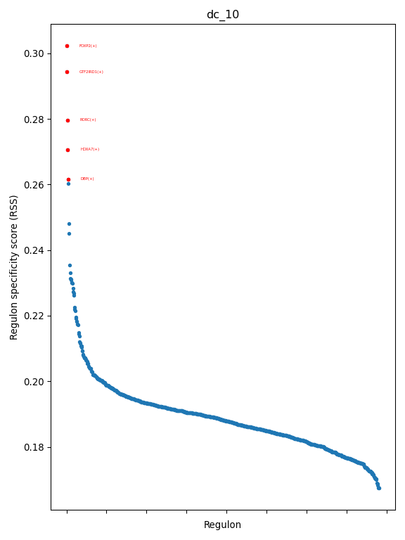

PIGR DC Figure 1
================

## Set up

Load R libraries

``` r
library(circlize)
library(ComplexHeatmap)
library(ggpubr)
library(glue)
library(tidyverse)
library(xlsx)

library(reticulate)
use_python("/projects/home/tlchan/.conda/envs/myenv/bin/python")

setwd('/projects/home/tlchan/github_code/ascites/functions')
source('plot_sf_boxplot.R')
```

Load python libraries

``` python
import matplotlib.pyplot as plt
import os
import pandas as pd
import pegasus as pg
from pyscenic.plotting import plot_rss
import scanpy as sc

import sys
sys.path.append("/projects/home/tlchan/github_code/ascites/functions")
import python_functions
```

## Figure 1A

``` python
dc_cluster_palette = {
    "1": "#FF0029",
    "2": "#377EB8",
    "3": "#66A61E",
    "4": "#984EA3",
    "5": "#00D2D5",
    "6": "#FF7F00",
    "7": "#AF8D00",
    "8": "#7F80CD",
    "9": "#B3E900",
    "10": "#C42E60"
}

# Load single-cell object
dc_data = pg.read_input(
    '/projects/home/tlchan/projects/ascites/second_data_freeze/clusterings/ascites_dc_R8_300mg_20pm_harm_channel_multi_res/1.1/data/pseudobulk/ascites_dc_R8_300mg_20pm_harm_channel_1_1_complete_with_pb.zarr.zip')

# Relabel obs for function
dc_data.obs['Cluster'] = dc_data.obs['leiden_labels'].cat.remove_unused_categories().astype(str)

python_functions.plot_umap(lin_data=dc_data,
                           palette=dc_cluster_palette)
```

    ## 2024-05-07 17:11:54,270 - pegasusio.readwrite - INFO - zarr file '/projects/home/tlchan/projects/ascites/second_data_freeze/clusterings/ascites_dc_R8_300mg_20pm_harm_channel_multi_res/1.1/data/pseudobulk/ascites_dc_R8_300mg_20pm_harm_channel_1_1_complete_with_pb.zarr.zip' is loaded.
    ## 2024-05-07 17:11:54,270 - pegasusio.readwrite - INFO - Function 'read_input' finished in 0.83s.
    ## /projects/home/tlchan/.conda/envs/myenv/lib/python3.9/site-packages/scanpy/plotting/_tools/scatterplots.py:392: UserWarning: No data for colormapping provided via 'c'. Parameters 'cmap' will be ignored
    ##   cax = scatter(


## Figure 1B

``` r
count_mtx <- read.csv("/projects/home/tlchan/ascites_dc_R8_300mg_20pm_harm_channel_1_1_cluster_pseudobulk_counts.csv",
                      row.names = 1)
meta_data <- read.csv("/projects/home/tlchan/ascites_dc_R8_300mg_20pm_harm_channel_1_1_cluster_pseudobulk_meta.csv",
                      row.names = 1)

annot_info <- read.csv("/projects/home/tlchan/ascites_dc_R8_300mg_20pm_harm_channel_1_1_cluster_pseudobulk_annotation.csv",
                       row.names = 1)

colnames(annot_info) <- sapply(str_replace(colnames(annot_info), "_", " "), str_to_title)
norm_counts <- apply(count_mtx, 2, function(c) {
    n_total <- sum(c)
    per_100k <- (c * 1000000) / n_total
    return(per_100k)
})
norm_counts <- log1p(norm_counts)

all_genes <- apply(annot_info, 2, function(c) {
    genes <- c[0:(nrow(annot_info) - 3)]
    genes <- genes[genes != ""]
    return(genes)
}) %>%
    unlist(use.names = FALSE)
heatmap_data <- norm_counts[unique(all_genes),]
heatmap_data <- t(scale(t(heatmap_data)))
colnames(heatmap_data) <- sapply(colnames(heatmap_data), function(x) paste("Cluster", strsplit(x, "_")[[1]][2]))

clustering <- hclust(dist(t(heatmap_data), method = "euclidean"), method = "ward.D2")
col_hc <- as.dendrogram(clustering)

order <- clustering$labels[clustering$order]

gene_order <- lapply(order, function(x) {
    genes <- annot_info[[x]][1:(nrow(annot_info) - 3)]
    genes <- genes[genes != ""]
    return(genes)
}) %>%
    unlist(use.names = FALSE)

heatmap_data <- heatmap_data[gene_order,]

label_genes <- list()

# Some custom labelings for interesting genes
label_genes$`Cluster 1` <- c("LILRA4", "IL3RA")
label_genes$`Cluster 2` <- c("IFI6", "CD1D")
label_genes$`Cluster 3` <- c("HLA-DRB1", "HLA-DRA")
label_genes$`Cluster 4` <- c("S100A8", "CSF3R")
label_genes$`Cluster 5` <- c("CLEC9A", "XCR1")
label_genes$`Cluster 6` <- c("SIGLEC6", "KIT")
label_genes$`Cluster 7` <- c("KLF2", "C1QA")
label_genes$`Cluster 8` <- c("NR4A2", "AREG")
label_genes$`Cluster 9` <- c("CCR7", "IL7R")
label_genes$`Cluster 10` <- c("GTF2IRD1", "ACY3", "NRXN2", "HOPX", "PRDM16", "RORC", "SFTPD", "PIGR")

annotation_genes <- unlist(label_genes, use.names = FALSE)

# Now lets organize the color info that will be used for annotations
col_info <- annot_info %>%
    t() %>%
    as.data.frame() %>%
    dplyr::select(-mean_genes) %>%
    rownames_to_column(var = "cluster") %>%
    reshape2::melt(id.vars = c("cluster", "col")) %>%
    select(-variable)

# Get the gene colors
gene_cols <- c()
for (gene in annotation_genes) {
    color <- as.character(filter(col_info, value == gene)["col"][[1]])
    gene_cols <- c(gene_cols, color)
}

mean_genes <- annot_info["mean_genes",] %>%
    mutate_each(funs(as.numeric(as.character(.)))) %>%
    select(colnames(heatmap_data))

gene_col_fun <- colorRamp2(c(min(mean_genes), max(mean_genes)), c("#1d111d", "#bbe7c8"))
gene_bar <- HeatmapAnnotation("mean # genes" = as.numeric(mean_genes),
                              col = list("mean # genes" = gene_col_fun),
                              show_legend = FALSE)
gene_lgd <- Legend(col_fun = gene_col_fun,
                   title = "# genes",
                   legend_height = unit(4, "cm"),
                   title_position = "topcenter")

heatmap_col_fun <- colorRamp2(c(min(heatmap_data), 0, max(heatmap_data)), c("purple", "black", "yellow"))
heatmap_lgd <- Legend(col_fun = heatmap_col_fun,
                      title = "z-score",
                      legend_height = unit(4, "cm"),
                      title_position = "topcenter")

lgd_list <- packLegend(heatmap_lgd, gene_lgd, column_gap = unit(1, "cm"), direction = "horizontal")

split <- c()
for (gene in rownames(heatmap_data)) {
    for (cl in order) {
        if (gene %in% annot_info[[cl]]) {
            split <- c(split, sub("Cluster", "", cl))
            break
        }
    }
}
split <- factor(split, levels = as.character(unique(split)))

# Get the cluster colors
col_label_colors <- c()
for (clust in colnames(heatmap_data)) {
    color <- col_info %>%
        select(cluster, col) %>%
        distinct() %>%
        filter(cluster == clust)
    col_label_colors <- c(col_label_colors, as.character(color$col))
}

# Make block annotation
clust_cols <- c()
for (clust in order) {
    color <- col_info %>%
        select(cluster, col) %>%
        distinct() %>%
        filter(cluster == clust)
    clust_cols <- c(clust_cols, as.character(color$col))
}

left_annotation <- HeatmapAnnotation(blk = anno_block(gp = gpar(fill = clust_cols, col = clust_cols)),
                                     which = "row",
                                     width = unit(1.5, "mm"))
heatmap_list <- Heatmap(heatmap_data,
                        name = "z-score",
                        col = heatmap_col_fun,
                        cluster_rows = FALSE,
                        cluster_columns = col_hc,
                        clustering_method_columns = "ward.D2",
                        clustering_distance_columns = "euclidean",
                        column_dend_reorder = FALSE,
                        top_annotation = gene_bar,
                        show_heatmap_legend = FALSE,
                        column_names_gp = gpar(col = col_label_colors, fontface = "bold"),
                        split = split,
                        left_annotation = left_annotation,
                        show_column_names = TRUE) +
    rowAnnotation(link = anno_mark(at = match(annotation_genes, rownames(heatmap_data)), labels = annotation_genes, labels_gp = gpar(col = gene_cols, fontsize = 8, fontface = "bold")))
draw(heatmap_list, heatmap_legend_list = lgd_list)
```

<!-- -->

## Figure 1C

``` python
dc_data = pg.read_input("/projects/home/tlchan/projects/ascites/data_cite_objects/dc.zarr.zip")

python_functions.plot_feature(lin_data=dc_data,
                              genes=['PIGR', 'RORC', 'PRDM16', 'KIT', 'S100B', 'SFTPD', 'cite_CD11c', 'cite_CD1c', 'cite_CD273', 'cite_CD123', 'cite_CD141', 'cite_CD103'],
                              ncol=3,
                              nrow=4)
```

    ## 2024-05-07 17:11:57,625 - pegasusio.readwrite - INFO - zarr file '/projects/home/tlchan/projects/ascites/data_cite_objects/dc.zarr.zip' is loaded.
    ## 2024-05-07 17:11:57,625 - pegasusio.readwrite - INFO - Function 'read_input' finished in 0.55s.



## Figure 1D

``` python
dc_data = pg.read_input(
    '/projects/home/tlchan/projects/ascites/second_data_freeze/clusterings/ascites_dc_R8_300mg_20pm_harm_channel_multi_res/1.1/data/filter_qc/ascites_dc_R8_300mg_20pm_harm_channel_1_1.zarr.zip')

dc_adata = dc_data.to_anndata()

sc.pp.neighbors(dc_adata)

sc.tl.paga(adata=dc_adata, groups="leiden_labels")

fig, ax = plt.subplots(figsize=(9, 9))
sc.pl.paga(adata=dc_adata, ax=ax, node_size_scale=2)
plt.show()
plt.close(fig)
```

    ## 2024-05-07 17:12:03,662 - pegasusio.readwrite - INFO - zarr file '/projects/home/tlchan/projects/ascites/second_data_freeze/clusterings/ascites_dc_R8_300mg_20pm_harm_channel_multi_res/1.1/data/filter_qc/ascites_dc_R8_300mg_20pm_harm_channel_1_1.zarr.zip' is loaded.
    ## 2024-05-07 17:12:03,662 - pegasusio.readwrite - INFO - Function 'read_input' finished in 0.69s.



## Figure 1E

``` r
# Load data
abundance <- read.csv("/projects/home/tlchan/projects/ascites/second_data_freeze/data/metadata/ascites_abundance.csv")

# Select DC cells
abundance <- abundance %>%
    filter(lineage == "dc")

# Get immune count
abundance <- abundance %>%
    group_by(patient_id, tissue_type, lineage, cluster) %>%
    mutate(clust_count = sum(immune == "True")) %>%
    select(patient_id, tissue_type, lineage, cluster, clust_count) %>%
    distinct()

# Account for patient/tissue pairs that contributed zero cells to clusters
combos <- expand.grid(unique(abundance$patient_id), unique(abundance$tissue_type), unique(abundance$lineage), unique(abundance$cluster)) %>% `colnames<-`(c("patient_id", "tissue_type", "lineage", "cluster"))

abundance <- combos %>%
    left_join(abundance, by = c("patient_id", "tissue_type", "lineage", "cluster")) %>%
    replace(is.na(.), 0)

# Get statistics
abundance <- abundance %>%
    group_by(patient_id, tissue_type) %>%
    mutate(total_count = sum(clust_count)) %>%
    mutate(clust_percentage = clust_count / total_count * 100) %>%
    mutate(log_clust_percentage = log1p(clust_percentage)) %>%
    mutate(tissue_type = factor(tissue_type, levels = c("blood", "ascites")))

abundance <- abundance %>%
    filter(cluster == "10") %>%
    mutate(clust_percentage = replace_na(clust_percentage, 0)) %>%
    mutate(log_clust_percentage = replace_na(log_clust_percentage, 0))

ggplot(abundance, aes(x = patient_id, y = log_clust_percentage, fill = tissue_type)) +
    geom_bar(stat = 'identity') +
    xlab("Patient") +
    ylab("log1p(percent native cluster abundance)") +
    labs(fill = "Tissue type") +
    theme(axis.text.x = element_text(angle = 90, vjust = 0.5, hjust = 1))
```

<!-- -->

## Figure 1F

``` r
plot_sf_boxplot(c("MIP-3α"))
```

<!-- -->

## Figure 1G

``` python
rss_list = list()
for i in range(0, 10):
    DATA_FOLDER = "/projects/home/tlchan/projects/ascites/second_data_freeze/data/dc_analysis/pigr/test_500"
    RSS_FNAME = os.path.join(DATA_FOLDER, f"lineage_rss_{i}_mtx.csv")
    rss_data = pd.read_csv(RSS_FNAME, index_col=0)
    rss_data = rss_data.loc['dc_10'].to_frame(f"iter_{i}")
    rss_list.append(rss_data)

rss_all = pd.concat(rss_list, axis=1)
rss_data = rss_all.mean(axis=1, skipna=True).to_frame('dc_10').T

fig = plt.figure(figsize=(6, 8))
c = "dc_10"
x = rss_data.T[c]
ax = fig.add_subplot(1, 1, 1)
plot_rss(rss_data, c, top_n=5, max_n=None, ax=ax)
ax.set_ylim(x.min() - (x.max() - x.min()) * 0.05, x.max() + (x.max() - x.min()) * 0.05)
ax.set_ylabel('Regulon specificity score (RSS)')
ax.set_xlabel('Regulon')
plt.tight_layout()
plt.show()
plt.close(fig)
```

    ## (0.16070401435335693, 0.30901425311015535)



## Figure 1H

``` r
select_regulons <- c("ID2(+)", "IRF4(+)", "IRF7(+)", "IRF8(+)", "KLF5(+)", "TCF4(+)", "SPIB(+)", "NFIL3(+)", "BATF3(+)", "KLF4(+)")

dc10_regulons <- read.xlsx("/projects/home/tlchan/projects/ascites/second_data_freeze/data/dc_analysis/pigr/test_500_top_regulons.xlsx", sheetName = "dc_10") %>%
    filter(count > 1) %>%
    pull(regulon)
select_regulons <- append(select_regulons, dc10_regulons)

rss_data <- lapply(seq(1, 9, 1), function(i) {
    iter_data <- read.csv(glue("/projects/home/tlchan/projects/ascites/second_data_freeze/data/dc_analysis/pigr/test_500/lineage_rss_{i}_mtx.csv"), check.names = FALSE, row.names = 1) %>%
        rownames_to_column("cluster") %>%
        pivot_longer(!cluster, names_to = "regulon", values_to = "score") %>%
        mutate(iter = i) %>%
        filter(startsWith(cluster, "dc_"))
    return(iter_data)
}) %>%
    do.call(rbind, .) %>%
    filter(regulon %in% select_regulons)

# Account for regulons that are not found in every cluster
combos <- expand.grid(unique(rss_data$iter), unique(rss_data$cluster), unique(rss_data$regulon)) %>% `colnames<-`(c("iter", "cluster", "regulon"))
rss_data <- combos %>%
    left_join(rss_data, by = c("iter", "cluster", "regulon")) %>%
    replace(is.na(.), 0)

rss_data <- rss_data %>%
    group_by(cluster, regulon) %>%
    summarize(score = mean(score)) %>%
    pivot_wider(names_from = regulon, values_from = score) %>%
    column_to_rownames("cluster") %>%
    t()

# Get Z-scres matrix
rss_data <- t(scale(t(rss_data)))

# Scale to 0 to 1
rss_data <- apply(rss_data, 1, function(r) {
    (r - min(r)) / (max(r) - min(r))
}) %>% t()

# Remove (+) from rownames
rownames(rss_data) <- str_sub(rownames(rss_data), end = -4)

# Function for coloring the heatmap
heatmap_col_fun <- colorRamp2(c(min(rss_data), 0, max(rss_data)), c("purple", "black", "yellow"))

# This creates the dendrogram for the genes
row_order <- c("IRF8", "KLF4", "NFIL3", "MEIS1", "IRF7", "TCF4", "IRF4", "SPIB", "KLF5", "HIC1", "AHR", "RARA", "HOXA6",
               "ELK1", "PDLIM5", "SP7", "HOXA7", "GTF2IRD1", "HOXA9", "DBP", "FOXP2", "BARX1", "NFATC4", "HOXB2",
               "NFIA", "RORC", "ZNF580")

col_order <- c("dc_5", "dc_2", "dc_3", "dc_7", "dc_8", "dc_4", "dc_6", "dc_1", "dc_9", "dc_10")

rss_data <- rss_data[row_order, col_order]

hmap <- Heatmap(rss_data,
                name = "z-score",
                col = heatmap_col_fun,
                show_column_names = TRUE,
                show_row_names = TRUE,
                cluster_columns = FALSE,
                cluster_rows = FALSE,
                show_heatmap_legend = TRUE,
                column_title = "Cluster",
                row_title = "Regulons")
draw(hmap)
```

<!-- -->
