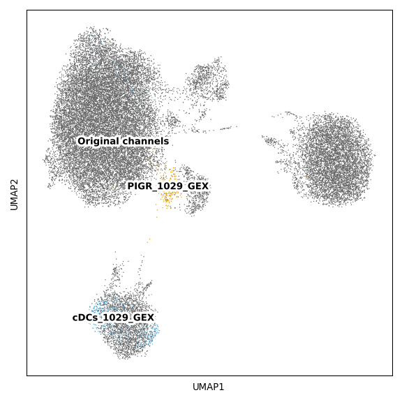
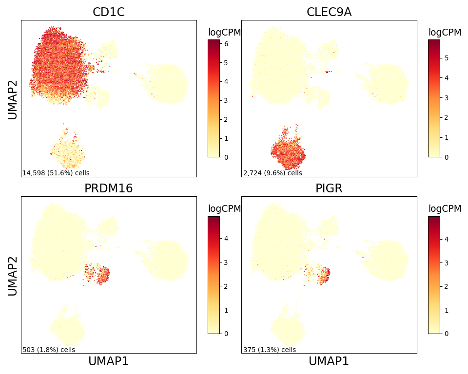

PIGR DC Figure 2
================

## Set up

Load R libraries

``` r
library(reticulate)
use_python("/projects/home/tlchan/.conda/envs/myenv/bin/python")
```

Load python libraries

``` python
import pegasus as pg

import sys
sys.path.append("/projects/home/tlchan/github_code/ascites/functions")
import python_functions
```

## Figure 1B

``` python
channel_palette = {
    "Original channels": "#666666",
    "PIGR_1029_GEX": "#E69F00",
    "cDCs_1029_GEX": "#56B4E9"
}

# Load single-cell object
pigr_dc_data = pg.read_input(
    '/projects/home/tlchan/projects/ascites/dc_hunting/clusterings/pigr_dc_project_R1_300mg_20pm_scVI_multi_res/1.3/data/pseudobulk/pigr_dc_project_R1_300mg_20pm_scVI_1_3_complete_with_pb.zarr.zip')

# Relabel obs for function
pigr_dc_data.obs['Channel'] = pigr_dc_data.obs['Channel'].cat.add_categories("Original channels")
pigr_dc_data.obs.loc[~pigr_dc_data.obs['Channel'].isin(["PIGR_1029_GEX", "cDCs_1029_GEX"]), "Channel"] = "Original channels"
pigr_dc_data.obs['Channel'] = pigr_dc_data.obs['Channel'].cat.remove_unused_categories().astype(str)
pigr_dc_data.obs['Channel'].value_counts()


python_functions.plot_umap(lin_data=pigr_dc_data,
                           color="Channel",
                           palette=channel_palette)
```

    ## 2024-05-07 17:11:56,488 - pegasusio.readwrite - INFO - zarr file '/projects/home/tlchan/projects/ascites/dc_hunting/clusterings/pigr_dc_project_R1_300mg_20pm_scVI_multi_res/1.3/data/pseudobulk/pigr_dc_project_R1_300mg_20pm_scVI_1_3_complete_with_pb.zarr.zip' is loaded.
    ## 2024-05-07 17:11:56,489 - pegasusio.readwrite - INFO - Function 'read_input' finished in 1.25s.
    ## Original channels    27174
    ## cDCs_1029_GEX          833
    ## PIGR_1029_GEX          290
    ## Name: Channel, dtype: int64
    ## /projects/home/tlchan/.conda/envs/myenv/lib/python3.9/site-packages/scanpy/plotting/_tools/scatterplots.py:392: UserWarning: No data for colormapping provided via 'c'. Parameters 'cmap' will be ignored
    ##   cax = scatter(



## Figure 1C

``` python
pigr_dc_data = pg.read_input(
    '/projects/home/tlchan/projects/ascites/dc_hunting/clusterings/pigr_dc_project_R1_300mg_20pm_scVI_multi_res/1.3/data/pseudobulk/pigr_dc_project_R1_300mg_20pm_scVI_1_3_complete_with_pb.zarr.zip')

python_functions.plot_feature(lin_data=pigr_dc_data,
                              genes=['CD1C', 'CLEC9A', 'PRDM16', 'PIGR'],
                              ncol=2,
                              nrow=2)
```

    ## 2024-05-07 17:11:58,849 - pegasusio.readwrite - INFO - zarr file '/projects/home/tlchan/projects/ascites/dc_hunting/clusterings/pigr_dc_project_R1_300mg_20pm_scVI_multi_res/1.3/data/pseudobulk/pigr_dc_project_R1_300mg_20pm_scVI_1_3_complete_with_pb.zarr.zip' is loaded.
    ## 2024-05-07 17:11:58,849 - pegasusio.readwrite - INFO - Function 'read_input' finished in 1.25s.


