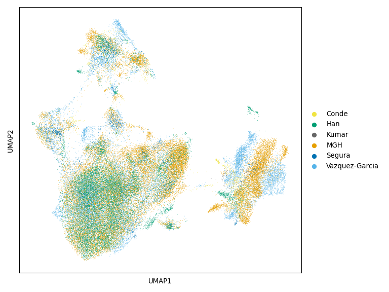
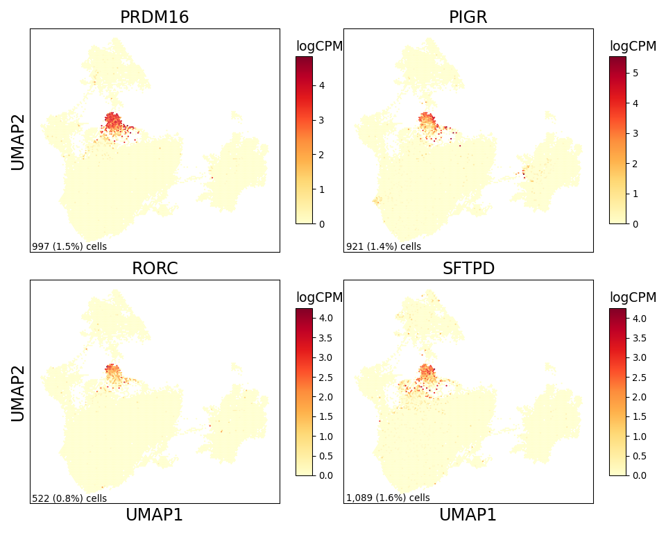

PIGR DC Figure 3
================

## Set up

Load R libraries

``` r
library(ggplot2)
library(tidyverse)

library(reticulate)
use_python("/projects/home/tlchan/.conda/envs/myenv/bin/python")

setwd('/projects/home/tlchan/github_code/ascites/functions')
source('plot_fgsea.R')
```

Load python libraries

``` python
import matplotlib as mpl
import matplotlib.pyplot as plt
import numpy as np
import pandas as pd
import pegasus as pg
import scanpy as sc
```

## Figure 1B

``` python
mpl.rcParams['pdf.fonttype'] = 42

dataset_dict = {
    "cancer_discovery": "Kumar",
    "gastric": "MGH",
    "ovarian": "Vazquez-Garcia",
    "peritoneal": "Han",
    "teichmann": "Conde",
    "tonsil": "Segura"
}

dataset_palette = {
    "Kumar": "#666666",
    "MGH": "#E69F00",
    "Vazquez-Garcia": "#56B4E9",
    "Han": "#009E73",
    "Conde": "#F0E442",
    "Segura": "#0072b2"
}

# Load single-cell object
lineage_data = pg.read_input(
    '/projects/home/tlchan/projects/ascites/dc_hunting/clusterings/combo_data_dc_R4_300mg_20pm_harm_dataset_multi_res/1.5/data/pseudobulk/combo_data_dc_R4_300mg_20pm_harm_dataset_1_5_complete_with_pb.zarr.zip')

# Relabel obs for function
pg.annotate(lineage_data, 'dataset', 'dataset', dataset_dict)

dataset_fig, dataset_ax = plt.subplots(1)
dataset_umap = sc.pl.umap(adata=lineage_data.to_anndata(),
                          color="dataset",
                          use_raw=True,
                          palette=dataset_palette,
                          legend_loc="right margin",
                          legend_fontoutline=5,
                          title="",
                          show=False,
                          ax=dataset_ax)

dataset_fig = plt.gcf()
dataset_fig.set_size_inches(8, 6)
dataset_fig.tight_layout()
dataset_ax.set_rasterization_zorder(2)
plt.show()
plt.close()
```

    ## 2024-04-29 21:02:08,698 - pegasusio.readwrite - INFO - zarr file '/projects/home/tlchan/projects/ascites/dc_hunting/clusterings/combo_data_dc_R4_300mg_20pm_harm_dataset_multi_res/1.5/data/pseudobulk/combo_data_dc_R4_300mg_20pm_harm_dataset_1_5_complete_with_pb.zarr.zip' is loaded.
    ## 2024-04-29 21:02:08,698 - pegasusio.readwrite - INFO - Function 'read_input' finished in 2.62s.
    ## /projects/home/tlchan/.conda/envs/myenv/lib/python3.9/site-packages/scanpy/plotting/_tools/scatterplots.py:392: UserWarning: No data for colormapping provided via 'c'. Parameters 'cmap' will be ignored
    ##   cax = scatter(



## Figure 1C

``` python
mpl.rcParams['pdf.fonttype'] = 42

ncol = 2
nrow = 2
genes = ['PRDM16', 'PIGR', 'RORC', 'SFTPD']

lineage_data = pg.read_input("/projects/home/tlchan/projects/ascites/dc_hunting/clusterings/combo_data_dc_R4_300mg_20pm_harm_dataset_multi_res/1.5/data/pseudobulk/combo_data_dc_R4_300mg_20pm_harm_dataset_1_5_complete_with_pb.zarr.zip")

# Get UMAP coordinates for base
umap_coords = pd.DataFrame(lineage_data.obsm['X_umap'], columns=['x', 'y'])
x = umap_coords['x']
y = umap_coords['y']

# Set up figure structure
fig_size = (5 * ncol, 4 * nrow)
fig, axes = plt.subplots(nrows=nrow, ncols=ncol, figsize=fig_size,
                         sharex=True, sharey=True)
ax = axes.ravel()

# Plot for each gene
for num, gene in enumerate(genes):
    # Get counts for each gene
    norm_counts = lineage_data[:, gene].copy().get_matrix('X').todense().transpose()
    norm_counts = np.squeeze(np.asarray(norm_counts))

    if norm_counts.size == 0:  # ie. All empty/zero in sparce matrix
        norm_counts = np.zeros(norm_counts.shape[1])

    # Get n cells and perc cells
    ncells = (norm_counts != 0).sum()
    pcells = ncells / norm_counts.shape[0]

    if gene.startswith('cite_'):
        cmap = 'PuBu'
    else:
        cmap = 'YlOrRd'

    # Create heatmap
    hb = ax[num].hexbin(x=x,
                        y=y,
                        C=norm_counts,
                        cmap=cmap,
                        gridsize=150,
                        edgecolors="none")

    # Add percent expression
    ax[num].annotate(f'{ncells:,} ({pcells:.1%}) cells',
                     xy=(0.01, 0), xycoords='axes fraction',
                     fontsize=10,
                     horizontalalignment='left',
                     verticalalignment='bottom')

    # Add axes and colorbar information
    cb = fig.colorbar(hb, ax=ax[num], shrink=.75, aspect=10)
    cb.ax.set_title('logCPM', loc='left', fontsize=14)
    ax[num].set_title(gene, fontsize=18)
    ax[num].tick_params(left=False, labelleft=False,
                        bottom=False, labelbottom=False)
    if (num + ncol) % ncol == 0:
        # Start of row
        ax[num].set_ylabel('UMAP2', fontsize=18)
    if nrow == 1:
        # Only one row
        ax[num].set_xlabel('UMAP1', fontsize=18)
    elif num > (len(genes) - ncol - 1):
        # Last row if more than one row
        ax[num].set_xlabel('UMAP1', fontsize=18)

    # Rasterize
    ax[num].set_rasterization_zorder(2)

for i in range(len(ax) - (len(ax) - len(genes)), len(ax)):
    ax[i].set_axis_off()
fig.tight_layout()
plt.show()
plt.close()
```

    ## 2024-04-29 21:02:12,606 - pegasusio.readwrite - INFO - zarr file '/projects/home/tlchan/projects/ascites/dc_hunting/clusterings/combo_data_dc_R4_300mg_20pm_harm_dataset_multi_res/1.5/data/pseudobulk/combo_data_dc_R4_300mg_20pm_harm_dataset_1_5_complete_with_pb.zarr.zip' is loaded.
    ## 2024-04-29 21:02:12,607 - pegasusio.readwrite - INFO - Function 'read_input' finished in 2.60s.



## Figure 1D

``` r
# Load data
abundance <- read.csv('/projects/home/tlchan/projects/ascites/external_dcs_obs.csv')

abundance <- abundance %>%
    filter(!dataset %in% c("tonsil")) %>%
    group_by(organ, organ_type, dataset, Channel, leiden_labels) %>%
    summarize(n_cell = n())

# Include zeros
combos <- expand.grid(unique(abundance$Channel), unique(abundance$leiden_labels)) %>%
    `colnames<-`(c("Channel", "leiden_labels")) %>%
    left_join(abundance %>%
                  select("Channel", "organ_type", "organ") %>%
                  distinct(), by = c("Channel"))

abundance <- combos %>%
    left_join(abundance, by = c("Channel", "leiden_labels", "organ_type", "dataset", "organ")) %>%
    replace(is.na(.), 0)

abundance <- abundance %>%
    group_by(organ, Channel) %>%
    mutate(channel_count = sum(n_cell),
           percentage = n_cell / channel_count * 100)

organ_levels <- list("Other", "Upper quadrant", "Skeletal muscle", "Lung", "Liver", "Bone marrow", "Blood", "Adnexa",
                     "Thymus", "Thoracic LN", "Spleen", "Mesenteric LN", "Transverse colon", "Sigmoid colon", "Jejunum LP", "Jejunum epithelium", "Ileum", "Doudenum", "Caecum", "Bowel",
                     "Stomach", "Omentum", "Peritoneum", "Healthy washing", "Ascites")

tumor_palette <- list("Peritoneum" = "#66A61E", "GI tract" = "#984EA3", "Lymphoid" = "#00D2D5",
                      "Blood" = "#FF7F00", "Adnexa" = "#FF7F00", "Bone marrow" = "#FF7F00", "Liver" = "#FF7F00", "Lung" = "#FF7F00", "Muscle" = "#FF7F00", "Other" = "#FF7F00")

abundance <- abundance %>%
    filter(leiden_labels == 'dc_17') %>%
    mutate(organ = factor(organ, levels = organ_levels),
           dataset = factor(dataset, levels = c('GEA', 'NI PC', 'Ovarian_Ca', 'Immune Atlas')))

ggplot(abundance, aes(y = organ, x = percentage + 0.1, fill = organ_type)) +
    geom_boxplot(outlier.shape = NA) +
    geom_point(pch = 21, position = position_jitterdodge(), size = 3) +
    labs(fill = "Organ type") +
    scale_x_log10() +
    ylab("Organ") +
    xlab("Percent of channel + 0.1") +
    ggtitle("DC cluster 17, percent abundance") +
    facet_grid(dataset ~ ., scales = "free_y", space = 'free') +
    scale_fill_manual(values = tumor_palette) +
    theme_classic(base_size = 15) +
    theme(axis.text.x = element_text(angle = 90, vjust = 0.5, hjust = 1))
```

<!-- -->
