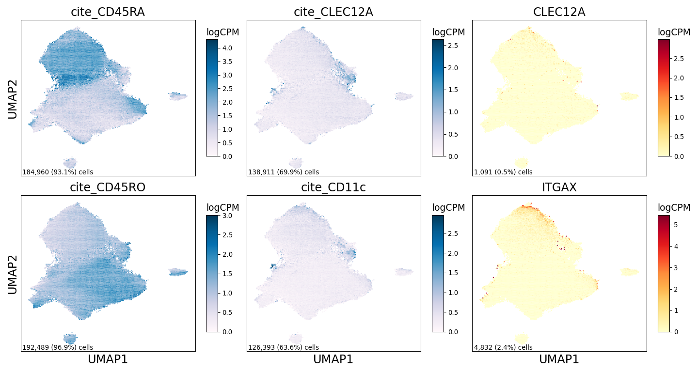

Supplemental CD8 Figure
================

## Set up

Load R libraries

``` r
library(ggplot2)
library(tidyverse)

library(reticulate)
use_python("/projects/home/tlchan/.conda/envs/myenv/bin/python")
```

Load python libraries

``` python
import matplotlib as mpl
import matplotlib.pyplot as plt
import numpy as np
import pandas as pd
import pegasus as pg
import scanpy as sc
```

## Figure 1A

``` python
mpl.rcParams['pdf.fonttype'] = 42

ncol = 3
nrow = 2
genes = ['cite_CD45RA', 'cite_CLEC12A', 'CLEC12A', 'cite_CD45RO', 'cite_CD11c', 'ITGAX']

lineage_data = pg.read_input("/projects/home/tlchan/data_objects/cd8.zarr.zip")

# Get UMAP coordinates for base
umap_coords = pd.DataFrame(lineage_data.obsm['X_umap'], columns=['x', 'y'])
x = umap_coords['x']
y = umap_coords['y']

# Set up figure structure
fig_size = (5 * ncol, 4 * nrow)
fig, axes = plt.subplots(nrows=nrow, ncols=ncol, figsize=fig_size,
                         sharex=True, sharey=True)
ax = axes.ravel()

# Plot for each gene
for num, gene in enumerate(genes):
    # Get counts for each gene
    norm_counts = lineage_data[:, gene].copy().get_matrix('X').todense().transpose()
    norm_counts = np.squeeze(np.asarray(norm_counts))

    if norm_counts.size == 0:  # ie. All empty/zero in sparce matrix
        norm_counts = np.zeros(norm_counts.shape[1])

    # Get n cells and perc cells
    ncells = (norm_counts != 0).sum()
    pcells = ncells / norm_counts.shape[0]

    if gene.startswith('cite_'):
        cmap = 'PuBu'
    else:
        cmap = 'YlOrRd'

    # Create heatmap
    hb = ax[num].hexbin(x=x,
                        y=y,
                        C=norm_counts,
                        cmap=cmap,
                        gridsize=150,
                        edgecolors="none")

    # Add percent expression
    ax[num].annotate(f'{ncells:,} ({pcells:.1%}) cells',
                     xy=(0.01, 0), xycoords='axes fraction',
                     fontsize=10,
                     horizontalalignment='left',
                     verticalalignment='bottom')

    # Add axes and colorbar information
    cb = fig.colorbar(hb, ax=ax[num], shrink=.75, aspect=10)
    cb.ax.set_title('logCPM', loc='left', fontsize=14)
    ax[num].set_title(gene, fontsize=18)
    ax[num].tick_params(left=False, labelleft=False,
                        bottom=False, labelbottom=False)
    if (num + ncol) % ncol == 0:
        # Start of row
        ax[num].set_ylabel('UMAP2', fontsize=18)
    if nrow == 1:
        # Only one row
        ax[num].set_xlabel('UMAP1', fontsize=18)
    elif num > (len(genes) - ncol - 1):
        # Last row if more than one row
        ax[num].set_xlabel('UMAP1', fontsize=18)

    # Rasterize
    ax[num].set_rasterization_zorder(2)

for i in range(len(ax) - (len(ax) - len(genes)), len(ax)):
    ax[i].set_axis_off()
fig.tight_layout()
plt.show()
plt.close()
```

    ## 2024-04-17 16:22:50,865 - pegasusio.readwrite - INFO - zarr file '/projects/home/tlchan/data_objects/cd8.zarr.zip' is loaded.
    ## 2024-04-17 16:22:50,865 - pegasusio.readwrite - INFO - Function 'read_input' finished in 2.00s.



## Figure 1B

``` r
cluster_palette <- list("1" = "#FF0029",
                        "2" = "#377EB8",
                        "3" = "#66A61E",
                        "4" = "#984EA3",
                        "5" = "#00D2D5",
                        "6" = "#FF7F00",
                        "7" = "#AF8D00",
                        "8" = "#7F80CD",
                        "9" = "#B3E900",
                        "10" = "#C42E60",
                        "11" = "#A65628",
                        "12" = "#F781BF",
                        "13" = "#8DD3C7",
                        "14" = "#BEBADA",
                        "15" = "#FB8072"
)

cd8_data <- read.csv('/projects/home/tlchan/projects/ascites/figure_panels/abundance_data/cd8_patient_counts.csv') %>%
    mutate(Cluster = factor(Cluster))


ggplot(cd8_data, aes(x = Patient, y = Count, fill = Cluster)) +
    geom_bar(stat = "identity", position = "fill") +
    theme_classic(base_size = 12) +
    theme(axis.text.x = element_text(angle = 90, vjust = 0.5, hjust = 1)) +
    scale_fill_manual(values = cluster_palette)
```

<!-- -->
