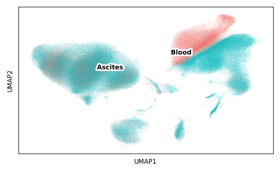

Supplemental Figure 1
================

## Set up

Load R libraries

``` r
library(tidyverse)

library(reticulate)
use_python("/projects/home/tlchan/.conda/envs/myenv/bin/python")

setwd('/projects/home/tlchan/github_code/ascites/functions')
source('plot_dotplot.R')
```

Load python libraries

``` python
import pegasus as pg

import sys
sys.path.append("/projects/home/tlchan/github_code/ascites/functions")
import python_functions
```

## Figure 1C

``` r
lineage_gex <- read.csv('/projects/home/tlchan/projects/ascites/figure_panels/dotplot_data/lineage_gene_exp.csv')
lineage_cite <- read.csv('/projects/home/tlchan/projects/ascites/figure_panels/dotplot_data/lineage_cite_exp.csv')

plot_dotplot(lin_gex = lineage_gex,
             lin_cite = lineage_cite,
             lin = "lineage",
             widths = c(1, .4, .2))
```

<!-- -->

## Figure 1D

``` python
tissue_palette = {
    "Ascites": "#00BFC4",
    "Blood": "#F8766D"
}

tissue_dict = {
    'blood': 'Blood',
    'ascites': 'Ascites'
}

# Load single-cell object
global_data = pg.read_input(
    '/projects/home/tlchan/projects/ascites/second_data_freeze/clusterings/ascites_combo_lineage_R8_300mg_20pm_harm_channel_multi_res/0.9/data/pseudobulk/ascites_combo_lineage_R8_300mg_20pm_harm_channel_0_9_complete_with_pb.zarr.zip')

# Rename labels for plot
pg.annotate(global_data, 'Tissue', 'tissue_type', tissue_dict)

python_functions.plot_umap(lin_data=global_data,
                           color="Tissue",
                           palette=tissue_palette)
```

    ## 2024-06-20 18:55:42,572 - pegasusio.readwrite - INFO - zarr file '/projects/home/tlchan/projects/ascites/second_data_freeze/clusterings/ascites_combo_lineage_R8_300mg_20pm_harm_channel_multi_res/0.9/data/pseudobulk/ascites_combo_lineage_R8_300mg_20pm_harm_channel_0_9_complete_with_pb.zarr.zip' is loaded.
    ## 2024-06-20 18:55:42,572 - pegasusio.readwrite - INFO - Function 'read_input' finished in 10.18s.



## Figure 1E

``` r
lineage_palette <- list("B/Plasma cells" = "#FF0029",
                        "CD4+ T/NK cells" = "#377EB8",
                        "CD8+ T/NK cells" = "#66A61E",
                        "Dendritic cells" = "#984EA3",
                        "Monocytes/Macrophages" = "#00D2D5",
                        "Cancer cells" = "#FF7F00")

global_lineage <- read.csv('/projects/home/tlchan/projects/ascites/figure_panels/abundance_data/global_lineage_counts.csv')
ggplot(global_lineage, aes(x = Patient, y = Count, fill = Lineage)) +
    geom_bar(stat = "identity") +
    theme_classic(base_size = 20) +
    theme(axis.text.x = element_text(angle = 90, vjust = 0.5, hjust = 1)) +
    scale_fill_manual(values = lineage_palette)
```

<!-- -->
