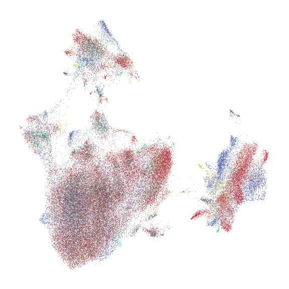
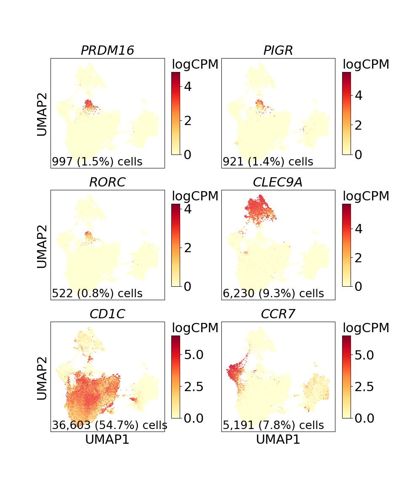

Supplemental Figure 10
================

## Set up

``` r
library(reticulate)
use_python("/projects/home/nealpsmith/software/pegasus_new_py/bin/python")
```

Load python libraries

``` python
import matplotlib.pyplot as plt
import pegasus as pg
```

    ## /projects/home/nealpsmith/R/x86_64-pc-linux-gnu-library/4.2/reticulate/python/rpytools/loader.py:120: UserWarning: pkg_resources is deprecated as an API. See https://setuptools.pypa.io/en/latest/pkg_resources.html. The pkg_resources package is slated for removal as early as 2025-11-30. Refrain from using this package or pin to Setuptools<81.
    ##   return _find_and_load(name, import_)

``` python

import sys
sys.path.append("../../functions")
import python_functions
```

## Supplemental Figure 10A

``` python
dataset_dict = {
    "cancer_discovery": "Primary gastric",
    "gastric": "Ascites (MGH)",
    "ovarian": "Ovarian cancer",
    "peritoneal": "Normal peritoneum",
    "teichmann": "Immune atlas",
    "tonsil": "Tonsil"
}

dataset_palette = {
    "Primary gastric": "#666666",
    "Ascites (MGH)": "#B52025",
    "Ovarian cancer": "#3E52A3",
    "Normal peritoneum": "#5F5B5B",
    "Immune atlas": "#CBCC2C",
    "Tonsil": "#009E73"
}

# Load single-cell object
ext_dc_data = pg.read_input(
    '/projects/home/tlchan/projects/ascites/external_dc_data/clusterings/combo_data_dc_R4_300mg_20pm_harm_dataset_multi_res/1.5/data/pseudobulk/combo_data_dc_R4_300mg_20pm_harm_dataset_1_5_complete_with_pb.zarr.zip')

# Relabel obs for function
pg.annotate(ext_dc_data, 'dataset', 'dataset', dataset_dict)

fig = python_functions.plot_umap(lin_data=ext_dc_data,
                                 color="dataset",
                                 palette=dataset_palette,
                                 legend_loc=None)

plt.show()
# plt.savefig("/projects/home/tlchan/fig_panels/supp_10a.pdf")
plt.close(fig)
```



## Supplemental Figure 10B

``` python
ext_dc_data = pg.read_input(
    "/projects/home/tlchan/projects/ascites/external_dc_data/clusterings/combo_data_dc_R4_300mg_20pm_harm_dataset_multi_res/1.5/data/pseudobulk/combo_data_dc_R4_300mg_20pm_harm_dataset_1_5_complete_with_pb.zarr.zip")

fig = python_functions.plot_feature(lin_data=ext_dc_data,
                                    genes=['PRDM16', 'PIGR', 'RORC', 'CLEC9A', 'CD1C', 'CCR7'],
                                    ncol=2,
                                    nrow=3)

plt.show()
# plt.savefig("/projects/home/tlchan/fig_panels/supp_10b.pdf")
plt.close(fig)
```


