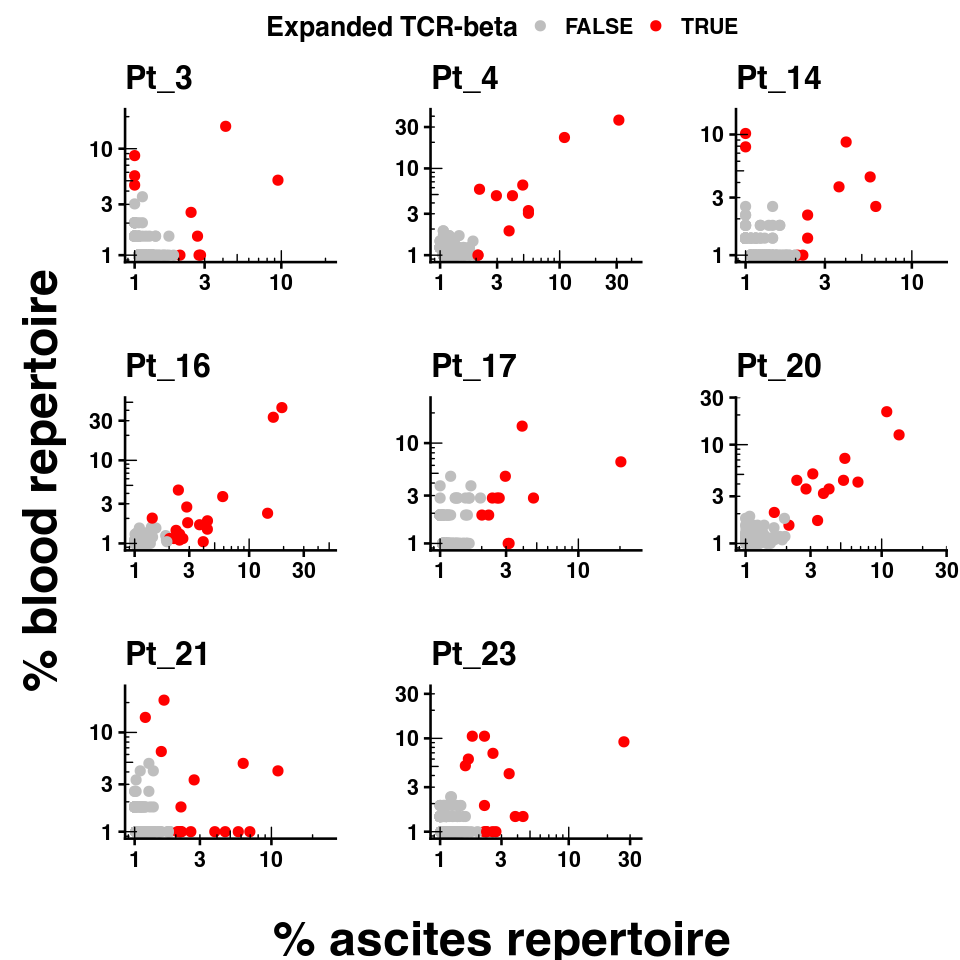
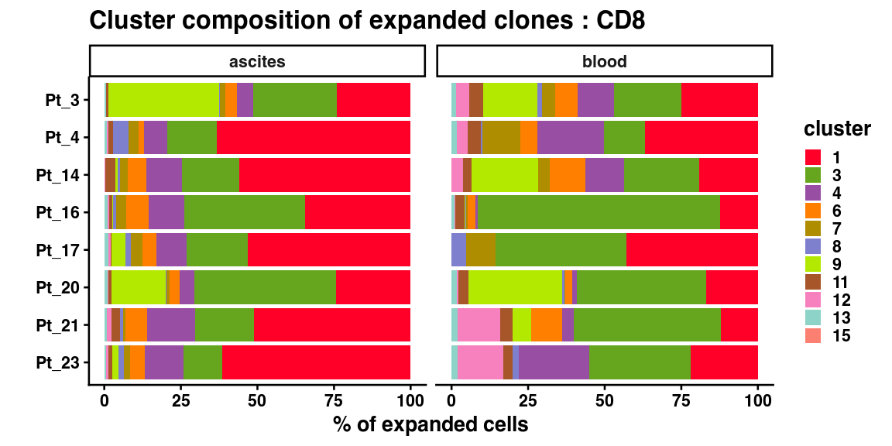
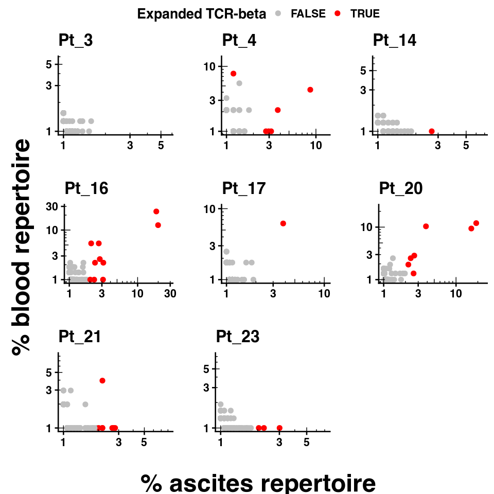
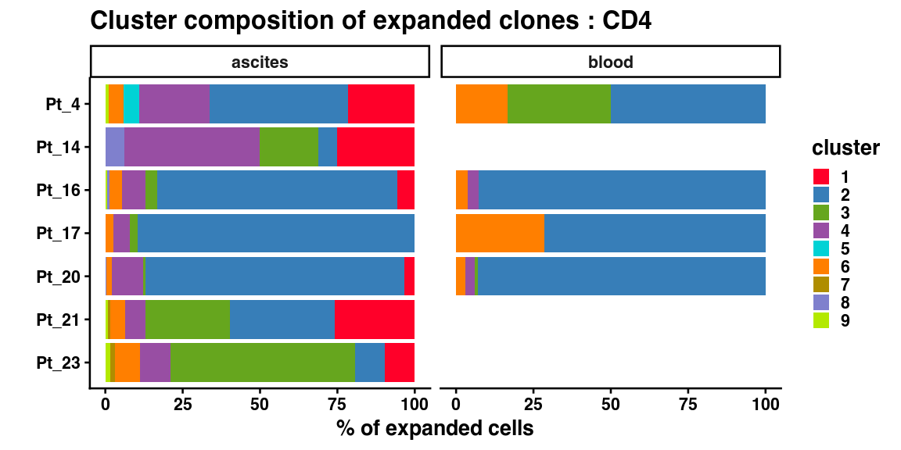

Supplementary Figure 2
================

## Set up

Load R libraries

``` r
library(tidyverse)
library(magrittr)
library(ggplot2)
library(scattermore)
library(glue)
library(gtools)
library(ggpubr)
library(grid)


library(reticulate)
use_python("/projects/home/nealpsmith/software/pegasus_new_py/bin/python")


source('../../functions/plot_abundance.R')
source('../../functions/plot_dotplot.R')
source('../../functions/plot_upset.R')
```

Load python libraries

``` python
import matplotlib.pyplot as plt
import pegasus as pg

import sys
sys.path.append("../../functions")
import python_functions
```

## Supplementary Figure 2A

``` python
cd8_wo_cite_data = pg.read_input("/projects/home/tlchan/projects/ascites/figure_panels/data/data_cite_objects/cd8_wo_cite.zarr.zip")

fig = python_functions.plot_feature(lin_data=cd8_wo_cite_data,
                                    ncol=2,
                                    nrow=2,
                                    genes=["CD14", "cite_CD45RO", "cite_CD14", "cite_CD45RA"])

plt.show()
# plt.savefig("/projects/home/tlchan/fig_panels/supp_2a.pdf")
plt.close(fig)
```


## Supplementary Figure 2B

``` python
cd8_w_cite_data = pg.read_input("/projects/home/tlchan/projects/ascites/figure_panels/data/data_cite_objects/cd8.zarr.zip")

fig = python_functions.plot_feature(lin_data=cd8_w_cite_data,
                                    ncol=2,
                                    nrow=2,
                                    genes=["CD14", "cite_CD45RO", "cite_CD14", "cite_CD45RA"])

plt.show()
# plt.savefig("/projects/home/tlchan/fig_panels/supp_2b.pdf")
plt.close(fig)
```


## Supplementary Figure 2C

``` python
cd8_cluster_palette = {
    "1": "#FF0029",
    "2": "#377EB8",
    "3": "#66A61E",
    "4": "#984EA3",
    "5": "#00D2D5",
    "6": "#FF7F00",
    "7": "#AF8D00",
    "8": "#7F80CD",
    "9": "#B3E900",
    "10": "#C42E60",
    "11": "#A65628",
    "12": "#F781BF",
    "13": "#8DD3C7",
    "14": "#BEBADA",
    "15": "#FB8072",
    '16': '#80B1D3'
}

# Load single-cell object
cd8_data = pg.read_input("/projects/home/nealpsmith/projects/ascites/data/resubmission_objects/ascites_cd8_cite_concat_R7_300mg_20pm_harm_channel_multi_res_with_ilc3.zarr")

pg.umap(cd8_data, rep='pca_cite_concat', min_dist=0.01, spread=2, out_basis='umap_pca_cite_concat')

# Relabel obs for function
cd8_data.obs['Cluster'] = cd8_data.obs['leiden_pca_cite_concat'].cat.remove_unused_categories().astype(str)
cd8_data.obsm['X_umap'] = cd8_data.obsm['X_umap_pca_cite_concat']

fig = python_functions.plot_umap(lin_data=cd8_data,
                                 palette=cd8_cluster_palette,
                                 legend_loc=None,
                                 size=2.5)

plt.show()
# plt.savefig("/projects/home/tlchan/fig_panels/supp_2c.pdf")
plt.close(fig)
```

    ## /projects/home/nealpsmith/software/pegasus_new_py/lib/python3.12/site-packages/pegasusio/zarr_utils.py:79: FutureWarning: The NestedDirectoryStore is deprecated and will be removed in a Zarr-Python version 3, see https://github.com/zarr-developers/zarr-python/issues/1274 for more information.
    ##   self.store = NestedDirectoryStore(path) if os.path.isdir(path) else ZipStore(path, mode = 'r')
    ## /projects/home/nealpsmith/software/pegasus_new_py/lib/python3.12/site-packages/umap/umap_.py:1952: UserWarning: n_jobs value 1 overridden to 1 by setting random_state. Use no seed for parallelism.
    ##   warn(
    ## UMAP(min_dist=0.01, n_jobs=1, precomputed_knn=(array([[     0, 105801, 183088, ..., 1186, 1033, 84],
    ##        [     1, 62754, 5491, ..., 153471, 137615, 126114],
    ##        [     2, 128351, 19013, ..., 140698, 90751, 31027],
    ##        ...,
    ##        [198732, 121304, 138603, ..., 192538, 165780, 136469],
    ##        [198733, 196167, 198698, ..., 135966, 102752, 106768],
    ##        [198734, 193747, 195150, ..., 184096, 198633, 174370]],
    ##       shape=(198735, 15)), array([[0.       , 7.72883  , 7.995438 , ..., 8.498492 , 8.507561 ,
    ##         8.517302 ],
    ##        [0.       , 7.0260644, 7.075279 , ..., 7.624907 , 7.632876 ,
    ##         7.635542 ],
    ##        [0.       , 6.504231 , 6.67443  , ..., 7.28833  , 7.3197527,
    ##         7.340207 ],
    ##        ...,
    ##        [0.       , 6.052602 , 6.205392 , ..., 6.647777 , 6.6582446,
    ##         6.6743097],
    ##        [0.       , 5.4192967, 5.4217973, ..., 5.855055 , 5.8897986,
    ##         5.8933363],
    ##        [0.       , 6.5696397, 6.629439 , ..., 7.5449724, 7.566548 ,
    ##         7.5781484]], shape=(198735, 15), dtype=float32), <pegasus.tools.visualization.DummyNNDescent object at 0x7f4d944f94f0>), random_state=0, spread=2, verbose=True)
    ## Wed Feb 11 17:06:22 2026 Construct fuzzy simplicial set
    ## Wed Feb 11 17:06:23 2026 Construct embedding
    ## Epochs completed:   0%|                                                                                                                                                                                                                        0/200 [00:00] completed  0  /  200 epochs
    ## Epochs completed:   1%| ##1                                                                                                                                                                                                                    2/200 [00:00]Epochs completed:   2%| ####2                                                                                                                                                                                                                  4/200 [00:00]Epochs completed:   2%| #####3                                                                                                                                                                                                                 5/200 [00:01]Epochs completed:   3%| ######4                                                                                                                                                                                                                6/200 [00:01]Epochs completed:   4%| #######4                                                                                                                                                                                                               7/200 [00:01]Epochs completed:   4%| ########5                                                                                                                                                                                                              8/200 [00:02]Epochs completed:   4%| #########6                                                                                                                                                                                                             9/200 [00:02]Epochs completed:   5%| ##########6                                                                                                                                                                                                           10/200 [00:03]Epochs completed:   6%| ###########7                                                                                                                                                                                                          11/200 [00:03]Epochs completed:   6%| ############7                                                                                                                                                                                                         12/200 [00:04]Epochs completed:   6%| #############8                                                                                                                                                                                                        13/200 [00:04]Epochs completed:   7%| ##############9                                                                                                                                                                                                       14/200 [00:05]Epochs completed:   8%| ###############9                                                                                                                                                                                                      15/200 [00:05]Epochs completed:   8%| #################                                                                                                                                                                                                     16/200 [00:06]Epochs completed:   8%| ##################1                                                                                                                                                                                                   17/200 [00:06]Epochs completed:   9%| ###################1                                                                                                                                                                                                  18/200 [00:07]Epochs completed:  10%| ####################2                                                                                                                                                                                                 19/200 [00:07]Epochs completed:  10%| #####################3                                                                                                                                                                                                20/200 [00:08] completed  20  /  200 epochs
    ## Epochs completed:  10%| ######################3                                                                                                                                                                                               21/200 [00:08]Epochs completed:  11%| #######################4                                                                                                                                                                                              22/200 [00:08]Epochs completed:  12%| ########################4                                                                                                                                                                                             23/200 [00:09]Epochs completed:  12%| #########################5                                                                                                                                                                                            24/200 [00:09]Epochs completed:  12%| ##########################6                                                                                                                                                                                           25/200 [00:10]Epochs completed:  13%| ###########################6                                                                                                                                                                                          26/200 [00:10]Epochs completed:  14%| ############################7                                                                                                                                                                                         27/200 [00:11]Epochs completed:  14%| #############################8                                                                                                                                                                                        28/200 [00:11]Epochs completed:  14%| ##############################8                                                                                                                                                                                       29/200 [00:12]Epochs completed:  15%| ###############################9                                                                                                                                                                                      30/200 [00:12]Epochs completed:  16%| #################################                                                                                                                                                                                     31/200 [00:13]Epochs completed:  16%| ##################################                                                                                                                                                                                    32/200 [00:13]Epochs completed:  16%| ###################################1                                                                                                                                                                                  33/200 [00:14]Epochs completed:  17%| ####################################2                                                                                                                                                                                 34/200 [00:14]Epochs completed:  18%| #####################################2                                                                                                                                                                                35/200 [00:14]Epochs completed:  18%| ######################################3                                                                                                                                                                               36/200 [00:15]Epochs completed:  18%| #######################################4                                                                                                                                                                              37/200 [00:15]Epochs completed:  19%| ########################################4                                                                                                                                                                             38/200 [00:16]Epochs completed:  20%| #########################################5                                                                                                                                                                            39/200 [00:16]Epochs completed:  20%| ##########################################6                                                                                                                                                                           40/200 [00:17] completed  40  /  200 epochs
    ## Epochs completed:  20%| ###########################################6                                                                                                                                                                          41/200 [00:17]Epochs completed:  21%| ############################################7                                                                                                                                                                         42/200 [00:18]Epochs completed:  22%| #############################################7                                                                                                                                                                        43/200 [00:18]Epochs completed:  22%| ##############################################8                                                                                                                                                                       44/200 [00:19]Epochs completed:  22%| ###############################################9                                                                                                                                                                      45/200 [00:19]Epochs completed:  23%| ################################################9                                                                                                                                                                     46/200 [00:20]Epochs completed:  24%| ##################################################                                                                                                                                                                    47/200 [00:20]Epochs completed:  24%| ###################################################1                                                                                                                                                                  48/200 [00:21]Epochs completed:  24%| ####################################################1                                                                                                                                                                 49/200 [00:21]Epochs completed:  25%| #####################################################2                                                                                                                                                                50/200 [00:21]Epochs completed:  26%| ######################################################3                                                                                                                                                               51/200 [00:22]Epochs completed:  26%| #######################################################3                                                                                                                                                              52/200 [00:22]Epochs completed:  26%| ########################################################4                                                                                                                                                             53/200 [00:23]Epochs completed:  27%| #########################################################5                                                                                                                                                            54/200 [00:23]Epochs completed:  28%| ##########################################################5                                                                                                                                                           55/200 [00:24]Epochs completed:  28%| ###########################################################6                                                                                                                                                          56/200 [00:24]Epochs completed:  28%| ############################################################7                                                                                                                                                         57/200 [00:25]Epochs completed:  29%| #############################################################7                                                                                                                                                        58/200 [00:25]Epochs completed:  30%| ##############################################################8                                                                                                                                                       59/200 [00:26]Epochs completed:  30%| ###############################################################9                                                                                                                                                      60/200 [00:26] completed  60  /  200 epochs
    ## Epochs completed:  30%| ################################################################9                                                                                                                                                     61/200 [00:27]Epochs completed:  31%| ##################################################################                                                                                                                                                    62/200 [00:27]Epochs completed:  32%| ###################################################################                                                                                                                                                   63/200 [00:28]Epochs completed:  32%| ####################################################################1                                                                                                                                                 64/200 [00:28]Epochs completed:  32%| #####################################################################2                                                                                                                                                65/200 [00:28]Epochs completed:  33%| ######################################################################2                                                                                                                                               66/200 [00:29]Epochs completed:  34%| #######################################################################3                                                                                                                                              67/200 [00:29]Epochs completed:  34%| ########################################################################4                                                                                                                                             68/200 [00:30]Epochs completed:  34%| #########################################################################4                                                                                                                                            69/200 [00:30]Epochs completed:  35%| ##########################################################################5                                                                                                                                           70/200 [00:31]Epochs completed:  36%| ###########################################################################6                                                                                                                                          71/200 [00:31]Epochs completed:  36%| ############################################################################6                                                                                                                                         72/200 [00:32]Epochs completed:  36%| #############################################################################7                                                                                                                                        73/200 [00:32]Epochs completed:  37%| ##############################################################################8                                                                                                                                       74/200 [00:33]Epochs completed:  38%| ###############################################################################8                                                                                                                                      75/200 [00:33]Epochs completed:  38%| ################################################################################9                                                                                                                                     76/200 [00:34]Epochs completed:  38%| ##################################################################################                                                                                                                                    77/200 [00:34]Epochs completed:  39%| ###################################################################################                                                                                                                                   78/200 [00:35]Epochs completed:  40%| ####################################################################################1                                                                                                                                 79/200 [00:35]Epochs completed:  40%| #####################################################################################2                                                                                                                                80/200 [00:35] completed  80  /  200 epochs
    ## Epochs completed:  40%| ######################################################################################2                                                                                                                               81/200 [00:36]Epochs completed:  41%| #######################################################################################3                                                                                                                              82/200 [00:36]Epochs completed:  42%| ########################################################################################3                                                                                                                             83/200 [00:37]Epochs completed:  42%| #########################################################################################4                                                                                                                            84/200 [00:37]Epochs completed:  42%| ##########################################################################################5                                                                                                                           85/200 [00:38]Epochs completed:  43%| ###########################################################################################5                                                                                                                          86/200 [00:38]Epochs completed:  44%| ############################################################################################6                                                                                                                         87/200 [00:39]Epochs completed:  44%| #############################################################################################7                                                                                                                        88/200 [00:39]Epochs completed:  44%| ##############################################################################################7                                                                                                                       89/200 [00:40]Epochs completed:  45%| ###############################################################################################8                                                                                                                      90/200 [00:40]Epochs completed:  46%| ################################################################################################9                                                                                                                     91/200 [00:41]Epochs completed:  46%| #################################################################################################9                                                                                                                    92/200 [00:41]Epochs completed:  46%| ###################################################################################################                                                                                                                   93/200 [00:42]Epochs completed:  47%| ####################################################################################################1                                                                                                                 94/200 [00:42]Epochs completed:  48%| #####################################################################################################1                                                                                                                95/200 [00:42]Epochs completed:  48%| ######################################################################################################2                                                                                                               96/200 [00:43]Epochs completed:  48%| #######################################################################################################3                                                                                                              97/200 [00:43]Epochs completed:  49%| ########################################################################################################3                                                                                                             98/200 [00:44]Epochs completed:  50%| #########################################################################################################4                                                                                                            99/200 [00:44]Epochs completed:  50%| ##########################################################################################################                                                                                                           100/200 [00:45] completed  100  /  200 epochs
    ## Epochs completed:  50%| ###########################################################################################################                                                                                                          101/200 [00:45]Epochs completed:  51%| ############################################################################################################1                                                                                                        102/200 [00:46]Epochs completed:  52%| #############################################################################################################1                                                                                                       103/200 [00:46]Epochs completed:  52%| ##############################################################################################################2                                                                                                      104/200 [00:47]Epochs completed:  52%| ###############################################################################################################3                                                                                                     105/200 [00:47]Epochs completed:  53%| ################################################################################################################3                                                                                                    106/200 [00:48]Epochs completed:  54%| #################################################################################################################4                                                                                                   107/200 [00:48]Epochs completed:  54%| ##################################################################################################################4                                                                                                  108/200 [00:49]Epochs completed:  55%| ###################################################################################################################5                                                                                                 109/200 [00:49]Epochs completed:  55%| ####################################################################################################################6                                                                                                110/200 [00:49]Epochs completed:  56%| #####################################################################################################################6                                                                                               111/200 [00:50]Epochs completed:  56%| ######################################################################################################################7                                                                                              112/200 [00:50]Epochs completed:  56%| #######################################################################################################################7                                                                                             113/200 [00:51]Epochs completed:  57%| ########################################################################################################################8                                                                                            114/200 [00:51]Epochs completed:  57%| #########################################################################################################################9                                                                                           115/200 [00:52]Epochs completed:  58%| ##########################################################################################################################9                                                                                          116/200 [00:52]Epochs completed:  58%| ############################################################################################################################                                                                                         117/200 [00:53]Epochs completed:  59%| #############################################################################################################################                                                                                        118/200 [00:53]Epochs completed:  60%| ##############################################################################################################################1                                                                                      119/200 [00:54]Epochs completed:  60%| ###############################################################################################################################2                                                                                     120/200 [00:54] completed  120  /  200 epochs
    ## Epochs completed:  60%| ################################################################################################################################2                                                                                    121/200 [00:55]Epochs completed:  61%| #################################################################################################################################3                                                                                   122/200 [00:55]Epochs completed:  62%| ##################################################################################################################################3                                                                                  123/200 [00:56]Epochs completed:  62%| ###################################################################################################################################4                                                                                 124/200 [00:56]Epochs completed:  62%| ####################################################################################################################################5                                                                                125/200 [00:56]Epochs completed:  63%| #####################################################################################################################################5                                                                               126/200 [00:57]Epochs completed:  64%| ######################################################################################################################################6                                                                              127/200 [00:57]Epochs completed:  64%| #######################################################################################################################################6                                                                             128/200 [00:58]Epochs completed:  64%| ########################################################################################################################################7                                                                            129/200 [00:58]Epochs completed:  65%| #########################################################################################################################################8                                                                           130/200 [00:59]Epochs completed:  66%| ##########################################################################################################################################8                                                                          131/200 [00:59]Epochs completed:  66%| ###########################################################################################################################################9                                                                         132/200 [01:00]Epochs completed:  66%| ############################################################################################################################################9                                                                        133/200 [01:00]Epochs completed:  67%| ##############################################################################################################################################                                                                       134/200 [01:01]Epochs completed:  68%| ###############################################################################################################################################1                                                                     135/200 [01:01]Epochs completed:  68%| ################################################################################################################################################1                                                                    136/200 [01:02]Epochs completed:  68%| #################################################################################################################################################2                                                                   137/200 [01:02]Epochs completed:  69%| ##################################################################################################################################################2                                                                  138/200 [01:02]Epochs completed:  70%| ###################################################################################################################################################3                                                                 139/200 [01:03]Epochs completed:  70%| ####################################################################################################################################################3                                                                140/200 [01:03] completed  140  /  200 epochs
    ## Epochs completed:  70%| #####################################################################################################################################################4                                                               141/200 [01:04]Epochs completed:  71%| ######################################################################################################################################################5                                                              142/200 [01:04]Epochs completed:  72%| #######################################################################################################################################################5                                                             143/200 [01:05]Epochs completed:  72%| ########################################################################################################################################################6                                                            144/200 [01:05]Epochs completed:  72%| #########################################################################################################################################################7                                                           145/200 [01:06]Epochs completed:  73%| ##########################################################################################################################################################7                                                          146/200 [01:06]Epochs completed:  74%| ###########################################################################################################################################################8                                                         147/200 [01:07]Epochs completed:  74%| ############################################################################################################################################################8                                                        148/200 [01:07]Epochs completed:  74%| #############################################################################################################################################################9                                                       149/200 [01:08]Epochs completed:  75%| ###############################################################################################################################################################                                                      150/200 [01:08]Epochs completed:  76%| ################################################################################################################################################################                                                     151/200 [01:09]Epochs completed:  76%| #################################################################################################################################################################1                                                   152/200 [01:09]Epochs completed:  76%| ##################################################################################################################################################################1                                                  153/200 [01:09]Epochs completed:  77%| ###################################################################################################################################################################2                                                 154/200 [01:10]Epochs completed:  78%| ####################################################################################################################################################################3                                                155/200 [01:10]Epochs completed:  78%| #####################################################################################################################################################################3                                               156/200 [01:11]Epochs completed:  78%| ######################################################################################################################################################################4                                              157/200 [01:11]Epochs completed:  79%| #######################################################################################################################################################################4                                             158/200 [01:12]Epochs completed:  80%| ########################################################################################################################################################################5                                            159/200 [01:12]Epochs completed:  80%| #########################################################################################################################################################################6                                           160/200 [01:13] completed  160  /  200 epochs
    ## Epochs completed:  80%| ##########################################################################################################################################################################6                                          161/200 [01:13]Epochs completed:  81%| ###########################################################################################################################################################################7                                         162/200 [01:14]Epochs completed:  82%| ############################################################################################################################################################################7                                        163/200 [01:14]Epochs completed:  82%| #############################################################################################################################################################################8                                       164/200 [01:15]Epochs completed:  82%| ##############################################################################################################################################################################8                                      165/200 [01:15]Epochs completed:  83%| ###############################################################################################################################################################################9                                     166/200 [01:16]Epochs completed:  84%| #################################################################################################################################################################################                                    167/200 [01:16]Epochs completed:  84%| ##################################################################################################################################################################################                                   168/200 [01:16]Epochs completed:  84%| ###################################################################################################################################################################################1                                 169/200 [01:17]Epochs completed:  85%| ####################################################################################################################################################################################2                                170/200 [01:17]Epochs completed:  86%| #####################################################################################################################################################################################2                               171/200 [01:18]Epochs completed:  86%| ######################################################################################################################################################################################3                              172/200 [01:18]Epochs completed:  86%| #######################################################################################################################################################################################3                             173/200 [01:19]Epochs completed:  87%| ########################################################################################################################################################################################4                            174/200 [01:19]Epochs completed:  88%| #########################################################################################################################################################################################5                           175/200 [01:20]Epochs completed:  88%| ##########################################################################################################################################################################################5                          176/200 [01:20]Epochs completed:  88%| ###########################################################################################################################################################################################6                         177/200 [01:21]Epochs completed:  89%| ############################################################################################################################################################################################6                        178/200 [01:21]Epochs completed:  90%| #############################################################################################################################################################################################7                       179/200 [01:22]Epochs completed:  90%| ##############################################################################################################################################################################################8                      180/200 [01:22] completed  180  /  200 epochs
    ## Epochs completed:  90%| ###############################################################################################################################################################################################8                     181/200 [01:23]Epochs completed:  91%| ################################################################################################################################################################################################9                    182/200 [01:23]Epochs completed:  92%| #################################################################################################################################################################################################9                   183/200 [01:23]Epochs completed:  92%| ###################################################################################################################################################################################################                  184/200 [01:24]Epochs completed:  92%| ####################################################################################################################################################################################################1                185/200 [01:24]Epochs completed:  93%| #####################################################################################################################################################################################################1               186/200 [01:25]Epochs completed:  94%| ######################################################################################################################################################################################################2              187/200 [01:25]Epochs completed:  94%| #######################################################################################################################################################################################################2             188/200 [01:26]Epochs completed:  94%| ########################################################################################################################################################################################################3            189/200 [01:26]Epochs completed:  95%| #########################################################################################################################################################################################################3           190/200 [01:27]Epochs completed:  96%| ##########################################################################################################################################################################################################4          191/200 [01:27]Epochs completed:  96%| ###########################################################################################################################################################################################################5         192/200 [01:28]Epochs completed:  96%| ############################################################################################################################################################################################################5        193/200 [01:28]Epochs completed:  97%| #############################################################################################################################################################################################################6       194/200 [01:29]Epochs completed:  98%| ##############################################################################################################################################################################################################7      195/200 [01:29]Epochs completed:  98%| ###############################################################################################################################################################################################################7     196/200 [01:30]Epochs completed:  98%| ################################################################################################################################################################################################################8    197/200 [01:30]Epochs completed:  99%| #################################################################################################################################################################################################################8   198/200 [01:30]Epochs completed: 100%| ##################################################################################################################################################################################################################9  199/200 [01:31]Epochs completed: 100%| #################################################################################################################################################################################################################### 200/200 [01:31]Epochs completed: 100%| #################################################################################################################################################################################################################### 200/200 [01:31]
    ## Wed Feb 11 17:08:09 2026 Finished embedding


## Supplementary Figure 2D

``` r
cd8_gex <- read.csv('/projects/home/nealpsmith/projects/ascites/figures/resubmission/dotplot_data/cd8_gene_exp.csv')
cd8_cite <- read.csv('/projects/home/nealpsmith/projects/ascites/figures/resubmission/dotplot_data/cd8_cite_exp.csv')

plot_dotplot(lin_gex = cd8_gex,
             lin_cite = cd8_cite,
             lin = "cd8",
             widths = c(1.0, 0.3, 0.2),
             cluster_order = c("1. CD8 T: GZMK, cite_CD8", "3. CD8 T: ZNF683, GZMB", "4. CD8 T: PDCD1, CXCL13",
                               "6. CD8 T: SYNE1, IKZF1", "7. CD8 T: IL7R, cite_CD45RO", "8. CD8 T: high mito",
                               "9. CD8 T: KIR2DL3, IKZF2", "11. CD8 T: CD14-lo, cite_CD14",
                               "15. CD8 T: CCR7, cite_CD62L", "12. CD8 T/NK: cycling", "13. CD8 T/NK: high cite",
                               "10. Vγ9Vδ2 T cells: cite_TCR-Vdelta2", "2. NK: CX3CR1, cite_CD16",
                               "5. NK: XCL1, cite_CD56", "14. NK: NR4A2, TNF", "16. ILC3: RORC, IL7R"))
```

<!-- -->

``` r
ggsave("/projects/home/nealpsmith/projects/ascites/figures/resubmission/fig_panels/fig_s2d.pdf", width = 16, height = 8)
```

## Supplementary Figure 2E

``` r
plot_cluster_abundance(lin = "cd8",
                       cluster_order = c('1', '3', '4', '6', '7', '8', '9', '11', '15', '12', '13', '10', '2', '5', '14', '16'))
```

<!-- -->

``` r
# ggsave("/projects/home/tlchan/fig_panels/supp_2e.pdf", width = 7, height = 8)
```

## Supplementary Figure 2G

``` r
data <- read.csv("/projects/home/nealpsmith/projects/ascites/data/updated_cd8_data_with_tcr_obs.csv.gz")
data$leiden_pca_cite_concat <- as.character(data$leiden_pca_cite_concat)
data$leiden_pca_cite_concat <- factor(data$leiden_pca_cite_concat, levels = mixedsort(unique(data$leiden_pca_cite_concat)))

# Also get the paper IDs
paper_ids <- read.csv("/projects/home/nealpsmith/projects/ascites/data/patient_paper_ids.csv")
data %<>% dplyr::left_join(paper_ids, by = "patient_id")
nk_clusters <- c("2", "5", "10", "14")

tcr_freqs <- data %>%
  dplyr::select(paper_id, patient_id,tissue_type, TRB_cdr3) %>%
  dplyr::filter(TRB_cdr3 != "") %>%
  group_by(paper_id, patient_id,tissue_type, TRB_cdr3) %>%
  summarise(n_cells = n()) %>%
  group_by(paper_id, patient_id,tissue_type) %>%
  mutate(total_cells = sum(n_cells)) %>%
  mutate(perc_repertoire = n_cells / total_cells * 100) %>%
  mutate(expanded_t = ifelse(perc_repertoire > 1 & n_cells > 5,TRUE, FALSE))

expanded_tcrs <- tcr_freqs %>%
  dplyr::filter(expanded_t == TRUE) %>%
  dplyr::select(patient_id, paper_id, tissue_type, TRB_cdr3, expanded_t)


## Which donors are in B1? ##
pbmc_b1_patients <- data %>%
  dplyr::select(Channel, paper_id) %>%
  dplyr::filter(Channel == "ASC_PBMC_B1_A") %>%
  distinct() %>%
  .$paper_id

plot_list <- lapply(gtools::mixedsort(pbmc_b1_patients), function(p){
  plot_df <- data %>%
    dplyr::filter(paper_id == p, TRB_cdr3 != "") %>%
    dplyr::select(tissue_type, TRB_cdr3) %>%
    group_by(tissue_type, TRB_cdr3) %>%
    summarise(n_cells = n()) %>%
    ungroup() %>%
    complete(tissue_type, TRB_cdr3, fill = list("n_cells" = 0)) %>%
    group_by(tissue_type) %>%
    mutate(total_cells = sum(n_cells)) %>%
    mutate(perc_cells = n_cells / total_cells * 100) %>%
    reshape2::dcast(TRB_cdr3~tissue_type, value.var = "perc_cells")
  pt_expanded <- expanded_tcrs %>% dplyr::filter(paper_id == p) %>% .$TRB_cdr3
  plot_df$is_expanded <- ifelse(plot_df$TRB_cdr3 %in% pt_expanded, TRUE, FALSE)
  max_val <- max(c(plot_df$ascites, plot_df$blood))
  plot <- ggplot(plot_df, aes(x = ascites+1, y = blood+1, color = is_expanded)) +
    geom_point() +
    scale_color_manual(name = "Expanded TCR-beta", values = c("grey", "red")) +
    ggtitle(p) +
    xlab("") +
    ylab("") +
    # geom_abline(slope = 1, intercept = 1, linetype = "dashed", color = "red") +
    # scale_x_continuous(limits = c(0, max_val + 5)) +
    # scale_y_continuous(limits = c(0, max_val + 5)) +
    scale_x_log10(limits = c(1, max_val + 5)) +
    scale_y_log10(limits = c(1, max_val + 5)) +
    annotation_logticks() +
    theme_classic(base_size = 20)
  return(plot)

})

figure <- ggarrange(plotlist = plot_list, common.legend = TRUE)
annotate_figure(figure, left = textGrob("% blood repertoire", rot = 90, vjust = 1, gp = gpar(cex = 3)),
                    bottom = textGrob("% ascites repertoire", gp = gpar(cex = 3)))
```

<!-- -->

## Supplemental figure 2H

``` r
cd8_cluster_palette = c(
    "1"= "#FF0029",
    "2"= "#377EB8",
    "3"= "#66A61E",
    "4"= "#984EA3",
    "5"= "#00D2D5",
    "6"= "#FF7F00",
    "7"= "#AF8D00",
    "8"= "#7F80CD",
    "9"= "#B3E900",
    "10"= "#C42E60",
    "11"= "#A65628",
    "12"= "#F781BF",
    "13"= "#8DD3C7",
    "14"= "#BEBADA",
    "15"= "#FB8072"
)


data %<>%
  dplyr::left_join(expanded_tcrs, by = c("patient_id", "paper_id", "tissue_type", "TRB_cdr3"))

exp_clone_clust_comp <- data %>%
  dplyr::filter(expanded_t == TRUE) %>%
  dplyr::filter(!leiden_pca_cite_concat %in% nk_clusters) %>%
  dplyr::select(paper_id, tissue_type, TRB_cdr3, leiden_pca_cite_concat) %>%
  dplyr::group_by(paper_id, tissue_type, leiden_pca_cite_concat) %>%
  summarise(n_cells = n()) %>%
  group_by(paper_id, tissue_type) %>%
  mutate(total_cells = sum(n_cells)) %>%
  mutate(perc_cells = n_cells / total_cells * 100)
exp_clone_clust_comp$paper_id <- factor(exp_clone_clust_comp$paper_id, levels = rev(gtools::mixedsort(unique(exp_clone_clust_comp$paper_id))))

ggplot(exp_clone_clust_comp %>% dplyr::filter(paper_id %in% pbmc_b1_patients),
       aes(x = perc_cells, y = paper_id, fill = leiden_pca_cite_concat)) +
  geom_bar(stat = "identity", position = "stack") +
  scale_fill_manual(values = cd8_cluster_palette, name = "cluster") +
  facet_wrap(~tissue_type) +
  ggtitle("Cluster composition of expanded clones : CD8") +
  xlab("% of expanded cells") +
  ylab("") +
  theme_classic(base_size = 20)
```

<!-- -->

## Supplemental figure 2I

``` r
cd4_data <- read.csv("/projects/home/nealpsmith/projects/ascites/data/updated_cd4_data_with_tcr_obs.csv.gz")
cd4_data$leiden_pca_cite_concat <- as.character(cd4_data$leiden_pca_cite_concat)
cd4_data$leiden_pca_cite_concat <- factor(cd4_data$leiden_pca_cite_concat, levels = mixedsort(unique(cd4_data$leiden_pca_cite_concat)))
cd4_data %<>% dplyr::left_join(paper_ids, by = "patient_id")

tcr_freqs <- cd4_data %>%
  dplyr::select(paper_id, patient_id,tissue_type, TRB_cdr3) %>%
  dplyr::filter(TRB_cdr3 != "") %>%
  group_by(paper_id, patient_id,tissue_type, TRB_cdr3) %>%
  summarise(n_cells = n()) %>%
  group_by(paper_id, patient_id,tissue_type) %>%
  mutate(total_cells = sum(n_cells)) %>%
  mutate(perc_repertoire = n_cells / total_cells * 100) %>%
  mutate(expanded_t = ifelse(perc_repertoire > 1 & n_cells > 5,TRUE, FALSE))

expanded_tcrs_cd4 <- tcr_freqs %>%
  dplyr::filter(expanded_t == TRUE) %>%
  dplyr::select(patient_id, paper_id, tissue_type, TRB_cdr3, expanded_t)

cd4_data %<>%
  dplyr::left_join(expanded_tcrs_cd4, by = c("patient_id", "paper_id", "tissue_type", "TRB_cdr3"))

pbmc_b1_patients <- cd4_data %>%
  dplyr::select(Channel, paper_id) %>%
  dplyr::filter(Channel == "ASC_PBMC_B1_A") %>%
  distinct() %>%
  .$paper_id


plot_list <- lapply(gtools::mixedsort(pbmc_b1_patients), function(p){
  plot_df <- cd4_data %>%
    dplyr::filter(paper_id == p, TRB_cdr3 != "") %>%
    dplyr::select(tissue_type, TRB_cdr3) %>%
    group_by(tissue_type, TRB_cdr3) %>%
    summarise(n_cells = n()) %>%
    ungroup() %>%
    complete(tissue_type, TRB_cdr3, fill = list("n_cells" = 0)) %>%
    group_by(tissue_type) %>%
    mutate(total_cells = sum(n_cells)) %>%
    mutate(perc_cells = n_cells / total_cells * 100) %>%
    reshape2::dcast(TRB_cdr3~tissue_type, value.var = "perc_cells")
  pt_expanded <- expanded_tcrs_cd4 %>% dplyr::filter(paper_id == p) %>% .$TRB_cdr3
  plot_df$is_expanded <- ifelse(plot_df$TRB_cdr3 %in% pt_expanded, TRUE, FALSE)
  max_val <- max(c(plot_df$ascites, plot_df$blood))
  plot_df$is_expanded <- factor(plot_df$is_expanded, levels = c(FALSE, TRUE))
  plot <- ggplot(plot_df, aes(x = ascites+1, y = blood+1, color = is_expanded)) +
    geom_point(show.legend = TRUE) +
    scale_color_manual(name = "Expanded TCR-beta", values = c("grey", "red"), drop = FALSE) +
    ggtitle(p) +
    xlab("") +
    ylab("") +
    # geom_abline(slope = 1, intercept = 1, linetype = "dashed", color = "red") +
    # scale_x_continuous(limits = c(0, max_val + 5)) +
    # scale_y_continuous(limits = c(0, max_val + 5)) +
    scale_x_log10(limits = c(1, max_val + 5)) +
    scale_y_log10(limits = c(1, max_val + 5)) +
    annotation_logticks() +
    theme_classic(base_size = 20)
  return(plot)

})

figure <- ggarrange(plotlist = plot_list, common.legend = TRUE)
annotate_figure(figure, left = textGrob("% blood repertoire", rot = 90, vjust = 1, gp = gpar(cex = 3)),
                    bottom = textGrob("% ascites repertoire", gp = gpar(cex = 3)))
```

<!-- -->

## Supplemental figure 2J

``` r
exp_clone_clust_comp_cd4 <- cd4_data %>%
  dplyr::filter(expanded_t == TRUE) %>%
  dplyr::select(paper_id, tissue_type, TRB_cdr3, leiden_pca_cite_concat) %>%
  dplyr::group_by(paper_id, tissue_type, leiden_pca_cite_concat) %>%
  summarise(n_cells = n()) %>%
  group_by(paper_id, tissue_type) %>%
  mutate(total_cells = sum(n_cells)) %>%
  mutate(perc_cells = n_cells / total_cells * 100)
exp_clone_clust_comp_cd4$paper_id <- factor(exp_clone_clust_comp_cd4$paper_id, levels = rev(gtools::mixedsort(unique(exp_clone_clust_comp_cd4$paper_id))))

ggplot(exp_clone_clust_comp_cd4 %>% dplyr::filter(paper_id %in% pbmc_b1_patients),
       aes(x = perc_cells, y = paper_id, fill = leiden_pca_cite_concat)) +
  geom_bar(stat = "identity", position = "stack") +
  scale_fill_manual(values = cd8_cluster_palette, name = "cluster") + # Same as CD8
  facet_wrap(~tissue_type) +
  ggtitle("Cluster composition of expanded clones : CD4") +
  xlab("% of expanded cells") +
  ylab("") +
  theme_classic(base_size = 20)
```

<!-- -->
