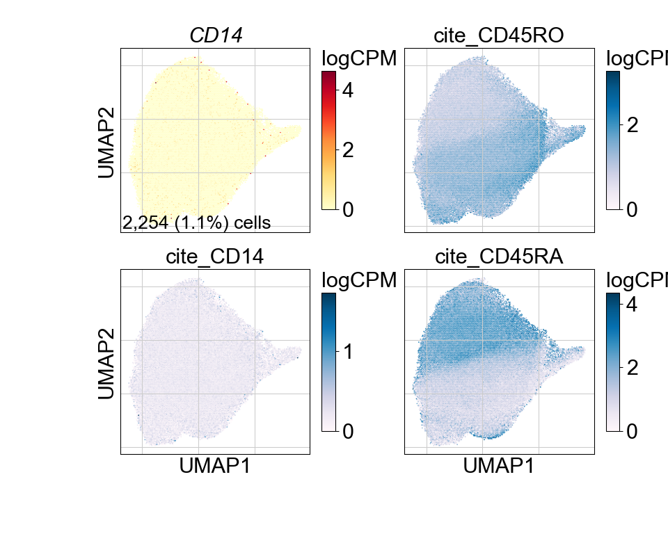
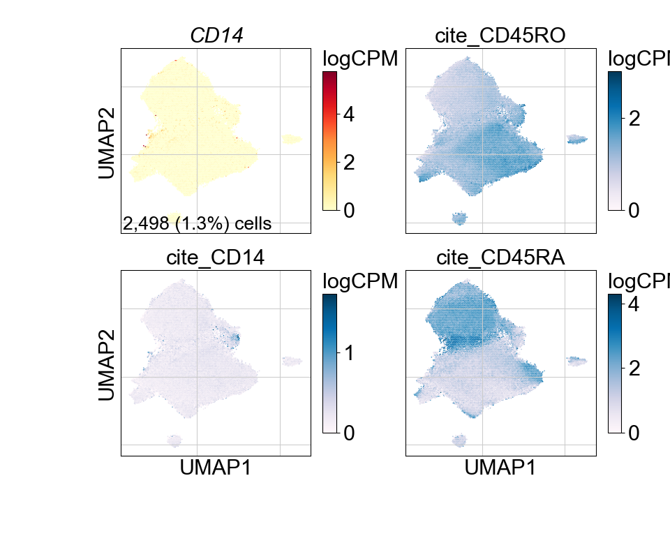
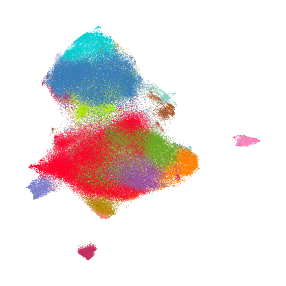
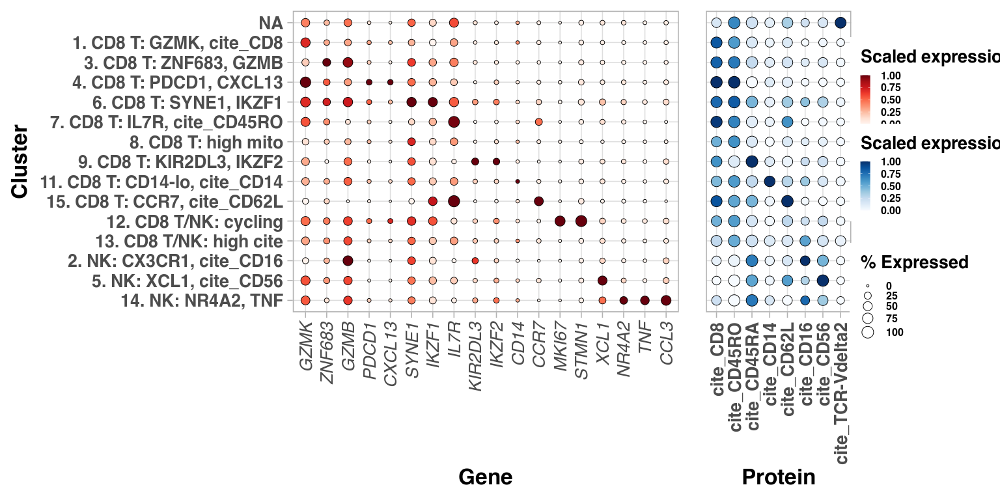
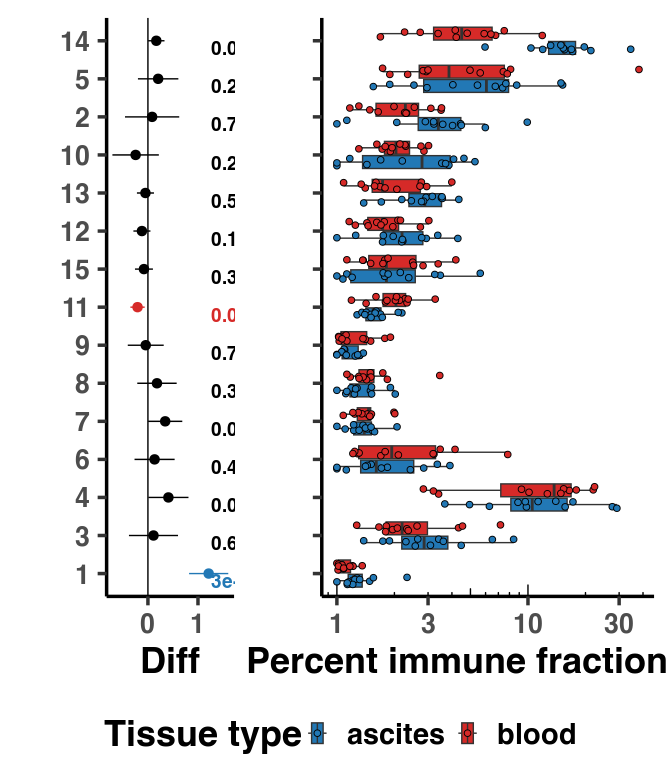
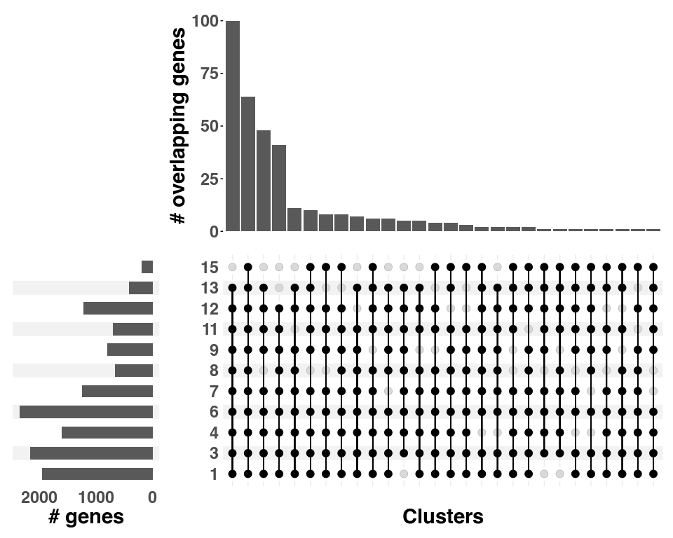
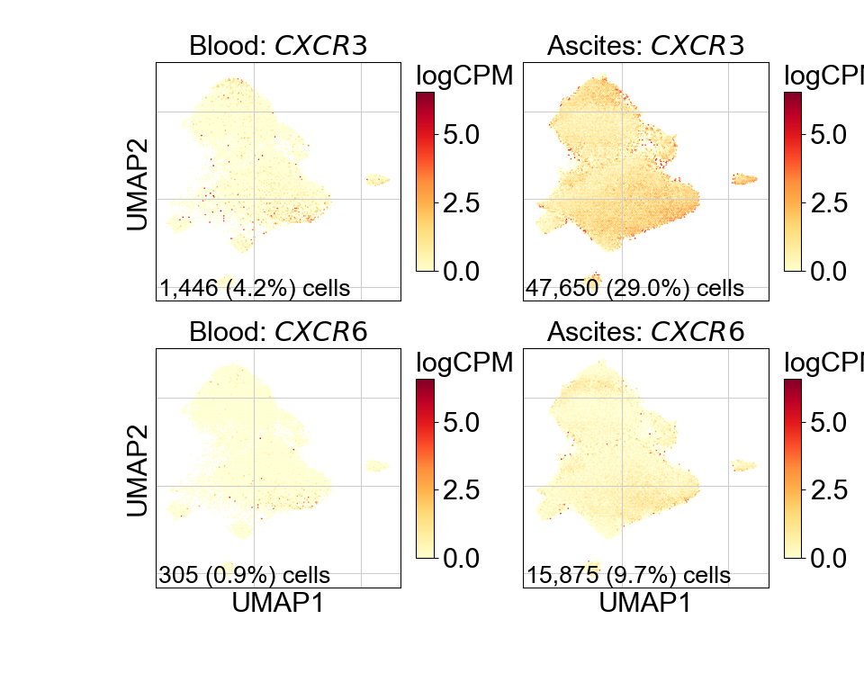

Supplementary Figure 2
================

## Set up

Load R libraries

``` r
library(reticulate)
use_python("/projects/home/tlchan/.conda/envs/myenv/bin/python")

setwd('/projects/home/tlchan/github_code/ascites/functions')
source('plot_abundance.R')
source('plot_dotplot.R')
source('plot_upset.R')
```

Load python libraries

``` python
import matplotlib.pyplot as plt
import pegasus as pg

import sys
sys.path.append("/projects/home/tlchan/github_code/ascites/functions")
import python_functions
```

## Supplementary Figure 2A

``` python
cd8_wo_cite_data = pg.read_input("/projects/home/tlchan/projects/ascites/figure_panels/data/data_cite_objects/cd8_wo_cite.zarr.zip")

fig = python_functions.plot_feature(lin_data=cd8_wo_cite_data,
                                    ncol=2,
                                    nrow=2,
                                    genes=["CD14", "cite_CD45RO", "cite_CD14", "cite_CD45RA"])

plt.show()
# plt.savefig("/projects/home/tlchan/fig_panels/supp_2a.pdf")
plt.close(fig)
```



## Supplementary Figure 2B

``` python
cd8_w_cite_data = pg.read_input("/projects/home/tlchan/projects/ascites/figure_panels/data/data_cite_objects/cd8.zarr.zip")

fig = python_functions.plot_feature(lin_data=cd8_w_cite_data,
                                    ncol=2,
                                    nrow=2,
                                    genes=["CD14", "cite_CD45RO", "cite_CD14", "cite_CD45RA"])

plt.show()
# plt.savefig("/projects/home/tlchan/fig_panels/supp_2b.pdf")
plt.close(fig)
```



## Supplementary Figure 2C

``` python
cd8_cluster_palette = {
    "1": "#FF0029",
    "2": "#377EB8",
    "3": "#66A61E",
    "4": "#984EA3",
    "5": "#00D2D5",
    "6": "#FF7F00",
    "7": "#AF8D00",
    "8": "#7F80CD",
    "9": "#B3E900",
    "10": "#C42E60",
    "11": "#A65628",
    "12": "#F781BF",
    "13": "#8DD3C7",
    "14": "#BEBADA",
    "15": "#FB8072"
}

# Load single-cell object
cd8_data = pg.read_input(
    '/projects/home/tlchan/projects/ascites/integrated_data/clusterings/ascites_cd8_cite_concat_R7_300mg_20pm_harm_channel_multi_res/1.9/data/pseudobulk/ascites_cd8_cite_concat_R7_300mg_20pm_harm_channel_1_9_complete_with_pb.zarr.zip')

pg.umap(cd8_data, rep='pca_cite_concat', min_dist=0.01, spread=2, out_basis='umap_pca_cite_concat')

# Relabel obs for function
cd8_data.obs['Cluster'] = cd8_data.obs['leiden_pca_cite_concat'].cat.remove_unused_categories().astype(str)
cd8_data.obsm['X_umap'] = cd8_data.obsm['X_umap_pca_cite_concat']

fig = python_functions.plot_umap(lin_data=cd8_data,
                                 palette=cd8_cluster_palette,
                                 legend_loc=None,
                                 size=2.5)

plt.show()
# plt.savefig("/projects/home/tlchan/fig_panels/supp_2c.pdf")
plt.close(fig)
```

    ## /projects/home/tlchan/.local/lib/python3.9/site-packages/umap/umap_.py:1943: UserWarning: n_jobs value -1 overridden to 1 by setting random_state. Use no seed for parallelism.
    ##   warn(f"n_jobs value {self.n_jobs} overridden to 1 by setting random_state. Use no seed for parallelism.")
    ## UMAP(min_dist=0.01, precomputed_knn=(array([[     0, 105801, 183088, ..., 1186, 1033, 84],
    ##        [     1, 62754, 5491, ..., 153471, 137615, 126114],
    ##        [     2, 128351, 19013, ..., 140698, 90751, 31027],
    ##        ...,
    ##        [198732, 121304, 138603, ..., 192538, 165780, 136469],
    ##        [198733, 196167, 198698, ..., 135966, 102752, 106768],
    ##        [198734, 193747, 195150, ..., 184096, 198633, 174370]]), array([[0.       , 7.72883  , 7.995438 , ..., 8.498492 , 8.507561 ,
    ##         8.517302 ],
    ##        [0.       , 7.0260644, 7.075279 , ..., 7.624907 , 7.632876 ,
    ##         7.635542 ],
    ##        [0.       , 6.504231 , 6.67443  , ..., 7.28833  , 7.3197527,
    ##         7.340207 ],
    ##        ...,
    ##        [0.       , 6.052602 , 6.205392 , ..., 6.647777 , 6.6582446,
    ##         6.6743097],
    ##        [0.       , 5.4192967, 5.4217973, ..., 5.855055 , 5.8897986,
    ##         5.8933363],
    ##        [0.       , 6.5696397, 6.629439 , ..., 7.5449724, 7.566548 ,
    ##         7.5781484]], dtype=float32), <pegasus.tools.visualization.DummyNNDescent object at 0x7f8fe3256fa0>), random_state=0, spread=2, verbose=True)
    ## Sat Jun  7 04:08:29 2025 Construct fuzzy simplicial set
    ## Sat Jun  7 04:08:29 2025 Construct embedding
    ## Epochs completed:   0%|            0/200 [00:00] completed  0  /  200 epochs
    ## Epochs completed:   0%|            1/200 [00:00]Epochs completed:   1%| 1          2/200 [00:00]Epochs completed:   2%| 1          3/200 [00:00]Epochs completed:   2%| 2          4/200 [00:01]Epochs completed:   2%| 2          5/200 [00:01]Epochs completed:   3%| 3          6/200 [00:02]Epochs completed:   4%| 3          7/200 [00:02]Epochs completed:   4%| 4          8/200 [00:03]Epochs completed:   4%| 4          9/200 [00:03]Epochs completed:   5%| 5          10/200 [00:03]Epochs completed:   6%| 5          11/200 [00:04]Epochs completed:   6%| 6          12/200 [00:04]Epochs completed:   6%| 6          13/200 [00:05]Epochs completed:   7%| 7          14/200 [00:05]Epochs completed:   8%| 7          15/200 [00:06]Epochs completed:   8%| 8          16/200 [00:06]Epochs completed:   8%| 8          17/200 [00:07]Epochs completed:   9%| 9          18/200 [00:07]Epochs completed:  10%| 9          19/200 [00:08]Epochs completed:  10%| #          20/200 [00:08]  completed  20  /  200 epochs
    ## Epochs completed:  10%| #          21/200 [00:09]Epochs completed:  11%| #1         22/200 [00:09]Epochs completed:  12%| #1         23/200 [00:09]Epochs completed:  12%| #2         24/200 [00:10]Epochs completed:  12%| #2         25/200 [00:10]Epochs completed:  13%| #3         26/200 [00:11]Epochs completed:  14%| #3         27/200 [00:11]Epochs completed:  14%| #4         28/200 [00:12]Epochs completed:  14%| #4         29/200 [00:12]Epochs completed:  15%| #5         30/200 [00:13]Epochs completed:  16%| #5         31/200 [00:13]Epochs completed:  16%| #6         32/200 [00:14]Epochs completed:  16%| #6         33/200 [00:14]Epochs completed:  17%| #7         34/200 [00:15]Epochs completed:  18%| #7         35/200 [00:15]Epochs completed:  18%| #8         36/200 [00:15]Epochs completed:  18%| #8         37/200 [00:16]Epochs completed:  19%| #9         38/200 [00:16]Epochs completed:  20%| #9         39/200 [00:17]Epochs completed:  20%| ##         40/200 [00:17] completed  40  /  200 epochs
    ## Epochs completed:  20%| ##         41/200 [00:18]Epochs completed:  21%| ##1        42/200 [00:18]Epochs completed:  22%| ##1        43/200 [00:19]Epochs completed:  22%| ##2        44/200 [00:19]Epochs completed:  22%| ##2        45/200 [00:20]Epochs completed:  23%| ##3        46/200 [00:20]Epochs completed:  24%| ##3        47/200 [00:21]Epochs completed:  24%| ##4        48/200 [00:21]Epochs completed:  24%| ##4        49/200 [00:22]Epochs completed:  25%| ##5        50/200 [00:22]Epochs completed:  26%| ##5        51/200 [00:22]Epochs completed:  26%| ##6        52/200 [00:23]Epochs completed:  26%| ##6        53/200 [00:23]Epochs completed:  27%| ##7        54/200 [00:24]Epochs completed:  28%| ##7        55/200 [00:24]Epochs completed:  28%| ##8        56/200 [00:25]Epochs completed:  28%| ##8        57/200 [00:25]Epochs completed:  29%| ##9        58/200 [00:26]Epochs completed:  30%| ##9        59/200 [00:26]Epochs completed:  30%| ###        60/200 [00:27] completed  60  /  200 epochs
    ## Epochs completed:  30%| ###        61/200 [00:27]Epochs completed:  31%| ###1       62/200 [00:28]Epochs completed:  32%| ###1       63/200 [00:28]Epochs completed:  32%| ###2       64/200 [00:28]Epochs completed:  32%| ###2       65/200 [00:29]Epochs completed:  33%| ###3       66/200 [00:29]Epochs completed:  34%| ###3       67/200 [00:30]Epochs completed:  34%| ###4       68/200 [00:30]Epochs completed:  34%| ###4       69/200 [00:31]Epochs completed:  35%| ###5       70/200 [00:31]Epochs completed:  36%| ###5       71/200 [00:32]Epochs completed:  36%| ###6       72/200 [00:32]Epochs completed:  36%| ###6       73/200 [00:33]Epochs completed:  37%| ###7       74/200 [00:33]Epochs completed:  38%| ###7       75/200 [00:34]Epochs completed:  38%| ###8       76/200 [00:34]Epochs completed:  38%| ###8       77/200 [00:34]Epochs completed:  39%| ###9       78/200 [00:35]Epochs completed:  40%| ###9       79/200 [00:35]Epochs completed:  40%| ####       80/200 [00:36] completed  80  /  200 epochs
    ## Epochs completed:  40%| ####       81/200 [00:36]Epochs completed:  41%| ####1      82/200 [00:37]Epochs completed:  42%| ####1      83/200 [00:37]Epochs completed:  42%| ####2      84/200 [00:38]Epochs completed:  42%| ####2      85/200 [00:38]Epochs completed:  43%| ####3      86/200 [00:39]Epochs completed:  44%| ####3      87/200 [00:39]Epochs completed:  44%| ####4      88/200 [00:40]Epochs completed:  44%| ####4      89/200 [00:40]Epochs completed:  45%| ####5      90/200 [00:41]Epochs completed:  46%| ####5      91/200 [00:41]Epochs completed:  46%| ####6      92/200 [00:41]Epochs completed:  46%| ####6      93/200 [00:42]Epochs completed:  47%| ####6      94/200 [00:42]Epochs completed:  48%| ####7      95/200 [00:43]Epochs completed:  48%| ####8      96/200 [00:43]Epochs completed:  48%| ####8      97/200 [00:44]Epochs completed:  49%| ####9      98/200 [00:44]Epochs completed:  50%| ####9      99/200 [00:45]Epochs completed:  50%| #####      100/200 [00:45]    completed  100  /  200 epochs
    ## Epochs completed:  50%| #####      101/200 [00:46]Epochs completed:  51%| #####1     102/200 [00:46]Epochs completed:  52%| #####1     103/200 [00:47]Epochs completed:  52%| #####2     104/200 [00:47]Epochs completed:  52%| #####2     105/200 [00:47]Epochs completed:  53%| #####3     106/200 [00:48]Epochs completed:  54%| #####3     107/200 [00:48]Epochs completed:  54%| #####4     108/200 [00:49]Epochs completed:  55%| #####4     109/200 [00:49]Epochs completed:  55%| #####5     110/200 [00:50]Epochs completed:  56%| #####5     111/200 [00:50]Epochs completed:  56%| #####6     112/200 [00:51]Epochs completed:  56%| #####6     113/200 [00:51]Epochs completed:  57%| #####6     114/200 [00:52]Epochs completed:  57%| #####7     115/200 [00:52]Epochs completed:  58%| #####8     116/200 [00:53]Epochs completed:  58%| #####8     117/200 [00:53]Epochs completed:  59%| #####8     118/200 [00:54]Epochs completed:  60%| #####9     119/200 [00:54]Epochs completed:  60%| ######     120/200 [00:54] completed  120  /  200 epochs
    ## Epochs completed:  60%| ######     121/200 [00:55]Epochs completed:  61%| ######1    122/200 [00:55]Epochs completed:  62%| ######1    123/200 [00:56]Epochs completed:  62%| ######2    124/200 [00:56]Epochs completed:  62%| ######2    125/200 [00:57]Epochs completed:  63%| ######3    126/200 [00:57]Epochs completed:  64%| ######3    127/200 [00:58]Epochs completed:  64%| ######4    128/200 [00:58]Epochs completed:  64%| ######4    129/200 [00:59]Epochs completed:  65%| ######5    130/200 [00:59]Epochs completed:  66%| ######5    131/200 [01:00]Epochs completed:  66%| ######6    132/200 [01:00]Epochs completed:  66%| ######6    133/200 [01:00]Epochs completed:  67%| ######7    134/200 [01:01]Epochs completed:  68%| ######7    135/200 [01:01]Epochs completed:  68%| ######8    136/200 [01:02]Epochs completed:  68%| ######8    137/200 [01:02]Epochs completed:  69%| ######9    138/200 [01:03]Epochs completed:  70%| ######9    139/200 [01:03]Epochs completed:  70%| #######    140/200 [01:04] completed  140  /  200 epochs
    ## Epochs completed:  70%| #######    141/200 [01:04]Epochs completed:  71%| #######1   142/200 [01:05]Epochs completed:  72%| #######1   143/200 [01:05]Epochs completed:  72%| #######2   144/200 [01:06]Epochs completed:  72%| #######2   145/200 [01:06]Epochs completed:  73%| #######3   146/200 [01:06]Epochs completed:  74%| #######3   147/200 [01:07]Epochs completed:  74%| #######4   148/200 [01:07]Epochs completed:  74%| #######4   149/200 [01:08]Epochs completed:  75%| #######5   150/200 [01:08]Epochs completed:  76%| #######5   151/200 [01:09]Epochs completed:  76%| #######6   152/200 [01:09]Epochs completed:  76%| #######6   153/200 [01:10]Epochs completed:  77%| #######7   154/200 [01:10]Epochs completed:  78%| #######7   155/200 [01:11]Epochs completed:  78%| #######8   156/200 [01:11]Epochs completed:  78%| #######8   157/200 [01:12]Epochs completed:  79%| #######9   158/200 [01:12]Epochs completed:  80%| #######9   159/200 [01:13]Epochs completed:  80%| ########   160/200 [01:13] completed  160  /  200 epochs
    ## Epochs completed:  80%| ########   161/200 [01:13]Epochs completed:  81%| ########1  162/200 [01:14]Epochs completed:  82%| ########1  163/200 [01:14]Epochs completed:  82%| ########2  164/200 [01:15]Epochs completed:  82%| ########2  165/200 [01:15]Epochs completed:  83%| ########2  166/200 [01:16]Epochs completed:  84%| ########3  167/200 [01:16]Epochs completed:  84%| ########4  168/200 [01:17]Epochs completed:  84%| ########4  169/200 [01:17]Epochs completed:  85%| ########5  170/200 [01:18]Epochs completed:  86%| ########5  171/200 [01:18]Epochs completed:  86%| ########6  172/200 [01:19]Epochs completed:  86%| ########6  173/200 [01:19]Epochs completed:  87%| ########7  174/200 [01:19]Epochs completed:  88%| ########7  175/200 [01:20]Epochs completed:  88%| ########8  176/200 [01:20]Epochs completed:  88%| ########8  177/200 [01:21]Epochs completed:  89%| ########9  178/200 [01:21]Epochs completed:  90%| ########9  179/200 [01:22]Epochs completed:  90%| #########  180/200 [01:22] completed  180  /  200 epochs
    ## Epochs completed:  90%| #########  181/200 [01:23]Epochs completed:  91%| #########1 182/200 [01:23]Epochs completed:  92%| #########1 183/200 [01:24]Epochs completed:  92%| #########2 184/200 [01:24]Epochs completed:  92%| #########2 185/200 [01:25]Epochs completed:  93%| #########3 186/200 [01:25]Epochs completed:  94%| #########3 187/200 [01:26]Epochs completed:  94%| #########3 188/200 [01:26]Epochs completed:  94%| #########4 189/200 [01:26]Epochs completed:  95%| #########5 190/200 [01:27]Epochs completed:  96%| #########5 191/200 [01:27]Epochs completed:  96%| #########6 192/200 [01:28]Epochs completed:  96%| #########6 193/200 [01:28]Epochs completed:  97%| #########7 194/200 [01:29]Epochs completed:  98%| #########7 195/200 [01:29]Epochs completed:  98%| #########8 196/200 [01:30]Epochs completed:  98%| #########8 197/200 [01:30]Epochs completed:  99%| #########9 198/200 [01:31]Epochs completed: 100%| #########9 199/200 [01:31]Epochs completed: 100%| ########## 200/200 [01:32]Epochs completed: 100%| ########## 200/200 [01:32]
    ## Sat Jun  7 04:10:18 2025 Finished embedding



## Supplementary Figure 2D

``` r
cd8_gex <- read.csv('/projects/home/tlchan/projects/ascites/figure_panels/data/dotplot_data/cd8_gene_exp.csv')
cd8_cite <- read.csv('/projects/home/tlchan/projects/ascites/figure_panels/data/dotplot_data/cd8_cite_exp.csv')

plot_dotplot(lin_gex = cd8_gex,
             lin_cite = cd8_cite,
             lin = "cd8",
             widths = c(1.0, 0.25, 0.2),
             cluster_order = c("1. CD8 T: GZMK, cite_CD8", "3. CD8 T: ZNF683, GZMB", "4. CD8 T: PDCD1, CXCL13",
                               "6. CD8 T: SYNE1, IKZF1", "7. CD8 T: IL7R, cite_CD45RO", "8. CD8 T: high mito",
                               "9. CD8 T: KIR2DL3, IKZF2", "11. CD8 T: CD14-lo, cite_CD14",
                               "15. CD8 T: CCR7, cite_CD62L", "12. CD8 T/NK: cycling", "13. CD8 T/NK: high cite",
                               "10. Vγ9Vδ2 T cells: cite_TCR-Vdelta2", "2. NK: CX3CR1, cite_CD16",
                               "5. NK: XCL1, cite_CD56", "14. NK: NR4A2, TNF"))
```

<!-- -->

``` r
# ggsave("/projects/home/tlchan/fig_panels/supp_2d.pdf", width = 16, height = 8, device = cairo_pdf)
```

## Supplementary Figure 2E

``` r
plot_cluster_abundance(lin = "cd8",
                       cluster_order = c('1', '3', '4', '6', '7', '8', '9', '11', '15', '12', '13', '10', '2', '5', '14'))
```

<!-- -->

``` r
# ggsave("/projects/home/tlchan/fig_panels/supp_2e.pdf", width = 7, height = 8)
```

## Supplementary Figure 2F

``` r
cd8_res <- read.csv('/projects/home/tlchan/projects/ascites/results/degs/integrated_data/cluster_level/cd8_tissue_type/cd8_de_by_tissue_type_all_results.csv')

cd8_clusters <- c('1', '3', '4', '6', '7', '8', '9', '11', '12', '13', '15')

cd8_res <- cd8_res %>% filter(cluster %in% cd8_clusters)

plot_upset(res = cd8_res,
           min_degree = 9)
```

<!-- -->

``` r
# ggsave("/projects/home/tlchan/fig_panels/supp_2f.pdf", width = 10, height = 8, dpi = 300)
```

## Supplementary Figure 2G

``` python
cd8_data = pg.read_input(
    '/projects/home/tlchan/projects/ascites/integrated_data/clusterings/ascites_cd8_cite_concat_R7_300mg_20pm_harm_channel_multi_res/1.9/data/pseudobulk/ascites_cd8_cite_concat_R7_300mg_20pm_harm_channel_1_9_complete_with_pb.zarr.zip')

pg.umap(cd8_data, rep='pca_cite_concat', min_dist=0.01, spread=2, out_basis='umap_pca_cite_concat')

cd8_data.obsm["X_umap"] = cd8_data.obsm["X_umap_pca_cite_concat"]

fig = python_functions.plot_feature_by_tissue_type(lin_data=cd8_data,
                                                   genes=["CXCR3", "CXCR6"])

plt.show()
# plt.savefig("/projects/home/tlchan/fig_panels/supp_2g.pdf")
plt.close(fig)
```

    ## /projects/home/tlchan/.local/lib/python3.9/site-packages/umap/umap_.py:1943: UserWarning: n_jobs value -1 overridden to 1 by setting random_state. Use no seed for parallelism.
    ##   warn(f"n_jobs value {self.n_jobs} overridden to 1 by setting random_state. Use no seed for parallelism.")
    ## UMAP(min_dist=0.01, precomputed_knn=(array([[     0, 105801, 183088, ..., 1186, 1033, 84],
    ##        [     1, 62754, 5491, ..., 153471, 137615, 126114],
    ##        [     2, 128351, 19013, ..., 140698, 90751, 31027],
    ##        ...,
    ##        [198732, 121304, 138603, ..., 192538, 165780, 136469],
    ##        [198733, 196167, 198698, ..., 135966, 102752, 106768],
    ##        [198734, 193747, 195150, ..., 184096, 198633, 174370]]), array([[0.       , 7.72883  , 7.995438 , ..., 8.498492 , 8.507561 ,
    ##         8.517302 ],
    ##        [0.       , 7.0260644, 7.075279 , ..., 7.624907 , 7.632876 ,
    ##         7.635542 ],
    ##        [0.       , 6.504231 , 6.67443  , ..., 7.28833  , 7.3197527,
    ##         7.340207 ],
    ##        ...,
    ##        [0.       , 6.052602 , 6.205392 , ..., 6.647777 , 6.6582446,
    ##         6.6743097],
    ##        [0.       , 5.4192967, 5.4217973, ..., 5.855055 , 5.8897986,
    ##         5.8933363],
    ##        [0.       , 6.5696397, 6.629439 , ..., 7.5449724, 7.566548 ,
    ##         7.5781484]], dtype=float32), <pegasus.tools.visualization.DummyNNDescent object at 0x7f8fe30df700>), random_state=0, spread=2, verbose=True)
    ## Sat Jun  7 04:10:32 2025 Construct fuzzy simplicial set
    ## Sat Jun  7 04:10:32 2025 Construct embedding
    ## Epochs completed:   0%|            0/200 [00:00] completed  0  /  200 epochs
    ## Epochs completed:   0%|            1/200 [00:00]Epochs completed:   1%| 1          2/200 [00:00]Epochs completed:   2%| 1          3/200 [00:00]Epochs completed:   2%| 2          4/200 [00:01]Epochs completed:   2%| 2          5/200 [00:01]Epochs completed:   3%| 3          6/200 [00:02]Epochs completed:   4%| 3          7/200 [00:02]Epochs completed:   4%| 4          8/200 [00:03]Epochs completed:   4%| 4          9/200 [00:03]Epochs completed:   5%| 5          10/200 [00:03]Epochs completed:   6%| 5          11/200 [00:04]Epochs completed:   6%| 6          12/200 [00:04]Epochs completed:   6%| 6          13/200 [00:05]Epochs completed:   7%| 7          14/200 [00:05]Epochs completed:   8%| 7          15/200 [00:06]Epochs completed:   8%| 8          16/200 [00:06]Epochs completed:   8%| 8          17/200 [00:07]Epochs completed:   9%| 9          18/200 [00:07]Epochs completed:  10%| 9          19/200 [00:08]Epochs completed:  10%| #          20/200 [00:08]  completed  20  /  200 epochs
    ## Epochs completed:  10%| #          21/200 [00:09]Epochs completed:  11%| #1         22/200 [00:09]Epochs completed:  12%| #1         23/200 [00:09]Epochs completed:  12%| #2         24/200 [00:10]Epochs completed:  12%| #2         25/200 [00:10]Epochs completed:  13%| #3         26/200 [00:11]Epochs completed:  14%| #3         27/200 [00:11]Epochs completed:  14%| #4         28/200 [00:12]Epochs completed:  14%| #4         29/200 [00:12]Epochs completed:  15%| #5         30/200 [00:13]Epochs completed:  16%| #5         31/200 [00:13]Epochs completed:  16%| #6         32/200 [00:14]Epochs completed:  16%| #6         33/200 [00:14]Epochs completed:  17%| #7         34/200 [00:15]Epochs completed:  18%| #7         35/200 [00:15]Epochs completed:  18%| #8         36/200 [00:15]Epochs completed:  18%| #8         37/200 [00:16]Epochs completed:  19%| #9         38/200 [00:16]Epochs completed:  20%| #9         39/200 [00:17]Epochs completed:  20%| ##         40/200 [00:17] completed  40  /  200 epochs
    ## Epochs completed:  20%| ##         41/200 [00:18]Epochs completed:  21%| ##1        42/200 [00:18]Epochs completed:  22%| ##1        43/200 [00:19]Epochs completed:  22%| ##2        44/200 [00:19]Epochs completed:  22%| ##2        45/200 [00:20]Epochs completed:  23%| ##3        46/200 [00:20]Epochs completed:  24%| ##3        47/200 [00:21]Epochs completed:  24%| ##4        48/200 [00:21]Epochs completed:  24%| ##4        49/200 [00:21]Epochs completed:  25%| ##5        50/200 [00:22]Epochs completed:  26%| ##5        51/200 [00:22]Epochs completed:  26%| ##6        52/200 [00:23]Epochs completed:  26%| ##6        53/200 [00:23]Epochs completed:  27%| ##7        54/200 [00:24]Epochs completed:  28%| ##7        55/200 [00:24]Epochs completed:  28%| ##8        56/200 [00:25]Epochs completed:  28%| ##8        57/200 [00:25]Epochs completed:  29%| ##9        58/200 [00:26]Epochs completed:  30%| ##9        59/200 [00:26]Epochs completed:  30%| ###        60/200 [00:27] completed  60  /  200 epochs
    ## Epochs completed:  30%| ###        61/200 [00:27]Epochs completed:  31%| ###1       62/200 [00:28]Epochs completed:  32%| ###1       63/200 [00:28]Epochs completed:  32%| ###2       64/200 [00:28]Epochs completed:  32%| ###2       65/200 [00:29]Epochs completed:  33%| ###3       66/200 [00:29]Epochs completed:  34%| ###3       67/200 [00:30]Epochs completed:  34%| ###4       68/200 [00:30]Epochs completed:  34%| ###4       69/200 [00:31]Epochs completed:  35%| ###5       70/200 [00:31]Epochs completed:  36%| ###5       71/200 [00:32]Epochs completed:  36%| ###6       72/200 [00:32]Epochs completed:  36%| ###6       73/200 [00:33]Epochs completed:  37%| ###7       74/200 [00:33]Epochs completed:  38%| ###7       75/200 [00:34]Epochs completed:  38%| ###8       76/200 [00:34]Epochs completed:  38%| ###8       77/200 [00:34]Epochs completed:  39%| ###9       78/200 [00:35]Epochs completed:  40%| ###9       79/200 [00:35]Epochs completed:  40%| ####       80/200 [00:36] completed  80  /  200 epochs
    ## Epochs completed:  40%| ####       81/200 [00:36]Epochs completed:  41%| ####1      82/200 [00:37]Epochs completed:  42%| ####1      83/200 [00:37]Epochs completed:  42%| ####2      84/200 [00:38]Epochs completed:  42%| ####2      85/200 [00:38]Epochs completed:  43%| ####3      86/200 [00:39]Epochs completed:  44%| ####3      87/200 [00:39]Epochs completed:  44%| ####4      88/200 [00:40]Epochs completed:  44%| ####4      89/200 [00:40]Epochs completed:  45%| ####5      90/200 [00:40]Epochs completed:  46%| ####5      91/200 [00:41]Epochs completed:  46%| ####6      92/200 [00:41]Epochs completed:  46%| ####6      93/200 [00:42]Epochs completed:  47%| ####6      94/200 [00:42]Epochs completed:  48%| ####7      95/200 [00:43]Epochs completed:  48%| ####8      96/200 [00:43]Epochs completed:  48%| ####8      97/200 [00:44]Epochs completed:  49%| ####9      98/200 [00:44]Epochs completed:  50%| ####9      99/200 [00:45]Epochs completed:  50%| #####      100/200 [00:45]    completed  100  /  200 epochs
    ## Epochs completed:  50%| #####      101/200 [00:46]Epochs completed:  51%| #####1     102/200 [00:46]Epochs completed:  52%| #####1     103/200 [00:47]Epochs completed:  52%| #####2     104/200 [00:47]Epochs completed:  52%| #####2     105/200 [00:47]Epochs completed:  53%| #####3     106/200 [00:48]Epochs completed:  54%| #####3     107/200 [00:48]Epochs completed:  54%| #####4     108/200 [00:49]Epochs completed:  55%| #####4     109/200 [00:49]Epochs completed:  55%| #####5     110/200 [00:50]Epochs completed:  56%| #####5     111/200 [00:50]Epochs completed:  56%| #####6     112/200 [00:51]Epochs completed:  56%| #####6     113/200 [00:51]Epochs completed:  57%| #####6     114/200 [00:52]Epochs completed:  57%| #####7     115/200 [00:52]Epochs completed:  58%| #####8     116/200 [00:53]Epochs completed:  58%| #####8     117/200 [00:53]Epochs completed:  59%| #####8     118/200 [00:53]Epochs completed:  60%| #####9     119/200 [00:54]Epochs completed:  60%| ######     120/200 [00:54] completed  120  /  200 epochs
    ## Epochs completed:  60%| ######     121/200 [00:55]Epochs completed:  61%| ######1    122/200 [00:55]Epochs completed:  62%| ######1    123/200 [00:56]Epochs completed:  62%| ######2    124/200 [00:56]Epochs completed:  62%| ######2    125/200 [00:57]Epochs completed:  63%| ######3    126/200 [00:57]Epochs completed:  64%| ######3    127/200 [00:58]Epochs completed:  64%| ######4    128/200 [00:58]Epochs completed:  64%| ######4    129/200 [00:59]Epochs completed:  65%| ######5    130/200 [00:59]Epochs completed:  66%| ######5    131/200 [01:00]Epochs completed:  66%| ######6    132/200 [01:00]Epochs completed:  66%| ######6    133/200 [01:00]Epochs completed:  67%| ######7    134/200 [01:01]Epochs completed:  68%| ######7    135/200 [01:01]Epochs completed:  68%| ######8    136/200 [01:02]Epochs completed:  68%| ######8    137/200 [01:02]Epochs completed:  69%| ######9    138/200 [01:03]Epochs completed:  70%| ######9    139/200 [01:03]Epochs completed:  70%| #######    140/200 [01:04] completed  140  /  200 epochs
    ## Epochs completed:  70%| #######    141/200 [01:04]Epochs completed:  71%| #######1   142/200 [01:05]Epochs completed:  72%| #######1   143/200 [01:05]Epochs completed:  72%| #######2   144/200 [01:06]Epochs completed:  72%| #######2   145/200 [01:06]Epochs completed:  73%| #######3   146/200 [01:06]Epochs completed:  74%| #######3   147/200 [01:07]Epochs completed:  74%| #######4   148/200 [01:07]Epochs completed:  74%| #######4   149/200 [01:08]Epochs completed:  75%| #######5   150/200 [01:08]Epochs completed:  76%| #######5   151/200 [01:09]Epochs completed:  76%| #######6   152/200 [01:09]Epochs completed:  76%| #######6   153/200 [01:10]Epochs completed:  77%| #######7   154/200 [01:10]Epochs completed:  78%| #######7   155/200 [01:11]Epochs completed:  78%| #######8   156/200 [01:11]Epochs completed:  78%| #######8   157/200 [01:12]Epochs completed:  79%| #######9   158/200 [01:12]Epochs completed:  80%| #######9   159/200 [01:12]Epochs completed:  80%| ########   160/200 [01:13] completed  160  /  200 epochs
    ## Epochs completed:  80%| ########   161/200 [01:13]Epochs completed:  81%| ########1  162/200 [01:14]Epochs completed:  82%| ########1  163/200 [01:14]Epochs completed:  82%| ########2  164/200 [01:15]Epochs completed:  82%| ########2  165/200 [01:15]Epochs completed:  83%| ########2  166/200 [01:16]Epochs completed:  84%| ########3  167/200 [01:16]Epochs completed:  84%| ########4  168/200 [01:17]Epochs completed:  84%| ########4  169/200 [01:17]Epochs completed:  85%| ########5  170/200 [01:18]Epochs completed:  86%| ########5  171/200 [01:18]Epochs completed:  86%| ########6  172/200 [01:19]Epochs completed:  86%| ########6  173/200 [01:19]Epochs completed:  87%| ########7  174/200 [01:19]Epochs completed:  88%| ########7  175/200 [01:20]Epochs completed:  88%| ########8  176/200 [01:20]Epochs completed:  88%| ########8  177/200 [01:21]Epochs completed:  89%| ########9  178/200 [01:21]Epochs completed:  90%| ########9  179/200 [01:22]Epochs completed:  90%| #########  180/200 [01:22] completed  180  /  200 epochs
    ## Epochs completed:  90%| #########  181/200 [01:23]Epochs completed:  91%| #########1 182/200 [01:23]Epochs completed:  92%| #########1 183/200 [01:24]Epochs completed:  92%| #########2 184/200 [01:24]Epochs completed:  92%| #########2 185/200 [01:25]Epochs completed:  93%| #########3 186/200 [01:25]Epochs completed:  94%| #########3 187/200 [01:25]Epochs completed:  94%| #########3 188/200 [01:26]Epochs completed:  94%| #########4 189/200 [01:26]Epochs completed:  95%| #########5 190/200 [01:27]Epochs completed:  96%| #########5 191/200 [01:27]Epochs completed:  96%| #########6 192/200 [01:28]Epochs completed:  96%| #########6 193/200 [01:28]Epochs completed:  97%| #########7 194/200 [01:29]Epochs completed:  98%| #########7 195/200 [01:29]Epochs completed:  98%| #########8 196/200 [01:30]Epochs completed:  98%| #########8 197/200 [01:30]Epochs completed:  99%| #########9 198/200 [01:31]Epochs completed: 100%| #########9 199/200 [01:31]Epochs completed: 100%| ########## 200/200 [01:32]Epochs completed: 100%| ########## 200/200 [01:32]
    ## Sat Jun  7 04:12:18 2025 Finished embedding


