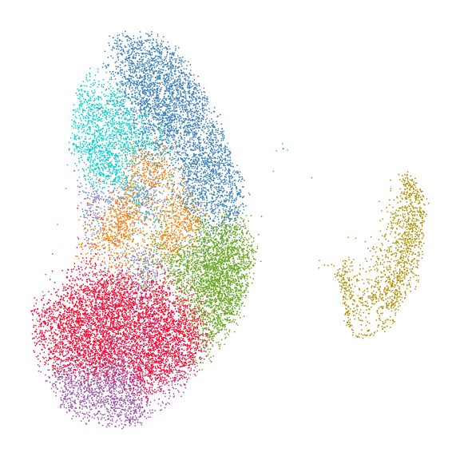
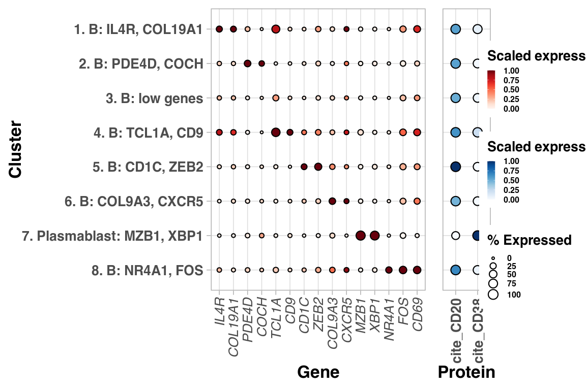
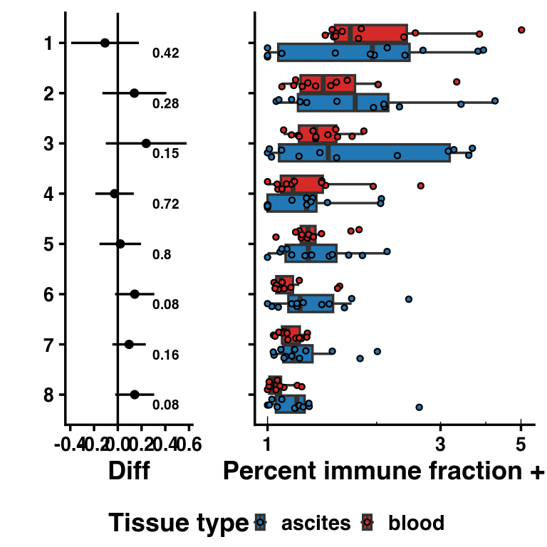

Supplemental Figure 3
================

## Set up

Load R libraries

``` r
library(reticulate)
use_python("/projects/home/nealpsmith/software/pegasus_new_py/bin/python")


source('../../functions/plot_abundance.R')
source('../../functions/plot_dotplot.R')
```

Load python libraries

``` python
import matplotlib.pyplot as plt
import pegasus as pg
```

    ## /projects/home/nealpsmith/R/x86_64-pc-linux-gnu-library/4.2/reticulate/python/rpytools/loader.py:120: UserWarning: pkg_resources is deprecated as an API. See https://setuptools.pypa.io/en/latest/pkg_resources.html. The pkg_resources package is slated for removal as early as 2025-11-30. Refrain from using this package or pin to Setuptools<81.
    ##   return _find_and_load(name, import_)

``` python

import sys
sys.path.append("../../functions")
import python_functions
```

## Supplementary Figure 3A

``` python
b_cluster_palette = {
    "1": "#FF0029",
    "2": "#377EB8",
    "3": "#66A61E",
    "4": "#984EA3",
    "5": "#00D2D5",
    "6": "#FF7F00",
    "7": "#AF8D00",
    "8": "#7F80CD",
    "9": "#B3E900",
    "10": "#C42E60"
}

# Load single-cell object
b_data = pg.read_input(
    '/projects/home/tlchan/projects/ascites/integrated_data/clusterings/ascites_bplasma_R5_300mg_20pm_harm_channel_multi_res/1.5/data/pseudobulk/ascites_bplasma_R5_300mg_20pm_harm_channel_1_5_complete_with_pb.zarr.zip')

# Relabel obs for function
b_data.obs['Cluster'] = b_data.obs['leiden_labels'].cat.remove_unused_categories().astype(str)

fig = python_functions.plot_umap(lin_data=b_data,
                           palette=b_cluster_palette)

plt.show()
# plt.savefig("/projects/home/tlchan/fig_panels/supp_3a.pdf")
plt.close(fig)
```



## Supplementary Figure 3B

``` r
b_gex <- read.csv('/projects/home/tlchan/projects/ascites/figure_panels/data/dotplot_data/bplasma_gene_exp.csv')
b_cite <- read.csv('/projects/home/tlchan/projects/ascites/figure_panels/data/dotplot_data/bplasma_cite_exp.csv')

plot_dotplot(lin_gex = b_gex,
             lin_cite = b_cite,
             lin = "bplasma",
            widths=c(1, .15, .2))
```

<!-- -->

``` r
# ggsave("/projects/home/tlchan/fig_panels/supp_3b.pdf", width = 12, height = 8)
```

## Supplementary Figure 3C

``` r
plot_cluster_abundance("bplasma")
```

<!-- -->

``` r
# ggsave("/projects/home/tlchan/fig_panels/supp_3c.pdf", width = 8, height = 8)
```
