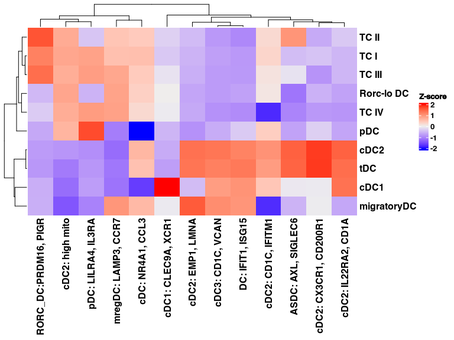
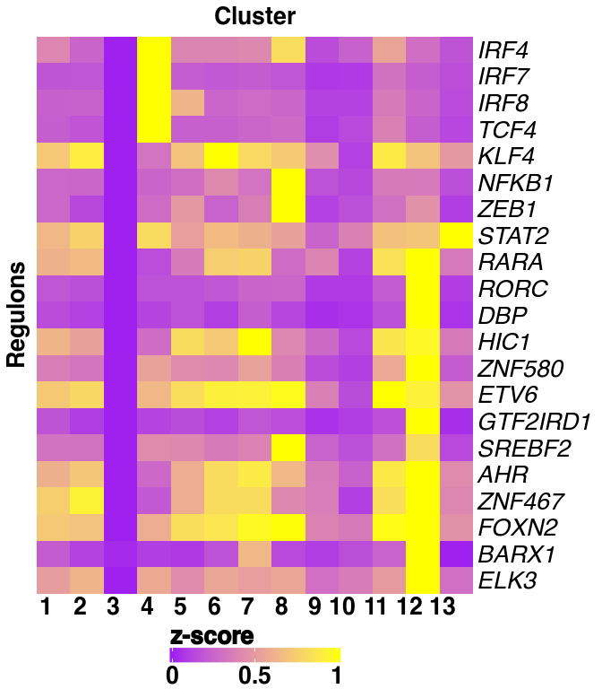

Supplemental Figure 5
================

## Set up

Load R libraries

``` r
library(ggpubr)
library(glue)
library(openxlsx)
library(tidyverse)
library(circlize)
library(ComplexHeatmap)
library(magrittr)
library(fgsea)

library(reticulate)
use_python("/projects/home/nealpsmith/software/pegasus_new_py/bin/python")

source('../../functions/plot_dotplot.R')
```

Load python libraries

``` python
import math
import matplotlib.pyplot as plt
import os
import pandas as pd
import pegasus as pg
```

    ## /projects/home/nealpsmith/R/x86_64-pc-linux-gnu-library/4.2/reticulate/python/rpytools/loader.py:120: UserWarning: pkg_resources is deprecated as an API. See https://setuptools.pypa.io/en/latest/pkg_resources.html. The pkg_resources package is slated for removal as early as 2025-11-30. Refrain from using this package or pin to Setuptools<81.
    ##   return _find_and_load(name, import_)

``` python
import scanpy as sc

import sys
sys.path.append("../../functions")
import python_functions
```

## Supplemental Figure 5A

``` r
patient_palette <- list(
    "Pt_1" = "#FF0029",
    "Pt_2" = "#377EB8",
    "Pt_3" = "#66A61E",
    "Pt_4" = "#984EA3",
    "Pt_5" = "#00D2D5",
    "Pt_6" = "#FF7F00",
    "Pt_7" = "#AF8D00",
    "Pt_8" = "#7F80CD",
    "Pt_9" = "#B3E900",
    "Pt_10" = "#C42E60",
    "Pt_11" = "#A65628",
    "Pt_12" = "#F781BF",
    "Pt_13" = "#8DD3C7",
    "Pt_14" = "#BEBADA",
    "Pt_15" = "#FB8072",
    "Pt_16" = "#80B1D3",
    "Pt_17" = "#FDB462",
    "Pt_18" = "#FCCDE5",
    "Pt_19" = "#BC80BD",
    "Pt_20" = "#FFED6F",
    "Pt_21" = "#C4EAFF",
    "Pt_22" = "#CF8C00",
    "Pt_23" = "#1B9E77"
)

abundance <- read.csv("/projects/home/tlchan/projects/ascites/results/abundance/w_peritoneal/ascites_abundance.csv")

abundance <- abundance %>%
    filter(lineage == "dc", tissue_type != "peritoneal") %>%
    group_by(patient_id, cluster) %>%
    summarize(count = n())

# Remap patient IDs
patient_mapping <- read.csv("/projects/home/tlchan/projects/ascites/figure_panels/data/patient_name_remapping.csv")
patient_mapping <- setNames(patient_mapping$new_id, patient_mapping$patient_id)
abundance$patient_id <- patient_mapping[abundance$patient_id]

ggplot(abundance, aes(x = factor(cluster), y = count, fill = patient_id)) +
    geom_bar(stat = 'identity', position = "fill") +
    xlab("Cluster") +
    ylab("Count") +
    scale_fill_manual(name = "Patient", values = patient_palette) +
    theme_classic(base_size = 22)
```

<!-- -->

``` r
# ggsave("/projects/home/nealpsmith/projects/ascites/figures/resubmission/fig_panels/supp_5a.pdf", width = 9, height = 8)
```

## Supplemental Figure 5B

``` r
dc_gex <- read.csv('/projects/home/tlchan/projects/ascites/figure_panels/data/dotplot_data/dc_gene_exp_alt.csv')
dc_cite <- read.csv('/projects/home/tlchan/projects/ascites/figure_panels/data/dotplot_data/dc_cite_exp_alt.csv')

cluster_order <- c("1. cDC2: CD1C, IFITM1", "2. cDC3: CD1C, VCAN", "3. cDC2: CX3CR1, CD200R1",
                   "4. pDC: LILRA4, IL3RA", "5. cDC1: CLEC9A, XCR1", "6. cDC: NR4A1, CCL3",
                   "7. cDC2: IL22RA2, CD1A", "8. mregDC: LAMP3, CCR7", "9. cDC2: EMP1, LMNA",
                   "10. cDC2: high mito", "11. ASDC: AXL, SIGLEC6", "12. DC: PIGR RORC",
                   "13. DC: IFIT1, ISG15", "B/Plasma", "CD4 T", "CD8 T/NK", "ILC", "Mono/Mac")

plot_dotplot(lin_gex = dc_gex,
             lin_cite = dc_cite,
             lin = "dc_alt",
             widths = c(1, .3, .2),
             cluster_order = cluster_order)
```

<!-- -->

``` r
# ggsave("/projects/home/tlchan/fig_panels/supp_5b.pdf", width = 18, height = 8)
```

## Supplemental Figure 5C

``` r
mouse_degs <- read.csv("/projects/home/nealpsmith/projects/ascites/mouse_comps/data/mouse_subsets_logfc_by_cluster.csv")

top_markers <- mouse_degs %>%
  reshape2::melt(id.vars = c("featurekey")) %>%
  group_by(variable) %>%
  dplyr::filter(value > 1.5)

# Clean names
clean_name_list <- c("cluster_DC1" = "cDC1", "cluster_DC2" = "cDC2", "cluster_Rorc._DC" = "Rorc-lo DC",
                     "cluster_migratoryDC" = "migratoryDC", "cluster_pDC" = "pDC", "cluster_tDC" = "tDC",
                     "cluster_TC_I" = "TC I", "cluster_TC_II" = "TC II", "cluster_TC_III" = "TC III",
                     "cluster_TC_IV" = "TC IV")
# top_markers$variable <- sapply(top_markers$variable, function(x) clean_name_list[[x]])

gsea_list <- split(top_markers, top_markers$variable)
gsea_list <- lapply(gsea_list, function(df) df$featurekey)

names(gsea_list) <- sapply(names(gsea_list), function(x) clean_name_list[[x]])

## Read in the human data ##
human_ova <- read.csv("/projects/home/nealpsmith/projects/ascites/mouse_comps/data/human_subsets_ova_logfc_by_cluster.csv")
annotations <- read.csv("/projects/home/nealpsmith/projects/ascites/data/ascites_cluster_annotations.csv")
annotations <- annotations %>% dplyr::filter(lineage == "dc") %>% dplyr::select(cluster, annotation)

human_ova %<>%
  dplyr::left_join(annotations, by = "cluster")

set.seed(1)
gsea_res <- lapply(unique(human_ova$annotation), function(cl){
  ranks <- human_ova %>%
    dplyr::filter(annotation == cl, percent > 2) %>%
    dplyr::select(featurekey, logFC) %>%
    arrange(desc(logFC)) %>%
    deframe(.)
  fgsea_res <- fgsea(pathways = gsea_list, stats = ranks, nperm = 10000)
  fgsea_res$annotation <- cl
  return(fgsea_res)
}) %>%
  do.call(rbind, .)


nes_df <- gsea_res %>%
  dplyr::select(pathway, NES, annotation) %>%
  reshape2::dcast(pathway~annotation, value.var = "NES") %>%
  column_to_rownames("pathway")
colnames(nes_df)[colnames(nes_df) == "DC: PIGR RORC"] <- "RORC_DC:PRDM16, PIGR"

# Can I scale by the columns
scaled_data <- scale(nes_df)

# dendrograms
clustering = hclust(dist(t(scaled_data), method = "euclidean"), method = "ward.D2")
col_hc <- as.dendrogram(clustering)

col_hc[[1]] = rev(col_hc[[1]])
col_hc[[1]][[1]] <- rev(col_hc[[1]][[1]])

clustering_row = hclust(dist(scaled_data, method = "euclidean"), method = "ward.D2")
row_hc <- as.dendrogram(clustering_row)

row_hc[[1]] <- rev(row_hc[[1]])
row_hc[[1]][[1]] <- rev(row_hc[[1]][[1]])

hmap <- Heatmap(scaled_data, name = "Z-score", cluster_columns = col_hc, cluster_rows = row_hc)

draw(hmap)
```

<!-- -->

## Supplemental Figure 5D

``` python
dc_data = pg.read_input("/projects/home/tlchan/projects/ascites/figure_panels/data/data_cite_objects/dc.zarr.zip")

fig = python_functions.plot_feature(lin_data=dc_data,
                                    genes=['RORC', 'ITGAX', 'IRF8', 'CLEC9A',
                                           'PIGR', 'CCR6', 'CD1C', 'CCR7',
                                           'PRDM16', 'CASS4', 'IL3RA', 'AIRE',
                                           'ACY3', 'HOPX', 'SIGLEC6', 'IL15'],
                                    ncol=4,
                                    nrow=4)

plt.show()
# plt.savefig("/projects/home/tlchan/fig_panels/supp_5c.pdf")
plt.close(fig)
```


## Supplemental Figure 5E

``` python
rss_list = list()
for i in range(0, 10):
    DATA_FOLDER = "/projects/home/tlchan/projects/ascites/results/scenic/w_peritoneal/test_500"
    RSS_FNAME = os.path.join(DATA_FOLDER, f"lineage_rss_{i}_mtx.csv")
    rss_data = pd.read_csv(RSS_FNAME, index_col=0)
    rss_data = rss_data.loc['dc_12'].to_frame(f"iter_{i}")
    rss_list.append(rss_data)

rss_all = pd.concat(rss_list, axis=1)
rss_data = rss_all.mean(axis=1, skipna=True).to_frame('dc_12').T

plt.rcParams.update({'font.size': 20})

fig = plt.figure(figsize=(8, 8))
c = "dc_12"
x = rss_data.T[c]
ax = fig.add_subplot(1, 1, 1)
python_functions.plot_rss(rss_data, c, top_n=5, max_n=None, ax=ax)
ax.set_ylim(x.min() - (x.max() - x.min()) * 0.05, x.max() + (x.max() - x.min()) * 0.05)
ax.set_ylabel('Regulon specificity score (RSS)')
ax.set_xlabel('Regulon')

plt.tight_layout()
# plt.show()
# plt.savefig("/projects/home/tlchan/fig_panels/supp_5d.pdf")
plt.close(fig)
```

    ## (0.1608878165, 0.3051544335)

## Supplemental Figure 5F

``` r
manual_regulons <- c("IRF4(+)", "IRF7(+)", "IRF8(+)", "KLF4(+)", "TCF4(+)", "NFKB1(+)", "STAT2(+)")

dc12_regulons <- read.xlsx("/projects/home/tlchan/projects/ascites/results/scenic/w_peritoneal/test_500_top_regulons.xlsx", sheet = "dc_12") %>%
    filter(count > 1) %>%
    pull(regulon)
select_regulons <- append(manual_regulons, dc12_regulons)

rss_data <- lapply(seq(1, 9, 1), function(i) {
    iter_data <- read.csv(glue("/projects/home/tlchan/projects/ascites/results/scenic/w_peritoneal/test_500/lineage_rss_{i}_mtx.csv"), check.names = FALSE, row.names = 1) %>%
        rownames_to_column("cluster") %>%
        pivot_longer(!cluster, names_to = "regulon", values_to = "score") %>%
        mutate(iter = i) %>%
        filter(startsWith(cluster, "dc_"))
    return(iter_data)
}) %>%
    do.call(rbind, .) %>%
    filter(regulon %in% select_regulons)

# Account for regulons that are not found in every cluster
combos <- expand.grid(unique(rss_data$iter), unique(rss_data$cluster), unique(rss_data$regulon)) %>% `colnames<-`(c("iter", "cluster", "regulon"))
rss_data <- combos %>%
    left_join(rss_data, by = c("iter", "cluster", "regulon")) %>%
    replace(is.na(.), 0)

rss_data <- rss_data %>%
    group_by(cluster, regulon) %>%
    summarize(score = mean(score)) %>%
    pivot_wider(names_from = regulon, values_from = score) %>%
    column_to_rownames("cluster") %>%
    t()

# Get Z-scres matrix
rss_data <- t(scale(t(rss_data)))

# Scale to 0 to 1
rss_data <- apply(rss_data, 1, function(r) {
    (r - min(r)) / (max(r) - min(r))
}) %>% t()


# Function for coloring the heatmap
heatmap_col_fun <- colorRamp2(c(min(rss_data), 0, max(rss_data)), c("purple", "black", "yellow"))

row_order <- c("IRF4(+)", "IRF7(+)", "IRF8(+)", "TCF4(+)", "KLF4(+)", "NFKB1(+)", "ZEB1(+)", "STAT2(+)", "RARA(+)",
               "RORC(+)", "DBP(+)", "HIC1(+)", "ZNF580(+)", "ETV6(+)", "GTF2IRD1(+)", "SREBF2(+)", "AHR(+)",
               "ZNF467(+)", "FOXN2(+)", "BARX1(+)", "ELK3(+)")
col_order <- c("dc_1", "dc_2", "dc_3", "dc_4", "dc_5", "dc_6", "dc_7", "dc_8", "dc_9", "dc_10", "dc_11", "dc_12", "dc_13")

rss_data <- rss_data[row_order, col_order]

# Remove (+) from rownames
rownames(rss_data) <- str_sub(rownames(rss_data), end = -4)
colnames(rss_data) <- c("1", "2", "3", "4", "5", "6", "7", "8", "9", "10", "11", "12", "13")

for (r in manual_regulons) {
    print(r)
    print(r %in% rownames(rss_data))
}

hmap <- Heatmap(rss_data,
                name = "z-score",
                col = heatmap_col_fun,
                show_column_names = TRUE,
                column_names_rot = 0,
                show_row_names = TRUE,
                cluster_columns = FALSE,
                cluster_rows = FALSE,
                show_heatmap_legend = TRUE,
                column_title = "Cluster",
                row_title = "Regulons",
                row_names_gp = gpar(fontsize = 20, fontface = "italic"),
                column_names_gp = gpar(fontsize = 20),
                row_title_gp = gpar(fontsize = 20),
                column_title_gp = gpar(fontsize = 20),
                heatmap_legend_param = list(
                    legend_direction = "horizontal",
                    legend_width = unit(5, "cm"),
                    title_gp = gpar(fontsize = 20, fontface = "bold"),
                    labels_gp = gpar(fontsize = 20)
                )
)

# pdf("/projects/home/tlchan/fig_panels/fig_3e.pdf", width = 7, height = 8)
draw(hmap, heatmap_legend_side = "bottom")
```

<!-- -->

``` r
# dev.off()
```
