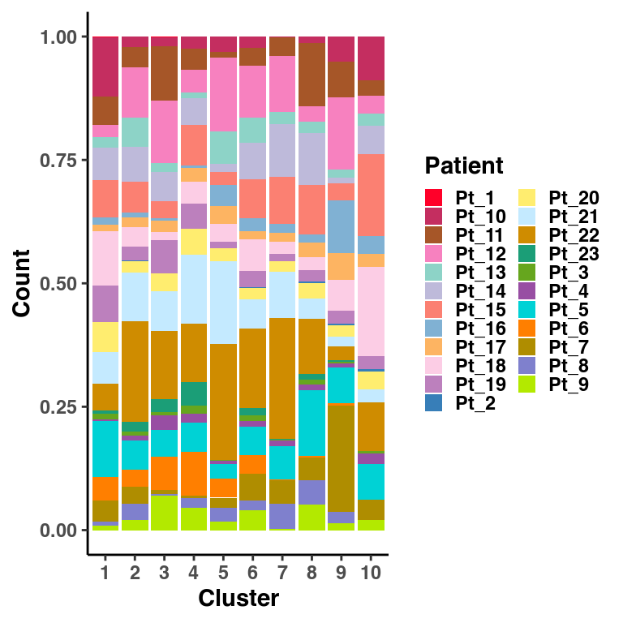
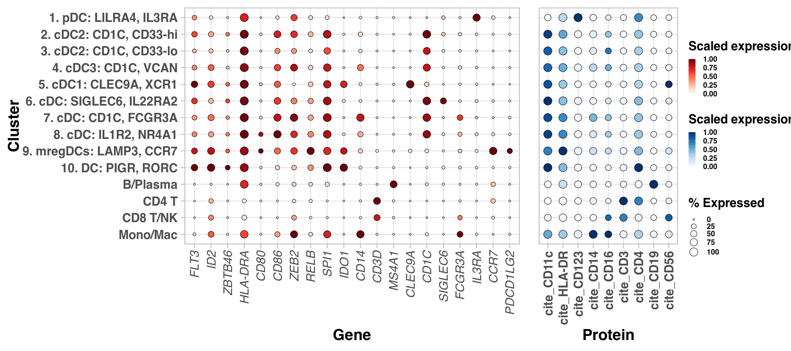
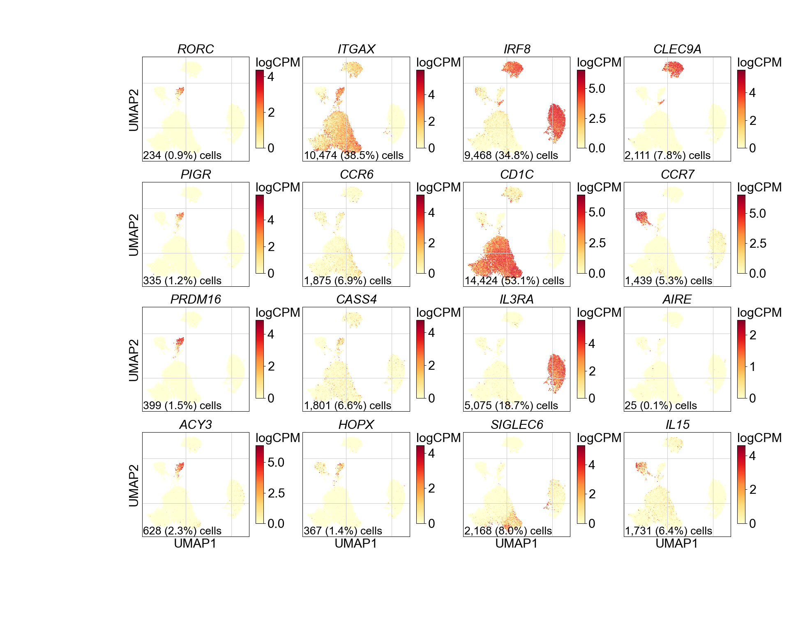
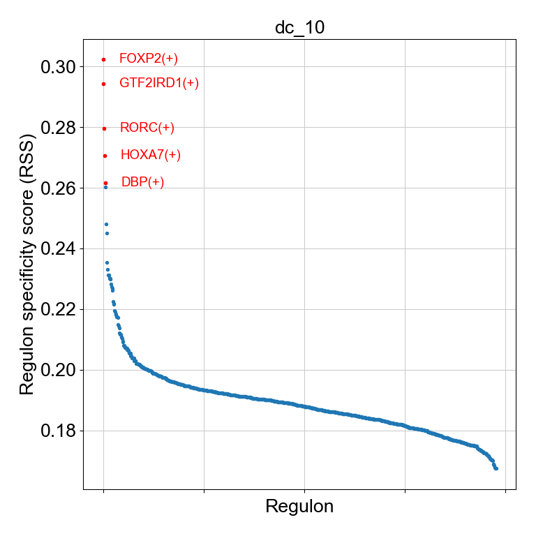
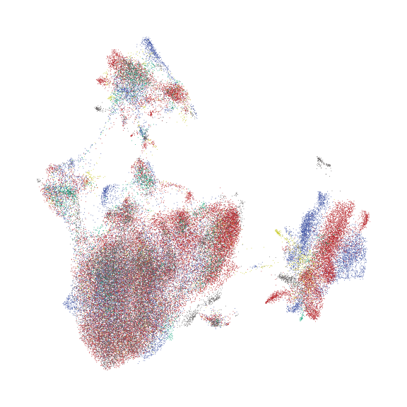
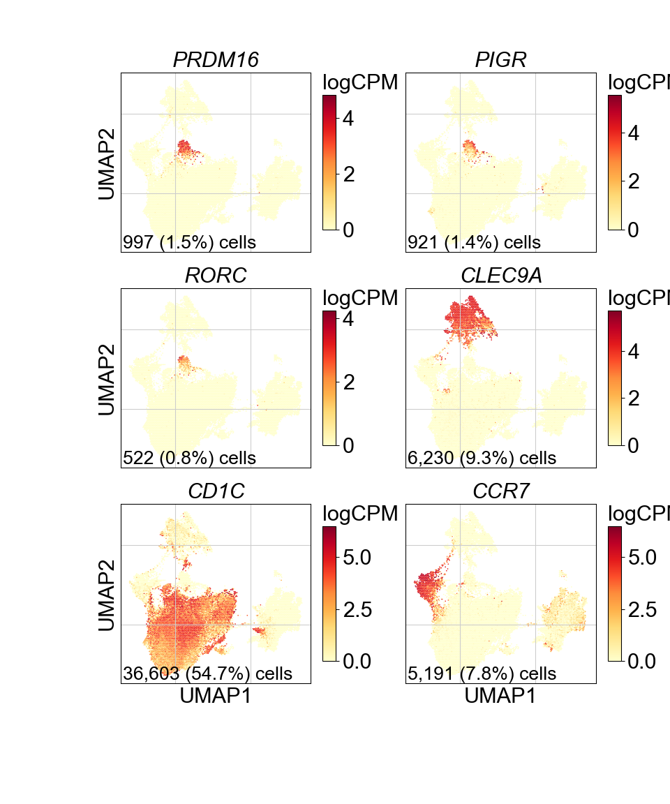

Supplemental Figure 5
================

## Set up

Load R libraries

``` r
library(ggpubr)
library(glue)
library(openxlsx)
library(tidyverse)

library(reticulate)
use_python("/projects/home/tlchan/.conda/envs/myenv/bin/python")

setwd('/projects/home/tlchan/github_code/ascites/functions')
source('plot_dotplot.R')
```

Load python libraries

``` python
import math
import matplotlib.pyplot as plt
import os
import pandas as pd
import pegasus as pg
import scanpy as sc

import sys
sys.path.append("/projects/home/tlchan/github_code/ascites/functions")
import python_functions
```

## Supplemental Figure 5A

``` r
patient_palette <- list(
    "Pt_1" = "#FF0029",
    "Pt_2" = "#377EB8",
    "Pt_3" = "#66A61E",
    "Pt_4" = "#984EA3",
    "Pt_5" = "#00D2D5",
    "Pt_6" = "#FF7F00",
    "Pt_7" = "#AF8D00",
    "Pt_8" = "#7F80CD",
    "Pt_9" = "#B3E900",
    "Pt_10" = "#C42E60",
    "Pt_11" = "#A65628",
    "Pt_12" = "#F781BF",
    "Pt_13" = "#8DD3C7",
    "Pt_14" = "#BEBADA",
    "Pt_15" = "#FB8072",
    "Pt_16" = "#80B1D3",
    "Pt_17" = "#FDB462",
    "Pt_18" = "#FCCDE5",
    "Pt_19" = "#BC80BD",
    "Pt_20" = "#FFED6F",
    "Pt_21" = "#C4EAFF",
    "Pt_22" = "#CF8C00",
    "Pt_23" = "#1B9E77"
)

abundance <- read.csv("/projects/home/tlchan/projects/ascites/results/abundance/integrated_data/ascites_abundance.csv")

abundance <- abundance %>%
    filter(lineage == "dc") %>%
    group_by(patient_id, cluster) %>%
    summarize(count = n())

# Remap patient IDs
patient_mapping <- read.csv("/projects/home/tlchan/projects/ascites/figure_panels/data/patient_name_remapping.csv")
patient_mapping <- setNames(patient_mapping$new_id, patient_mapping$patient_id)
abundance$patient_id <- patient_mapping[abundance$patient_id]

ggplot(abundance, aes(x = factor(cluster), y = count, fill = patient_id)) +
    geom_bar(stat = 'identity', position = "fill") +
    xlab("Cluster") +
    ylab("Count") +
    scale_fill_manual(name = "Patient", values = patient_palette) +
    theme_classic(base_size = 22)
```

<!-- -->

``` r
# ggsave("/projects/home/tlchan/fig_panels/supp_5a.pdf", width = 8, height = 8)
```

## Supplemental Figure 5B

``` r
dc_gex <- read.csv('/projects/home/tlchan/projects/ascites/figure_panels/data/dotplot_data/dc_gene_exp_alt.csv')
dc_cite <- read.csv('/projects/home/tlchan/projects/ascites/figure_panels/data/dotplot_data/dc_cite_exp_alt.csv')

cluster_order <- c("1. pDC: LILRA4, IL3RA", "2. cDC2: CD1C, CD33-hi", "3. cDC2: CD1C, CD33-lo",
                   "4. cDC3: CD1C, VCAN", "5. cDC1: CLEC9A, XCR1", "6. cDC: SIGLEC6, IL22RA2",
                   "7. cDC: CD1C, FCGR3A", "8. cDC: IL1R2, NR4A1", "9. mregDCs: LAMP3, CCR7",
                   "10. DC: PIGR, RORC", "B/Plasma", "CD4 T", "CD8 T/NK", "Mono/Mac")

plot_dotplot(lin_gex = dc_gex,
             lin_cite = dc_cite,
             lin = "dc_alt",
             widths = c(1, .3, .2),
             cluster_order = cluster_order)
```

<!-- -->

``` r
# ggsave("/projects/home/tlchan/fig_panels/supp_5b.pdf", width = 18, height = 8)
```

## Supplemental Figure 5C

``` python
dc_data = pg.read_input("/projects/home/tlchan/projects/ascites/figure_panels/data/data_cite_objects/dc.zarr.zip")

fig = python_functions.plot_feature(lin_data=dc_data,
                                    genes=['RORC', 'ITGAX', 'IRF8', 'CLEC9A',
                                           'PIGR', 'CCR6', 'CD1C', 'CCR7',
                                           'PRDM16', 'CASS4', 'IL3RA', 'AIRE',
                                           'ACY3', 'HOPX', 'SIGLEC6', 'IL15'],
                                    ncol=4,
                                    nrow=4)

plt.show()
# plt.savefig("/projects/home/tlchan/fig_panels/fig_5c.pdf")
plt.close(fig)
```



## Supplemental Figure 5D

``` python
rss_list = list()
for i in range(0, 10):
    DATA_FOLDER = "/projects/home/tlchan/projects/ascites/results/scenic/pigr/test_500"
    RSS_FNAME = os.path.join(DATA_FOLDER, f"lineage_rss_{i}_mtx.csv")
    rss_data = pd.read_csv(RSS_FNAME, index_col=0)
    rss_data = rss_data.loc['dc_10'].to_frame(f"iter_{i}")
    rss_list.append(rss_data)

rss_all = pd.concat(rss_list, axis=1)
rss_data = rss_all.mean(axis=1, skipna=True).to_frame('dc_10').T

plt.rcParams.update({'font.size': 20})

fig = plt.figure(figsize=(8, 8))
c = "dc_10"
x = rss_data.T[c]
ax = fig.add_subplot(1, 1, 1)
python_functions.plot_rss(rss_data, c, top_n=5, max_n=None, ax=ax)
ax.set_ylim(x.min() - (x.max() - x.min()) * 0.05, x.max() + (x.max() - x.min()) * 0.05)
ax.set_ylabel('Regulon specificity score (RSS)')
ax.set_xlabel('Regulon')

plt.tight_layout()
plt.show()
# plt.savefig("/projects/home/tlchan/fig_panels/supp_5d.pdf")
plt.close(fig)
```

    ## (0.16070401435335693, 0.30901425311015535)



## Supplemental Figure 5E

``` python
dataset_dict = {
    "cancer_discovery": "Primary gastric",
    "gastric": "Ascites (MGH)",
    "ovarian": "Ovarian cancer",
    "peritoneal": "Normal peritoneum",
    "teichmann": "Immune atlas",
    "tonsil": "Tonsil"
}

dataset_palette = {
    "Primary gastric": "#666666",
    "Ascites (MGH)": "#B52025",
    "Ovarian cancer": "#3E52A3",
    "Normal peritoneum": "#5F5B5B",
    "Immune atlas": "#CBCC2C",
    "Tonsil": "#009E73"
}

# Load single-cell object
ext_dc_data = pg.read_input(
    '/projects/home/tlchan/projects/ascites/external_dc_data/clusterings/combo_data_dc_R4_300mg_20pm_harm_dataset_multi_res/1.5/data/pseudobulk/combo_data_dc_R4_300mg_20pm_harm_dataset_1_5_complete_with_pb.zarr.zip')

# Relabel obs for function
pg.annotate(ext_dc_data, 'dataset', 'dataset', dataset_dict)

fig = python_functions.plot_umap(lin_data=ext_dc_data,
                                 color="dataset",
                                 palette=dataset_palette,
                                 legend_loc=None)

plt.show()
# plt.savefig("/projects/home/tlchan/fig_panels/supp_5e.pdf")
plt.close(fig)
```



## Supplemental Figure 5F

``` python
ext_dc_data = pg.read_input(
    "/projects/home/tlchan/projects/ascites/external_dc_data/clusterings/combo_data_dc_R4_300mg_20pm_harm_dataset_multi_res/1.5/data/pseudobulk/combo_data_dc_R4_300mg_20pm_harm_dataset_1_5_complete_with_pb.zarr.zip")

fig = python_functions.plot_feature(lin_data=ext_dc_data,
                                    genes=['PRDM16', 'PIGR', 'RORC', 'CLEC9A', 'CD1C', 'CCR7'],
                                    ncol=2,
                                    nrow=3)

plt.show()
# plt.savefig("/projects/home/tlchan/fig_panels/supp_5f.pdf")
plt.close(fig)
```


