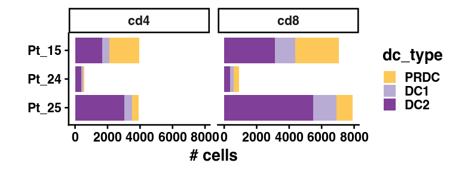
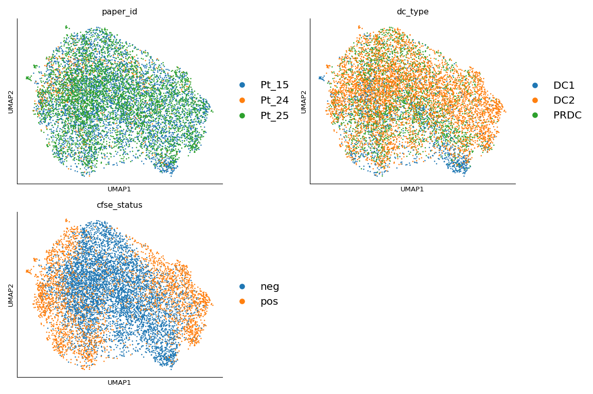
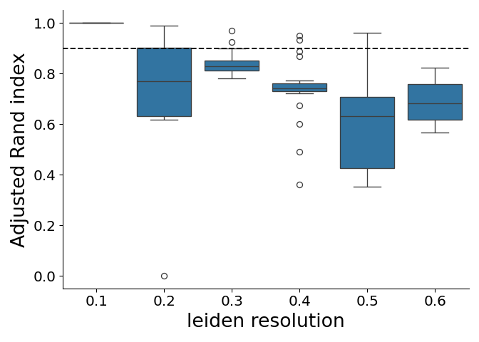
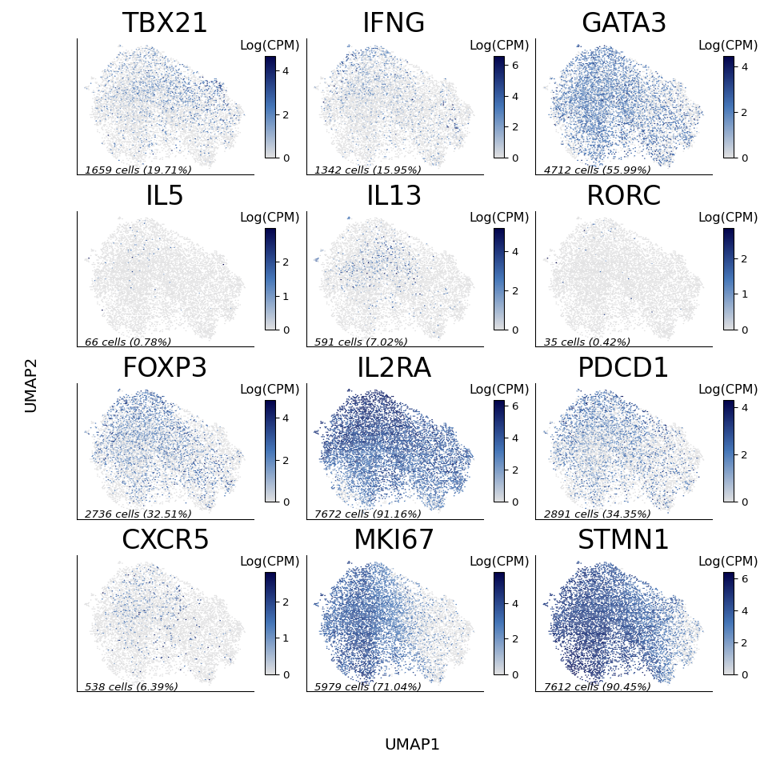
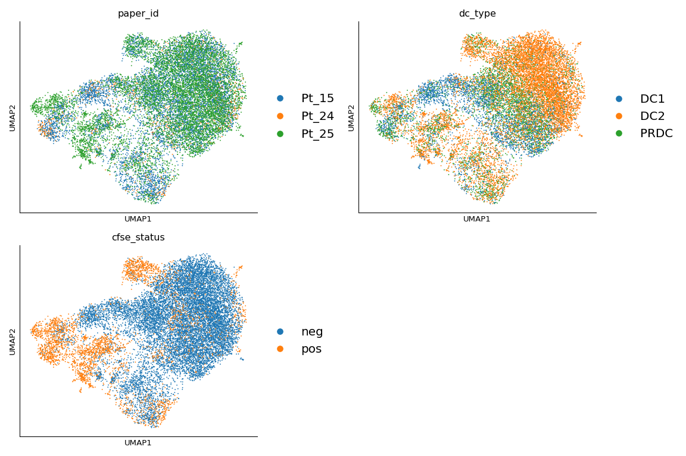
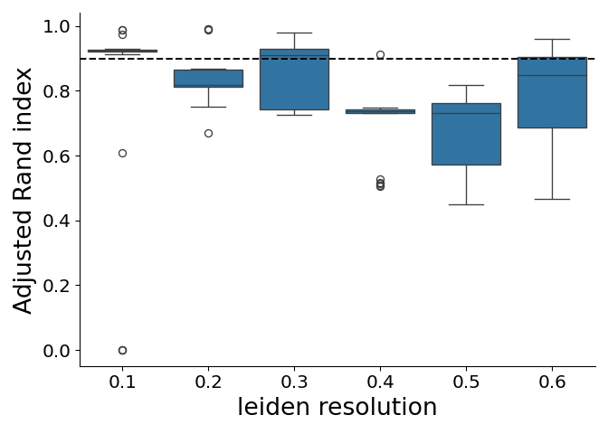
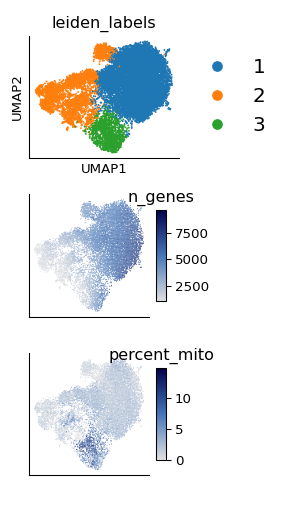
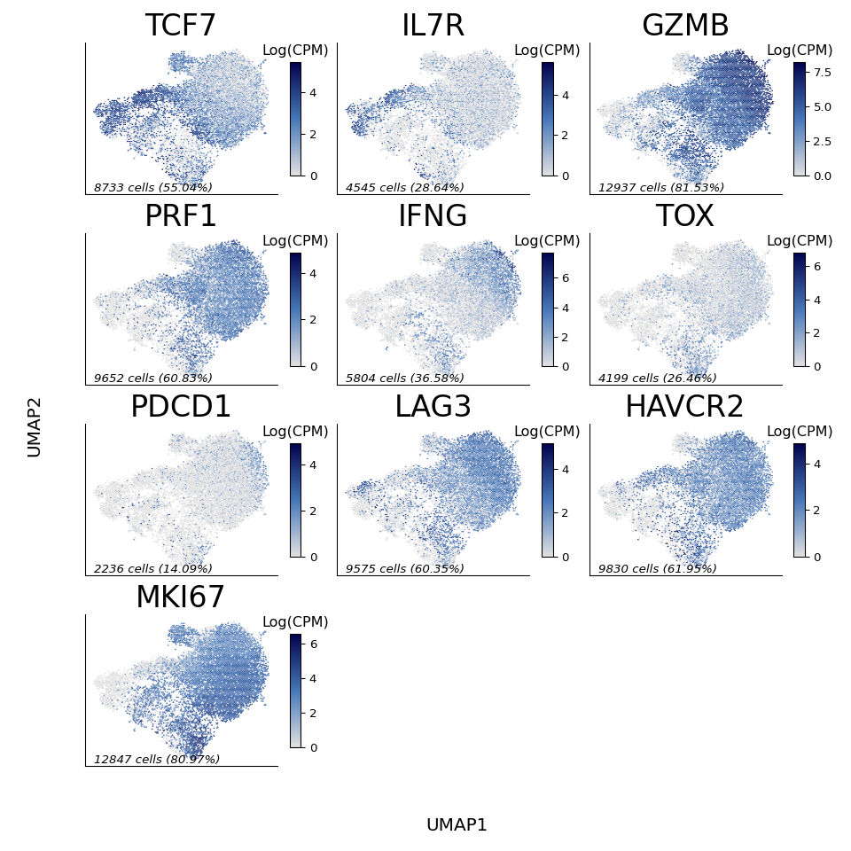
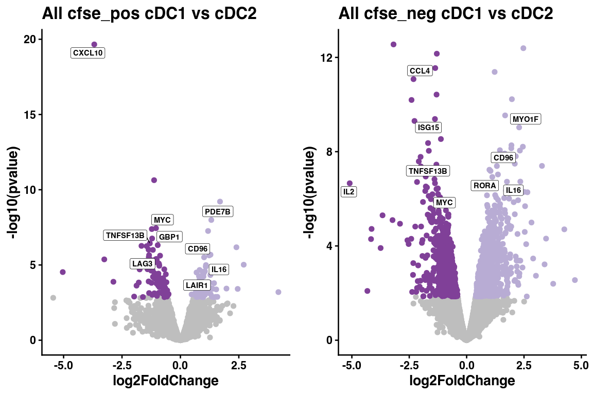

Supplemental Figure 8
================

## Set up

Load R libraries

``` r
library(ggpubr)
library(glue)
library(openxlsx)
library(tidyverse)
library(ggrepel)
library(ggplot2)

library(reticulate)
use_python("/projects/home/nealpsmith/software/pegasus_new_py/bin/python")
```

Load python libraries

``` python
import matplotlib.pyplot as plt
import pegasus as pg
import scanpy as sc
from matplotlib.lines import Line2D
import matplotlib as mpl
import pandas as pd
import seaborn as sns
import numpy as np
import matplotlib.colors as clr
mpl.rcParams['axes.spines.right'] = False
mpl.rcParams['axes.spines.top'] = False
mpl.rcParams['pdf.fonttype'] = 42
colormap = clr.LinearSegmentedColormap.from_list('gene_cmap', ["#e0e0e1", '#4576b8', '#02024a'], N=200)


import sys
sys.path.append("../../functions")
import python_functions
```

## Supplemental Figure 8D

``` r
cd4_data <- read.csv("/projects/home/nealpsmith/projects/ascites/mlr/data/combined_fastq/cd4_data_obs.csv")
cd8_data <- read.csv("/projects/home/nealpsmith/projects/ascites/mlr/data/combined_fastq/cd8_data_obs.csv")

plot_cd4 <- cd4_data %>%
  dplyr::select(dc_type, paper_id) %>%
  mutate(lineage = "cd4")

plot_cd8 <- cd8_data %>%
  dplyr::select(dc_type, paper_id) %>%
  mutate(lineage = "cd8")

plot_df <- rbind(plot_cd4, plot_cd8)

n_cells <- plot_df %>%
  group_by(dc_type, paper_id, lineage) %>%
  summarise(n_cells = n())
n_cells$paper_id <- factor(n_cells$paper_id, levels = c("Pt_25", "Pt_24", "Pt_15"))
n_cells$dc_type <- factor(n_cells$dc_type, levels = rev(c("DC2", "DC1", "PRDC")))
ggplot(n_cells, aes(x = n_cells, y = paper_id, fill = dc_type)) +
  geom_bar(stat = "identity", position = "stack") +
  scale_fill_manual(values = c("DC2" = "#803f98", "DC1" = "#b8acd4", "PRDC" = "#fec859")) +
  facet_wrap(~lineage) +
  xlab("# cells") +
  ylab("") +
  theme_classic(base_size = 20)
```

<!-- -->

## Supplemental Figure 8E

``` python
cd4_data = pg.read_input("/projects/home/nealpsmith/projects/ascites/mlr/data/combined_fastq/cd4_data.zarr")

cd4_data.obs["patient_id"] = ["_".join(n.split("_")[0:2]) for n in cd4_data.obs["sample"]]
cd4_data.obs["dc_type"] = ["_".join(n.split("_")[2:3]) for n in cd4_data.obs["sample"]]
cd4_data.obs["dc_type"][cd4_data.obs["dc_type"] == "newDC"] = "PRDC"

# Add paper ID
# paper_ids = pd.read_csv("/projects/home/nealpsmith/projects/ascites/data/patient_paper_ids.csv")
paper_id_dict = {"ASC_62" : "Pt_15", "ASC_89" : "Pt_24", "ASC_91" : "Pt_25"}
cd4_data.obs["paper_id"] = [paper_id_dict[n] for n in cd4_data.obs["patient_id"]]

adata = cd4_data.to_anndata()
sc.pl.umap(adata, color = ["paper_id", "dc_type", "cfse_status"], show = False)

cats = ["paper_id", "dc_type", "cfse_status"]
fig, ax = plt.subplots(nrows=2, ncols=2)
ax = ax.ravel()
for num, c in enumerate(cats) :
    print(c)
    if c == "leiden_labels" :
        col_dict = dict(zip(sorted(set(adata.obs[c]), key = int),
                           adata.uns[f"{c}_colors"]))
        legend_elements = [Line2D([0], [0], marker='o', color=col_dict[cl], label=cl,
                                  markerfacecolor=col_dict[cl], markersize=7, lw=0) for cl in
                           sorted(set(adata.obs[c]), key = int)]
    else :
        col_dict = dict(zip(sorted(set(adata.obs[c])),
                            adata.uns[f"{c}_colors"]))
        legend_elements = [Line2D([0], [0], marker='o', color=col_dict[cl], label=cl,
                                  markerfacecolor=col_dict[cl], markersize=7, lw=0) for cl in
                           sorted(set(adata.obs[c]))]

    if len(legend_elements) > 6 :
        lcols = 2
        leg_loc = "on data"
    else :
        lcols = 1
        leg_loc = "none"

    plot = sc.pl.umap(adata, color=c,
                           legend_loc=leg_loc, show=False, ax=ax[num],
                           title="", legend_fontoutline=5)
    lgd = ax[num].legend(handles=legend_elements, loc='center left', fontsize=15,
                         bbox_to_anchor=(1, 0.5), frameon=False, ncol = lcols)
    ax[num].set_title(c)
    ax[num].set_rasterization_zorder(2)
for noplot in range(num + 1, len(ax)) :
    ax[noplot].axis("off")
```

    ## (np.float64(0.0), np.float64(1.0), np.float64(0.0), np.float64(1.0))

``` python
fig = plt.gcf()
fig.set_size_inches(12, 8)
fig.tight_layout()
plt.show()
```



``` python
plt.close()
```

## Supplemental Figure 8F

``` python
# rand_indx_dict = rand_index_plot(W = adata.obsp["W_pca_harmony"],
#                                       resolutions  = [0.1, 0.2, 0.3, 0.4, 0.5, 0.6],
#                                       n_samples = 25, random_state=1)
# plot_df = pd.DataFrame(rand_indx_dict).T
# plot_df = plot_df.reset_index()
# plot_df = plot_df.melt(id_vars="index")
# plot_df.to_csv("/projects/home/nealpsmith/projects/ascites/mlr/data/combined_fastq/cd4_ari.csv")
plot_df = pd.read_csv("/projects/home/nealpsmith/projects/ascites/mlr/data/combined_fastq/cd4_ari.csv")

fig, ax = plt.subplots(1)
sns.boxplot(x="index", y="value", data=plot_df, ax = ax)
for box in ax.artists:
    box.set_facecolor("grey")
# ax.artists[6].set_facecolor("red") # The one we chose!
ax.spines['right'].set_visible(False)
ax.spines['top'].set_visible(False)
ax.tick_params(axis='both', which='major', labelsize=15)
ax.set_ylabel("Adjusted Rand index", size = 20)
ax.set_xlabel("leiden resolution", size = 20)
plt.axhline(y = 0.9, color = "black", linestyle = "--")
fig.tight_layout()
# plt.savefig("/projects/home/nealpsmith/projects/ascites/mlr/figures/combined_fastq/cd4/ari_cd4.pdf")
plt.show()
```



``` python
plt.close()
```

## Supplemental figure 8G

``` python
genes =["TBX21", "IFNG", "GATA3", "IL5", "IL13", "RORC", "FOXP3", "IL2RA", "PDCD1", "CXCR5", "MKI67", "STMN1"]
x_loc = np.min(adata.obsm["X_umap"][:,0]) - np.min(adata.obsm["X_umap"][:,0]) * 0.01
y_loc = np.min(adata.obsm["X_umap"][:,1]) - 0.4

fig, ax = plt.subplots(ncols = 3, nrows = 4, figsize = (10, 10))
ax = ax.ravel()

for num, gene in enumerate(genes) :
    # Calculate n cells and percent
    n_cells = adata[:, gene].X.count_nonzero()
    perc_cells = n_cells / len(adata) * 100
    perc_cells = round(perc_cells, 2)

    plot_df = pd.DataFrame(adata[:,gene].X.toarray(), columns = [gene], index = adata.obs_names)
    plot_df["x"] = adata.obsm["X_umap"][:, 0]
    plot_df["y"] = adata.obsm["X_umap"][:, 1]
    hb = ax[num].hexbin(plot_df["x"], plot_df["y"], C=plot_df[gene], cmap=colormap, gridsize=120, edgecolors = "none")
    ax[num].get_xaxis().set_ticks([])
    ax[num].get_yaxis().set_ticks([])
    ax[num].spines['top'].set_visible(False)
    ax[num].spines['right'].set_visible(False)
    ax[num].set_title(gene, size = 25)
    ax[num].text(x_loc, y_loc, f"{n_cells} cells ({perc_cells}%)", style="italic")
    cb = fig.colorbar(hb, ax=ax[num], shrink=.75, aspect=10)
    cb.ax.set_title("Log(CPM)")
for noplot in range(num +1, len(ax)) :
    ax[noplot].axis("off")
fig.text(0.5, 0.03, 'UMAP1', va='center', size = 15)
fig.text(0.03, 0.5, 'UMAP2', va='center', rotation='vertical', size = 15)
fig.tight_layout()
plt.subplots_adjust(left = 0.1, bottom = 0.1)
plt.show()
```



``` python
plt.close()
```

## Supplemental figure 8H

``` python
cd8_data = pg.read_input("/projects/home/nealpsmith/projects/ascites/mlr/data/combined_fastq/cd8_data.zarr")
pg.leiden(cd8_data, resolution=0.3, rep = "pca_harmony")
del cd8_data.uns["leiden_labels_colors"]

cd8_data.obs["patient_id"] = ["_".join(n.split("_")[0:2]) for n in cd8_data.obs["sample"]]
cd8_data.obs["dc_type"] = ["_".join(n.split("_")[2:3]) for n in cd8_data.obs["sample"]]
cd8_data.obs["dc_type"][cd8_data.obs["dc_type"] == "newDC"] = "PRDC"
paper_id_dict = {"ASC_62" : "Pt_15", "ASC_89" : "Pt_24", "ASC_91" : "Pt_25"}
cd8_data.obs["paper_id"] = [paper_id_dict[n] for n in cd8_data.obs["patient_id"]]

adata = cd8_data.to_anndata()
sc.pl.umap(adata, color = ["paper_id", "dc_type", "cfse_status", "leiden_labels"], show = False)

cats = ["paper_id", "dc_type", "cfse_status"]
fig, ax = plt.subplots(nrows=2, ncols=2)
ax = ax.ravel()
for num, c in enumerate(cats) :
    print(c)
    if c == "leiden_labels" :
        col_dict = dict(zip(sorted(set(adata.obs[c]), key = int),
                           adata.uns[f"{c}_colors"]))
        legend_elements = [Line2D([0], [0], marker='o', color=col_dict[cl], label=cl,
                                  markerfacecolor=col_dict[cl], markersize=7, lw=0) for cl in
                           sorted(set(adata.obs[c]), key = int)]
    else :
        col_dict = dict(zip(sorted(set(adata.obs[c])),
                            adata.uns[f"{c}_colors"]))
        legend_elements = [Line2D([0], [0], marker='o', color=col_dict[cl], label=cl,
                                  markerfacecolor=col_dict[cl], markersize=7, lw=0) for cl in
                           sorted(set(adata.obs[c]))]

    if len(legend_elements) > 6 :
        lcols = 2
        leg_loc = "on data"
    else :
        lcols = 1
        leg_loc = "none"

    plot = sc.pl.umap(adata, color=c,
                           legend_loc=leg_loc, show=False, ax=ax[num],
                           title="", legend_fontoutline=5)
    lgd = ax[num].legend(handles=legend_elements, loc='center left', fontsize=15,
                         bbox_to_anchor=(1, 0.5), frameon=False, ncol = lcols)
    ax[num].set_title(c)
    ax[num].set_rasterization_zorder(2)
for noplot in range(num + 1, len(ax)) :
    ax[noplot].axis("off")
```

    ## (np.float64(0.0), np.float64(1.0), np.float64(0.0), np.float64(1.0))

``` python
fig = plt.gcf()
fig.set_size_inches(12, 8)
fig.tight_layout()
plt.show()
```



``` python
plt.close()
```

## Supplemental Figure 8I

``` python
plot_df = pd.read_csv("/projects/home/nealpsmith/projects/ascites/mlr/data/combined_fastq/cd8_ari.csv")
fig, ax = plt.subplots(1)
sns.boxplot(x="index", y="value", data=plot_df, ax = ax)
for box in ax.artists:
    box.set_facecolor("grey")
# ax.artists[6].set_facecolor("red") # The one we chose!
ax.spines['right'].set_visible(False)
ax.spines['top'].set_visible(False)
ax.tick_params(axis='both', which='major', labelsize=15)
ax.set_ylabel("Adjusted Rand index", size = 20)
ax.set_xlabel("leiden resolution", size = 20)
plt.axhline(y = 0.9, color = "black", linestyle = "--")
fig.tight_layout()
plt.show()
```



``` python
plt.close()
```

## Supplemental Figure 8J

``` python
fig, ax = plt.subplots(ncols = 1, nrows = 3, figsize = (3, 5.5))
ax = ax.ravel()
c = "leiden_labels"
col_dict = dict(zip(sorted(set(adata.obs[c]), key=int),
                    adata.uns[f"{c}_colors"]))
legend_elements = [Line2D([0], [0], marker='o', color=col_dict[cl], label=cl,
                          markerfacecolor=col_dict[cl], markersize=7, lw=0) for cl in
                   sorted(set(adata.obs[c]), key=int)]
plot = sc.pl.umap(adata, color=c,
                  legend_loc=leg_loc, show=False, ax=ax[0],
                  title="", legend_fontoutline=5)
lgd = ax[0].legend(handles=legend_elements, loc='center left', fontsize=15,
                     bbox_to_anchor=(1, 0.5), frameon=False, ncol=lcols)
ax[0].set_title(c)
ax[0].set_rasterization_zorder(2)

for num, gene in enumerate(["n_genes", "percent_mito"]) :
    num = num+1
    plot_df = adata.obs
    plot_df["x"] = adata.obsm["X_umap"][:, 0]
    plot_df["y"] = adata.obsm["X_umap"][:, 1]
    hb = ax[num].hexbin(plot_df["x"], plot_df["y"], C=plot_df[gene], cmap=colormap, gridsize=120, edgecolors = "none")
    ax[num].get_xaxis().set_ticks([])
    ax[num].get_yaxis().set_ticks([])
    ax[num].spines['top'].set_visible(False)
    ax[num].spines['right'].set_visible(False)
    # ax[num].set_title(gene, size = 25)
    cb = fig.colorbar(hb, ax=ax[num], shrink=.75, aspect=10)
    cb.ax.set_title(f"{gene}")

fig.tight_layout()
plt.subplots_adjust(left = 0.1, bottom = 0.1)
plt.show()
```



``` python
plt.close()
```

## Supplemental Figure 8K

``` python
genes =["TCF7", "IL7R", "GZMB", "PRF1", "IFNG", "TOX", "PDCD1", "LAG3", "HAVCR2", "MKI67"]
x_loc = np.min(adata.obsm["X_umap"][:,0]) - np.min(adata.obsm["X_umap"][:,0]) * 0.01
y_loc = np.min(adata.obsm["X_umap"][:,1]) - 0.4

fig, ax = plt.subplots(ncols = 3, nrows = 4, figsize = (10, 10))
ax = ax.ravel()

for num, gene in enumerate(genes) :
    # Calculate n cells and percent
    n_cells = adata[:, gene].X.count_nonzero()
    perc_cells = n_cells / len(adata) * 100
    perc_cells = round(perc_cells, 2)

    plot_df = pd.DataFrame(adata[:,gene].X.toarray(), columns = [gene], index = adata.obs_names)
    plot_df["x"] = adata.obsm["X_umap"][:, 0]
    plot_df["y"] = adata.obsm["X_umap"][:, 1]
    hb = ax[num].hexbin(plot_df["x"], plot_df["y"], C=plot_df[gene], cmap=colormap, gridsize=120, edgecolors = "none")
    ax[num].get_xaxis().set_ticks([])
    ax[num].get_yaxis().set_ticks([])
    ax[num].spines['top'].set_visible(False)
    ax[num].spines['right'].set_visible(False)
    ax[num].set_title(gene, size = 25)
    ax[num].text(x_loc, y_loc, f"{n_cells} cells ({perc_cells}%)", style="italic")
    cb = fig.colorbar(hb, ax=ax[num], shrink=.75, aspect=10)
    cb.ax.set_title("Log(CPM)")
for noplot in range(num +1, len(ax)) :
    ax[noplot].axis("off")
```

    ## (np.float64(0.0), np.float64(1.0), np.float64(0.0), np.float64(1.0))
    ## (np.float64(0.0), np.float64(1.0), np.float64(0.0), np.float64(1.0))

``` python
fig.text(0.5, 0.03, 'UMAP1', va='center', size = 15)
fig.text(0.03, 0.5, 'UMAP2', va='center', rotation='vertical', size = 15)
fig.tight_layout()
plt.subplots_adjust(left = 0.1, bottom = 0.1)
plt.show()
```



``` python
plt.close()
```

## Supplemental Figure 8L

``` r
all_de_res <- read.csv("/projects/home/nealpsmith/projects/ascites/mlr/data/combined_fastq/degs/mlr_all_de_res.csv")

## DC1 vs DC2 volcanos ##
volcano_label_genes <- list("cfse_pos" = c("CXCL10", "MYC", "GBP1", "LAG3", "TNFSF13B", "PDE7B", "CD96",
                                           "IL16", "LAIR1"),
                            "cfse_neg" = c("CCL4", "IL2", "ISG15", "TNFSF13B", "MYC", "MYO1F", "CD96",
                                           "IL16", "RORA"))
plot_list <- list()
for (group in c("cfse_pos", "cfse_neg")){
  volcano_df <- all_de_res %>%
    dplyr::filter(lineage == "all", cfse_status == group, contrast == "DC1_vs_DC2")
  label_genes <- volcano_label_genes[[group]]

  p <- ggplot(volcano_df, aes(x = log2FoldChange, y = -log10(pvalue))) +
    geom_point(data = volcano_df %>% dplyr::filter(padj > 0.1), color ="grey") +
    geom_point(data = volcano_df %>% dplyr::filter(padj < 0.1, log2FoldChange > 0), color ="#b8acd4") +
    geom_point(data = volcano_df %>% dplyr::filter(padj < 0.1, log2FoldChange < 0), color ="#804098") +
    geom_label_repel(data = volcano_df %>% dplyr::filter(gene %in% label_genes), aes(label = gene)) +
    ggtitle(glue("All {group} cDC1 vs cDC2")) +
    theme_classic(base_size = 20)
  plot_list <- c(plot_list, list(p))
}

ggarrange(plotlist = plot_list, ncol = 2)
```

<!-- -->
