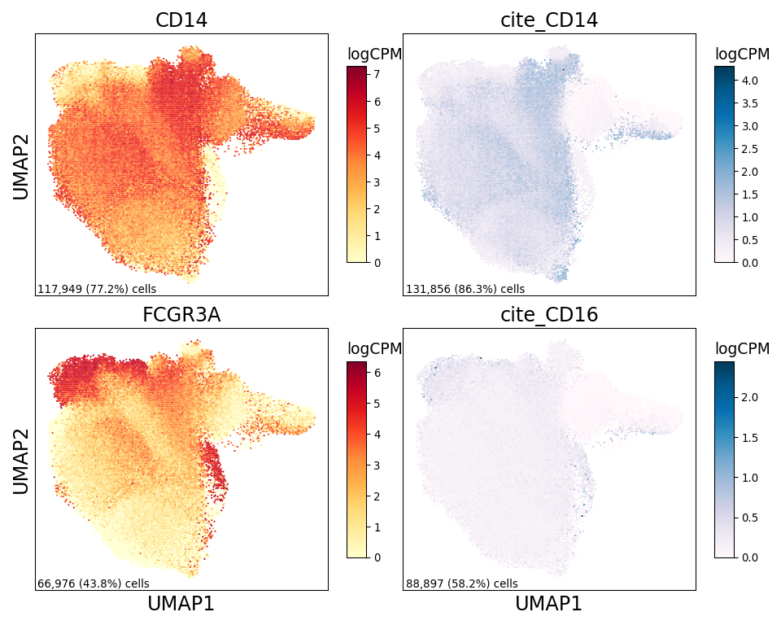

Supplemental Monocyte/Macrophage Figure
================

## Set up

Load R libraries

``` r
library(tidyverse)

library(reticulate)
use_python("/projects/home/tlchan/.conda/envs/myenv/bin/python")
```

Load python libraries

``` python
import pegasus as pg

import sys
sys.path.append("/projects/home/tlchan/github_code/ascites/functions")
import python_functions
```

## Figure 1A

``` python
monomac_data = pg.read_input("/projects/home/tlchan/projects/ascites/data_cite_objects/monomac.zarr.zip")

python_functions.plot_feature(lin_data=monomac_data,
                              genes=['CD14', 'cite_CD14', 'FCGR3A', 'cite_CD16'],
                              ncol=2,
                              nrow=2)
```

    ## 2024-05-07 17:14:44,530 - pegasusio.readwrite - INFO - zarr file '/projects/home/tlchan/projects/ascites/data_cite_objects/monomac.zarr.zip' is loaded.
    ## 2024-05-07 17:14:44,530 - pegasusio.readwrite - INFO - Function 'read_input' finished in 2.14s.



## Figure 1B

``` r
cluster_palette <- list("1" = "#FF0029",
                        "2" = "#377EB8",
                        "3" = "#66A61E",
                        "4" = "#984EA3",
                        "5" = "#00D2D5",
                        "6" = "#FF7F00",
                        "7" = "#AF8D00",
                        "8" = "#7F80CD",
                        "9" = "#B3E900",
                        "10" = "#C42E60",
                        "11" = "#A65628",
                        "12" = "#F781BF",
                        "13" = "#8DD3C7"
)

monomac_data <- read.csv('/projects/home/tlchan/projects/ascites/figure_panels/abundance_data/monomac_patient_counts.csv') %>%
    mutate(Cluster = factor(Cluster))


ggplot(monomac_data, aes(x = Patient, y = Count, fill = Cluster)) +
    geom_bar(stat = "identity", position = "fill") +
    theme_classic(base_size = 12) +
    theme(axis.text.x = element_text(angle = 90, vjust = 0.5, hjust = 1)) +
    scale_fill_manual(values = cluster_palette)
```

<!-- -->
