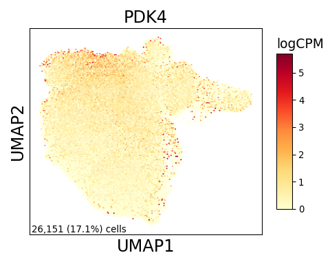

Supplemental Monocyte/Macrophage Figure
================

## Set up

Load R libraries

``` r
library(tidyverse)

library(reticulate)
use_python("/projects/home/tlchan/.conda/envs/myenv/bin/python")

setwd('/projects/home/tlchan/github_code/ascites/functions')
source('plot_deg.R')
```

Load python libraries

``` python
import pegasus as pg

import sys
sys.path.append("/projects/home/tlchan/github_code/ascites/functions")
import python_functions
```

## Figure 1A

``` python
monomac_data = pg.read_input("/projects/home/tlchan/projects/ascites/data_cite_objects/monomac.zarr.zip")

python_functions.plot_feature(lin_data=monomac_data,
                              genes=['CD14', 'cite_CD14', 'FCGR3A', 'cite_CD16'],
                              ncol=2,
                              nrow=2)
```

    ## 2024-06-20 19:16:34,796 - pegasusio.readwrite - INFO - zarr file '/projects/home/tlchan/projects/ascites/data_cite_objects/monomac.zarr.zip' is loaded.
    ## 2024-06-20 19:16:34,796 - pegasusio.readwrite - INFO - Function 'read_input' finished in 2.11s.


## Figure 1B

``` r
cluster_palette <- list("1" = "#FF0029",
                        "2" = "#377EB8",
                        "3" = "#66A61E",
                        "4" = "#984EA3",
                        "5" = "#00D2D5",
                        "6" = "#FF7F00",
                        "7" = "#AF8D00",
                        "8" = "#7F80CD",
                        "9" = "#B3E900",
                        "10" = "#C42E60",
                        "11" = "#A65628",
                        "12" = "#F781BF",
                        "13" = "#8DD3C7"
)

monomac_data <- read.csv('/projects/home/tlchan/projects/ascites/figure_panels/abundance_data/monomac_patient_counts.csv') %>%
    mutate(Cluster = factor(Cluster))


ggplot(monomac_data, aes(x = Patient, y = Count, fill = Cluster)) +
    geom_bar(stat = "identity", position = "fill") +
    theme_classic(base_size = 12) +
    theme(axis.text.x = element_text(angle = 90, vjust = 0.5, hjust = 1)) +
    scale_fill_manual(values = cluster_palette)
```

<!-- -->

## Figure 1C

``` r
monomac_res <- read.csv('/projects/home/tlchan/projects/ascites/ascites_deg_results/monomac/monomac_ascites_de_by_survival_HvL_all_results.csv')
monomac_meta <- read.csv('/projects/home/tlchan/projects/ascites/second_data_freeze/clusterings/ascites_mono-mac_R7_300mg_20pm_harm_channel_multi_res/1.1/data/pseudobulk/ascites_mono-mac_R7_300mg_20pm_harm_channel_1_1_pseudobulk_meta.csv', row.names = 1)

monomac_meta <- monomac_meta %>%
    mutate(survival_bin = case_when(survival < 92 ~ "Low", survival > 183 ~ "High")) %>%
    filter(survival_bin == "Low" | survival_bin == "High") %>%
    mutate(survival_bin = factor(survival_bin, levels = c("Low", "High"))) %>%
    mutate(sex = factor(sex, levels = c('M', 'F'))) %>%
    filter(tissue_type == "ascites")

p <- plot_deg(res = monomac_res,
                     meta = monomac_meta,
                     lin = "Mono/Mac",
                     clust = 3,
                     contrast = "survival_bin",
                     ref_var = "Low",
                     test_var = "High")
print(p)
```

<!-- -->

## Figure 1D

``` python
monomac_data = pg.read_input("/projects/home/tlchan/projects/ascites/data_cite_objects/monomac.zarr.zip")

python_functions.plot_feature(lin_data=monomac_data,
                              genes=['PDK4'],
                              ncol=1,
                              nrow=1)
```

    ## 2024-06-20 19:16:44,601 - pegasusio.readwrite - INFO - zarr file '/projects/home/tlchan/projects/ascites/data_cite_objects/monomac.zarr.zip' is loaded.
    ## 2024-06-20 19:16:44,601 - pegasusio.readwrite - INFO - Function 'read_input' finished in 2.09s.


