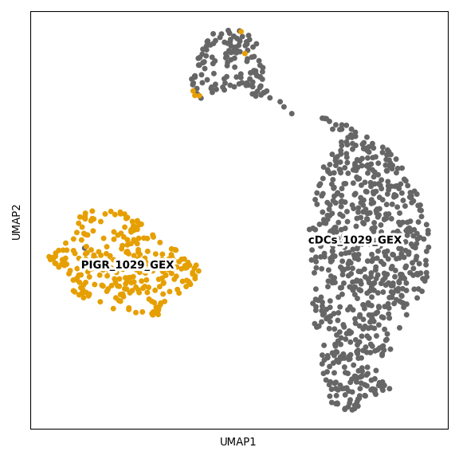
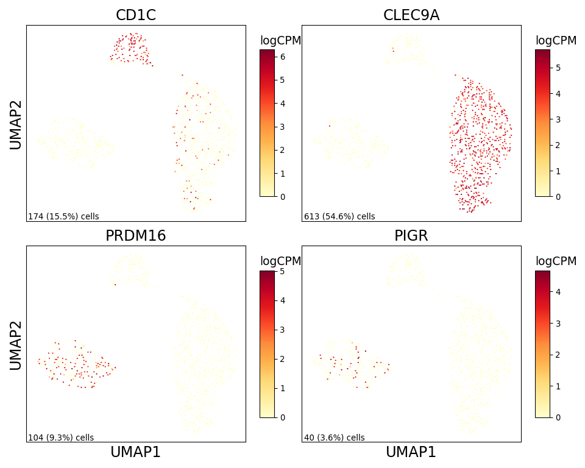

Supplemental PIGR DC Figure 2
================

## Set up

Load R libraries

``` r
library(reticulate)
use_python("/projects/home/tlchan/.conda/envs/myenv/bin/python")

setwd('/projects/home/tlchan/github_code/ascites/functions')
source('plot_fgsea.R')
```

Load python libraries

``` python
import matplotlib as mpl
import matplotlib.pyplot as plt
import numpy as np
import pandas as pd
import pegasus as pg
import scanpy as sc
```

## Figure 1B

``` python
mpl.rcParams['pdf.fonttype'] = 42

channel_palette = {
    "cDCs_1029_GEX": "#666666",
    "PIGR_1029_GEX": "#E69F00"
}

# Load single-cell object
lineage_data = pg.read_input(
    '/projects/home/tlchan/projects/ascites/dc_hunting/clusterings/pigr_dcs_R1_300mg_20pm_multi_res/1.3/data/pseudobulk/pigr_dcs_R1_300mg_20pm_1_3_complete_with_pb.zarr.zip')

channel_fig, channel_ax = plt.subplots(1)
channel_umap = sc.pl.umap(adata=lineage_data.to_anndata(),
                          color="Channel",
                          use_raw=True,
                          palette=channel_palette,
                          legend_loc="on data",
                          legend_fontoutline=5,
                          title="",
                          show=False,
                          ax=channel_ax)

channel_fig = plt.gcf()
channel_fig.set_size_inches(6, 6)
channel_fig.tight_layout()
channel_ax.set_rasterization_zorder(2)
plt.show()
plt.close()
```

    ## 2024-04-29 21:04:30,940 - pegasusio.readwrite - INFO - zarr file '/projects/home/tlchan/projects/ascites/dc_hunting/clusterings/pigr_dcs_R1_300mg_20pm_multi_res/1.3/data/pseudobulk/pigr_dcs_R1_300mg_20pm_1_3_complete_with_pb.zarr.zip' is loaded.
    ## 2024-04-29 21:04:30,940 - pegasusio.readwrite - INFO - Function 'read_input' finished in 0.06s.
    ## /projects/home/tlchan/.conda/envs/myenv/lib/python3.9/site-packages/scanpy/plotting/_tools/scatterplots.py:392: UserWarning: No data for colormapping provided via 'c'. Parameters 'cmap' will be ignored
    ##   cax = scatter(



## Figure 1C

``` python
mpl.rcParams['pdf.fonttype'] = 42

ncol = 2
nrow = 2
genes = ['CD1C', 'CLEC9A', 'PRDM16', 'PIGR']

lineage_data = pg.read_input("/projects/home/tlchan/projects/ascites/dc_hunting/clusterings/pigr_dcs_R1_300mg_20pm_multi_res/1.3/data/pseudobulk/pigr_dcs_R1_300mg_20pm_1_3_complete_with_pb.zarr.zip")
lineage_data.add_matrix('X', lineage_data.get_matrix('counts.log_norm'))

# Get UMAP coordinates for base
umap_coords = pd.DataFrame(lineage_data.obsm['X_umap'], columns=['x', 'y'])
x = umap_coords['x']
y = umap_coords['y']

# Set up figure structure
fig_size = (5 * ncol, 4 * nrow)
fig, axes = plt.subplots(nrows=nrow, ncols=ncol, figsize=fig_size,
                         sharex=True, sharey=True)
ax = axes.ravel()

# Plot for each gene
for num, gene in enumerate(genes):
    # Get counts for each gene
    norm_counts = lineage_data[:, gene].copy().get_matrix('X').todense().transpose()
    norm_counts = np.squeeze(np.asarray(norm_counts))

    if norm_counts.size == 0:  # ie. All empty/zero in sparce matrix
        norm_counts = np.zeros(norm_counts.shape[1])

    # Get n cells and perc cells
    ncells = (norm_counts != 0).sum()
    pcells = ncells / norm_counts.shape[0]

    if gene.startswith('cite_'):
        cmap = 'PuBu'
    else:
        cmap = 'YlOrRd'

    # Create heatmap
    hb = ax[num].hexbin(x=x,
                        y=y,
                        C=norm_counts,
                        cmap=cmap,
                        gridsize=150,
                        edgecolors="none")

    # Add percent expression
    ax[num].annotate(f'{ncells:,} ({pcells:.1%}) cells',
                     xy=(0.01, 0), xycoords='axes fraction',
                     fontsize=10,
                     horizontalalignment='left',
                     verticalalignment='bottom')

    # Add axes and colorbar information
    cb = fig.colorbar(hb, ax=ax[num], shrink=.75, aspect=10)
    cb.ax.set_title('logCPM', loc='left', fontsize=14)
    ax[num].set_title(gene, fontsize=18)
    ax[num].tick_params(left=False, labelleft=False,
                        bottom=False, labelbottom=False)
    if (num + ncol) % ncol == 0:
        # Start of row
        ax[num].set_ylabel('UMAP2', fontsize=18)
    if nrow == 1:
        # Only one row
        ax[num].set_xlabel('UMAP1', fontsize=18)
    elif num > (len(genes) - ncol - 1):
        # Last row if more than one row
        ax[num].set_xlabel('UMAP1', fontsize=18)

    # Rasterize
    ax[num].set_rasterization_zorder(2)

for i in range(len(ax) - (len(ax) - len(genes)), len(ax)):
    ax[i].set_axis_off()
fig.tight_layout()
plt.show()
plt.close()
```

    ## 2024-04-29 21:04:31,817 - pegasusio.readwrite - INFO - zarr file '/projects/home/tlchan/projects/ascites/dc_hunting/clusterings/pigr_dcs_R1_300mg_20pm_multi_res/1.3/data/pseudobulk/pigr_dcs_R1_300mg_20pm_1_3_complete_with_pb.zarr.zip' is loaded.
    ## 2024-04-29 21:04:31,817 - pegasusio.readwrite - INFO - Function 'read_input' finished in 0.06s.


