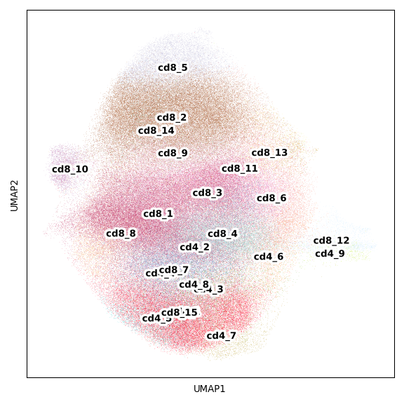
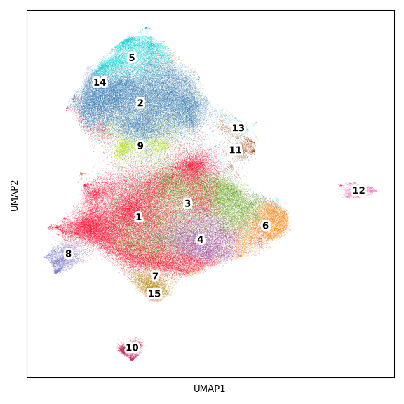
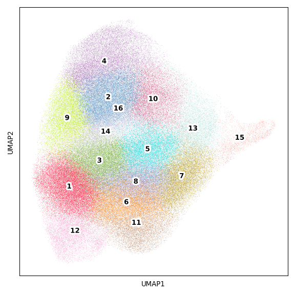
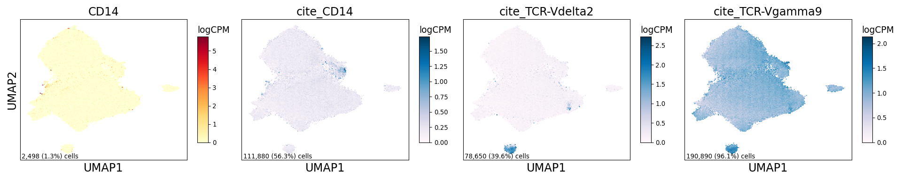
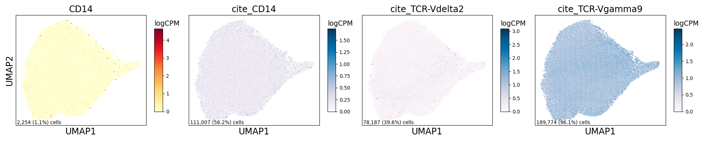

TNK Figure
================

## Set up

Load R libraries

``` r
library(reticulate)
use_python("/projects/home/tlchan/.conda/envs/myenv/bin/python")
```

Load python libraries

``` python
import pandas as pd
import pegasus as pg

import sys
sys.path.append("/projects/home/tlchan/github_code/ascites/functions")
import python_functions
```

## Figure 1A

``` python
tnk_cluster_palette = {
    "cd4_1": "#FF0029",
    "cd4_2": "#377EB8",
    "cd4_3": "#66A61E",
    "cd4_4": "#984EA3",
    "cd4_5": "#00D2D5",
    "cd4_6": "#FF7F00",
    "cd4_7": "#AF8D00",
    "cd4_8": "#7F80CD",
    "cd4_9": "#B3E900",
    "cd8_1": "#C42E60",
    "cd8_2": "#A65628",
    "cd8_3": "#F781BF",
    "cd8_4": "#8DD3C7",
    "cd8_5": "#BEBADA",
    "cd8_6": "#FB8072",
    "cd8_7": "#80B1D3",
    "cd8_8": "#FDB462",
    "cd8_9": "#FCCDE5",
    "cd8_10": "#BC80BD",
    "cd8_11": "#FFED6F",
    "cd8_12": "#C4EAFF",
    "cd8_13": "#CF8C00",
    "cd8_14": "#1B9E77",
    "cd8_15": "#D95F02"
}

tnk_data = pg.read_input('/projects/home/tlchan/projects/ascites/second_data_freeze/clusterings/ascites_tnk_cite_concat_R7_300mg_20pm_harm_channel_multi_res/1.7/data/filter_qc/ascites_tnk_cite_concat_R7_300mg_20pm_harm_channel_1_7.zarr.zip')
cd4_data = pg.read_input(
    '/projects/home/tlchan/projects/ascites/second_data_freeze/clusterings/ascites_cd4_cite_concat_R7_300mg_20pm_harm_channel_multi_res/1.3/data/pseudobulk/ascites_cd4_cite_concat_R7_300mg_20pm_harm_channel_1_3_complete_with_pb.zarr.zip')
cd8_data = pg.read_input(
    '/projects/home/tlchan/projects/ascites/second_data_freeze/clusterings/ascites_cd8_cite_concat_R7_300mg_20pm_harm_channel_multi_res/1.9/data/pseudobulk/ascites_cd8_cite_concat_R7_300mg_20pm_harm_channel_1_9_complete_with_pb.zarr.zip')

cd4_data.obs['Cluster'] = "cd4_" + cd4_data.obs['leiden_pca_cite_concat'].astype(str)
cd8_data.obs['Cluster'] = "cd8_" + cd8_data.obs['leiden_pca_cite_concat'].astype(str)
tnk_data.obs['Cluster'] = pd.concat([cd4_data.obs['Cluster'], cd8_data.obs['Cluster']])

tnk_data.obsm['X_umap'] = tnk_data.obsm['X_umap_pca_cite_concat']

python_functions.plot_umap(lin_data=tnk_data,
                           palette=tnk_cluster_palette)
```

    ## 2024-06-24 19:54:01,673 - pegasusio.readwrite - INFO - zarr file '/projects/home/tlchan/projects/ascites/second_data_freeze/clusterings/ascites_tnk_cite_concat_R7_300mg_20pm_harm_channel_multi_res/1.7/data/filter_qc/ascites_tnk_cite_concat_R7_300mg_20pm_harm_channel_1_7.zarr.zip' is loaded.
    ## 2024-06-24 19:54:01,673 - pegasusio.readwrite - INFO - Function 'read_input' finished in 3.53s.
    ## 2024-06-24 19:54:02,595 - pegasusio.readwrite - INFO - zarr file '/projects/home/tlchan/projects/ascites/second_data_freeze/clusterings/ascites_cd4_cite_concat_R7_300mg_20pm_harm_channel_multi_res/1.3/data/pseudobulk/ascites_cd4_cite_concat_R7_300mg_20pm_harm_channel_1_3_complete_with_pb.zarr.zip' is loaded.
    ## 2024-06-24 19:54:02,595 - pegasusio.readwrite - INFO - Function 'read_input' finished in 0.92s.
    ## 2024-06-24 19:54:05,560 - pegasusio.readwrite - INFO - zarr file '/projects/home/tlchan/projects/ascites/second_data_freeze/clusterings/ascites_cd8_cite_concat_R7_300mg_20pm_harm_channel_multi_res/1.9/data/pseudobulk/ascites_cd8_cite_concat_R7_300mg_20pm_harm_channel_1_9_complete_with_pb.zarr.zip' is loaded.
    ## 2024-06-24 19:54:05,560 - pegasusio.readwrite - INFO - Function 'read_input' finished in 2.94s.



## Figure 1B

``` python
cd8_cluster_palette = {
    "1": "#FF0029",
    "2": "#377EB8",
    "3": "#66A61E",
    "4": "#984EA3",
    "5": "#00D2D5",
    "6": "#FF7F00",
    "7": "#AF8D00",
    "8": "#7F80CD",
    "9": "#B3E900",
    "10": "#C42E60",
    "11": "#A65628",
    "12": "#F781BF",
    "13": "#8DD3C7",
    "14": "#BEBADA",
    "15": "#FB8072",
    "16": "#80B1D3",
}

cd8_w_cite_data = pg.read_input("/projects/home/tlchan/projects/ascites/data_cite_objects/cd8.zarr.zip")

if 'raw.X' not in cd8_w_cite_data.list_keys():
    cd8_w_cite_data.add_matrix('raw.X', cd8_w_cite_data.X)

cd8_w_cite_data.obs['Cluster'] = cd8_w_cite_data.obs['leiden_pca_cite_concat'].cat.remove_unused_categories().astype(str)
cd8_w_cite_data.obsm['X_umap'] = cd8_w_cite_data.obsm['X_umap_pca_cite_concat']

python_functions.plot_umap(lin_data=cd8_w_cite_data,
                           palette=cd8_cluster_palette)

cd8_wo_cite_data = pg.read_input("/projects/home/tlchan/projects/ascites/data_cite_objects/cd8_wo_cite.zarr.zip")

if 'raw.X' not in cd8_wo_cite_data.list_keys():
    cd8_wo_cite_data.add_matrix('raw.X', cd8_wo_cite_data.X)

python_functions.plot_umap(lin_data=cd8_wo_cite_data,
                           palette=cd8_cluster_palette)
```

    ## 2024-06-24 19:54:12,176 - pegasusio.readwrite - INFO - zarr file '/projects/home/tlchan/projects/ascites/data_cite_objects/cd8.zarr.zip' is loaded.
    ## 2024-06-24 19:54:12,176 - pegasusio.readwrite - INFO - Function 'read_input' finished in 3.81s.



    ## 2024-06-24 19:54:17,574 - pegasusio.readwrite - INFO - zarr file '/projects/home/tlchan/projects/ascites/data_cite_objects/cd8_wo_cite.zarr.zip' is loaded.
    ## 2024-06-24 19:54:17,574 - pegasusio.readwrite - INFO - Function 'read_input' finished in 3.72s.



## Figure 1C

``` python
cd8_w_cite_data = pg.read_input("/projects/home/tlchan/projects/ascites/data_cite_objects/cd8.zarr.zip")

cd8_wo_cite_data = pg.read_input("/projects/home/tlchan/projects/ascites/data_cite_objects/cd8_wo_cite.zarr.zip")

python_functions.plot_feature(lin_data=cd8_w_cite_data,
                              ncol=4,
                              nrow=1,
                              genes=["CD14", "cite_CD14", "cite_TCR-Vdelta2", "cite_TCR-Vgamma9"])


python_functions.plot_feature(lin_data=cd8_wo_cite_data,
                              ncol=4,
                              nrow=1,
                              genes=["CD14", "cite_CD14", "cite_TCR-Vdelta2", "cite_TCR-Vgamma9"])
```

    ## 2024-06-24 19:54:23,705 - pegasusio.readwrite - INFO - zarr file '/projects/home/tlchan/projects/ascites/data_cite_objects/cd8.zarr.zip' is loaded.
    ## 2024-06-24 19:54:23,705 - pegasusio.readwrite - INFO - Function 'read_input' finished in 3.95s.
    ## 2024-06-24 19:54:25,646 - pegasusio.readwrite - INFO - zarr file '/projects/home/tlchan/projects/ascites/data_cite_objects/cd8_wo_cite.zarr.zip' is loaded.
    ## 2024-06-24 19:54:25,647 - pegasusio.readwrite - INFO - Function 'read_input' finished in 1.92s.


